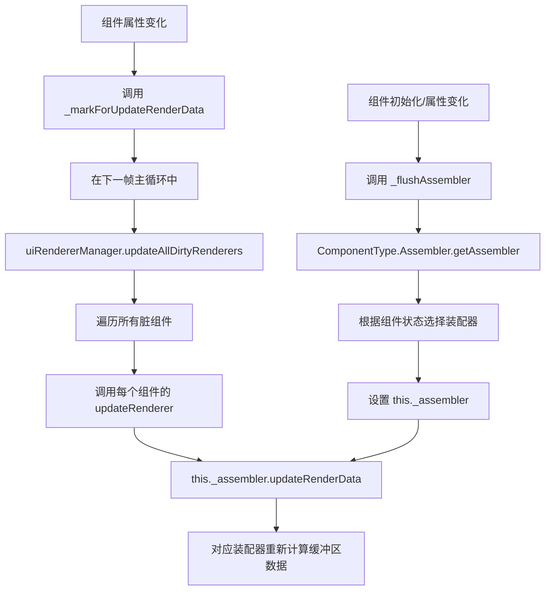

# 主循环中有一段uiRendererManager.updateAllDirtyRenderers(); ，我想让你整理一下，给我详细介绍一下uiRendererManager的作用，运作机制。
_Exported on 7/14/2025 at 14:29:40 GMT+8 from Cursor (1.2.4)_

---

**User**

主循环中有一段uiRendererManager.updateAllDirtyRenderers(); ，我想让你整理一下，给我详细介绍一下uiRendererManager的作用，运作机制。

---

**Cursor**

我来帮你详细了解 `uiRendererManager` 的作用和运作机制。让我先搜索相关的代码来获取完整信息。

现在让我查看 `updateRenderer` 方法的实现，以及脏标记机制的工作原理：

让我查看具体的 `updateRenderer` 实现：

现在让我查看脏标记机制的具体触发时机：

## UIRendererManager 详细介绍

基于对代码的深入分析，我来为你详细介绍 `uiRendererManager` 的作用和运作机制：

### 1. 基本作用

`uiRendererManager` 是 Cocos Creator 引擎中的 **UI 渲染器管理器**，它的核心作用是：
- **管理所有 UI 渲染组件**（如 Sprite、Label、Graphics 等）
- **实现脏标记机制**，优化渲染性能
- **统一更新所有需要更新的渲染器**

### 2. 核心机制

#### 渲染器注册管理
```75:78:cocos-engine/cocos/2d/framework/ui-renderer-manager.ts
export class UIRendererManager {
    private _allRenderers: (UIRenderer | UIMeshRenderer)[] = [];
    private _dirtyRenderers: (UIRenderer | UIMeshRenderer)[] = [];
    private _dirtyVersion = 0;
```

- `_allRenderers`: 存储所有已注册的 UI 渲染器
- `_dirtyRenderers`: 存储当前帧需要更新的"脏"渲染器
- `_dirtyVersion`: 版本号，用于防止重复标记

#### 脏标记系统（Dirty Flag System）

**脏标记的时机**：
- 节点变换改变（位置、旋转、缩放）
- 颜色改变
- 材质改变 
- 贴图改变
- 组件属性改变（如 Sprite 的 spriteFrame）
- 节点启用/禁用状态改变

**脏标记流程**：
```433:440:cocos-engine/cocos/2d/framework/ui-renderer.ts
public _markForUpdateRenderData (enable = true): void {
    if (enable) {
        const renderData = this._renderData;
        if (renderData) {
            renderData.vertDirty = true;
        }
        uiRendererManager.markDirtyRenderer(this);
    }
}
```

### 3. 运作流程

#### 主循环中的位置
在 Director 的 tick 方法中：
```798:798:cocos-engine/cocos/game/director.ts
uiRendererManager.updateAllDirtyRenderers();
```

这行代码位于：
- **游戏逻辑更新完成后**（AFTER_UPDATE 事件后）
- **渲染提交前**（BEFORE_DRAW 事件后）
- **Root.frameMove() 调用前**

#### 更新流程
```59:77:cocos-engine/cocos/2d/framework/ui-renderer-manager.ts
public updateAllDirtyRenderers (): void {
    const dirtyRenderers = this._dirtyRenderers;
    for (let i = 0; i < this._dirtyRenderers.length; i++) {
        if (DEBUG) {
            assert(dirtyRenderers[i]._internalId !== -1);
        }
        dirtyRenderers[i].updateRenderer();
    }
    this._dirtyRenderers.length = 0;
    this._dirtyVersion++;
}
```

**每个渲染器的 updateRenderer 做什么**：
```470:477:cocos-engine/cocos/2d/framework/ui-renderer.ts
public updateRenderer (): void {
    const assembler = this._assembler;
    if (assembler && assembler.updateRenderData) {
        assembler.updateRenderData(this);
    }
    this._renderFlag = this._canRender();
    this._renderEntity.enabled = this._renderFlag;
}
```

1. **调用装配器更新渲染数据**：重新计算顶点、UV、颜色等
2. **更新渲染标志**：判断是否可以渲染
3. **更新渲染实体状态**：同步到渲染系统

### 4. 性能优化原理

#### 批处理优化
- **避免每帧全量更新**：只更新标记为脏的渲染器
- **集中处理**：在统一的时机批量更新，避免分散的性能损耗
- **版本控制**：防止同一帧内重复标记同一个渲染器

#### 内存管理优化
```34:57:cocos-engine/cocos/2d/framework/ui-renderer-manager.ts
public addRenderer (uiRenderer: UIRenderer | UIMeshRenderer): void {
    if (uiRenderer._internalId === -1) {
        uiRenderer._internalId = this._allRenderers.length;
        this._allRenderers.push(uiRenderer);
    }
}

public removeRenderer (uiRenderer: UIRenderer | UIMeshRenderer): void {
    if (uiRenderer._internalId !== -1) {
        const id = uiRenderer._internalId;
        this._allRenderers[this._allRenderers.length - 1]._internalId = id;
        js.array.fastRemoveAt(this._allRenderers, id);
        uiRenderer._internalId = -1;
        // 清理脏标记
        if (uiRenderer._dirtyVersion === this._dirtyVersion) {
            js.array.fastRemove(this._dirtyRenderers, uiRenderer);
            uiRenderer._dirtyVersion = -1;
        }
    }
}
```

- 使用 `_internalId` 快速索引
- 使用 `fastRemoveAt` 避免数组移动开销
- 及时清理无效的脏标记

### 5. 与渲染管线的关系

`uiRendererManager.updateAllDirtyRenderers()` 是 **CPU 端的数据准备阶段**，它：

1. **更新渲染数据**：重新计算顶点缓冲区数据
2. **准备渲染实体**：确保渲染实体状态正确  
3. **为 GPU 渲染做准备**：之后 `root.frameMove()` 会将数据提交到 GPU

这个设计保证了：
- UI 渲染数据的及时更新
- 最小化不必要的计算开销
- 与整个渲染管线的良好协作

总的来说，`uiRendererManager` 是 Cocos Creator UI 系统中的关键性能优化组件，通过脏标记机制实现了高效的 UI 渲染数据管理。

```typescript
export class UIRendererManager {
    private _allRenderers: (UIRenderer | UIMeshRenderer)[] = [];
    private _dirtyRenderers: (UIRenderer | UIMeshRenderer)[] = [];
    private _dirtyVersion = 0;
```

```typescript
public _markForUpdateRenderData (enable = true): void {
    if (enable) {
        const renderData = this._renderData;
        if (renderData) {
            renderData.vertDirty = true;
        }
        uiRendererManager.markDirtyRenderer(this);
    }
}
```

```typescript
uiRendererManager.updateAllDirtyRenderers();
```

```typescript
public updateAllDirtyRenderers (): void {
    const dirtyRenderers = this._dirtyRenderers;
    for (let i = 0; i < this._dirtyRenderers.length; i++) {
        if (DEBUG) {
            assert(dirtyRenderers[i]._internalId !== -1);
        }
        dirtyRenderers[i].updateRenderer();
    }
    this._dirtyRenderers.length = 0;
    this._dirtyVersion++;
}
```

```typescript
public updateRenderer (): void {
    const assembler = this._assembler;
    if (assembler && assembler.updateRenderData) {
        assembler.updateRenderData(this);
    }
    this._renderFlag = this._canRender();
    this._renderEntity.enabled = this._renderFlag;
}
```

```typescript
public addRenderer (uiRenderer: UIRenderer | UIMeshRenderer): void {
    if (uiRenderer._internalId === -1) {
        uiRenderer._internalId = this._allRenderers.length;
        this._allRenderers.push(uiRenderer);
    }
}

public removeRenderer (uiRenderer: UIRenderer | UIMeshRenderer): void {
    if (uiRenderer._internalId !== -1) {
        const id = uiRenderer._internalId;
        this._allRenderers[this._allRenderers.length - 1]._internalId = id;
        js.array.fastRemoveAt(this._allRenderers, id);
        uiRenderer._internalId = -1;
        // 清理脏标记
        if (uiRenderer._dirtyVersion === this._dirtyVersion) {
            js.array.fastRemove(this._dirtyRenderers, uiRenderer);
            uiRenderer._dirtyVersion = -1;
        }
    }
}
```

---

**User**

那这个地方就是用来重新计算所有脏标记的render的缓冲区数据的吧？

---

**Cursor**

```typescript
if (assembler && assembler.updateRenderData) {
    assembler.updateRenderData(this);
}
```

是的，你理解得完全正确！这段代码正是用来重新计算所有脏标记的渲染器的缓冲区数据的核心部分。

让我详细说明一下这个机制：

是的，你的理解完全正确！这段代码正是整个"脏标记-批量更新"机制的核心执行部分。让我详细展示这个流程：

## 核心流程分析

### 1. 触发时机
当 `uiRendererManager.updateAllDirtyRenderers()` 执行时：

```59:77:cocos-engine/cocos/2d/framework/ui-renderer-manager.ts
public updateAllDirtyRenderers (): void {
    const dirtyRenderers = this._dirtyRenderers;
    for (let i = 0; i < this._dirtyRenderers.length; i++) {
        dirtyRenderers[i].updateRenderer(); // 这里调用每个脏渲染器的updateRenderer
    }
    // 清空脏列表，增加版本号
    this._dirtyRenderers.length = 0;
    this._dirtyVersion++;
}
```

### 2. 具体的缓冲区重新计算
```473:475:cocos-engine/cocos/2d/framework/ui-renderer.ts
if (assembler && assembler.updateRenderData) {
    assembler.updateRenderData(this);
}
```

这里的 `assembler.updateRenderData(this)` 会根据不同的 UI 组件类型执行相应的缓冲区数据重计算：

#### 以 Sprite 为例（Simple 模式）：
```53:65:cocos-engine/cocos/2d/assembler/sprite/simple.ts
updateRenderData (sprite: Sprite): void {
    const frame = sprite.spriteFrame;
    
    dynamicAtlasManager.packToDynamicAtlas(sprite, frame);
    this.updateUVs(sprite);     // 重新计算UV坐标
    
    const renderData = sprite.renderData;
    if (renderData && frame) {
        if (renderData.vertDirty) {
            this.updateVertexData(sprite);  // 重新计算顶点数据
        }
        renderData.updateRenderData(sprite, frame);
    }
}
```

### 3. 具体重新计算的数据包括：

#### 顶点数据（Vertex Data）
```133:179:cocos-engine/cocos/2d/assembler/sprite/simple.ts
private updateVertexData (sprite: Sprite): void {
    const renderData: RenderData | null = sprite.renderData;
    if (!renderData) return;
    
    const uiTrans = sprite.node._getUITransformComp()!;
    const dataList: IRenderData[] = renderData.data;
    const cw = uiTrans.width;   // 组件宽度
    const ch = uiTrans.height;  // 组件高度
    const appX = uiTrans.anchorX * cw; // 锚点X
    const appY = uiTrans.anchorY * ch; // 锚点Y
    
    // 计算四个顶点的局部坐标
    // ... 具体的顶点位置计算逻辑
    
    dataList[0].x = l; dataList[0].y = b; // 左下
    dataList[1].x = r; dataList[1].y = b; // 右下  
    dataList[2].x = l; dataList[2].y = t; // 左上
    dataList[3].x = r; dataList[3].y = t; // 右上
    
    renderData.vertDirty = true;
}
```

#### UV 坐标（UV Coordinates）
```192:206:cocos-engine/cocos/2d/assembler/sprite/simple.ts
updateUVs (sprite: Sprite): void {
    const renderData = sprite.renderData;
    if (!sprite.spriteFrame || !renderData) return;
    
    const vData = renderData.chunk.vb;  // 顶点缓冲区
    const uv = sprite.spriteFrame.uv;   // 贴图UV坐标
    const stride = renderData.floatStride;
    
    let uvOffset = 3;
    for (let i = 0; i < renderData.dataLength; ++i) {
        const index = i * 2;
        vData[uvOffset] = uv[index];      // U坐标
        vData[uvOffset + 1] = uv[index + 1]; // V坐标
        uvOffset += stride;
    }
}
```

#### 世界坐标转换
```71:96:cocos-engine/cocos/2d/assembler/sprite/simple.ts
private updateWorldVerts (sprite: Sprite, chunk: StaticVBChunk): void {
    const renderData = sprite.renderData;
    if (!renderData) return;
    
    const vData = chunk.vb;
    const dataList: IRenderData[] = renderData.data;
    const node = sprite.node;
    const m = node.worldMatrix;  // 节点的世界变换矩阵
    
    // 将局部坐标转换为世界坐标
    for (let i = 0; i < length; ++i) {
        const curData = dataList[i];
        const x = curData.x;
        const y = curData.y;
        
        // 矩阵变换：本地坐标 -> 世界坐标
        vData[offset + 0] = (m00 * x + m04 * y + m12) * rhw;
        vData[offset + 1] = (m01 * x + m05 * y + m13) * rhw;
        vData[offset + 2] = (m02 * x + m06 * y + m14) * rhw;
    }
}
```

## 总结

所以这段代码确实是 **重新计算所有脏标记的渲染器的缓冲区数据** 的核心：

1. **遍历所有脏渲染器**
2. **调用每个渲染器的 updateRenderer()**
3. **updateRenderer() 调用对应装配器的 updateRenderData()**
4. **装配器重新计算**：
   - 顶点位置（基于节点大小、锚点等）
   - UV 坐标（基于 SpriteFrame 的纹理区域）
   - 世界坐标变换（基于节点的世界矩阵）
   - 颜色数据（如果需要）

这个机制确保了只有真正发生变化的 UI 元素才会重新计算缓冲区数据，从而大大优化了渲染性能。

```typescript
public updateAllDirtyRenderers (): void {
    const dirtyRenderers = this._dirtyRenderers;
    for (let i = 0; i < this._dirtyRenderers.length; i++) {
        dirtyRenderers[i].updateRenderer(); // 这里调用每个脏渲染器的updateRenderer
    }
    // 清空脏列表，增加版本号
    this._dirtyRenderers.length = 0;
    this._dirtyVersion++;
}
```

```typescript
if (assembler && assembler.updateRenderData) {
    assembler.updateRenderData(this);
}
```

```typescript
updateRenderData (sprite: Sprite): void {
    const frame = sprite.spriteFrame;
    
    dynamicAtlasManager.packToDynamicAtlas(sprite, frame);
    this.updateUVs(sprite);     // 重新计算UV坐标
    
    const renderData = sprite.renderData;
    if (renderData && frame) {
        if (renderData.vertDirty) {
            this.updateVertexData(sprite);  // 重新计算顶点数据
        }
        renderData.updateRenderData(sprite, frame);
    }
}
```

```typescript
private updateVertexData (sprite: Sprite): void {
    const renderData: RenderData | null = sprite.renderData;
    if (!renderData) return;
    
    const uiTrans = sprite.node._getUITransformComp()!;
    const dataList: IRenderData[] = renderData.data;
    const cw = uiTrans.width;   // 组件宽度
    const ch = uiTrans.height;  // 组件高度
    const appX = uiTrans.anchorX * cw; // 锚点X
    const appY = uiTrans.anchorY * ch; // 锚点Y
    
    // 计算四个顶点的局部坐标
    // ... 具体的顶点位置计算逻辑
    
    dataList[0].x = l; dataList[0].y = b; // 左下
    dataList[1].x = r; dataList[1].y = b; // 右下  
    dataList[2].x = l; dataList[2].y = t; // 左上
    dataList[3].x = r; dataList[3].y = t; // 右上
    
    renderData.vertDirty = true;
}
```

```typescript
updateUVs (sprite: Sprite): void {
    const renderData = sprite.renderData;
    if (!sprite.spriteFrame || !renderData) return;
    
    const vData = renderData.chunk.vb;  // 顶点缓冲区
    const uv = sprite.spriteFrame.uv;   // 贴图UV坐标
    const stride = renderData.floatStride;
    
    let uvOffset = 3;
    for (let i = 0; i < renderData.dataLength; ++i) {
        const index = i * 2;
        vData[uvOffset] = uv[index];      // U坐标
        vData[uvOffset + 1] = uv[index + 1]; // V坐标
        uvOffset += stride;
    }
}
```

```typescript
private updateWorldVerts (sprite: Sprite, chunk: StaticVBChunk): void {
    const renderData = sprite.renderData;
    if (!renderData) return;
    
    const vData = chunk.vb;
    const dataList: IRenderData[] = renderData.data;
    const node = sprite.node;
    const m = node.worldMatrix;  // 节点的世界变换矩阵
    
    // 将局部坐标转换为世界坐标
    for (let i = 0; i < length; ++i) {
        const curData = dataList[i];
        const x = curData.x;
        const y = curData.y;
        
        // 矩阵变换：本地坐标 -> 世界坐标
        vData[offset + 0] = (m00 * x + m04 * y + m12) * rhw;
        vData[offset + 1] = (m01 * x + m05 * y + m13) * rhw;
        vData[offset + 2] = (m02 * x + m06 * y + m14) * rhw;
    }
}
```

---

**User**

还有一个问题像你说的，不同的updateRender的调用会找到对应的适配器的updateRenderData去调用，可是在代码里只是索引的单独的this._assembler，并没有通过类型去获取相应的this._assembler呀？

---

**Cursor**

这是一个非常好的问题！你观察得很仔细。确实，在 `updateRenderer()` 方法中只是简单地调用了 `this._assembler.updateRenderData(this)`，但关键是 `this._assembler` 是什么时候、如何被设置为对应类型的装配器的。

让我来查找这个机制：

```typescript
protected _flushAssembler (): void {
    const self = this;
    const assembler = Sprite.Assembler.getAssembler(self);

    if (self._assembler !== assembler) {
        self.destroyRenderData();
        self._assembler = assembler;
    }
    // ...
}
```

```typescript
protected _flushAssembler (): void {
    const assembler = Label.Assembler.getAssembler(this);

    if (this._assembler !== assembler) {
        this.destroyRenderData();
        this._assembler = assembler;
        // ...
    }
    // ...
}
```

很好的问题！现在我完全理解了这个机制。答案是：**每种UI组件类型都有自己的装配器管理器（Assembler Manager），它们负责根据组件的当前状态选择合适的装配器**。

## 装配器分发机制详解

### 1. 装配器设置时机

每个UI组件都有一个 `_flushAssembler()` 方法，它在特定时机被调用（如组件启用、属性变化等）：

#### Sprite 组件：
```593:603:cocos-engine/cocos/2d/components/sprite.ts
protected _flushAssembler (): void {
    const self = this;
    const assembler = Sprite.Assembler.getAssembler(self);  // 根据组件状态获取装配器

    if (self._assembler !== assembler) {
        self.destroyRenderData();
        self._assembler = assembler;  // 设置对应的装配器
    }
    // ...
}
```

#### Label 组件：
```1014:1024:cocos-engine/cocos/2d/components/label.ts
protected _flushAssembler (): void {
    const assembler = Label.Assembler.getAssembler(this);  // 根据组件状态获取装配器

    if (this._assembler !== assembler) {
        this.destroyRenderData();
        this._assembler = assembler;  // 设置对应的装配器
        // ...
    }
    // ...
}
```

### 2. 装配器管理器（Assembler Manager）

每种组件类型都有自己的装配器管理器，负责根据组件状态选择合适的装配器：

#### Sprite 装配器管理器：
```39:63:cocos-engine/cocos/2d/assembler/sprite/index.ts
const spriteAssembler: IAssemblerManager = {
    getAssembler (spriteComp: UIRenderer) {
        let util: IAssembler = simple;  // 默认使用simple装配器

        const comp = spriteComp as Sprite;
        switch (comp.type) {  // 根据Sprite类型选择装配器
        case SpriteType.SLICED:
            util = sliced;      // 九宫格装配器
            break;
        case SpriteType.TILED:
            util = tiled;       // 平铺装配器
            break;
        case SpriteType.FILLED:
            if (comp.fillType === FillType.RADIAL) {
                util = radialFilled;  // 径向填充装配器
            } else {
                util = barFilled;     // 条形填充装配器
            }
            break;
        default:
            break;
        }
        return util;
    },
};

Sprite.Assembler = spriteAssembler;  // 设置为Sprite的静态属性
```

#### Label 装配器管理器：
```32:44:cocos-engine/cocos/2d/assembler/label/index.ts
const labelAssembler: IAssemblerManager = {
    getAssembler (comp: Label): IAssembler {
        let assembler: IAssembler = ttf;  // 默认使用TTF装配器

        if (comp.font instanceof BitmapFont) {
            assembler = bmfont;           // 位图字体装配器
        } else if (comp.cacheMode === CacheMode.CHAR) {
            assembler = letter;           // 字符缓存装配器
        }

        return assembler;
    },
};

Label.Assembler = labelAssembler;  // 设置为Label的静态属性
```

### 3. 完整流程



### 4. 具体例子

当一个 Sprite 的 `type` 从 `SIMPLE` 改为 `SLICED` 时：

1. **属性变化触发**：
   ```typescript
   set type (value: SpriteType) {
       // ... 
       this._flushAssembler();  // 重新选择装配器
   }
   ```

2. **装配器选择**：
   ```typescript
   // _flushAssembler 内部
   const assembler = Sprite.Assembler.getAssembler(self);  // 返回 sliced 装配器
   if (self._assembler !== assembler) {
       self._assembler = assembler;  // 设置新的装配器
   }
   ```

3. **数据更新**：
   ```typescript
   // 在下一帧的 updateRenderer 中
   this._assembler.updateRenderData(this);  // 调用 sliced 装配器的 updateRenderData
   ```

## 总结

所以回答你的问题：**不是通过类型去获取装配器，而是每个组件在初始化和状态变化时，通过自己的装配器管理器根据当前状态主动选择并设置合适的装配器到 `this._assembler`**。这样在 `updateRenderer()` 中就可以直接使用已经设置好的正确装配器了。

这种设计的优点是：
- **性能优化**：避免每次更新都进行类型判断
- **灵活性**：组件状态变化时能自动切换装配器
- **扩展性**：容易为新的组件类型添加装配器管理器

```typescript
protected _flushAssembler (): void {
    const self = this;
    const assembler = Sprite.Assembler.getAssembler(self);  // 根据组件状态获取装配器

    if (self._assembler !== assembler) {
        self.destroyRenderData();
        self._assembler = assembler;  // 设置对应的装配器
    }
    // ...
}
```

```typescript
protected _flushAssembler (): void {
    const assembler = Label.Assembler.getAssembler(this);  // 根据组件状态获取装配器

    if (this._assembler !== assembler) {
        this.destroyRenderData();
        this._assembler = assembler;  // 设置对应的装配器
        // ...
    }
    // ...
}
```

```typescript
const spriteAssembler: IAssemblerManager = {
    getAssembler (spriteComp: UIRenderer) {
        let util: IAssembler = simple;  // 默认使用simple装配器

        const comp = spriteComp as Sprite;
        switch (comp.type) {  // 根据Sprite类型选择装配器
        case SpriteType.SLICED:
            util = sliced;      // 九宫格装配器
            break;
        case SpriteType.TILED:
            util = tiled;       // 平铺装配器
            break;
        case SpriteType.FILLED:
            if (comp.fillType === FillType.RADIAL) {
                util = radialFilled;  // 径向填充装配器
            } else {
                util = barFilled;     // 条形填充装配器
            }
            break;
        default:
            break;
        }
        return util;
    },
};

Sprite.Assembler = spriteAssembler;  // 设置为Sprite的静态属性
```

```typescript
const labelAssembler: IAssemblerManager = {
    getAssembler (comp: Label): IAssembler {
        let assembler: IAssembler = ttf;  // 默认使用TTF装配器

        if (comp.font instanceof BitmapFont) {
            assembler = bmfont;           // 位图字体装配器
        } else if (comp.cacheMode === CacheMode.CHAR) {
            assembler = letter;           // 字符缓存装配器
        }

        return assembler;
    },
};

Label.Assembler = labelAssembler;  // 设置为Label的静态属性
```

```plaintext
graph TD
    A[组件属性变化] --> B[调用 _markForUpdateRenderData]
    B --> C[在下一帧主循环中]
    C --> D[uiRendererManager.updateAllDirtyRenderers]
    D --> E[遍历所有脏组件]
    E --> F[调用每个组件的 updateRenderer]
    F --> G[this._assembler.updateRenderData]
    
    H[组件初始化/属性变化] --> I[调用 _flushAssembler]
    I --> J[ComponentType.Assembler.getAssembler]
    J --> K[根据组件状态选择装配器]
    K --> L[设置 this._assembler]
    
    L --> G
    G --> M[对应装配器重新计算缓冲区数据]
```

```typescript
   set type (value: SpriteType) {
       // ... 
       this._flushAssembler();  // 重新选择装配器
   }
```

```typescript
   // _flushAssembler 内部
   const assembler = Sprite.Assembler.getAssembler(self);  // 返回 sliced 装配器
   if (self._assembler !== assembler) {
       self._assembler = assembler;  // 设置新的装配器
   }
```

```typescript
   // 在下一帧的 updateRenderer 中
   this._assembler.updateRenderData(this);  // 调用 sliced 装配器的 updateRenderData
```

---

**User**

我明白了，其实在脏标记循环时，是调用的脏标记组件的updaterenderer方法，每个脏标记组件会有对应的装配器。

---

**Cursor**

完全正确！你已经完全理解了这个机制。让我总结一下这个优雅的设计：

## 核心机制总结

### 1. 脏标记循环中的调用链
```typescript
// UIRendererManager.updateAllDirtyRenderers()
for (let i = 0; i < this._dirtyRenderers.length; i++) {
    dirtyRenderers[i].updateRenderer();  // 调用每个脏组件自己的 updateRenderer
}
```

### 2. 每个组件的 updateRenderer 方法
```typescript
// UIRenderer.updateRenderer() 
public updateRenderer (): void {
    const assembler = this._assembler;  // 使用组件自己的装配器
    if (assembler && assembler.updateRenderData) {
        assembler.updateRenderData(this);  // 调用对应装配器的方法
    }
    // ...
}
```

### 3. 装配器的预设置
每个组件在合适的时机（初始化、属性变化等）都会通过 `_flushAssembler()` 设置正确的装配器：

- **Sprite 组件**：`this._assembler` 可能是 `simple`、`sliced`、`tiled`、`barFilled`、`radialFilled` 等
- **Label 组件**：`this._assembler` 可能是 `ttf`、`bmfont`、`letter` 等
- **Graphics 组件**：`this._assembler` 是 `graphics` 装配器
- **其他组件**：都有各自对应的装配器

## 这个设计的优雅之处

1. **多态性**：不同组件类型调用相同的接口 `updateRenderer()`，但执行不同的逻辑
2. **性能优化**：装配器预先选择好，避免运行时的类型判断开销
3. **扩展性**：添加新的组件类型或装配器类型都很容易
4. **解耦**：`UIRendererManager` 不需要知道具体的组件类型，只需要调用统一的接口

你的理解很到位！这确实是一个经典的**策略模式 + 多态**的设计，既保证了性能，又保持了代码的清晰和可扩展性。

```typescript
// UIRendererManager.updateAllDirtyRenderers()
for (let i = 0; i < this._dirtyRenderers.length; i++) {
    dirtyRenderers[i].updateRenderer();  // 调用每个脏组件自己的 updateRenderer
}
```

```typescript
// UIRenderer.updateRenderer() 
public updateRenderer (): void {
    const assembler = this._assembler;  // 使用组件自己的装配器
    if (assembler && assembler.updateRenderData) {
        assembler.updateRenderData(this);  // 调用对应装配器的方法
    }
    // ...
}
```

