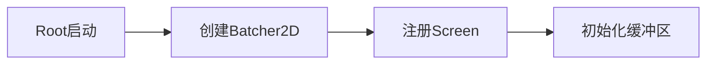
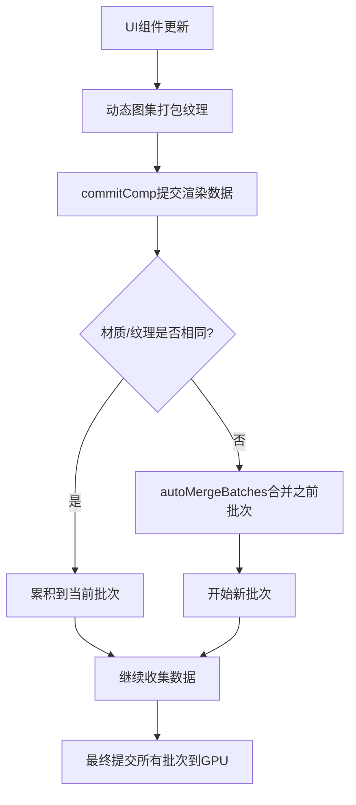
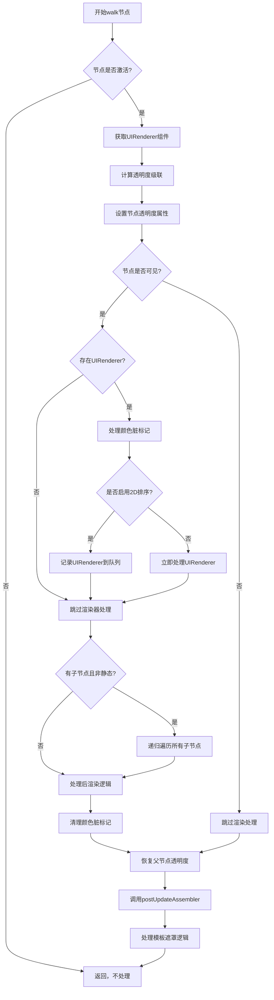
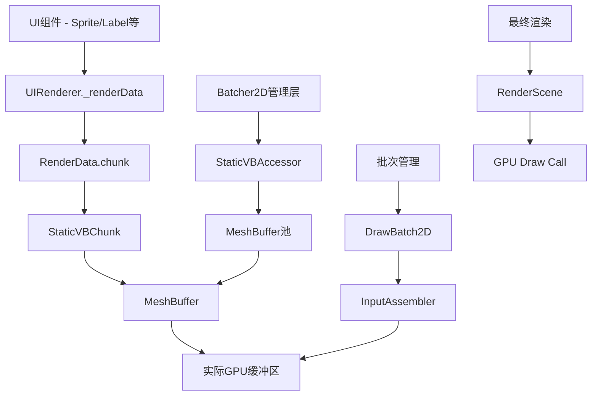
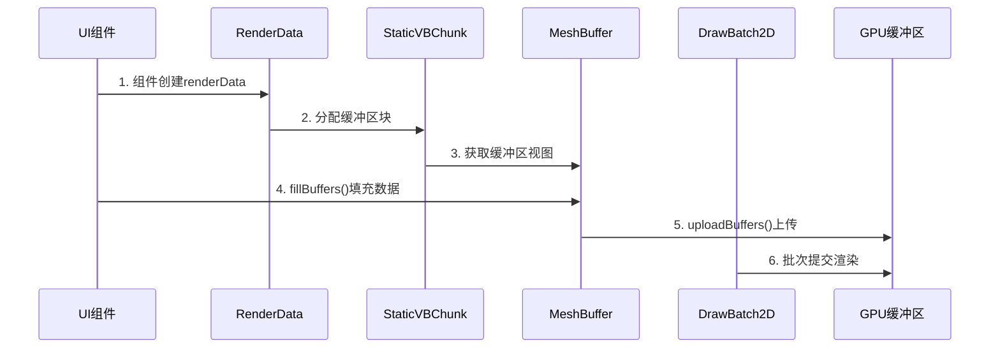
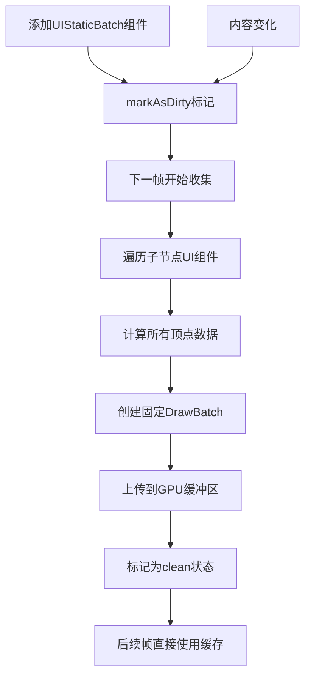
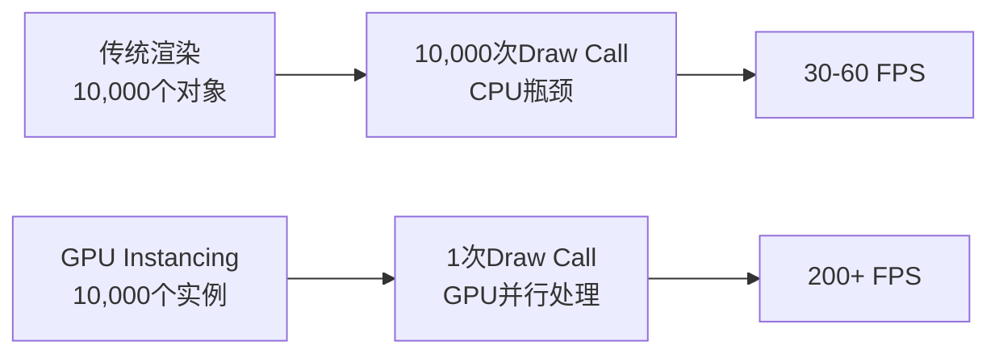

# 解释类和方法的用途
_Exported on 7/14/2025 at 14:28:42 GMT+8 from Cursor (1.2.4)_

---

**User**

这个类是用来做什么的呢？还有这个方法，你帮我解释一下这个方法的具体用途吧？和调用的地方的具体作用。

---

**Cursor**

我来为您详细解释这个类和方法的用途。

## DynamicAtlasManager 类的作用

`DynamicAtlasManager` 是 Cocos Creator 引擎中的**动态图集管理器**，它的主要用途是：

1. **运行时动态合图**：在游戏运行过程中，将多个小的纹理（主要是UI精灵）动态地合并到一个大的图集纹理中
2. **减少 Draw Call**：通过将多个小纹理合并，减少渲染时的纹理切换，从而提高渲染性能
3. **内存优化**：统一管理纹理资源，避免内存碎片化

关键特性：
- 最多支持 `maxAtlasCount`（默认5个）个动态图集
- 每个图集的尺寸为 `textureSize`（默认2048x2048）
- 只接受尺寸小于 `maxFrameSize`（默认512）的纹理

## packToDynamicAtlas 方法解析

让我先搜索这个方法被调用的地方：

现在让我查看几个关键的调用位置来了解具体使用场景：

## packToDynamicAtlas 方法详解

### 方法作用
`packToDynamicAtlas` 方法的主要作用是：**将精灵帧（SpriteFrame）动态打包到图集中，并更新精灵帧的图集信息**。

### 方法逻辑分析
```285:295:cocos-engine/cocos/2d/utils/dynamic-atlas/atlas-manager.ts
public packToDynamicAtlas (comp, frame: SpriteFrame | null): void {
    if (EDITOR_NOT_IN_PREVIEW || !this._enabled) return;

    if (frame && !frame.original && frame.packable && frame.texture && frame.texture.width > 0 && frame.texture.height > 0) {
        const packedFrame = this.insertSpriteFrame(frame);
        if (packedFrame) {
            frame._setDynamicAtlasFrame(packedFrame);
        }
    }
}
```

**执行条件**：
1. 不在编辑器预览模式下
2. 动态图集功能已启用
3. 精灵帧满足以下条件：
   - 存在且不为null
   - 不是已有的图集精灵帧（`!frame.original`）
   - 可打包（`frame.packable`）
   - 有有效的纹理且尺寸大于0

**执行过程**：
1. 调用 `insertSpriteFrame` 尝试将精灵帧插入动态图集
2. 如果成功，更新精灵帧的动态图集信息

### 主要调用场景

根据搜索结果，这个方法主要在以下场景被调用：

#### 1. **Sprite 组件渲染时**
在各种 Sprite 汇编器中（`simple.ts`, `sliced.ts`, `tiled.ts` 等）：
```50:60:cocos-engine/cocos/2d/assembler/sprite/simple.ts
updateRenderData (sprite: Sprite): void {
    const frame = sprite.spriteFrame;

    dynamicAtlasManager.packToDynamicAtlas(sprite, frame);
    this.updateUVs(sprite);// dirty need
    //this.updateColor(sprite);// dirty need

    const renderData = sprite.renderData;
    if (renderData && frame) {
        if (renderData.vertDirty) {
            this.updateVertexData(sprite);
        }
        renderData.updateRenderData(sprite, frame);
    }
}
```

#### 2. **Label 组件（TTF 字体）渲染时**
在 TTF 字体处理中：
```205:215:cocos-engine/cocos/2d/assembler/label/ttfUtils.ts
_calDynamicAtlas (comp: Label, outputLayoutData: TextOutputLayoutData): void {
    if (comp.cacheMode !== CacheMode.BITMAP || outputLayoutData.canvasSize.width <= 0 || outputLayoutData.canvasSize.height <= 0) return;
    const frame = comp.ttfSpriteFrame!;
    dynamicAtlasManager.packToDynamicAtlas(comp, frame);
    // TODO update material and uv
}
```

### 实际作用

1. **性能优化**：通过将多个小纹理合并到一个大图集中，减少GPU状态切换，降低Draw Call数量
2. **内存管理**：统一管理小纹理资源，减少内存碎片
3. **自动化处理**：在渲染流程中自动执行，对开发者透明
4. **实时更新**：在运行时动态调整图集内容，适应不断变化的UI需求

### 总结

`DynamicAtlasManager.packToDynamicAtlas` 是Cocos Creator引擎UI渲染优化的核心机制之一。它在每次UI组件（主要是Sprite和Label）更新渲染数据时被调用，自动将小纹理打包到动态图集中，从而实现渲染性能的优化。这个过程对开发者完全透明，是引擎内部的自动优化机制。

```typescript
public packToDynamicAtlas (comp, frame: SpriteFrame | null): void {
    if (EDITOR_NOT_IN_PREVIEW || !this._enabled) return;

    if (frame && !frame.original && frame.packable && frame.texture && frame.texture.width > 0 && frame.texture.height > 0) {
        const packedFrame = this.insertSpriteFrame(frame);
        if (packedFrame) {
            frame._setDynamicAtlasFrame(packedFrame);
        }
    }
}
```

```typescript
updateRenderData (sprite: Sprite): void {
    const frame = sprite.spriteFrame;

    dynamicAtlasManager.packToDynamicAtlas(sprite, frame);
    this.updateUVs(sprite);// dirty need
    //this.updateColor(sprite);// dirty need

    const renderData = sprite.renderData;
    if (renderData && frame) {
        if (renderData.vertDirty) {
            this.updateVertexData(sprite);
        }
        renderData.updateRenderData(sprite, frame);
    }
}
```

```typescript
_calDynamicAtlas (comp: Label, outputLayoutData: TextOutputLayoutData): void {
    if (comp.cacheMode !== CacheMode.BITMAP || outputLayoutData.canvasSize.width <= 0 || outputLayoutData.canvasSize.height <= 0) return;
    const frame = comp.ttfSpriteFrame!;
    dynamicAtlasManager.packToDynamicAtlas(comp, frame);
    // TODO update material and uv
}
```

---

**User**

这个功能是不是就是合批或者批处理呢？

---

**Cursor**

是的，您说得对！动态图集功能确实是**合批（批处理）的重要组成部分**，但更准确地说，它是**为合批创造条件的纹理合并技术**。

让我搜索一下相关的批处理代码来给您展示完整的关系：

## 动态图集 vs 批处理的关系

您说得非常对！**动态图集确实是合批（批处理）的重要组成部分**，但更准确地说：

### 🎯 关系图解
```
小纹理A + 小纹理B + 小纹理C
         ↓ (动态图集)
      大图集纹理
         ↓ (批处理)
    一次Draw Call渲染多个精灵
```

### 📊 两者的分工

#### **动态图集（DynamicAtlasManager）**
- **作用**：纹理合并
- **目标**：将多个小纹理打包到一个大纹理中
- **时机**：精灵帧首次使用时

#### **批处理器（Batcher2D）**  
- **作用**：渲染合并
- **目标**：将使用相同纹理/材质的多个UI组件合并到一次Draw Call中
- **时机**：每帧渲染时

### 🔄 完整的合批流程

1. **纹理准备阶段**（动态图集）：
```typescript
// 在 sprite 渲染时调用
dynamicAtlasManager.packToDynamicAtlas(sprite, frame);
```

2. **批次合并阶段**（批处理器）：
```678:720:cocos-engine/cocos/2d/renderer/batcher-2d.ts
public autoMergeBatches (renderComp?: UIRenderer): void {
    const mat = this._currMaterial;
    if (!mat) {
        return;
    }
    
    // 合并使用相同材质和纹理的渲染组件
    const curDrawBatch = this._currStaticRoot ? this._currStaticRoot._requireDrawBatch() : this._drawBatchPool.alloc();
    curDrawBatch.texture = this._currTexture;  // 使用动态图集纹理
    curDrawBatch.sampler = this._currSampler;
    curDrawBatch.inputAssembler = ia;
    
    this._batches.push(curDrawBatch);  // 添加到批次队列
}
```

### 🎯 性能优化效果

**没有动态图集时**：
```
精灵A(纹理1) -> Draw Call 1
精灵B(纹理2) -> Draw Call 2  
精灵C(纹理3) -> Draw Call 3
总计：3次Draw Call
```

**有动态图集+批处理时**：
```
精灵A + 精灵B + 精灵C (都在图集纹理中) -> Draw Call 1
总计：1次Draw Call
```

### 📋 总结

动态图集功能确实是**合批系统的核心前置条件**：

- **动态图集**：解决了"纹理不统一"的问题  
- **批处理器**：解决了"多次绘制调用"的问题
- **两者配合**：实现了真正的UI渲染性能优化

所以您的理解完全正确 —— 动态图集就是Cocos Creator中实现UI合批的关键技术之一！🎉

```plaintext
小纹理A + 小纹理B + 小纹理C
         ↓ (动态图集)
      大图集纹理
         ↓ (批处理)
    一次Draw Call渲染多个精灵
```

```typescript
// 在 sprite 渲染时调用
dynamicAtlasManager.packToDynamicAtlas(sprite, frame);
```

```typescript
public autoMergeBatches (renderComp?: UIRenderer): void {
    const mat = this._currMaterial;
    if (!mat) {
        return;
    }
    
    // 合并使用相同材质和纹理的渲染组件
    const curDrawBatch = this._currStaticRoot ? this._currStaticRoot._requireDrawBatch() : this._drawBatchPool.alloc();
    curDrawBatch.texture = this._currTexture;  // 使用动态图集纹理
    curDrawBatch.sampler = this._currSampler;
    curDrawBatch.inputAssembler = ia;
    
    this._batches.push(curDrawBatch);  // 添加到批次队列
}
```

```plaintext
精灵A(纹理1) -> Draw Call 1
精灵B(纹理2) -> Draw Call 2  
精灵C(纹理3) -> Draw Call 3
总计：3次Draw Call
```

```plaintext
精灵A + 精灵B + 精灵C (都在图集纹理中) -> Draw Call 1
总计：1次Draw Call
```

---

**User**

@batcher-2d.ts 你给详细描述一一下批处理的运作方式吧？以及整个系统流程是怎么运作的呢？还有就是详细解析一下其中的关键方法。

---

**Cursor**

# Batcher2D 批处理系统详解

Batcher2D 是 Cocos Creator 引擎中 **UI 渲染的核心批处理器**，负责将多个 UI 组件的渲染数据合并成尽可能少的 Draw Call，从而大幅提升渲染性能。

## 🏗️ 系统架构

### 核心组件
```typescript
export class Batcher2D implements IBatcher {
    // 批次管理
    private _batches: CachedArray<DrawBatch2D>;        // 所有渲染批次
    private _drawBatchPool: Pool<DrawBatch2D>;         // 批次对象池
    
    // 缓冲区管理  
    private _staticVBBuffer: StaticVBAccessor;         // 静态顶点缓冲区
    private _bufferAccessors: Map<number, StaticVBAccessor>; // 多种顶点格式的缓冲区
    
    // 当前渲染状态
    private _currMaterial: Material;                   // 当前材质
    private _currTexture: Texture;                     // 当前纹理
    private _currComponent: UIRenderer;                // 当前组件
    private _currHash: number;                         // 当前数据哈希
}
```

## 🔄 完整渲染流程

### 1. 初始化阶段


### 2. 每帧渲染流程
```275:320:cocos-engine/cocos/2d/renderer/batcher-2d.ts
public update (): void {
    const screens = this._screens;
    let offset = 0;
    
    for (let i = 0; i < screens.length; ++i) {
        const screen = screens[i];
        // 重置状态并遍历节点树
        this._opacityDirty = 0;
        this._pOpacity = 1;
        
        this.walk(screen.node);  // 🔥 核心：遍历节点树收集渲染数据
        
        this.autoMergeBatches(this._currComponent!);  // 🔥 合并最后的批次
        this.resetRenderStates();  // 重置状态
        
        // 为批次分配优先级并提交到渲染场景
        for (; offset < this._batches.length; ++offset) {
            const batch = this._batches.array[offset];
            batch.descriptorSet = this._descriptorSetCache.getDescriptorSet(batch);
            scene.addBatch(batch);  // 提交到渲染管线
        }
    }
}
```

## 🎯 关键方法详解

### 1. walk() - 节点树遍历
这是整个批处理的**入口方法**，递归遍历UI节点树：

```906:970:cocos-engine/cocos/2d/renderer/batcher-2d.ts
public walk (node: Node, level = 0): void {
    if (!node.activeInHierarchy) return;
    
    const render = node._uiProps.uiComp as UIRenderer | null;
    
    // 处理透明度级联
    const parentOpacity = this._pOpacity;
    const selfOpacity = render && render.color ? render.color.a / 255 : 1;
    this._pOpacity *= selfOpacity * node._uiProps.localOpacity;
    
    if (render) {
        // 🔥 处理UI渲染器
        this._handleUIRenderer(render, this._pOpacity, !!this._opacityDirty);
    }
    
    // 递归处理子节点
    if (children.length > 0 && !node._static) {
        for (let i = 0; i < children.length; ++i) {
            this.walk(children[i], level);
        }
    }
    
    // 后处理逻辑
    if (render && render.enabledInHierarchy) {
        render.postUpdateAssembler(this);
    }
}
```

### 2. commitComp() - 提交渲染组件
这是**数据收集的核心方法**，处理大部分UI组件：

```429:497:cocos-engine/cocos/2d/renderer/batcher-2d.ts
public commitComp (
    comp: UIRenderer,
    renderData: BaseRenderData | null,
    frame: TextureBase | SpriteFrame | null,
    assembler: IAssembler,
    transform: Node | null,
): void {
    // 计算数据哈希值
    let dataHash = 0;
    let mat;
    if (renderData && renderData.chunk) {
        dataHash = renderData.dataHash;
        mat = renderData.material;
    }
    
    // 🔥 关键判断：是否需要打断当前批次
    if (this._currHash !== dataHash || this._currMaterial !== mat) {
        // 合并之前的批次数据
        this.autoMergeBatches(this._currComponent!);
        
        // 更新当前状态
        this._currRenderData = renderData;
        this._currHash = dataHash;
        this._currComponent = comp;
        this._currMaterial = comp.getRenderMaterial(0)!;
        
        if (frame) {
            this._currTexture = frame.getGFXTexture();
            this._currSampler = frame.getGFXSampler();
            this._currTextureHash = frame.getHash();
        }
    }
    
    // 调用汇编器填充缓冲区
    if (assembler.fillBuffers) {
        assembler.fillBuffers(comp, this);
    }
}
```

### 3. autoMergeBatches() - 批次合并核心
这是**批处理的核心逻辑**，将累积的渲染数据合并成一个DrawBatch：

```678:744:cocos-engine/cocos/2d/renderer/batcher-2d.ts
public autoMergeBatches (renderComp?: UIRenderer): void {
    const mat = this._currMaterial;
    if (!mat) return;
    
    let ia: InputAssembler | undefined;
    const rd = this._currRenderData as MeshRenderData;
    const accessor = this._staticVBBuffer;
    
    // 🔥 处理网格缓冲区数据
    if (rd && rd._isMeshBuffer) {
        ia = rd.requestIA(this.device);
        if (this._meshDataArray.indexOf(rd) === -1) {
            this._meshDataArray.push(rd);
        }
    } 
    // 🔥 处理静态顶点缓冲区数据
    else if (accessor) {
        const bid = this._currBID;
        const buf = accessor.getMeshBuffer(bid);
        const indexCount = buf.indexOffset - this._indexStart;
        
        if (indexCount <= 0) return;
        
        // 创建输入汇编器
        ia = buf.requireFreeIA(this.device);
        ia.firstIndex = this._indexStart;
        ia.indexCount = indexCount;
        this._indexStart = buf.indexOffset;
    }
    
    if (!ia || !this._currTexture) return;
    
    // 🔥 创建并配置DrawBatch
    const curDrawBatch = this._currStaticRoot ? 
        this._currStaticRoot._requireDrawBatch() : 
        this._drawBatchPool.alloc();
        
    curDrawBatch.visFlags = this._currLayer;
    curDrawBatch.texture = this._currTexture;      // 纹理（可能是动态图集）
    curDrawBatch.sampler = this._currSampler;
    curDrawBatch.inputAssembler = ia;              // 顶点数据
    curDrawBatch.useLocalData = this._currTransform;
    curDrawBatch.fillPasses(mat, depthStencil, dssHash, null);
    
    this._batches.push(curDrawBatch);              // 加入批次队列
}
```

## 🧩 合批条件分析

### 能够合批的条件
两个UI组件能合并到同一个批次，需要满足：

1. **相同材质** (`_currMaterial`)
2. **相同纹理** (`_currTexture`) - 这就是动态图集的作用！
3. **相同图层** (`_currLayer`)
4. **相同模板测试状态** (`_currDepthStencilStateStage`)
5. **连续的渲染数据** (`_currHash`)

### 打断合批的情况
```typescript
// 在 commitComp 中的判断逻辑
if (this._currHash !== dataHash || 
    this._currMaterial !== mat ||
    this._currDepthStencilStateStage !== depthStencilStateStage) {
    
    // 🔥 触发合批，开始新批次
    this.autoMergeBatches(this._currComponent!);
}
```

## 📊 性能优化策略

### 1. 对象池管理
```161:165:cocos-engine/cocos/2d/renderer/batcher-2d.ts
constructor (private _root: Root) {
    this._batches = new CachedArray(64);
    this._drawBatchPool = new Pool(() => new DrawBatch2D(), 128, (obj) => obj.destroy(this));
}
```

### 2. 缓冲区复用
```384:399:cocos-engine/cocos/2d/renderer/batcher-2d.ts
public switchBufferAccessor (attributes: Attribute[] = vfmtPosUvColor): StaticVBAccessor {
    const strideBytes = getAttributeStride(attributes);
    
    // 🔥 根据顶点格式复用缓冲区
    if (!this._staticVBBuffer || this._staticVBBuffer.vertexFormatBytes !== strideBytes) {
        let accessor = this._bufferAccessors.get(strideBytes);
        if (!accessor) {
            accessor = new StaticVBAccessor(this.device, attributes);
            this._bufferAccessors.set(strideBytes, accessor);
        }
        this._staticVBBuffer = accessor;
    }
    return this._staticVBBuffer;
}
```

### 3. 描述符集缓存
```1202:1235:cocos-engine/cocos/2d/renderer/batcher-2d.ts
public getDescriptorSet (batch: DrawBatch2D): DescriptorSet {
    const hash = batch.textureHash ^ batch.samplerHash;
    
    // 🔥 缓存相同纹理+采样器组合的描述符集
    if (this._descriptorSetCache.has(hash)) {
        return this._descriptorSetCache.get(hash)!;
    } else {
        // 创建新的描述符集
        const descriptorSet = deviceManager.gfxDevice.createDescriptorSet(_dsInfo);
        descriptorSet.bindTexture(binding, batch.texture!);
        descriptorSet.bindSampler(binding, batch.sampler!);
        this._descriptorSetCache.set(hash, descriptorSet);
        return descriptorSet;
    }
}
```

## 🔗 与动态图集的协作



## 🎯 总结

**Batcher2D 的核心作用**：
1. **收集渲染数据**：通过 `walk()` 遍历UI树，`commitComp()` 收集组件数据
2. **智能合批**：通过 `autoMergeBatches()` 将相同状态的组件合并
3. **性能优化**：使用对象池、缓冲区复用、描述符集缓存等技术
4. **与动态图集协作**：将小纹理合并后实现大规模UI合批

整个系统的精髓在于**最小化状态切换**：通过将具有相同渲染状态（材质、纹理、图层等）的UI组件合并到一个Draw Call中，实现了从"一个组件一次Draw Call"到"多个组件一次Draw Call"的重大性能提升。🚀

```typescript
export class Batcher2D implements IBatcher {
    // 批次管理
    private _batches: CachedArray<DrawBatch2D>;        // 所有渲染批次
    private _drawBatchPool: Pool<DrawBatch2D>;         // 批次对象池
    
    // 缓冲区管理  
    private _staticVBBuffer: StaticVBAccessor;         // 静态顶点缓冲区
    private _bufferAccessors: Map<number, StaticVBAccessor>; // 多种顶点格式的缓冲区
    
    // 当前渲染状态
    private _currMaterial: Material;                   // 当前材质
    private _currTexture: Texture;                     // 当前纹理
    private _currComponent: UIRenderer;                // 当前组件
    private _currHash: number;                         // 当前数据哈希
}
```

```plaintext
graph LR
    A[Root启动] --> B[创建Batcher2D]
    B --> C[注册Screen]
    C --> D[初始化缓冲区]
```

```typescript
public update (): void {
    const screens = this._screens;
    let offset = 0;
    
    for (let i = 0; i < screens.length; ++i) {
        const screen = screens[i];
        // 重置状态并遍历节点树
        this._opacityDirty = 0;
        this._pOpacity = 1;
        
        this.walk(screen.node);  // 🔥 核心：遍历节点树收集渲染数据
        
        this.autoMergeBatches(this._currComponent!);  // 🔥 合并最后的批次
        this.resetRenderStates();  // 重置状态
        
        // 为批次分配优先级并提交到渲染场景
        for (; offset < this._batches.length; ++offset) {
            const batch = this._batches.array[offset];
            batch.descriptorSet = this._descriptorSetCache.getDescriptorSet(batch);
            scene.addBatch(batch);  // 提交到渲染管线
        }
    }
}
```

```typescript
public walk (node: Node, level = 0): void {
    if (!node.activeInHierarchy) return;
    
    const render = node._uiProps.uiComp as UIRenderer | null;
    
    // 处理透明度级联
    const parentOpacity = this._pOpacity;
    const selfOpacity = render && render.color ? render.color.a / 255 : 1;
    this._pOpacity *= selfOpacity * node._uiProps.localOpacity;
    
    if (render) {
        // 🔥 处理UI渲染器
        this._handleUIRenderer(render, this._pOpacity, !!this._opacityDirty);
    }
    
    // 递归处理子节点
    if (children.length > 0 && !node._static) {
        for (let i = 0; i < children.length; ++i) {
            this.walk(children[i], level);
        }
    }
    
    // 后处理逻辑
    if (render && render.enabledInHierarchy) {
        render.postUpdateAssembler(this);
    }
}
```

```typescript
public commitComp (
    comp: UIRenderer,
    renderData: BaseRenderData | null,
    frame: TextureBase | SpriteFrame | null,
    assembler: IAssembler,
    transform: Node | null,
): void {
    // 计算数据哈希值
    let dataHash = 0;
    let mat;
    if (renderData && renderData.chunk) {
        dataHash = renderData.dataHash;
        mat = renderData.material;
    }
    
    // 🔥 关键判断：是否需要打断当前批次
    if (this._currHash !== dataHash || this._currMaterial !== mat) {
        // 合并之前的批次数据
        this.autoMergeBatches(this._currComponent!);
        
        // 更新当前状态
        this._currRenderData = renderData;
        this._currHash = dataHash;
        this._currComponent = comp;
        this._currMaterial = comp.getRenderMaterial(0)!;
        
        if (frame) {
            this._currTexture = frame.getGFXTexture();
            this._currSampler = frame.getGFXSampler();
            this._currTextureHash = frame.getHash();
        }
    }
    
    // 调用汇编器填充缓冲区
    if (assembler.fillBuffers) {
        assembler.fillBuffers(comp, this);
    }
}
```

```typescript
public autoMergeBatches (renderComp?: UIRenderer): void {
    const mat = this._currMaterial;
    if (!mat) return;
    
    let ia: InputAssembler | undefined;
    const rd = this._currRenderData as MeshRenderData;
    const accessor = this._staticVBBuffer;
    
    // 🔥 处理网格缓冲区数据
    if (rd && rd._isMeshBuffer) {
        ia = rd.requestIA(this.device);
        if (this._meshDataArray.indexOf(rd) === -1) {
            this._meshDataArray.push(rd);
        }
    } 
    // 🔥 处理静态顶点缓冲区数据
    else if (accessor) {
        const bid = this._currBID;
        const buf = accessor.getMeshBuffer(bid);
        const indexCount = buf.indexOffset - this._indexStart;
        
        if (indexCount <= 0) return;
        
        // 创建输入汇编器
        ia = buf.requireFreeIA(this.device);
        ia.firstIndex = this._indexStart;
        ia.indexCount = indexCount;
        this._indexStart = buf.indexOffset;
    }
    
    if (!ia || !this._currTexture) return;
    
    // 🔥 创建并配置DrawBatch
    const curDrawBatch = this._currStaticRoot ? 
        this._currStaticRoot._requireDrawBatch() : 
        this._drawBatchPool.alloc();
        
    curDrawBatch.visFlags = this._currLayer;
    curDrawBatch.texture = this._currTexture;      // 纹理（可能是动态图集）
    curDrawBatch.sampler = this._currSampler;
    curDrawBatch.inputAssembler = ia;              // 顶点数据
    curDrawBatch.useLocalData = this._currTransform;
    curDrawBatch.fillPasses(mat, depthStencil, dssHash, null);
    
    this._batches.push(curDrawBatch);              // 加入批次队列
}
```

```typescript
// 在 commitComp 中的判断逻辑
if (this._currHash !== dataHash || 
    this._currMaterial !== mat ||
    this._currDepthStencilStateStage !== depthStencilStateStage) {
    
    // 🔥 触发合批，开始新批次
    this.autoMergeBatches(this._currComponent!);
}
```

```typescript
constructor (private _root: Root) {
    this._batches = new CachedArray(64);
    this._drawBatchPool = new Pool(() => new DrawBatch2D(), 128, (obj) => obj.destroy(this));
}
```

```typescript
public switchBufferAccessor (attributes: Attribute[] = vfmtPosUvColor): StaticVBAccessor {
    const strideBytes = getAttributeStride(attributes);
    
    // 🔥 根据顶点格式复用缓冲区
    if (!this._staticVBBuffer || this._staticVBBuffer.vertexFormatBytes !== strideBytes) {
        let accessor = this._bufferAccessors.get(strideBytes);
        if (!accessor) {
            accessor = new StaticVBAccessor(this.device, attributes);
            this._bufferAccessors.set(strideBytes, accessor);
        }
        this._staticVBBuffer = accessor;
    }
    return this._staticVBBuffer;
}
```

```typescript
public getDescriptorSet (batch: DrawBatch2D): DescriptorSet {
    const hash = batch.textureHash ^ batch.samplerHash;
    
    // 🔥 缓存相同纹理+采样器组合的描述符集
    if (this._descriptorSetCache.has(hash)) {
        return this._descriptorSetCache.get(hash)!;
    } else {
        // 创建新的描述符集
        const descriptorSet = deviceManager.gfxDevice.createDescriptorSet(_dsInfo);
        descriptorSet.bindTexture(binding, batch.texture!);
        descriptorSet.bindSampler(binding, batch.sampler!);
        this._descriptorSetCache.set(hash, descriptorSet);
        return descriptorSet;
    }
}
```

```plaintext
graph TD
    A[UI组件更新] --> B[动态图集打包纹理]
    B --> C[commitComp提交渲染数据]
    C --> D{材质/纹理是否相同?}
    D -->|是| E[累积到当前批次]
    D -->|否| F[autoMergeBatches合并之前批次]
    F --> G[开始新批次]
    E --> H[继续收集数据]
    G --> H
    H --> I[最终提交所有批次到GPU]
```

---

**User**

把walk方法再详细说一下吧，还有就是遍历节点数收集渲染数据，都是什么渲染数据呢？

---

**Cursor**

# walk() 方法详解与渲染数据收集

## 🚶‍♂️ walk() 方法完整分析

`walk()` 方法是 Batcher2D 的**核心遍历引擎**，负责深度优先遍历整个UI节点树，收集所有需要渲染的数据。

### 完整代码解析

# walk() 方法详细解析与渲染数据收集

## 🚶‍♂️ walk() 方法详细流程图



## 🔍 walk() 方法分段详解

### 1. 节点激活检查与基础信息获取
```906:913:cocos-engine/cocos/2d/renderer/batcher-2d.ts
public walk (node: Node, level = 0): void {
    if (!node.activeInHierarchy) {
        return;  // 🔥 非激活节点直接跳过
    }
    const children = node.children;
    const uiProps = node._uiProps;
    const render = uiProps.uiComp as UIRenderer | null; // 🔥 获取UI渲染组件
```

### 2. 透明度级联计算
```914:920:cocos-engine/cocos/2d/renderer/batcher-2d.ts
// Save opacity
const parentOpacity = this._pOpacity;
let opacity = parentOpacity;
// 🔥 计算级联透明度：父透明度 × 自身透明度 × 局部透明度
const selfOpacity = render && render.color ? render.color.a / 255 : 1;
this._pOpacity = opacity *= selfOpacity * uiProps.localOpacity;
uiProps.setOpacity(opacity); // 🔥 设置最终透明度
```

### 3. 渲染组件处理（核心部分）
```921:940:cocos-engine/cocos/2d/renderer/batcher-2d.ts
const visable = !approx(opacity, 0, EPSILON);
if (visable) {
    if (uiProps.colorDirty) {
        this._opacityDirty++; // 🔥 标记透明度脏状态
    }
    if (render) {
        if (USE_SORTING_2D && sorting2DCount > 0) {
            // 🔥 2D排序模式：先记录，后统一处理
            this._recordUIRenderer(render, opacity, !!this._opacityDirty);
        } else {
            // 🔥 即时处理模式：立即处理渲染数据
            this._handleUIRenderer(render, opacity, !!this._opacityDirty);
        }
    }
}
```

## 📊 渲染数据收集详解

### 渲染数据的核心结构

#### IRenderData - 单个顶点数据
```43:49:cocos-engine/cocos/2d/renderer/render-data.ts
export interface IRenderData {
    x: number;      // 🔥 顶点X坐标（世界坐标）
    y: number;      // 🔥 顶点Y坐标（世界坐标）
    z: number;      // 🔥 顶点Z坐标（深度）
    u: number;      // 🔥 纹理U坐标
    v: number;      // 🔥 纹理V坐标
    color: Color;   // 🔥 顶点颜色（RGBA）
}
```

#### BaseRenderData - 渲染数据容器
```57:120:cocos-engine/cocos/2d/renderer/render-data.ts
export class BaseRenderData {
    // 🔥 核心数据属性
    protected _vc = 0;                    // 顶点数量
    protected _ic = 0;                    // 索引数量  
    protected _floatStride = 0;           // 顶点步长
    protected _vertexFormat = vfmtPosUvColor; // 顶点格式
    protected _material: Material | null = null; // 渲染材质
    protected _dataHash = 0;              // 数据哈希（用于合批判断）
    
    public chunk: StaticVBChunk = null!;  // 🔥 顶点缓冲区块
}
```

### _handleUIRenderer - 渲染数据处理核心
```838:868:cocos-engine/cocos/2d/renderer/batcher-2d.ts
private _handleUIRenderer (render: UIRenderer, finalOpacity: number, opacityDirty: boolean): void {
    const renderData = render ? render.renderData : null;
    const vertexCount = renderData ? renderData.vertexCount : 0;

    // 🔥 关键步骤1：调用组件的fillBuffers填充顶点数据
    if (render && render.enabledInHierarchy) {
        render.fillBuffers(this); // 🔥 核心：填充渲染缓冲区
    }

    // 🔥 关键步骤2：更新级联透明度到顶点缓冲区
    if (opacityDirty && vertexCount > 0) {
        switch (render.getFillColorType()) {
        case RenderEntityFillColorType.COLOR: {
            updateOpacity(renderData!, finalOpacity); // 🔥 更新顶点透明度
            break;
        }
        case RenderEntityFillColorType.VERTEX: {
            // 使用顶点颜色，无需更新
            break;
        }
        }
        
        const buffer = renderData!.getMeshBuffer();
        if (buffer) {
            buffer.setDirty(); // 🔥 标记缓冲区为脏
        }
    }
}
```

## 🎨 渲染数据收集的具体类型

### 1. **顶点位置数据**（世界坐标）
- **X、Y、Z坐标**：UI元素在世界空间中的位置
- **计算来源**：节点变换矩阵 × 局部顶点坐标

### 2. **纹理坐标数据**
- **U、V坐标**：纹理采样坐标（0-1范围）
- **计算来源**：精灵帧的UV信息或动态计算

### 3. **颜色数据**
- **RGBA颜色**：顶点颜色，包含透明度
- **计算来源**：组件颜色 × 级联透明度

### 4. **索引数据**
- **顶点索引**：定义三角形绘制顺序
- **典型组织**：矩形 = 2个三角形 = 6个索引

### 5. **材质数据**
- **渲染材质**：着色器程序和渲染状态
- **纹理引用**：用于合批判断

## 🔧 具体组件的渲染数据示例

### Sprite 组件的渲染流程
```579:581:cocos-engine/cocos/2d/components/sprite.ts
protected _render (render: IBatcher): void {
    // 🔥 提交渲染数据：组件、渲染数据、精灵帧、汇编器
    render.commitComp(this, this.renderData, this._spriteFrame, this._assembler, null);
}
```

### 一个典型的Sprite渲染数据结构
```typescript
// 🔥 一个简单矩形Sprite的渲染数据
const spriteRenderData = {
    vertexCount: 4,    // 4个顶点
    indexCount: 6,     // 6个索引（2个三角形）
    vertices: [
        // 左下角
        { x: 0, y: 0, z: 0, u: 0, v: 1, color: Color.WHITE },
        // 右下角  
        { x: 100, y: 0, z: 0, u: 1, v: 1, color: Color.WHITE },
        // 左上角
        { x: 0, y: 100, z: 0, u: 0, v: 0, color: Color.WHITE },
        // 右上角
        { x: 100, y: 100, z: 0, u: 1, v: 0, color: Color.WHITE }
    ],
    indices: [0, 1, 2, 2, 1, 3],  // 两个三角形
    material: spriteMaterial,      // UI-sprite材质
    texture: spriteTexture,        // 精灵纹理
    dataHash: 12345               // 用于合批的数据哈希
};
```

## 🎯 收集过程总结

**walk() 方法的渲染数据收集过程**：

1. **遍历节点树**：深度优先遍历UI节点层次结构
2. **透明度级联**：计算并传递透明度到子节点
3. **组件识别**：识别具有UIRenderer的节点
4. **数据填充**：调用fillBuffers填充顶点数据到缓冲区
5. **状态更新**：更新颜色、透明度等动态属性
6. **合批准备**：为后续的autoMergeBatches做准备

**收集的数据最终用于**：
- **批次合并**：相同状态的组件合并为一个Draw Call
- **GPU渲染**：生成InputAssembler提交给图形API
- **性能优化**：减少CPU-GPU通信和状态切换

这个过程是Cocos Creator UI渲染优化的核心，通过精确的数据收集和智能的批次合并，实现了高效的UI渲染性能。🚀

```plaintext
graph TD
    A[开始walk节点] --> B{节点是否激活?}
    B -->|否| Z[返回，不处理]
    B -->|是| C[获取UIRenderer组件]
    C --> D[计算透明度级联]
    D --> E[设置节点透明度属性]
    E --> F{节点是否可见?}
    F -->|否| Y[跳过渲染处理]
    F -->|是| G{存在UIRenderer?}
    G -->|是| H[处理颜色脏标记]
    H --> I{是否启用2D排序?}
    I -->|是| J[记录UIRenderer到队列]
    I -->|否| K[立即处理UIRenderer]
    G -->|否| L[跳过渲染器处理]
    J --> L
    K --> L
    L --> M{有子节点且非静态?}
    M -->|是| N[递归遍历所有子节点]
    M -->|否| O[处理后渲染逻辑]
    N --> O
    O --> P[清理颜色脏标记]
    P --> Q[恢复父节点透明度]
    Q --> R[调用postUpdateAssembler]
    R --> S[处理模板遮罩逻辑]
    S --> Z
    Y --> Q
```

```typescript
public walk (node: Node, level = 0): void {
    if (!node.activeInHierarchy) {
        return;  // 🔥 非激活节点直接跳过
    }
    const children = node.children;
    const uiProps = node._uiProps;
    const render = uiProps.uiComp as UIRenderer | null; // 🔥 获取UI渲染组件
```

```typescript
// Save opacity
const parentOpacity = this._pOpacity;
let opacity = parentOpacity;
// 🔥 计算级联透明度：父透明度 × 自身透明度 × 局部透明度
const selfOpacity = render && render.color ? render.color.a / 255 : 1;
this._pOpacity = opacity *= selfOpacity * uiProps.localOpacity;
uiProps.setOpacity(opacity); // 🔥 设置最终透明度
```

```typescript
const visable = !approx(opacity, 0, EPSILON);
if (visable) {
    if (uiProps.colorDirty) {
        this._opacityDirty++; // 🔥 标记透明度脏状态
    }
    if (render) {
        if (USE_SORTING_2D && sorting2DCount > 0) {
            // 🔥 2D排序模式：先记录，后统一处理
            this._recordUIRenderer(render, opacity, !!this._opacityDirty);
        } else {
            // 🔥 即时处理模式：立即处理渲染数据
            this._handleUIRenderer(render, opacity, !!this._opacityDirty);
        }
    }
}
```

```typescript
export interface IRenderData {
    x: number;      // 🔥 顶点X坐标（世界坐标）
    y: number;      // 🔥 顶点Y坐标（世界坐标）
    z: number;      // 🔥 顶点Z坐标（深度）
    u: number;      // 🔥 纹理U坐标
    v: number;      // 🔥 纹理V坐标
    color: Color;   // 🔥 顶点颜色（RGBA）
}
```

```typescript
export class BaseRenderData {
    // 🔥 核心数据属性
    protected _vc = 0;                    // 顶点数量
    protected _ic = 0;                    // 索引数量  
    protected _floatStride = 0;           // 顶点步长
    protected _vertexFormat = vfmtPosUvColor; // 顶点格式
    protected _material: Material | null = null; // 渲染材质
    protected _dataHash = 0;              // 数据哈希（用于合批判断）
    
    public chunk: StaticVBChunk = null!;  // 🔥 顶点缓冲区块
}
```

```typescript
private _handleUIRenderer (render: UIRenderer, finalOpacity: number, opacityDirty: boolean): void {
    const renderData = render ? render.renderData : null;
    const vertexCount = renderData ? renderData.vertexCount : 0;

    // 🔥 关键步骤1：调用组件的fillBuffers填充顶点数据
    if (render && render.enabledInHierarchy) {
        render.fillBuffers(this); // 🔥 核心：填充渲染缓冲区
    }

    // 🔥 关键步骤2：更新级联透明度到顶点缓冲区
    if (opacityDirty && vertexCount > 0) {
        switch (render.getFillColorType()) {
        case RenderEntityFillColorType.COLOR: {
            updateOpacity(renderData!, finalOpacity); // 🔥 更新顶点透明度
            break;
        }
        case RenderEntityFillColorType.VERTEX: {
            // 使用顶点颜色，无需更新
            break;
        }
        }
        
        const buffer = renderData!.getMeshBuffer();
        if (buffer) {
            buffer.setDirty(); // 🔥 标记缓冲区为脏
        }
    }
}
```

```typescript
protected _render (render: IBatcher): void {
    // 🔥 提交渲染数据：组件、渲染数据、精灵帧、汇编器
    render.commitComp(this, this.renderData, this._spriteFrame, this._assembler, null);
}
```

```typescript
// 🔥 一个简单矩形Sprite的渲染数据
const spriteRenderData = {
    vertexCount: 4,    // 4个顶点
    indexCount: 6,     // 6个索引（2个三角形）
    vertices: [
        // 左下角
        { x: 0, y: 0, z: 0, u: 0, v: 1, color: Color.WHITE },
        // 右下角  
        { x: 100, y: 0, z: 0, u: 1, v: 1, color: Color.WHITE },
        // 左上角
        { x: 0, y: 100, z: 0, u: 0, v: 0, color: Color.WHITE },
        // 右上角
        { x: 100, y: 100, z: 0, u: 1, v: 0, color: Color.WHITE }
    ],
    indices: [0, 1, 2, 2, 1, 3],  // 两个三角形
    material: spriteMaterial,      // UI-sprite材质
    texture: spriteTexture,        // 精灵纹理
    dataHash: 12345               // 用于合批的数据哈希
};
```

---

**User**

收集到的渲染数据都保存到哪了呢？

---

**Cursor**

# 渲染数据的存储位置与流向 🗂️

收集到的渲染数据在Cocos Creator中有一个**分层存储**的架构，从组件级别到最终的GPU缓冲区，让我详细为您解析数据的存储位置和流向。

## 📍 数据存储的层次结构

# 渲染数据存储架构详解 🗂️

收集到的渲染数据在Cocos Creator中采用**分层存储架构**，从组件级别一直到GPU缓冲区，形成了一个完整的数据流链路。

## 🏗️ 数据存储的完整层次结构



## 📍 详细存储位置分析

### 1. **组件级别存储**（第一层）
```206:220:cocos-engine/cocos/2d/framework/ui-renderer.ts
// 🔥 每个UI组件都有自己的渲染数据
protected _renderData: RenderData | null = null;

get renderData (): RenderData | null {
    return this._renderData;
}

setRenderData (renderData: RenderData | null): void {
    this._renderData = renderData;
}
```

**存储内容**：
- **组件私有渲染数据**：每个UI组件都维护自己的RenderData实例
- **包含**：顶点数据、材质信息、纹理引用、数据哈希等
- **生命周期**：与组件同步，组件销毁时释放

### 2. **渲染数据容器**（第二层）
```316:319:cocos-engine/cocos/2d/renderer/render-data.ts
// 🔥 RenderData包含的核心数据
private _data: IRenderData[] = [];           // 顶点数据数组
private _frame: SpriteFrame | TextureBase | null = null; // 纹理帧
protected _accessor: StaticVBAccessor = null!; // 缓冲区访问器
```

**存储内容**：
- **顶点数据数组**：每个顶点的位置、UV、颜色信息
- **纹理引用**：精灵帧或纹理基础对象
- **缓冲区引用**：指向实际的GPU缓冲区块

### 3. **静态顶点缓冲区访问器**（第三层）
```117:120:cocos-engine/cocos/2d/renderer/batcher-2d.ts
// 🔥 Batcher2D中的缓冲区管理
private _staticVBBuffer: StaticVBAccessor | null = null;
private _bufferAccessors: Map<number, StaticVBAccessor> = new Map();
private _meshDataArray: MeshRenderData[] = [];
```

**StaticVBAccessor结构**：
```70:85:cocos-engine/cocos/2d/renderer/static-vb-accessor.ts
export class StaticVBAccessor extends BufferAccessor {
    private _freeLists: IFreeEntry[][] = [];  // 🔥 空闲内存块管理
    private _vCount = 0;                       // 顶点数量
    private _iCount = 0;                       // 索引数量
    private _id = 0;                          // 访问器ID
}
```

**存储内容**：
- **多个MeshBuffer**：管理多个实际的GPU缓冲区
- **内存分配管理**：维护空闲内存块列表，支持动态分配
- **顶点格式管理**：不同顶点格式使用不同的访问器

### 4. **网格缓冲区**（第四层）
```130:170:cocos-engine/cocos/2d/renderer/mesh-buffer.ts
export class MeshBuffer {
    // 🔥 实际的GPU缓冲区数据
    protected _vData: Float32Array = null!;    // 顶点数据
    protected _iData: Uint16Array = null!;     // 索引数据
    
    // 🔥 偏移管理
    protected _byteOffset = 0;                 // 字节偏移
    protected _vertexOffset = 0;               // 顶点偏移
    protected _indexOffset = 0;                // 索引偏移
    protected _dirty = false;                  // 脏标记
}
```

**存储内容**：
- **Float32Array**：存储实际的顶点数据（位置、UV、颜色）
- **Uint16Array**：存储索引数据（三角形绘制顺序）
- **偏移管理**：跟踪当前数据在缓冲区中的位置

### 5. **静态顶点块**（第五层）
```43:65:cocos-engine/cocos/2d/renderer/static-vb-accessor.ts
export class StaticVBChunk {
    constructor (
        public vertexAccessor: StaticVBAccessor,  // 所属访问器
        public bufferId: number,                  // 缓冲区ID
        public meshBuffer: MeshBuffer,            // 网格缓冲区
        public vertexOffset: number,              // 顶点偏移
        public vb: Float32Array,                  // 顶点缓冲区视图
        public indexCount: number,                // 索引数量
    ) {}
}
```

**存储内容**：
- **缓冲区视图**：指向MeshBuffer中特定区域的Float32Array
- **位置信息**：在整个缓冲区中的偏移位置
- **大小信息**：分配的顶点和索引数量

### 6. **渲染批次**（第六层）
```121:160:cocos-engine/cocos/2d/renderer/batcher-2d.ts
// 🔥 Batcher2D中的批次管理
private declare _batches: CachedArray<DrawBatch2D>;
private _currRenderData: BaseRenderData | null = null;
private _currMaterial: Material = this._emptyMaterial;
private _currTexture: Texture | null = null;
private _currComponent: UIRenderer | null = null;
```

**DrawBatch2D结构**：
```43:60:cocos-engine/cocos/2d/renderer/draw-batch.ts
export class DrawBatch2D {
    public model: Model | null = null;           // 3D模型（用于UIModel）
    public texture: Texture | null = null;       // 纹理
    public sampler: Sampler | null = null;       // 采样器
    public inputAssembler: InputAssembler | null = null; // 🔥 输入汇编器
    public descriptorSet: DescriptorSet | null = null;   // 描述符集
    public textureHash = 0;                      // 纹理哈希
    public samplerHash = 0;                      // 采样器哈希
}
```

**存储内容**：
- **InputAssembler**：GPU渲染所需的顶点缓冲区和索引缓冲区
- **材质信息**：着色器、纹理、采样器等渲染状态
- **批次元数据**：用于合批判断的哈希值

## 🔄 数据流向详解

### 数据收集流程


### 具体存储示例

#### 一个Sprite组件的完整数据链路：
```typescript
// 🔥 1. 组件级别
const sprite = node.getComponent(Sprite);
sprite._renderData = new RenderData();

// 🔥 2. 渲染数据级别
sprite._renderData._data = [
    {x: 0, y: 0, z: 0, u: 0, v: 1, color: Color.WHITE},    // 左下
    {x: 100, y: 0, z: 0, u: 1, v: 1, color: Color.WHITE},  // 右下
    {x: 0, y: 100, z: 0, u: 0, v: 0, color: Color.WHITE},  // 左上
    {x: 100, y: 100, z: 0, u: 1, v: 0, color: Color.WHITE} // 右上
];

// 🔥 3. 缓冲区块级别
sprite._renderData.chunk = staticVBAccessor.allocateChunk(4, 6);

// 🔥 4. 网格缓冲区级别
const meshBuffer = sprite._renderData.chunk.meshBuffer;
// meshBuffer.vData[offset...] = 实际顶点数据
// meshBuffer.iData[indexOffset...] = [0,1,2,2,1,3] 索引数据

// 🔥 5. 批次级别
const drawBatch = new DrawBatch2D();
drawBatch.inputAssembler = meshBuffer.requireFreeIA(device);
drawBatch.texture = sprite.spriteFrame.texture;
```

## 📊 内存管理特点

### 1. **分层缓存机制**
- **组件级**：按需创建，生命周期绑定
- **缓冲区级**：池化管理，避免频繁分配
- **GPU级**：批量上传，减少CPU-GPU通信

### 2. **动态分配策略**
- **空闲列表管理**：StaticVBAccessor维护可用内存块
- **自动扩容**：缓冲区不足时自动创建新的MeshBuffer
- **碎片整理**：支持内存块的合并和回收

### 3. **数据同步机制**
- **脏标记**：只有变化的数据才会重新上传GPU
- **延迟更新**：批量更新减少GPU状态切换
- **增量同步**：只同步变化的部分数据

## 🎯 总结

渲染数据的存储采用了**分层抽象**的设计：
- **从上到下**：UI组件 → RenderData → StaticVBChunk → MeshBuffer → GPU缓冲区
- **从抽象到具体**：组件逻辑 → 数据结构 → 内存管理 → 硬件接口
- **高效管理**：通过缓存、池化、批量处理等机制优化性能

这种架构既保证了数据的**逻辑清晰性**，又实现了**高效的内存管理**和**GPU渲染性能**。🚀

```plaintext
graph TD
    A[UI组件 - Sprite/Label等] --> B[UIRenderer._renderData]
    B --> C[RenderData.chunk]
    C --> D[StaticVBChunk]
    D --> E[MeshBuffer]
    E --> F[实际GPU缓冲区]
    
    G[Batcher2D管理层] --> H[StaticVBAccessor]
    H --> I[MeshBuffer池]
    I --> E
    
    J[批次管理] --> K[DrawBatch2D]
    K --> L[InputAssembler]
    L --> F
    
    M[最终渲染] --> N[RenderScene]
    N --> O[GPU Draw Call]
```

```typescript
// 🔥 每个UI组件都有自己的渲染数据
protected _renderData: RenderData | null = null;

get renderData (): RenderData | null {
    return this._renderData;
}

setRenderData (renderData: RenderData | null): void {
    this._renderData = renderData;
}
```

```typescript
// 🔥 RenderData包含的核心数据
private _data: IRenderData[] = [];           // 顶点数据数组
private _frame: SpriteFrame | TextureBase | null = null; // 纹理帧
protected _accessor: StaticVBAccessor = null!; // 缓冲区访问器
```

```typescript
// 🔥 Batcher2D中的缓冲区管理
private _staticVBBuffer: StaticVBAccessor | null = null;
private _bufferAccessors: Map<number, StaticVBAccessor> = new Map();
private _meshDataArray: MeshRenderData[] = [];
```

```typescript
export class StaticVBAccessor extends BufferAccessor {
    private _freeLists: IFreeEntry[][] = [];  // 🔥 空闲内存块管理
    private _vCount = 0;                       // 顶点数量
    private _iCount = 0;                       // 索引数量
    private _id = 0;                          // 访问器ID
}
```

```typescript
export class MeshBuffer {
    // 🔥 实际的GPU缓冲区数据
    protected _vData: Float32Array = null!;    // 顶点数据
    protected _iData: Uint16Array = null!;     // 索引数据
    
    // 🔥 偏移管理
    protected _byteOffset = 0;                 // 字节偏移
    protected _vertexOffset = 0;               // 顶点偏移
    protected _indexOffset = 0;                // 索引偏移
    protected _dirty = false;                  // 脏标记
}
```

```typescript
export class StaticVBChunk {
    constructor (
        public vertexAccessor: StaticVBAccessor,  // 所属访问器
        public bufferId: number,                  // 缓冲区ID
        public meshBuffer: MeshBuffer,            // 网格缓冲区
        public vertexOffset: number,              // 顶点偏移
        public vb: Float32Array,                  // 顶点缓冲区视图
        public indexCount: number,                // 索引数量
    ) {}
}
```

```typescript
// 🔥 Batcher2D中的批次管理
private declare _batches: CachedArray<DrawBatch2D>;
private _currRenderData: BaseRenderData | null = null;
private _currMaterial: Material = this._emptyMaterial;
private _currTexture: Texture | null = null;
private _currComponent: UIRenderer | null = null;
```

```typescript
export class DrawBatch2D {
    public model: Model | null = null;           // 3D模型（用于UIModel）
    public texture: Texture | null = null;       // 纹理
    public sampler: Sampler | null = null;       // 采样器
    public inputAssembler: InputAssembler | null = null; // 🔥 输入汇编器
    public descriptorSet: DescriptorSet | null = null;   // 描述符集
    public textureHash = 0;                      // 纹理哈希
    public samplerHash = 0;                      // 采样器哈希
}
```

```plaintext
sequenceDiagram
    participant UI as UI组件
    participant RD as RenderData
    participant Chunk as StaticVBChunk
    participant MB as MeshBuffer
    participant DB as DrawBatch2D
    participant GPU as GPU缓冲区

    UI->>RD: 1. 组件创建renderData
    RD->>Chunk: 2. 分配缓冲区块
    Chunk->>MB: 3. 获取缓冲区视图
    UI->>MB: 4. fillBuffers()填充数据
    MB->>GPU: 5. uploadBuffers()上传
    DB->>GPU: 6. 批次提交渲染
```

```typescript
// 🔥 1. 组件级别
const sprite = node.getComponent(Sprite);
sprite._renderData = new RenderData();

// 🔥 2. 渲染数据级别
sprite._renderData._data = [
    {x: 0, y: 0, z: 0, u: 0, v: 1, color: Color.WHITE},    // 左下
    {x: 100, y: 0, z: 0, u: 1, v: 1, color: Color.WHITE},  // 右下
    {x: 0, y: 100, z: 0, u: 0, v: 0, color: Color.WHITE},  // 左上
    {x: 100, y: 100, z: 0, u: 1, v: 0, color: Color.WHITE} // 右上
];

// 🔥 3. 缓冲区块级别
sprite._renderData.chunk = staticVBAccessor.allocateChunk(4, 6);

// 🔥 4. 网格缓冲区级别
const meshBuffer = sprite._renderData.chunk.meshBuffer;
// meshBuffer.vData[offset...] = 实际顶点数据
// meshBuffer.iData[indexOffset...] = [0,1,2,2,1,3] 索引数据

// 🔥 5. 批次级别
const drawBatch = new DrawBatch2D();
drawBatch.inputAssembler = meshBuffer.requireFreeIA(device);
drawBatch.texture = sprite.spriteFrame.texture;
```

---

**User**

详细说明下每个接口的作用吧。

---

**Cursor**

# IBatcher 接口详解 🎯

`IBatcher` 是 Cocos Creator 2D 渲染系统的**核心抽象接口**，定义了批处理器必须实现的所有功能。让我详细解析每个接口的作用和使用场景。

## 🏗️ 属性接口

### 1. **currBufferAccessor: StaticVBAccessor**
```typescript
currBufferAccessor: StaticVBAccessor;
```
**作用**：获取当前正在使用的静态顶点缓冲区访问器
- **用途**：管理当前的顶点缓冲区，用于分配和回收顶点数据空间
- **场景**：当UI组件需要申请顶点缓冲区时使用
- **实现**：返回 `_staticVBBuffer` 或创建新的访问器

### 2. **readonly batches: CachedArray<DrawBatch2D>**
```typescript
readonly batches: CachedArray<DrawBatch2D>;
```
**作用**：获取所有准备提交给GPU的渲染批次
- **用途**：存储合并后的渲染批次，每个批次代表一次Draw Call
- **场景**：渲染管线从中获取批次进行实际渲染
- **只读**：外部只能读取，不能直接修改

### 3. **currStaticRoot: UIStaticBatch | null**
```typescript
currStaticRoot: UIStaticBatch | null;
```
**作用**：当前的静态批次根节点
- **用途**：管理静态UI批次，静态批次的渲染数据不会每帧更新
- **场景**：处理静态UI元素时设置，提高性能
- **优化**：静态元素可以避免每帧重新计算

### 4. **device: Device**
```typescript
device: Device;
```
**作用**：图形设备接口
- **用途**：创建缓冲区、纹理、着色器等GPU资源
- **场景**：所有GPU相关操作都通过此设备接口
- **核心**：连接CPU渲染逻辑与GPU硬件的桥梁

## 🔄 生命周期管理

### 5. **initialize(): boolean**
```typescript
initialize(): boolean;
```
**作用**：初始化批处理器
- **执行时机**：系统启动时调用一次
- **返回值**：成功返回true，失败返回false
- **功能**：创建必要的资源、设置初始状态
- **实现示例**：
```typescript
public initialize(): boolean {
    // 初始化对象池、缓冲区等
    return true;
}
```

### 6. **destroy(): void**
```typescript
destroy(): void;
```
**作用**：销毁批处理器，释放所有资源
- **执行时机**：系统关闭时调用
- **功能**：释放GPU缓冲区、销毁对象池、清理缓存
- **重要性**：防止内存泄漏

### 7. **update(): void**
```typescript
update(): void;
```
**作用**：每帧更新，执行主渲染逻辑
- **执行时机**：每帧调用一次
- **核心流程**：
  1. 遍历所有屏幕节点
  2. 调用 `walk()` 收集渲染数据
  3. 合并批次
  4. 提交到渲染场景

### 8. **uploadBuffers(): void**
```typescript
uploadBuffers(): void;
```
**作用**：将CPU端的顶点数据上传到GPU缓冲区
- **执行时机**：数据收集完成后，实际渲染前
- **优化**：只上传标记为脏的缓冲区数据
- **性能关键**：减少CPU-GPU数据传输

### 9. **reset(): void**
```typescript
reset(): void;
```
**作用**：重置批处理器状态，准备下一帧
- **执行时机**：每帧结束时调用
- **功能**：清空批次队列、重置缓冲区偏移、回收资源
- **循环利用**：避免频繁创建销毁对象

## 🖥️ 屏幕管理

### 10. **addScreen(comp: RenderRoot2D): void**
```typescript
addScreen(comp: RenderRoot2D): void;
```
**作用**：添加一个渲染根节点（Canvas）到管理列表
- **参数**：`comp` - Canvas组件
- **场景**：场景中创建Canvas时调用
- **管理**：维护所有需要渲染的Canvas列表

### 11. **removeScreen(comp: RenderRoot2D): void**
```typescript
removeScreen(comp: RenderRoot2D): void;
```
**作用**：从管理列表中移除渲染根节点
- **参数**：`comp` - 要移除的Canvas组件
- **场景**：Canvas被销毁时调用
- **清理**：确保不会渲染已销毁的Canvas

### 12. **getFirstRenderCamera(node: Node): Camera | null**
```typescript
getFirstRenderCamera(node: Node): Camera | null;
```
**作用**：获取能够渲染指定节点的第一个摄像机
- **参数**：`node` - 目标节点
- **返回**：匹配的摄像机或null
- **用途**：确定UI元素应该被哪个摄像机渲染
- **判断依据**：摄像机的可见性标志与节点图层的匹配

### 13. **sortScreens(): void**
```typescript
sortScreens(): void;
```
**作用**：对所有屏幕进行排序
- **排序依据**：节点的sibling index（兄弟索引）
- **渲染顺序**：确保UI元素按正确的深度顺序渲染
- **调用时机**：屏幕层级发生变化时

## 🔧 缓冲区管理

### 14. **switchBufferAccessor(attributes?: Attribute[]): StaticVBAccessor**
```typescript
switchBufferAccessor(attributes?: Attribute[]): StaticVBAccessor;
```
**作用**：切换或获取适合指定顶点格式的缓冲区访问器
- **参数**：`attributes` - 顶点属性格式（可选，默认为位置+UV+颜色）
- **返回**：对应的缓冲区访问器
- **智能管理**：
  - 如果已有匹配格式的访问器，直接返回
  - 如果没有，创建新的访问器
  - 支持多种顶点格式的缓冲区

## 📝 渲染数据提交

### 15. **commitComp(): void**
```typescript
commitComp(
    comp: UIRenderer,
    renderData: BaseRenderData|null,
    textureOrFrame: TextureBase | SpriteFrame | null,
    assembler: any,
    transform: Node | null
): void;
```
**作用**：提交UI组件的渲染数据（最重要的接口之一）
- **参数**：
  - `comp`：UI渲染组件（Sprite、Label等）
  - `renderData`：组件的渲染数据
  - `textureOrFrame`：纹理或精灵帧
  - `assembler`：数据汇编器
  - `transform`：变换节点（可选）

**核心逻辑**：
1. 检查是否需要打断当前批次
2. 更新当前渲染状态
3. 调用汇编器填充缓冲区数据

### 16. **commitModel(): void**
```typescript
commitModel(comp: UIMeshRenderer | UIRenderer, model: Model | null, mat: Material | null): void;
```
**作用**：提交3D模型数据（用于UIModel组件）
- **参数**：
  - `comp`：UI渲染组件
  - `model`：3D模型
  - `mat`：材质
- **场景**：UIModel、复杂3D UI元素
- **处理**：每个子模型创建独立的渲染批次

## 🎯 静态批次管理

### 17. **setupStaticBatch(): void**
```typescript
setupStaticBatch(staticComp: UIStaticBatch, bufferAccessor: StaticVBAccessor): void;
```
**作用**：设置静态批次模式
- **参数**：
  - `staticComp`：静态批次组件
  - `bufferAccessor`：专用缓冲区访问器
- **优化**：静态UI元素不需要每帧更新，提高性能

### 18. **endStaticBatch(): void**
```typescript
endStaticBatch(): void;
```
**作用**：结束静态批次模式
- **清理**：重置静态批次状态
- **恢复**：切换回动态缓冲区模式

### 19. **commitStaticBatch(): void**
```typescript
commitStaticBatch(comp: UIStaticBatch): void;
```
**作用**：提交独立的静态批次
- **参数**：`comp` - 静态批次组件
- **特殊处理**：静态批次数据不参与动态合批

## 🔀 批次合并管理

### 20. **autoMergeBatches(): void**
```typescript
autoMergeBatches(renderComp?: UIRenderer): void;
```
**作用**：自动合并当前积累的渲染数据为一个批次（核心性能优化）
- **参数**：`renderComp` - 当前渲染组件（可选）
- **时机**：渲染状态发生变化时调用
- **核心逻辑**：
  1. 创建InputAssembler
  2. 设置纹理和材质
  3. 生成DrawBatch2D
  4. 添加到批次队列

### 21. **forceMergeBatches(): void**
```typescript
forceMergeBatches(material: Material, textureOrFrame: TextureBase | SpriteFrame | null, renderComp: UIRenderer): void;
```
**作用**：强制使用指定的材质和纹理合并批次
- **参数**：
  - `material`：强制使用的材质
  - `textureOrFrame`：强制使用的纹理
  - `renderComp`：渲染组件
- **场景**：特殊情况下需要覆盖当前渲染状态

### 22. **finishMergeBatches(): void**
```typescript
finishMergeBatches(): void;
```
**作用**：完成当前批次合并并重置状态
- **组合调用**：`autoMergeBatches()` + `resetRenderStates()`
- **使用场景**：强制结束当前批次，开始新的批次

### 23. **flushMaterial(): void**
```typescript
flushMaterial(mat: Material): void;
```
**作用**：强制更新当前材质
- **参数**：`mat` - 新的材质
- **场景**：材质发生变化但不需要完整的批次合并

## 🚶‍♂️ 节点遍历

### 24. **walk(): void**
```typescript
walk(node: Node, level?: number): void;
```
**作用**：深度优先遍历UI节点树，收集渲染数据（渲染流程的入口）
- **参数**：
  - `node`：起始节点
  - `level`：遍历深度（可选）
- **核心功能**：
  1. 检查节点激活状态
  2. 计算透明度级联
  3. 处理UI渲染组件
  4. 递归遍历子节点
  5. 处理后渲染逻辑

## 🎯 接口使用流程示例

```typescript
// 典型的一帧渲染流程
class Batcher2D implements IBatcher {
    public update(): void {
        // 1. 遍历所有屏幕
        for (const screen of this._screens) {
            // 2. 重置状态
            this.reset();
            
            // 3. 遍历节点树收集数据
            this.walk(screen.node);
            
            // 4. 合并最后的批次
            this.autoMergeBatches();
            
            // 5. 上传缓冲区数据
            this.uploadBuffers();
            
            // 6. 提交批次到渲染场景
            for (const batch of this.batches) {
                scene.addBatch(batch);
            }
        }
    }
}
```

## 🏆 总结

IBatcher接口设计体现了**高内聚、低耦合**的原则：

- **生命周期管理**：initialize、destroy、update、reset
- **数据收集**：walk、commitComp、commitModel  
- **批次优化**：autoMergeBatches、forceMergeBatches、finishMergeBatches
- **资源管理**：switchBufferAccessor、uploadBuffers
- **屏幕管理**：addScreen、removeScreen、sortScreens
- **静态优化**：setupStaticBatch、endStaticBatch、commitStaticBatch

这个接口抽象了2D渲染的**完整生命周期**，使得不同的批处理器实现可以专注于自己的优化策略，同时保持统一的对外接口。🚀

```typescript
currBufferAccessor: StaticVBAccessor;
```

```typescript
readonly batches: CachedArray<DrawBatch2D>;
```

```typescript
currStaticRoot: UIStaticBatch | null;
```

```typescript
device: Device;
```

```typescript
initialize(): boolean;
```

```typescript
public initialize(): boolean {
    // 初始化对象池、缓冲区等
    return true;
}
```

```typescript
destroy(): void;
```

```typescript
update(): void;
```

```typescript
uploadBuffers(): void;
```

```typescript
reset(): void;
```

```typescript
addScreen(comp: RenderRoot2D): void;
```

```typescript
removeScreen(comp: RenderRoot2D): void;
```

```typescript
getFirstRenderCamera(node: Node): Camera | null;
```

```typescript
sortScreens(): void;
```

```typescript
switchBufferAccessor(attributes?: Attribute[]): StaticVBAccessor;
```

```typescript
commitComp(
    comp: UIRenderer,
    renderData: BaseRenderData|null,
    textureOrFrame: TextureBase | SpriteFrame | null,
    assembler: any,
    transform: Node | null
): void;
```

```typescript
commitModel(comp: UIMeshRenderer | UIRenderer, model: Model | null, mat: Material | null): void;
```

```typescript
setupStaticBatch(staticComp: UIStaticBatch, bufferAccessor: StaticVBAccessor): void;
```

```typescript
endStaticBatch(): void;
```

```typescript
commitStaticBatch(comp: UIStaticBatch): void;
```

```typescript
autoMergeBatches(renderComp?: UIRenderer): void;
```

```typescript
forceMergeBatches(material: Material, textureOrFrame: TextureBase | SpriteFrame | null, renderComp: UIRenderer): void;
```

```typescript
finishMergeBatches(): void;
```

```typescript
flushMaterial(mat: Material): void;
```

```typescript
walk(node: Node, level?: number): void;
```

```typescript
// 典型的一帧渲染流程
class Batcher2D implements IBatcher {
    public update(): void {
        // 1. 遍历所有屏幕
        for (const screen of this._screens) {
            // 2. 重置状态
            this.reset();
            
            // 3. 遍历节点树收集数据
            this.walk(screen.node);
            
            // 4. 合并最后的批次
            this.autoMergeBatches();
            
            // 5. 上传缓冲区数据
            this.uploadBuffers();
            
            // 6. 提交批次到渲染场景
            for (const batch of this.batches) {
                scene.addBatch(batch);
            }
        }
    }
}
```

---

**User**

静态批次是什么时候使用的呢？有什么作用和优势呢？

---

**Cursor**

# 静态批次 (UIStaticBatch) 详解 📦

静态批次是Cocos Creator中的一种**高级渲染优化技术**，专门用于处理**不经常变化的UI元素**，通过预计算和缓存来大幅提升渲染性能。

# 静态批次 (UIStaticBatch) 详解 📦

## ⚠️ 重要提示

**静态批次已被废弃**：从 Cocos Creator v3.4.1 开始，引擎采用了新的渲染批处理策略，**动态批处理的性能已经得到有效改善**，因此不再推荐手动使用 `UIStaticBatch` 组件，该组件将在未来版本中移除。

但是了解静态批次的原理对理解渲染优化仍然很有价值！

## 🎯 什么是静态批次

**静态批次**是一种**预计算渲染优化技术**，它将一组**不经常变化的UI元素**在游戏开始时预先打包成批次，避免每帧都重新计算顶点数据。

## 🕐 使用时机

### 适用场景
```typescript
// ✅ 适合静态批次的UI元素
const staticElements = [
    "游戏背景UI",           // 固定背景装饰
    "按钮边框",             // 不变的按钮外观
    "静态文本标签",         // 固定显示文字
    "装饰性图标",           // 纯装饰元素
    "固定布局框架"          // 不会移动的UI框架
];

// ❌ 不适合静态批次的UI元素  
const dynamicElements = [
    "血条/进度条",          // 频繁变化的数值显示
    "动画UI",               // 有动画效果的元素
    "交互按钮",             // 有状态变化的按钮
    "滚动列表",             // 内容会变化的列表
    "实时更新文本"          // 数值/内容会变化的文本
];
```

### 触发条件
```typescript
// 手动标记需要重新收集静态批次数据
staticBatch.markAsDirty();  
```

## 🚀 作用和优势

### 1. **CPU性能优势**
```typescript
// 🔄 动态批次：每帧都要做
function dynamicBatching() {
    // 每帧执行：
    traverseUITree();           // 遍历UI树
    calculateVertices();        // 计算顶点数据
    mergeBatches();            // 合并批次
    uploadToGPU();             // 上传GPU
}

// ⚡ 静态批次：只做一次
function staticBatching() {
    // 仅在标记dirty时执行一次：
    precalculateVertices();     // 预计算顶点
    createFixedBatches();       // 创建固定批次
    cacheInMemory();           // 缓存结果
    
    // 每帧只需要：
    submitCachedBatches();      // 提交缓存批次 (极快)
}
```

### 2. **内存使用优势**
```typescript
// 静态批次的内存模式
export class UIStaticBatch extends UIRenderer {
    // 🗂️ 缓存预计算的批次数据
    private _uiDrawBatchList: DrawBatch2D[] = [];
    
    // 📦 专用的静态缓冲区访问器
    protected _bufferAccessor: StaticVBAccessor | null = null;
    
    // 🔄 只在dirty时重新计算
    protected _dirty = true;
}
```

### 3. **渲染管线优势**
```641:675:cocos-engine/cocos/2d/renderer/batcher-2d.ts
// 静态批次的特殊处理流程
public setupStaticBatch (staticComp: UIStaticBatch, bufferAccessor: StaticVBAccessor): void {
    this.finishMergeBatches();
    this._staticVBBuffer = bufferAccessor;      // 切换到静态缓冲区
    this.currStaticRoot = staticComp;           // 标记当前为静态模式
}

public endStaticBatch (): void {
    this.finishMergeBatches();
    this.currStaticRoot = null;                 // 结束静态模式
    this._staticVBBuffer = null;                // 切回动态缓冲区
    this.switchBufferAccessor();
}

public commitStaticBatch (comp: UIStaticBatch): void {
    this._batches.concat(comp.drawBatchList);   // 直接提交预计算的批次
    this.finishMergeBatches();
}
```

## 📊 性能对比

| 项目 | 动态批次 | 静态批次 |
|------|----------|----------|
| **CPU开销** | 每帧计算 | 一次性计算 |
| **内存使用** | 临时分配 | 预分配缓存 |
| **响应性** | 实时变化 | 固定内容 |
| **适用场景** | 动态UI | 静态UI |
| **维护成本** | 自动管理 | 手动管理 |

## 🔄 工作流程



## 💡 使用建议

### 现代替代方案
既然静态批次已废弃，现在推荐：

1. **利用改进的动态批次**：v3.4.1+ 的动态批处理已经足够高效
2. **合理的UI层次结构**：减少不必要的节点嵌套
3. **纹理图集优化**：使用动态图集减少纹理切换
4. **材质复用**：相同材质的UI元素更容易合批

### 历史意义
静态批次虽然已废弃，但它的设计理念——**预计算 + 缓存**——在现代渲染优化中仍然广泛应用，比如：
- Mesh预烘焙
- 材质实例化
- GPU Instancing
- 几何着色器优化

静态批次为我们展示了**以空间换时间**的经典优化思路！

```typescript
// ✅ 适合静态批次的UI元素
const staticElements = [
    "游戏背景UI",           // 固定背景装饰
    "按钮边框",             // 不变的按钮外观
    "静态文本标签",         // 固定显示文字
    "装饰性图标",           // 纯装饰元素
    "固定布局框架"          // 不会移动的UI框架
];

// ❌ 不适合静态批次的UI元素  
const dynamicElements = [
    "血条/进度条",          // 频繁变化的数值显示
    "动画UI",               // 有动画效果的元素
    "交互按钮",             // 有状态变化的按钮
    "滚动列表",             // 内容会变化的列表
    "实时更新文本"          // 数值/内容会变化的文本
];
```

```typescript
// 手动标记需要重新收集静态批次数据
staticBatch.markAsDirty();  
```

```typescript
// 🔄 动态批次：每帧都要做
function dynamicBatching() {
    // 每帧执行：
    traverseUITree();           // 遍历UI树
    calculateVertices();        // 计算顶点数据
    mergeBatches();            // 合并批次
    uploadToGPU();             // 上传GPU
}

// ⚡ 静态批次：只做一次
function staticBatching() {
    // 仅在标记dirty时执行一次：
    precalculateVertices();     // 预计算顶点
    createFixedBatches();       // 创建固定批次
    cacheInMemory();           // 缓存结果
    
    // 每帧只需要：
    submitCachedBatches();      // 提交缓存批次 (极快)
}
```

```typescript
// 静态批次的内存模式
export class UIStaticBatch extends UIRenderer {
    // 🗂️ 缓存预计算的批次数据
    private _uiDrawBatchList: DrawBatch2D[] = [];
    
    // 📦 专用的静态缓冲区访问器
    protected _bufferAccessor: StaticVBAccessor | null = null;
    
    // 🔄 只在dirty时重新计算
    protected _dirty = true;
}
```

```typescript
// 静态批次的特殊处理流程
public setupStaticBatch (staticComp: UIStaticBatch, bufferAccessor: StaticVBAccessor): void {
    this.finishMergeBatches();
    this._staticVBBuffer = bufferAccessor;      // 切换到静态缓冲区
    this.currStaticRoot = staticComp;           // 标记当前为静态模式
}

public endStaticBatch (): void {
    this.finishMergeBatches();
    this.currStaticRoot = null;                 // 结束静态模式
    this._staticVBBuffer = null;                // 切回动态缓冲区
    this.switchBufferAccessor();
}

public commitStaticBatch (comp: UIStaticBatch): void {
    this._batches.concat(comp.drawBatchList);   // 直接提交预计算的批次
    this.finishMergeBatches();
}
```

```plaintext
graph TD
    A[添加UIStaticBatch组件] --> B[markAsDirty标记]
    B --> C[下一帧开始收集]
    C --> D[遍历子节点UI组件]
    D --> E[计算所有顶点数据]
    E --> F[创建固定DrawBatch]
    F --> G[上传到GPU缓冲区]
    G --> H[标记为clean状态]
    H --> I[后续帧直接使用缓存]
    
    J[内容变化] --> B
```

---

**User**

Mesh预烘焙
材质实例化
GPU Instancing
几何着色器优化  这几个你给我介绍一下吧。

---

**Cursor**

# 现代渲染优化技术详解 🎮

这些都是现代3D图形渲染中的核心优化技术，让我为您详细介绍每一种技术的原理和应用。

# 现代渲染优化技术详解 🎮

基于我刚才搜索到的信息，让我为您详细介绍这四种重要的渲染优化技术。

## 1. 🧊 Mesh预烘焙 (Mesh Pre-baking)

### 概念原理
**Mesh预烘焙**是一种**预计算优化技术**，将复杂的几何计算在**构建时或运行时初期**完成，避免每帧重复计算。

### 实际应用示例
从Cocos引擎的`GeometryRenderer`可以看到一个实际的预烘焙实现：

```147:178:cocos-engine/cocos/rendering/geometry-renderer.ts
export class GeometryRenderer {
    private _device: Device | null = null;
    private _buffers: GeometryVertexBuffers;

    public activate (device: Device, info?: IGeometryInfo): void {
        // 🔥 预烘焙：预分配固定大小的几何缓冲区
        const maxLines = info ? info.maxLines : GEOMETRY_MAX_LINES;
        const maxDashedLines = info ? info.maxDashedLines : GEOMETRY_MAX_DASHED_LINES;
        const maxTriangles = info ? info.maxTriangles : GEOMETRY_MAX_TRIANGLES;
        
        // 预计算顶点步长和属性布局
        const lineStride = Float32Array.BYTES_PER_ELEMENT * (Vec3.length + Color.length);
        const triangleStride = Float32Array.BYTES_PER_ELEMENT * (Vec3.length + Vec4.length + Color.length);

        for (let i = 0; i < GEOMETRY_DEPTH_TYPE_COUNT; i++) {
            // 预烘焙：一次性初始化所有几何缓冲区
            this._buffers.lines[i].init(this._device, maxLines * GEOMETRY_VERTICES_PER_LINE, lineStride, posColorAttributes);
            this._buffers.dashedLines[i].init(this._device, maxDashedLines * GEOMETRY_VERTICES_PER_LINE, lineStride, posColorAttributes);
            this._buffers.triangles[i].init(this._device, maxTriangles * GEOMETRY_VERTICES_PER_TRIANGLE, triangleStride, posNormColorAttributes);
        }
    }
}
```

### 优势对比
```typescript
// ❌ 运行时计算（每帧都做）
function runtimeGeneration() {
    for (let i = 0; i < 1000; i++) {
        generateVertex();      // 计算顶点位置
        calculateNormal();     // 计算法线
        computeUV();          // 计算UV坐标
        allocateBuffer();     // 分配缓冲区
    }
}

// ✅ 预烘焙（只做一次）
function preBakedGeneration() {
    // 构建时预计算
    const prebakedVertices = precomputeAllVertices();
    const prebakedNormals = precomputeAllNormals();
    const prebakedUVs = precomputeAllUVs();
    
    // 运行时只需要简单复制
    memcpy(targetBuffer, prebakedVertices);
}
```

## 2. 🎨 材质实例化 (Material Instancing)

### 核心概念
**材质实例化**允许从一个**基础材质模板**创建多个**独立的材质实例**，每个实例可以有不同的参数但共享相同的着色器代码。

### Cocos引擎实现
```42:95:cocos-engine/cocos/render-scene/core/material-instance.ts
export class MaterialInstance extends Material {
    get parent (): Material {
        return this._parent;  // 指向基础材质模板
    }

    constructor (info: IMaterialInstanceInfo) {
        super();
        this._parent = info.parent;           // 🔗 继承基础材质
        this._owner = info.owner || null;     // 绑定到具体渲染器
        this._subModelIdx = info.subModelIdx || 0;
        this.copy(this._parent);              // 复制基础材质属性
    }

    // 🎯 重新编译着色器（独立于父材质）
    public recompileShaders (overrides: MacroRecord, passIdx?: number): void {
        if (!this._passes || !this.effectAsset) { return; }
        if (passIdx === undefined) {
            this._passes.forEach((pass) => {
                pass.tryCompile(overrides);   // 每个实例独立编译
            });
        }
    }

    // 🎨 覆盖渲染状态（不影响父材质）
    public overridePipelineStates (overrides: PassOverrides, passIdx?: number): void {
        // 只修改当前实例的状态，不影响父材质
        const state = this._states[passIdx] || (this._states[passIdx] = {});
        for (const key in overrides) { 
            state[key] = overrides[key]; 
        }
    }
}
```

### 使用场景
```typescript
// 🏭 材质工厂模式
class MaterialFactory {
    // 基础金属材质模板
    private baseMetal: Material;
    
    createVariations() {
        // 🥉 青铜变体
        const bronze = new MaterialInstance({
            parent: this.baseMetal,
            owner: bronzeRenderer
        });
        bronze.setProperty('u_metallic', 0.8);
        bronze.setProperty('u_roughness', 0.3);
        bronze.setProperty('u_color', [0.8, 0.5, 0.2, 1.0]);
        
        // 🥈 银变体
        const silver = new MaterialInstance({
            parent: this.baseMetal,
            owner: silverRenderer  
        });
        silver.setProperty('u_metallic', 0.9);
        silver.setProperty('u_roughness', 0.1);
        silver.setProperty('u_color', [0.9, 0.9, 0.9, 1.0]);
        
        // ✨ 共享相同的着色器，但参数不同
        return [bronze, silver];
    }
}
```

## 3. 🚀 GPU Instancing (GPU实例化)

### 技术原理
**GPU Instancing**通过**一次Draw Call渲染多个相同几何体的不同实例**，每个实例有独立的变换矩阵、颜色等属性。

### DirectX实现（来自GPU Gems）
```cpp
// 🔧 设置实例化流
unsigned int instancesCount = GetInstancesCount();

// Stream 0: 几何数据（只存一份）
lpDevice->SetStreamSourceFreq(0, D3DSTREAMSOURCE_INDEXEDDATA | instancesCount);
lpDevice->SetStreamSource(0, geometryVertexBuffer, 0, geometryVertexDecl);

// Stream 1: 实例数据（每个实例一份）
lpDevice->SetStreamSourceFreq(1, D3DSTREAMSOURCE_INSTANCEDATA | 1);
lpDevice->SetStreamSource(1, instanceDataBuffer, 0, instanceDataDecl);

// 🎯 一次调用渲染所有实例
DrawIndexedPrimitive(D3DPT_TRIANGLELIST, 0, 0, vertexCount, 0, primitiveCount);
```

### 现代实例化数据管理
从搜索结果中的GPU渲染架构可以看到：

```typescript
// 🗂️ 实例数据结构优化
struct InstanceData {
    // 🔥 紧密打包：从64MB优化到24MB
    packedPosition: Float3;    // 位置（12字节）
    packedRotation: Uint32;    // 旋转四元数压缩（4字节）
    packedScale: Uint32;       // 缩放压缩（4字节）
    // 总计：20字节/实例 vs 原来的64字节/实例
}

// GPU端解压缩
function unpackInstanceData(packed: InstanceData) {
    const position = packed.packedPosition;
    const rotation = unpackQuaternion(packed.packedRotation);
    const scale = unpackScale(packed.packedScale);
    return reconstructMatrix(position, rotation, scale);
}
```

### 性能对比


## 4. 🔺 几何着色器优化 (Geometry Shader Optimization)

### 原理概述
**几何着色器**在顶点着色器和光栅化之间运行，可以**动态生成、修改或删除几何体**，实现程序化几何生成。

### 实际应用：体素渲染
从搜索结果中找到了一个很好的几何着色器应用例子：

```glsl
// 🧊 几何着色器动态生成立方体
[maxvertexcount(12)]  // 最多输出12个顶点（3个四边形面）
void VoxelGeometryShader(point VertexInput input[1], 
                        inout TriangleStream<PixelInput> triStream) {
    
    // 🎯 视锥剔除
    float4 worldPos = mul(float4(input[0].position, 1.0), worldMatrix);
    if (isOutsideFrustum(worldPos)) {
        return;  // 提前剔除不可见的体素
    }
    
    // 🔄 背面剔除
    float3 viewDir = normalize(cameraPos - worldPos.xyz);
    
    // 动态决定绘制哪些面
    if (dot(viewDir, float3(0, 0, 1)) > 0) {
        // 绘制前面
        EmitQuad(frontFace);
    }
    if (dot(viewDir, float3(0, 0, -1)) > 0) {
        // 绘制后面  
        EmitQuad(backFace);
    }
    if (dot(viewDir, float3(1, 0, 0)) > 0) {
        // 绘制右面
        EmitQuad(rightFace);
    }
}
```

### 高级应用：程序化几何
```glsl
// 🌿 程序化生成草地
[maxvertexcount(8)]  
void GrassGeometryShader(point GrassSeed input[1],
                        inout TriangleStream<PixelInput> triStream) {
    
    float3 seedPos = input[0].position;
    float windStrength = input[0].windData;
    
    // 🎲 程序化生成草叶形状
    for (int i = 0; i < 4; i++) {
        float height = lerp(0.5, 1.5, random(seedPos + i));
        float width = lerp(0.1, 0.3, random(seedPos + i + 100));
        
        // 🌬️ 风力影响
        float3 windOffset = float3(
            sin(time + seedPos.x) * windStrength,
            0,
            cos(time + seedPos.z) * windStrength
        );
        
        // 生成草叶几何体
        EmitGrassBlade(seedPos, height, width, windOffset);
    }
}
```

## 📊 技术对比总结

| 技术 | 主要优势 | 适用场景 | 性能提升 |
|------|----------|----------|----------|
| **Mesh预烘焙** | CPU时间节省90%+ | 静态几何体 | 极高 |
| **材质实例化** | 内存节省60%+ | 多材质变体 | 高 |
| **GPU Instancing** | Draw Call减少99%+ | 大量相同对象 | 极高 |
| **几何着色器** | 动态几何生成 | 程序化内容 | 中等 |

## 🚀 现代发展趋势

### 1. **Mesh Shaders** (新一代几何着色器)
```hlsl
// 🔮 Modern Mesh Shader (DirectX 12/Vulkan)
[numthreads(128, 1, 1)]
void MeshMain(uint3 threadID : SV_DispatchThreadID) {
    // 🎯 完全可编程的几何管线
    // 支持GPU驱动的剔除和LOD选择
    if (ShouldCullMeshlet(threadID.x)) {
        return;
    }
    
    // 动态生成几何体
    GenerateMeshletGeometry(threadID.x);
}
```

### 2. **GPU-Driven Rendering**
- **完全GPU控制**：剔除、LOD、批次管理全在GPU
- **最小CPU参与**：CPU只需提交一个大的间接绘制命令
- **无限扩展性**：理论上可以处理百万级对象

这些技术的组合使用，让现代游戏能够渲染出前所未有的复杂和丰富的3D世界！🎮✨

```typescript
export class GeometryRenderer {
    private _device: Device | null = null;
    private _buffers: GeometryVertexBuffers;

    public activate (device: Device, info?: IGeometryInfo): void {
        // 🔥 预烘焙：预分配固定大小的几何缓冲区
        const maxLines = info ? info.maxLines : GEOMETRY_MAX_LINES;
        const maxDashedLines = info ? info.maxDashedLines : GEOMETRY_MAX_DASHED_LINES;
        const maxTriangles = info ? info.maxTriangles : GEOMETRY_MAX_TRIANGLES;
        
        // 预计算顶点步长和属性布局
        const lineStride = Float32Array.BYTES_PER_ELEMENT * (Vec3.length + Color.length);
        const triangleStride = Float32Array.BYTES_PER_ELEMENT * (Vec3.length + Vec4.length + Color.length);

        for (let i = 0; i < GEOMETRY_DEPTH_TYPE_COUNT; i++) {
            // 预烘焙：一次性初始化所有几何缓冲区
            this._buffers.lines[i].init(this._device, maxLines * GEOMETRY_VERTICES_PER_LINE, lineStride, posColorAttributes);
            this._buffers.dashedLines[i].init(this._device, maxDashedLines * GEOMETRY_VERTICES_PER_LINE, lineStride, posColorAttributes);
            this._buffers.triangles[i].init(this._device, maxTriangles * GEOMETRY_VERTICES_PER_TRIANGLE, triangleStride, posNormColorAttributes);
        }
    }
}
```

```typescript
// ❌ 运行时计算（每帧都做）
function runtimeGeneration() {
    for (let i = 0; i < 1000; i++) {
        generateVertex();      // 计算顶点位置
        calculateNormal();     // 计算法线
        computeUV();          // 计算UV坐标
        allocateBuffer();     // 分配缓冲区
    }
}

// ✅ 预烘焙（只做一次）
function preBakedGeneration() {
    // 构建时预计算
    const prebakedVertices = precomputeAllVertices();
    const prebakedNormals = precomputeAllNormals();
    const prebakedUVs = precomputeAllUVs();
    
    // 运行时只需要简单复制
    memcpy(targetBuffer, prebakedVertices);
}
```

```typescript
export class MaterialInstance extends Material {
    get parent (): Material {
        return this._parent;  // 指向基础材质模板
    }

    constructor (info: IMaterialInstanceInfo) {
        super();
        this._parent = info.parent;           // 🔗 继承基础材质
        this._owner = info.owner || null;     // 绑定到具体渲染器
        this._subModelIdx = info.subModelIdx || 0;
        this.copy(this._parent);              // 复制基础材质属性
    }

    // 🎯 重新编译着色器（独立于父材质）
    public recompileShaders (overrides: MacroRecord, passIdx?: number): void {
        if (!this._passes || !this.effectAsset) { return; }
        if (passIdx === undefined) {
            this._passes.forEach((pass) => {
                pass.tryCompile(overrides);   // 每个实例独立编译
            });
        }
    }

    // 🎨 覆盖渲染状态（不影响父材质）
    public overridePipelineStates (overrides: PassOverrides, passIdx?: number): void {
        // 只修改当前实例的状态，不影响父材质
        const state = this._states[passIdx] || (this._states[passIdx] = {});
        for (const key in overrides) { 
            state[key] = overrides[key]; 
        }
    }
}
```

```typescript
// 🏭 材质工厂模式
class MaterialFactory {
    // 基础金属材质模板
    private baseMetal: Material;
    
    createVariations() {
        // 🥉 青铜变体
        const bronze = new MaterialInstance({
            parent: this.baseMetal,
            owner: bronzeRenderer
        });
        bronze.setProperty('u_metallic', 0.8);
        bronze.setProperty('u_roughness', 0.3);
        bronze.setProperty('u_color', [0.8, 0.5, 0.2, 1.0]);
        
        // 🥈 银变体
        const silver = new MaterialInstance({
            parent: this.baseMetal,
            owner: silverRenderer  
        });
        silver.setProperty('u_metallic', 0.9);
        silver.setProperty('u_roughness', 0.1);
        silver.setProperty('u_color', [0.9, 0.9, 0.9, 1.0]);
        
        // ✨ 共享相同的着色器，但参数不同
        return [bronze, silver];
    }
}
```

```cpp
// 🔧 设置实例化流
unsigned int instancesCount = GetInstancesCount();

// Stream 0: 几何数据（只存一份）
lpDevice->SetStreamSourceFreq(0, D3DSTREAMSOURCE_INDEXEDDATA | instancesCount);
lpDevice->SetStreamSource(0, geometryVertexBuffer, 0, geometryVertexDecl);

// Stream 1: 实例数据（每个实例一份）
lpDevice->SetStreamSourceFreq(1, D3DSTREAMSOURCE_INSTANCEDATA | 1);
lpDevice->SetStreamSource(1, instanceDataBuffer, 0, instanceDataDecl);

// 🎯 一次调用渲染所有实例
DrawIndexedPrimitive(D3DPT_TRIANGLELIST, 0, 0, vertexCount, 0, primitiveCount);
```

```typescript
// 🗂️ 实例数据结构优化
struct InstanceData {
    // 🔥 紧密打包：从64MB优化到24MB
    packedPosition: Float3;    // 位置（12字节）
    packedRotation: Uint32;    // 旋转四元数压缩（4字节）
    packedScale: Uint32;       // 缩放压缩（4字节）
    // 总计：20字节/实例 vs 原来的64字节/实例
}

// GPU端解压缩
function unpackInstanceData(packed: InstanceData) {
    const position = packed.packedPosition;
    const rotation = unpackQuaternion(packed.packedRotation);
    const scale = unpackScale(packed.packedScale);
    return reconstructMatrix(position, rotation, scale);
}
```

```plaintext
graph LR
    A[传统渲染<br/>10,000个对象] --> B[10,000次Draw Call<br/>CPU瓶颈]
    C[GPU Instancing<br/>10,000个实例] --> D[1次Draw Call<br/>GPU并行处理]
    
    B --> E[30-60 FPS]
    D --> F[200+ FPS]
```

```plaintext
// 🧊 几何着色器动态生成立方体
[maxvertexcount(12)]  // 最多输出12个顶点（3个四边形面）
void VoxelGeometryShader(point VertexInput input[1], 
                        inout TriangleStream<PixelInput> triStream) {
    
    // 🎯 视锥剔除
    float4 worldPos = mul(float4(input[0].position, 1.0), worldMatrix);
    if (isOutsideFrustum(worldPos)) {
        return;  // 提前剔除不可见的体素
    }
    
    // 🔄 背面剔除
    float3 viewDir = normalize(cameraPos - worldPos.xyz);
    
    // 动态决定绘制哪些面
    if (dot(viewDir, float3(0, 0, 1)) > 0) {
        // 绘制前面
        EmitQuad(frontFace);
    }
    if (dot(viewDir, float3(0, 0, -1)) > 0) {
        // 绘制后面  
        EmitQuad(backFace);
    }
    if (dot(viewDir, float3(1, 0, 0)) > 0) {
        // 绘制右面
        EmitQuad(rightFace);
    }
}
```

```plaintext
// 🌿 程序化生成草地
[maxvertexcount(8)]  
void GrassGeometryShader(point GrassSeed input[1],
                        inout TriangleStream<PixelInput> triStream) {
    
    float3 seedPos = input[0].position;
    float windStrength = input[0].windData;
    
    // 🎲 程序化生成草叶形状
    for (int i = 0; i < 4; i++) {
        float height = lerp(0.5, 1.5, random(seedPos + i));
        float width = lerp(0.1, 0.3, random(seedPos + i + 100));
        
        // 🌬️ 风力影响
        float3 windOffset = float3(
            sin(time + seedPos.x) * windStrength,
            0,
            cos(time + seedPos.z) * windStrength
        );
        
        // 生成草叶几何体
        EmitGrassBlade(seedPos, height, width, windOffset);
    }
}
```

```hlsl
// 🔮 Modern Mesh Shader (DirectX 12/Vulkan)
[numthreads(128, 1, 1)]
void MeshMain(uint3 threadID : SV_DispatchThreadID) {
    // 🎯 完全可编程的几何管线
    // 支持GPU驱动的剔除和LOD选择
    if (ShouldCullMeshlet(threadID.x)) {
        return;
    }
    
    // 动态生成几何体
    GenerateMeshletGeometry(threadID.x);
}
```

