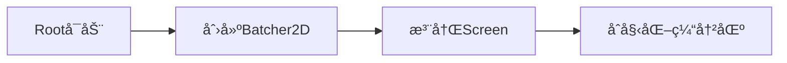
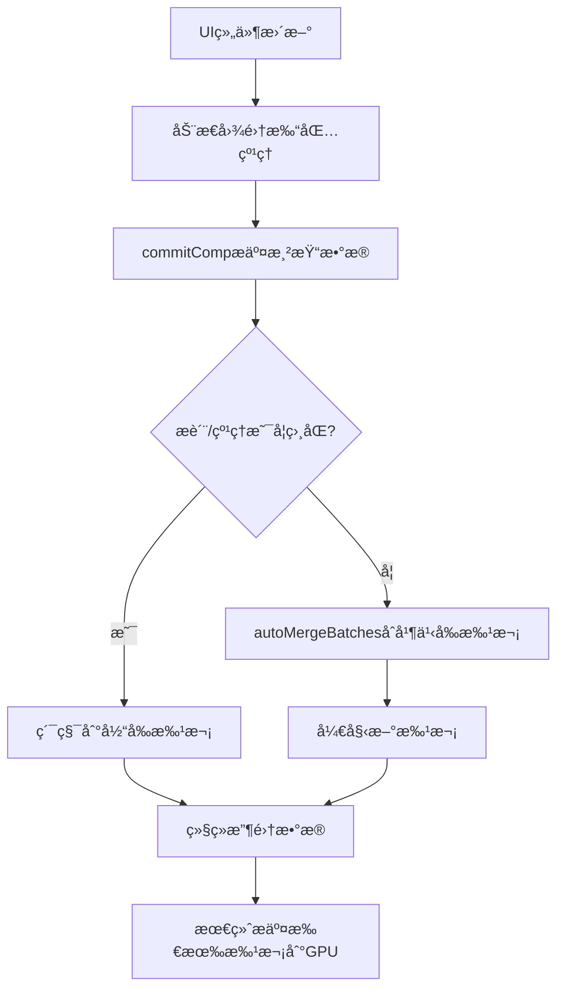
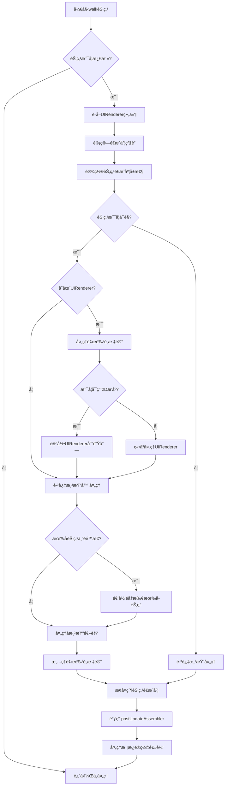
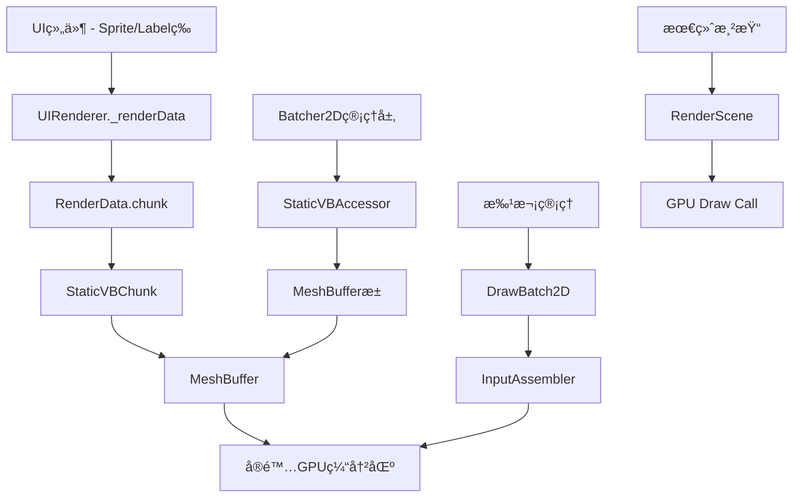
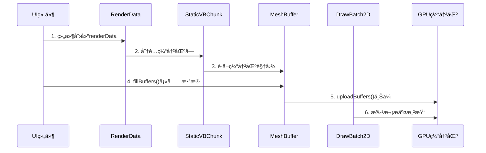
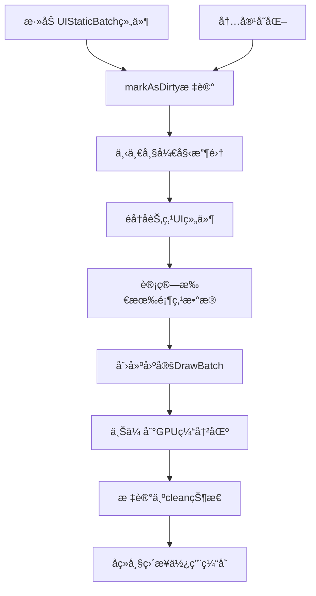
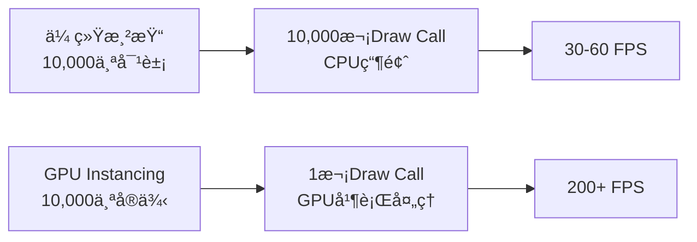

# 解释类和方法的用途
_Exported on 7/14/2025 at 14:28:42 GMT+8 from Cursor (1.2.4)_

---

**User**

这个类是用æ¥åšä»€ä¹ˆçš„呢？还有这个方法，你帮我解释一下这个方法的具体用途å§ï¼Ÿå’Œè°ƒç”¨çš„地方的具体作用。

---

**Cursor**

我æ¥ä¸ºæ‚¨è¯¦ç»†è§£é‡Šè¿™ä¸ªç±»å’Œæ–¹æ³•çš„用途。

## DynamicAtlasManager 类的作用

`DynamicAtlasManager` 是 Cocos Creator 引æ“中的**动æ€å›¾é›†ç®¡ç†å™¨**，它的主è¦ç”¨é€”是：

1. **è¿è¡Œæ—¶åŠ¨æ€åˆå›¾**：在游æˆè¿è¡Œè¿‡ç¨‹ä¸­ï¼Œå°†å¤šä¸ªå°çš„纹ç†ï¼ˆä¸»è¦æ˜¯UIç²¾çµï¼‰åŠ¨æ€åœ°åˆå¹¶åˆ°ä¸€ä¸ªå¤§çš„图集纹ç†ä¸­
2. **å‡å°‘ Draw Call**：通过将多个å°çº¹ç†åˆå¹¶ï¼Œå‡å°‘渲染时的纹ç†åˆ‡æ¢ï¼Œä»è€Œæ高渲染性能
3. **内存优化**：统一管ç†çº¹ç†èµ„æºï¼Œé¿å…内存ç¢ç‰‡åŒ–

关键特性：
- æœ€å¤šæ”¯æŒ `maxAtlasCount`（默认5个）个动æ€å›¾é›†
- æ¯ä¸ªå›¾é›†çš„尺寸为 `textureSize`（默认2048x2048）
- åªæ¥å—尺寸å°äº `maxFrameSize`（默认512）的纹ç†

## packToDynamicAtlas 方法解æ

让我先æœç´¢è¿™ä¸ªæ–¹æ³•è¢«è°ƒç”¨çš„地方：

ç°åœ¨è®©æˆ‘查看几个关键的调用ä½ç½®æ¥äº†è§£å…·ä½“使用场景：

## packToDynamicAtlas 方法详解

### 方法作用
`packToDynamicAtlas` 方法的主è¦ä½œç”¨æ˜¯ï¼š**将精çµå¸§ï¼ˆSpriteFrame）动æ€æ‰“包到图集中，并更新精çµå¸§çš„图集信æ¯**。

### 方法逻辑分æ
```285:295:cocos-engine/cocos/2d/utils/dynamic-atlas/atlas-manager.ts
public packToDynamicAtlas (comp, frame: SpriteFrame | null): void {
    if (EDITOR_NOT_IN_PREVIEW || !this._enabled) return;

    if (frame && !frame.original && frame.packable && frame.texture && frame.texture.width > 0 && frame.texture.height > 0) {
        const packedFrame = this.insertSpriteFrame(frame);
        if (packedFrame) {
            frame._setDynamicAtlasFrame(packedFrame);
        }
    }
}
```

**执行æ¡ä»¶**：
1. ä¸åœ¨ç¼–辑器预览模å¼ä¸‹
2. 动æ€å›¾é›†åŠŸèƒ½å·²å¯ç”¨
3. ç²¾çµå¸§æ»¡è¶³ä»¥ä¸‹æ¡ä»¶ï¼š
   - 存在且ä¸ä¸ºnull
   - ä¸æ˜¯å·²æœ‰çš„图集精çµå¸§ï¼ˆ`!frame.original`）
   - å¯æ‰“包（`frame.packable`）
   - 有有效的纹ç†ä¸”尺寸大äº0

**执行过程**：
1. 调用 `insertSpriteFrame` å°è¯•å°†ç²¾çµå¸§æ’入动æ€å›¾é›†
2. 如æœæˆåŠŸï¼Œæ›´æ–°ç²¾çµå¸§çš„动æ€å›¾é›†ä¿¡æ¯

### 主è¦è°ƒç”¨åœºæ™¯

æ ¹æ®æœç´¢ç»“æœï¼Œè¿™ä¸ªæ–¹æ³•ä¸»è¦åœ¨ä»¥ä¸‹åœºæ™¯è¢«è°ƒç”¨ï¼š

#### 1. **Sprite 组件渲染时**
在å„ç§ Sprite 汇编器中（`simple.ts`, `sliced.ts`, `tiled.ts` 等）：
```50:60:cocos-engine/cocos/2d/assembler/sprite/simple.ts
updateRenderData (sprite: Sprite): void {
    const frame = sprite.spriteFrame;

    dynamicAtlasManager.packToDynamicAtlas(sprite, frame);
    this.updateUVs(sprite);// dirty need
    //this.updateColor(sprite);// dirty need

    const renderData = sprite.renderData;
    if (renderData && frame) {
        if (renderData.vertDirty) {
            this.updateVertexData(sprite);
        }
        renderData.updateRenderData(sprite, frame);
    }
}
```

#### 2. **Label 组件（TTF 字体）渲染时**
在 TTF 字体处ç†ä¸­ï¼š
```205:215:cocos-engine/cocos/2d/assembler/label/ttfUtils.ts
_calDynamicAtlas (comp: Label, outputLayoutData: TextOutputLayoutData): void {
    if (comp.cacheMode !== CacheMode.BITMAP || outputLayoutData.canvasSize.width <= 0 || outputLayoutData.canvasSize.height <= 0) return;
    const frame = comp.ttfSpriteFrame!;
    dynamicAtlasManager.packToDynamicAtlas(comp, frame);
    // TODO update material and uv
}
```

### å®é™…作用

1. **性能优化**：通过将多个å°çº¹ç†åˆå¹¶åˆ°ä¸€ä¸ªå¤§å›¾é›†ä¸­ï¼Œå‡å°‘GPU状æ€åˆ‡æ¢ï¼Œé™ä½Draw Callæ•°é‡
2. **内存管ç†**：统一管ç†å°çº¹ç†èµ„æºï¼Œå‡å°‘内存ç¢ç‰‡
3. **自动化处ç†**：在渲染æµç¨‹ä¸­è‡ªåŠ¨æ‰§è¡Œï¼Œå¯¹å¼€å‘者é€æ˜
4. **å®æ—¶æ›´æ–°**：在è¿è¡Œæ—¶åŠ¨æ€è°ƒæ•´å›¾é›†å†…容，适应ä¸æ–­å˜åŒ–çš„UI需求

### 总结

`DynamicAtlasManager.packToDynamicAtlas` 是Cocos Creator引æ“UI渲染优化的核心机制之一。它在æ¯æ¬¡UI组件（主è¦æ˜¯Spriteå’ŒLabel）更新渲染数æ®æ—¶è¢«è°ƒç”¨ï¼Œè‡ªåŠ¨å°†å°çº¹ç†æ‰“包到动æ€å›¾é›†ä¸­ï¼Œä»è€Œå®ç°æ¸²æŸ“性能的优化。这个过程对开å‘者完全é€æ˜ï¼Œæ˜¯å¼•æ“内部的自动优化机制。

```typescript
public packToDynamicAtlas (comp, frame: SpriteFrame | null): void {
    if (EDITOR_NOT_IN_PREVIEW || !this._enabled) return;

    if (frame && !frame.original && frame.packable && frame.texture && frame.texture.width > 0 && frame.texture.height > 0) {
        const packedFrame = this.insertSpriteFrame(frame);
        if (packedFrame) {
            frame._setDynamicAtlasFrame(packedFrame);
        }
    }
}
```

```typescript
updateRenderData (sprite: Sprite): void {
    const frame = sprite.spriteFrame;

    dynamicAtlasManager.packToDynamicAtlas(sprite, frame);
    this.updateUVs(sprite);// dirty need
    //this.updateColor(sprite);// dirty need

    const renderData = sprite.renderData;
    if (renderData && frame) {
        if (renderData.vertDirty) {
            this.updateVertexData(sprite);
        }
        renderData.updateRenderData(sprite, frame);
    }
}
```

```typescript
_calDynamicAtlas (comp: Label, outputLayoutData: TextOutputLayoutData): void {
    if (comp.cacheMode !== CacheMode.BITMAP || outputLayoutData.canvasSize.width <= 0 || outputLayoutData.canvasSize.height <= 0) return;
    const frame = comp.ttfSpriteFrame!;
    dynamicAtlasManager.packToDynamicAtlas(comp, frame);
    // TODO update material and uv
}
```

---

**User**

这个功能是ä¸æ˜¯å°±æ˜¯åˆæ‰¹æˆ–者批处ç†å‘¢ï¼Ÿ

---

**Cursor**

是的，您说得对ï¼åŠ¨æ€å›¾é›†åŠŸèƒ½ç¡®å®æ˜¯**åˆæ‰¹ï¼ˆæ‰¹å¤„ç†ï¼‰çš„é‡è¦ç»„æˆéƒ¨åˆ†**，但更准确地说，它是**为åˆæ‰¹åˆ›é€ æ¡ä»¶çš„纹ç†åˆå¹¶æŠ€æœ¯**。

让我æœç´¢ä¸€ä¸‹ç›¸å…³çš„批处ç†ä»£ç æ¥ç»™æ‚¨å±•ç¤ºå®Œæ•´çš„关系：

## 动æ€å›¾é›† vs 批处ç†çš„关系

您说得é常对ï¼**动æ€å›¾é›†ç¡®å®æ˜¯åˆæ‰¹ï¼ˆæ‰¹å¤„ç†ï¼‰çš„é‡è¦ç»„æˆéƒ¨åˆ†**，但更准确地说：

### 🯠关系图解
```
å°çº¹ç†A + å°çº¹ç†B + å°çº¹ç†C
         ↓ (动æ€å›¾é›†)
      大图集纹ç†
         ↓ (批处ç†)
    一次Draw Call渲染多个精çµ
```

### 📊 两者的分工

#### **动æ€å›¾é›†ï¼ˆDynamicAtlasManager）**
- **作用**：纹ç†åˆå¹¶
- **目标**：将多个å°çº¹ç†æ‰“包到一个大纹ç†ä¸­
- **时机**：精çµå¸§é¦–次使用时

#### **批处ç†å™¨ï¼ˆBatcher2D）**  
- **作用**：渲染åˆå¹¶
- **目标**：将使用相åŒçº¹ç†/æ质的多个UI组件åˆå¹¶åˆ°ä¸€æ¬¡Draw Call中
- **时机**：æ¯å¸§æ¸²æŸ“æ—¶

### 🔄 完整的åˆæ‰¹æµç¨‹

1. **纹ç†å‡†å¤‡é˜¶æ®µ**（动æ€å›¾é›†ï¼‰ï¼š
```typescript
// 在 sprite 渲染时调用
dynamicAtlasManager.packToDynamicAtlas(sprite, frame);
```

2. **批次åˆå¹¶é˜¶æ®µ**（批处ç†å™¨ï¼‰ï¼š
```678:720:cocos-engine/cocos/2d/renderer/batcher-2d.ts
public autoMergeBatches (renderComp?: UIRenderer): void {
    const mat = this._currMaterial;
    if (!mat) {
        return;
    }
    
    // åˆå¹¶ä½¿ç”¨ç›¸åŒæ质和纹ç†çš„渲染组件
    const curDrawBatch = this._currStaticRoot ? this._currStaticRoot._requireDrawBatch() : this._drawBatchPool.alloc();
    curDrawBatch.texture = this._currTexture;  // 使用动æ€å›¾é›†çº¹ç†
    curDrawBatch.sampler = this._currSampler;
    curDrawBatch.inputAssembler = ia;
    
    this._batches.push(curDrawBatch);  // 添加到批次队列
}
```

### 🯠性能优化效æœ

**没有动æ€å›¾é›†æ—¶**：
```
ç²¾çµA(纹ç†1) -> Draw Call 1
ç²¾çµB(纹ç†2) -> Draw Call 2  
ç²¾çµC(纹ç†3) -> Draw Call 3
总计：3次Draw Call
```

**有动æ€å›¾é›†+批处ç†æ—¶**：
```
ç²¾çµA + ç²¾çµB + ç²¾çµC (都在图集纹ç†ä¸­) -> Draw Call 1
总计：1次Draw Call
```

### 📋 总结

动æ€å›¾é›†åŠŸèƒ½ç¡®å®æ˜¯**åˆæ‰¹ç³»ç»Ÿçš„核心å‰ç½®æ¡ä»¶**：

- **动æ€å›¾é›†**：解决了"纹ç†ä¸ç»Ÿä¸€"的问题  
- **批处ç†å™¨**：解决了"多次绘制调用"的问题
- **两者é…åˆ**：å®ç°äº†çœŸæ­£çš„UI渲染性能优化

所以您的ç†è§£å®Œå…¨æ­£ç¡® —— 动æ€å›¾é›†å°±æ˜¯Cocos Creator中å®ç°UIåˆæ‰¹çš„关键技术之一ï¼ğŸ‰

```plaintext
å°çº¹ç†A + å°çº¹ç†B + å°çº¹ç†C
         ↓ (动æ€å›¾é›†)
      大图集纹ç†
         ↓ (批处ç†)
    一次Draw Call渲染多个精çµ
```

```typescript
// 在 sprite 渲染时调用
dynamicAtlasManager.packToDynamicAtlas(sprite, frame);
```

```typescript
public autoMergeBatches (renderComp?: UIRenderer): void {
    const mat = this._currMaterial;
    if (!mat) {
        return;
    }
    
    // åˆå¹¶ä½¿ç”¨ç›¸åŒæ质和纹ç†çš„渲染组件
    const curDrawBatch = this._currStaticRoot ? this._currStaticRoot._requireDrawBatch() : this._drawBatchPool.alloc();
    curDrawBatch.texture = this._currTexture;  // 使用动æ€å›¾é›†çº¹ç†
    curDrawBatch.sampler = this._currSampler;
    curDrawBatch.inputAssembler = ia;
    
    this._batches.push(curDrawBatch);  // 添加到批次队列
}
```

```plaintext
ç²¾çµA(纹ç†1) -> Draw Call 1
ç²¾çµB(纹ç†2) -> Draw Call 2  
ç²¾çµC(纹ç†3) -> Draw Call 3
总计：3次Draw Call
```

```plaintext
ç²¾çµA + ç²¾çµB + ç²¾çµC (都在图集纹ç†ä¸­) -> Draw Call 1
总计：1次Draw Call
```

---

**User**

@batcher-2d.ts 你给详细æ述一一下批处ç†çš„è¿ä½œæ–¹å¼å§ï¼Ÿä»¥åŠæ•´ä¸ªç³»ç»Ÿæµç¨‹æ˜¯æ€ä¹ˆè¿ä½œçš„呢？还有就是详细解æ一下其中的关键方法。

---

**Cursor**

# Batcher2D 批处ç†ç³»ç»Ÿè¯¦è§£

Batcher2D 是 Cocos Creator 引æ“中 **UI 渲染的核心批处ç†å™¨**，负责将多个 UI 组件的渲染数æ®åˆå¹¶æˆå°½å¯èƒ½å°‘çš„ Draw Call，ä»è€Œå¤§å¹…æå‡æ¸²æŸ“性能。

## ğŸ—ï¸ ç³»ç»Ÿæ¶æ„

### 核心组件
```typescript
export class Batcher2D implements IBatcher {
    // 批次管ç†
    private _batches: CachedArray<DrawBatch2D>;        // 所有渲染批次
    private _drawBatchPool: Pool<DrawBatch2D>;         // 批次对象池
    
    // ç¼“å†²åŒºç®¡ç†  
    private _staticVBBuffer: StaticVBAccessor;         // é™æ€é¡¶ç‚¹ç¼“冲区
    private _bufferAccessors: Map<number, StaticVBAccessor>; // 多ç§é¡¶ç‚¹æ ¼å¼çš„缓冲区
    
    // 当å‰æ¸²æŸ“状æ€
    private _currMaterial: Material;                   // 当å‰æè´¨
    private _currTexture: Texture;                     // 当å‰çº¹ç†
    private _currComponent: UIRenderer;                // 当å‰ç»„件
    private _currHash: number;                         // 当å‰æ•°æ®å“ˆå¸Œ
}
```

## 🔄 完整渲染æµç¨‹

### 1. åˆå§‹åŒ–阶段


### 2. æ¯å¸§æ¸²æŸ“æµç¨‹
```275:320:cocos-engine/cocos/2d/renderer/batcher-2d.ts
public update (): void {
    const screens = this._screens;
    let offset = 0;
    
    for (let i = 0; i < screens.length; ++i) {
        const screen = screens[i];
        // é‡ç½®çŠ¶æ€å¹¶éå†èŠ‚点树
        this._opacityDirty = 0;
        this._pOpacity = 1;
        
        this.walk(screen.node);  // 🔥 核心：éå†èŠ‚点树收集渲染数æ®
        
        this.autoMergeBatches(this._currComponent!);  // 🔥 åˆå¹¶æœ€å的批次
        this.resetRenderStates();  // é‡ç½®çŠ¶æ€
        
        // 为批次分é…优先级并æ交到渲染场景
        for (; offset < this._batches.length; ++offset) {
            const batch = this._batches.array[offset];
            batch.descriptorSet = this._descriptorSetCache.getDescriptorSet(batch);
            scene.addBatch(batch);  // æ交到渲染管线
        }
    }
}
```

## 🯠关键方法详解

### 1. walk() - 节点树éå†
这是整个批处ç†çš„**å…¥å£æ–¹æ³•**，递归éå†UI节点树：

```906:970:cocos-engine/cocos/2d/renderer/batcher-2d.ts
public walk (node: Node, level = 0): void {
    if (!node.activeInHierarchy) return;
    
    const render = node._uiProps.uiComp as UIRenderer | null;
    
    // 处ç†é€æ˜åº¦çº§è”
    const parentOpacity = this._pOpacity;
    const selfOpacity = render && render.color ? render.color.a / 255 : 1;
    this._pOpacity *= selfOpacity * node._uiProps.localOpacity;
    
    if (render) {
        // 🔥 处ç†UI渲染器
        this._handleUIRenderer(render, this._pOpacity, !!this._opacityDirty);
    }
    
    // 递归处ç†å­èŠ‚点
    if (children.length > 0 && !node._static) {
        for (let i = 0; i < children.length; ++i) {
            this.walk(children[i], level);
        }
    }
    
    // å处ç†é€»è¾‘
    if (render && render.enabledInHierarchy) {
        render.postUpdateAssembler(this);
    }
}
```

### 2. commitComp() - æ交渲染组件
这是**æ•°æ®æ”¶é›†çš„核心方法**，处ç†å¤§éƒ¨åˆ†UI组件：

```429:497:cocos-engine/cocos/2d/renderer/batcher-2d.ts
public commitComp (
    comp: UIRenderer,
    renderData: BaseRenderData | null,
    frame: TextureBase | SpriteFrame | null,
    assembler: IAssembler,
    transform: Node | null,
): void {
    // 计算数æ®å“ˆå¸Œå€¼
    let dataHash = 0;
    let mat;
    if (renderData && renderData.chunk) {
        dataHash = renderData.dataHash;
        mat = renderData.material;
    }
    
    // 🔥 关键判断：是å¦éœ€è¦æ‰“断当å‰æ‰¹æ¬¡
    if (this._currHash !== dataHash || this._currMaterial !== mat) {
        // åˆå¹¶ä¹‹å‰çš„批次数æ®
        this.autoMergeBatches(this._currComponent!);
        
        // 更新当å‰çŠ¶æ€
        this._currRenderData = renderData;
        this._currHash = dataHash;
        this._currComponent = comp;
        this._currMaterial = comp.getRenderMaterial(0)!;
        
        if (frame) {
            this._currTexture = frame.getGFXTexture();
            this._currSampler = frame.getGFXSampler();
            this._currTextureHash = frame.getHash();
        }
    }
    
    // 调用汇编器填充缓冲区
    if (assembler.fillBuffers) {
        assembler.fillBuffers(comp, this);
    }
}
```

### 3. autoMergeBatches() - 批次åˆå¹¶æ ¸å¿ƒ
这是**批处ç†çš„核心逻辑**，将累积的渲染数æ®åˆå¹¶æˆä¸€ä¸ªDrawBatch：

```678:744:cocos-engine/cocos/2d/renderer/batcher-2d.ts
public autoMergeBatches (renderComp?: UIRenderer): void {
    const mat = this._currMaterial;
    if (!mat) return;
    
    let ia: InputAssembler | undefined;
    const rd = this._currRenderData as MeshRenderData;
    const accessor = this._staticVBBuffer;
    
    // 🔥 处ç†ç½‘格缓冲区数æ®
    if (rd && rd._isMeshBuffer) {
        ia = rd.requestIA(this.device);
        if (this._meshDataArray.indexOf(rd) === -1) {
            this._meshDataArray.push(rd);
        }
    } 
    // 🔥 处ç†é™æ€é¡¶ç‚¹ç¼“冲区数æ®
    else if (accessor) {
        const bid = this._currBID;
        const buf = accessor.getMeshBuffer(bid);
        const indexCount = buf.indexOffset - this._indexStart;
        
        if (indexCount <= 0) return;
        
        // 创建输入汇编器
        ia = buf.requireFreeIA(this.device);
        ia.firstIndex = this._indexStart;
        ia.indexCount = indexCount;
        this._indexStart = buf.indexOffset;
    }
    
    if (!ia || !this._currTexture) return;
    
    // 🔥 创建并é…ç½®DrawBatch
    const curDrawBatch = this._currStaticRoot ? 
        this._currStaticRoot._requireDrawBatch() : 
        this._drawBatchPool.alloc();
        
    curDrawBatch.visFlags = this._currLayer;
    curDrawBatch.texture = this._currTexture;      // 纹ç†ï¼ˆå¯èƒ½æ˜¯åŠ¨æ€å›¾é›†ï¼‰
    curDrawBatch.sampler = this._currSampler;
    curDrawBatch.inputAssembler = ia;              // 顶点数æ®
    curDrawBatch.useLocalData = this._currTransform;
    curDrawBatch.fillPasses(mat, depthStencil, dssHash, null);
    
    this._batches.push(curDrawBatch);              // 加入批次队列
}
```

## 🧩 åˆæ‰¹æ¡ä»¶åˆ†æ

### 能够åˆæ‰¹çš„æ¡ä»¶
两个UI组件能åˆå¹¶åˆ°åŒä¸€ä¸ªæ‰¹æ¬¡ï¼Œéœ€è¦æ»¡è¶³ï¼š

1. **相åŒæè´¨** (`_currMaterial`)
2. **相åŒçº¹ç†** (`_currTexture`) - 这就是动æ€å›¾é›†çš„作用ï¼
3. **相åŒå›¾å±‚** (`_currLayer`)
4. **相åŒæ¨¡æ¿æµ‹è¯•çŠ¶æ€** (`_currDepthStencilStateStage`)
5. **è¿ç»­çš„渲染数æ®** (`_currHash`)

### 打断åˆæ‰¹çš„情况
```typescript
// 在 commitComp 中的判断逻辑
if (this._currHash !== dataHash || 
    this._currMaterial !== mat ||
    this._currDepthStencilStateStage !== depthStencilStateStage) {
    
    // 🔥 触å‘åˆæ‰¹ï¼Œå¼€å§‹æ–°æ‰¹æ¬¡
    this.autoMergeBatches(this._currComponent!);
}
```

## 📊 性能优化策略

### 1. 对象池管ç†
```161:165:cocos-engine/cocos/2d/renderer/batcher-2d.ts
constructor (private _root: Root) {
    this._batches = new CachedArray(64);
    this._drawBatchPool = new Pool(() => new DrawBatch2D(), 128, (obj) => obj.destroy(this));
}
```

### 2. 缓冲区å¤ç”¨
```384:399:cocos-engine/cocos/2d/renderer/batcher-2d.ts
public switchBufferAccessor (attributes: Attribute[] = vfmtPosUvColor): StaticVBAccessor {
    const strideBytes = getAttributeStride(attributes);
    
    // 🔥 æ ¹æ®é¡¶ç‚¹æ ¼å¼å¤ç”¨ç¼“冲区
    if (!this._staticVBBuffer || this._staticVBBuffer.vertexFormatBytes !== strideBytes) {
        let accessor = this._bufferAccessors.get(strideBytes);
        if (!accessor) {
            accessor = new StaticVBAccessor(this.device, attributes);
            this._bufferAccessors.set(strideBytes, accessor);
        }
        this._staticVBBuffer = accessor;
    }
    return this._staticVBBuffer;
}
```

### 3. æ述符集缓存
```1202:1235:cocos-engine/cocos/2d/renderer/batcher-2d.ts
public getDescriptorSet (batch: DrawBatch2D): DescriptorSet {
    const hash = batch.textureHash ^ batch.samplerHash;
    
    // 🔥 缓存相åŒçº¹ç†+采样器组åˆçš„æ述符集
    if (this._descriptorSetCache.has(hash)) {
        return this._descriptorSetCache.get(hash)!;
    } else {
        // 创建新的æ述符集
        const descriptorSet = deviceManager.gfxDevice.createDescriptorSet(_dsInfo);
        descriptorSet.bindTexture(binding, batch.texture!);
        descriptorSet.bindSampler(binding, batch.sampler!);
        this._descriptorSetCache.set(hash, descriptorSet);
        return descriptorSet;
    }
}
```

## 🔗 ä¸åŠ¨æ€å›¾é›†çš„å作



## 🯠总结

**Batcher2D 的核心作用**：
1. **收集渲染数æ®**：通过 `walk()` éå†UI树，`commitComp()` 收集组件数æ®
2. **智能åˆæ‰¹**：通过 `autoMergeBatches()` 将相åŒçŠ¶æ€çš„组件åˆå¹¶
3. **性能优化**：使用对象池ã€ç¼“冲区å¤ç”¨ã€æ述符集缓存等技术
4. **ä¸åŠ¨æ€å›¾é›†å作**：将å°çº¹ç†åˆå¹¶åå®ç°å¤§è§„模UIåˆæ‰¹

整个系统的精髓在äº**最å°åŒ–状æ€åˆ‡æ¢**：通过将具有相åŒæ¸²æŸ“状æ€ï¼ˆæè´¨ã€çº¹ç†ã€å›¾å±‚等）的UI组件åˆå¹¶åˆ°ä¸€ä¸ªDraw Call中，å®ç°äº†ä»"一个组件一次Draw Call"到"多个组件一次Draw Call"çš„é‡å¤§æ€§èƒ½æå‡ã€‚🚀

```typescript
export class Batcher2D implements IBatcher {
    // 批次管ç†
    private _batches: CachedArray<DrawBatch2D>;        // 所有渲染批次
    private _drawBatchPool: Pool<DrawBatch2D>;         // 批次对象池
    
    // ç¼“å†²åŒºç®¡ç†  
    private _staticVBBuffer: StaticVBAccessor;         // é™æ€é¡¶ç‚¹ç¼“冲区
    private _bufferAccessors: Map<number, StaticVBAccessor>; // 多ç§é¡¶ç‚¹æ ¼å¼çš„缓冲区
    
    // 当å‰æ¸²æŸ“状æ€
    private _currMaterial: Material;                   // 当å‰æè´¨
    private _currTexture: Texture;                     // 当å‰çº¹ç†
    private _currComponent: UIRenderer;                // 当å‰ç»„件
    private _currHash: number;                         // 当å‰æ•°æ®å“ˆå¸Œ
}
```

```plaintext
graph LR
    A[Rootå¯åŠ¨] --> B[创建Batcher2D]
    B --> C[注册Screen]
    C --> D[åˆå§‹åŒ–缓冲区]
```

```typescript
public update (): void {
    const screens = this._screens;
    let offset = 0;
    
    for (let i = 0; i < screens.length; ++i) {
        const screen = screens[i];
        // é‡ç½®çŠ¶æ€å¹¶éå†èŠ‚点树
        this._opacityDirty = 0;
        this._pOpacity = 1;
        
        this.walk(screen.node);  // 🔥 核心：éå†èŠ‚点树收集渲染数æ®
        
        this.autoMergeBatches(this._currComponent!);  // 🔥 åˆå¹¶æœ€å的批次
        this.resetRenderStates();  // é‡ç½®çŠ¶æ€
        
        // 为批次分é…优先级并æ交到渲染场景
        for (; offset < this._batches.length; ++offset) {
            const batch = this._batches.array[offset];
            batch.descriptorSet = this._descriptorSetCache.getDescriptorSet(batch);
            scene.addBatch(batch);  // æ交到渲染管线
        }
    }
}
```

```typescript
public walk (node: Node, level = 0): void {
    if (!node.activeInHierarchy) return;
    
    const render = node._uiProps.uiComp as UIRenderer | null;
    
    // 处ç†é€æ˜åº¦çº§è”
    const parentOpacity = this._pOpacity;
    const selfOpacity = render && render.color ? render.color.a / 255 : 1;
    this._pOpacity *= selfOpacity * node._uiProps.localOpacity;
    
    if (render) {
        // 🔥 处ç†UI渲染器
        this._handleUIRenderer(render, this._pOpacity, !!this._opacityDirty);
    }
    
    // 递归处ç†å­èŠ‚点
    if (children.length > 0 && !node._static) {
        for (let i = 0; i < children.length; ++i) {
            this.walk(children[i], level);
        }
    }
    
    // å处ç†é€»è¾‘
    if (render && render.enabledInHierarchy) {
        render.postUpdateAssembler(this);
    }
}
```

```typescript
public commitComp (
    comp: UIRenderer,
    renderData: BaseRenderData | null,
    frame: TextureBase | SpriteFrame | null,
    assembler: IAssembler,
    transform: Node | null,
): void {
    // 计算数æ®å“ˆå¸Œå€¼
    let dataHash = 0;
    let mat;
    if (renderData && renderData.chunk) {
        dataHash = renderData.dataHash;
        mat = renderData.material;
    }
    
    // 🔥 关键判断：是å¦éœ€è¦æ‰“断当å‰æ‰¹æ¬¡
    if (this._currHash !== dataHash || this._currMaterial !== mat) {
        // åˆå¹¶ä¹‹å‰çš„批次数æ®
        this.autoMergeBatches(this._currComponent!);
        
        // 更新当å‰çŠ¶æ€
        this._currRenderData = renderData;
        this._currHash = dataHash;
        this._currComponent = comp;
        this._currMaterial = comp.getRenderMaterial(0)!;
        
        if (frame) {
            this._currTexture = frame.getGFXTexture();
            this._currSampler = frame.getGFXSampler();
            this._currTextureHash = frame.getHash();
        }
    }
    
    // 调用汇编器填充缓冲区
    if (assembler.fillBuffers) {
        assembler.fillBuffers(comp, this);
    }
}
```

```typescript
public autoMergeBatches (renderComp?: UIRenderer): void {
    const mat = this._currMaterial;
    if (!mat) return;
    
    let ia: InputAssembler | undefined;
    const rd = this._currRenderData as MeshRenderData;
    const accessor = this._staticVBBuffer;
    
    // 🔥 处ç†ç½‘格缓冲区数æ®
    if (rd && rd._isMeshBuffer) {
        ia = rd.requestIA(this.device);
        if (this._meshDataArray.indexOf(rd) === -1) {
            this._meshDataArray.push(rd);
        }
    } 
    // 🔥 处ç†é™æ€é¡¶ç‚¹ç¼“冲区数æ®
    else if (accessor) {
        const bid = this._currBID;
        const buf = accessor.getMeshBuffer(bid);
        const indexCount = buf.indexOffset - this._indexStart;
        
        if (indexCount <= 0) return;
        
        // 创建输入汇编器
        ia = buf.requireFreeIA(this.device);
        ia.firstIndex = this._indexStart;
        ia.indexCount = indexCount;
        this._indexStart = buf.indexOffset;
    }
    
    if (!ia || !this._currTexture) return;
    
    // 🔥 创建并é…ç½®DrawBatch
    const curDrawBatch = this._currStaticRoot ? 
        this._currStaticRoot._requireDrawBatch() : 
        this._drawBatchPool.alloc();
        
    curDrawBatch.visFlags = this._currLayer;
    curDrawBatch.texture = this._currTexture;      // 纹ç†ï¼ˆå¯èƒ½æ˜¯åŠ¨æ€å›¾é›†ï¼‰
    curDrawBatch.sampler = this._currSampler;
    curDrawBatch.inputAssembler = ia;              // 顶点数æ®
    curDrawBatch.useLocalData = this._currTransform;
    curDrawBatch.fillPasses(mat, depthStencil, dssHash, null);
    
    this._batches.push(curDrawBatch);              // 加入批次队列
}
```

```typescript
// 在 commitComp 中的判断逻辑
if (this._currHash !== dataHash || 
    this._currMaterial !== mat ||
    this._currDepthStencilStateStage !== depthStencilStateStage) {
    
    // 🔥 触å‘åˆæ‰¹ï¼Œå¼€å§‹æ–°æ‰¹æ¬¡
    this.autoMergeBatches(this._currComponent!);
}
```

```typescript
constructor (private _root: Root) {
    this._batches = new CachedArray(64);
    this._drawBatchPool = new Pool(() => new DrawBatch2D(), 128, (obj) => obj.destroy(this));
}
```

```typescript
public switchBufferAccessor (attributes: Attribute[] = vfmtPosUvColor): StaticVBAccessor {
    const strideBytes = getAttributeStride(attributes);
    
    // 🔥 æ ¹æ®é¡¶ç‚¹æ ¼å¼å¤ç”¨ç¼“冲区
    if (!this._staticVBBuffer || this._staticVBBuffer.vertexFormatBytes !== strideBytes) {
        let accessor = this._bufferAccessors.get(strideBytes);
        if (!accessor) {
            accessor = new StaticVBAccessor(this.device, attributes);
            this._bufferAccessors.set(strideBytes, accessor);
        }
        this._staticVBBuffer = accessor;
    }
    return this._staticVBBuffer;
}
```

```typescript
public getDescriptorSet (batch: DrawBatch2D): DescriptorSet {
    const hash = batch.textureHash ^ batch.samplerHash;
    
    // 🔥 缓存相åŒçº¹ç†+采样器组åˆçš„æ述符集
    if (this._descriptorSetCache.has(hash)) {
        return this._descriptorSetCache.get(hash)!;
    } else {
        // 创建新的æ述符集
        const descriptorSet = deviceManager.gfxDevice.createDescriptorSet(_dsInfo);
        descriptorSet.bindTexture(binding, batch.texture!);
        descriptorSet.bindSampler(binding, batch.sampler!);
        this._descriptorSetCache.set(hash, descriptorSet);
        return descriptorSet;
    }
}
```

```plaintext
graph TD
    A[UI组件更新] --> B[动æ€å›¾é›†æ‰“包纹ç†]
    B --> C[commitCompæ交渲染数æ®]
    C --> D{æè´¨/纹ç†æ˜¯å¦ç›¸åŒ?}
    D -->|是| E[累积到当å‰æ‰¹æ¬¡]
    D -->|å¦| F[autoMergeBatchesåˆå¹¶ä¹‹å‰æ‰¹æ¬¡]
    F --> G[开始新批次]
    E --> H[继续收集数æ®]
    G --> H
    H --> I[最终æ交所有批次到GPU]
```

---

**User**

把walk方法å†è¯¦ç»†è¯´ä¸€ä¸‹å§ï¼Œè¿˜æœ‰å°±æ˜¯éå†èŠ‚点数收集渲染数æ®ï¼Œéƒ½æ˜¯ä»€ä¹ˆæ¸²æŸ“æ•°æ®å‘¢ï¼Ÿ

---

**Cursor**

# walk() 方法详解ä¸æ¸²æŸ“æ•°æ®æ”¶é›†

## 🚶â€â™‚ï¸ walk() 方法完整分æ

`walk()` 方法是 Batcher2D çš„**核心éå†å¼•æ“**，负责深度优先éå†æ•´ä¸ªUI节点树，收集所有需è¦æ¸²æŸ“çš„æ•°æ®ã€‚

### 完整代ç è§£æ

# walk() 方法详细解æä¸æ¸²æŸ“æ•°æ®æ”¶é›†

## 🚶â€â™‚ï¸ walk() 方法详细æµç¨‹å›¾



## 🔠walk() 方法分段详解

### 1. 节点激活检查ä¸åŸºç¡€ä¿¡æ¯è·å–
```906:913:cocos-engine/cocos/2d/renderer/batcher-2d.ts
public walk (node: Node, level = 0): void {
    if (!node.activeInHierarchy) {
        return;  // 🔥 é激活节点直æ¥è·³è¿‡
    }
    const children = node.children;
    const uiProps = node._uiProps;
    const render = uiProps.uiComp as UIRenderer | null; // 🔥 è·å–UI渲染组件
```

### 2. é€æ˜åº¦çº§è”计算
```914:920:cocos-engine/cocos/2d/renderer/batcher-2d.ts
// Save opacity
const parentOpacity = this._pOpacity;
let opacity = parentOpacity;
// 🔥 计算级è”é€æ˜åº¦ï¼šçˆ¶é€æ˜åº¦ × 自身é€æ˜åº¦ × 局部é€æ˜åº¦
const selfOpacity = render && render.color ? render.color.a / 255 : 1;
this._pOpacity = opacity *= selfOpacity * uiProps.localOpacity;
uiProps.setOpacity(opacity); // 🔥 设置最终é€æ˜åº¦
```

### 3. 渲染组件处ç†ï¼ˆæ ¸å¿ƒéƒ¨åˆ†ï¼‰
```921:940:cocos-engine/cocos/2d/renderer/batcher-2d.ts
const visable = !approx(opacity, 0, EPSILON);
if (visable) {
    if (uiProps.colorDirty) {
        this._opacityDirty++; // 🔥 标记é€æ˜åº¦è„状æ€
    }
    if (render) {
        if (USE_SORTING_2D && sorting2DCount > 0) {
            // 🔥 2Dæ’åºæ¨¡å¼ï¼šå…ˆè®°å½•ï¼Œå统一处ç†
            this._recordUIRenderer(render, opacity, !!this._opacityDirty);
        } else {
            // 🔥 å³æ—¶å¤„ç†æ¨¡å¼ï¼šç«‹å³å¤„ç†æ¸²æŸ“æ•°æ®
            this._handleUIRenderer(render, opacity, !!this._opacityDirty);
        }
    }
}
```

## 📊 渲染数æ®æ”¶é›†è¯¦è§£

### 渲染数æ®çš„核心结æ„

#### IRenderData - å•ä¸ªé¡¶ç‚¹æ•°æ®
```43:49:cocos-engine/cocos/2d/renderer/render-data.ts
export interface IRenderData {
    x: number;      // 🔥 顶点Xå标（世界å标）
    y: number;      // 🔥 顶点Yå标（世界å标）
    z: number;      // 🔥 顶点Zå标（深度）
    u: number;      // 🔥 纹ç†Uåæ ‡
    v: number;      // 🔥 纹ç†Våæ ‡
    color: Color;   // 🔥 顶点颜色（RGBA）
}
```

#### BaseRenderData - 渲染数æ®å®¹å™¨
```57:120:cocos-engine/cocos/2d/renderer/render-data.ts
export class BaseRenderData {
    // 🔥 核心数æ®å±æ€§
    protected _vc = 0;                    // 顶点数é‡
    protected _ic = 0;                    // ç´¢å¼•æ•°é‡  
    protected _floatStride = 0;           // 顶点步长
    protected _vertexFormat = vfmtPosUvColor; // 顶点格å¼
    protected _material: Material | null = null; // 渲染æè´¨
    protected _dataHash = 0;              // æ•°æ®å“ˆå¸Œï¼ˆç”¨äºåˆæ‰¹åˆ¤æ–­ï¼‰
    
    public chunk: StaticVBChunk = null!;  // 🔥 顶点缓冲区å—
}
```

### _handleUIRenderer - 渲染数æ®å¤„ç†æ ¸å¿ƒ
```838:868:cocos-engine/cocos/2d/renderer/batcher-2d.ts
private _handleUIRenderer (render: UIRenderer, finalOpacity: number, opacityDirty: boolean): void {
    const renderData = render ? render.renderData : null;
    const vertexCount = renderData ? renderData.vertexCount : 0;

    // 🔥 关键步骤1：调用组件的fillBuffers填充顶点数æ®
    if (render && render.enabledInHierarchy) {
        render.fillBuffers(this); // 🔥 核心：填充渲染缓冲区
    }

    // 🔥 关键步骤2：更新级è”é€æ˜åº¦åˆ°é¡¶ç‚¹ç¼“冲区
    if (opacityDirty && vertexCount > 0) {
        switch (render.getFillColorType()) {
        case RenderEntityFillColorType.COLOR: {
            updateOpacity(renderData!, finalOpacity); // 🔥 更新顶点é€æ˜åº¦
            break;
        }
        case RenderEntityFillColorType.VERTEX: {
            // 使用顶点颜色，无需更新
            break;
        }
        }
        
        const buffer = renderData!.getMeshBuffer();
        if (buffer) {
            buffer.setDirty(); // 🔥 标记缓冲区为è„
        }
    }
}
```

## 🨠渲染数æ®æ”¶é›†çš„具体类å‹

### 1. **顶点ä½ç½®æ•°æ®**（世界å标）
- **Xã€Yã€Zåæ ‡**：UI元素在世界空间中的ä½ç½®
- **计算æ¥æº**：节点å˜æ¢çŸ©é˜µ × 局部顶点åæ ‡

### 2. **纹ç†å标数æ®**
- **Uã€Våæ ‡**：纹ç†é‡‡æ ·å标（0-1范围）
- **计算æ¥æº**：精çµå¸§çš„UVä¿¡æ¯æˆ–动æ€è®¡ç®—

### 3. **颜色数æ®**
- **RGBA颜色**：顶点颜色，包å«é€æ˜åº¦
- **计算æ¥æº**：组件颜色 × 级è”é€æ˜åº¦

### 4. **索引数æ®**
- **顶点索引**：定义三角形绘制顺åº
- **å…¸å‹ç»„织**：矩形 = 2个三角形 = 6个索引

### 5. **æ质数æ®**
- **渲染æè´¨**：ç€è‰²å™¨ç¨‹åºå’Œæ¸²æŸ“状æ€
- **纹ç†å¼•ç”¨**：用äºåˆæ‰¹åˆ¤æ–­

## 🔧 具体组件的渲染数æ®ç¤ºä¾‹

### Sprite 组件的渲染æµç¨‹
```579:581:cocos-engine/cocos/2d/components/sprite.ts
protected _render (render: IBatcher): void {
    // 🔥 æ交渲染数æ®ï¼šç»„件ã€æ¸²æŸ“æ•°æ®ã€ç²¾çµå¸§ã€æ±‡ç¼–器
    render.commitComp(this, this.renderData, this._spriteFrame, this._assembler, null);
}
```

### 一个典å‹çš„Sprite渲染数æ®ç»“æ„
```typescript
// 🔥 一个简å•çŸ©å½¢Sprite的渲染数æ®
const spriteRenderData = {
    vertexCount: 4,    // 4个顶点
    indexCount: 6,     // 6个索引（2个三角形）
    vertices: [
        // 左下角
        { x: 0, y: 0, z: 0, u: 0, v: 1, color: Color.WHITE },
        // å³ä¸‹è§’  
        { x: 100, y: 0, z: 0, u: 1, v: 1, color: Color.WHITE },
        // 左上角
        { x: 0, y: 100, z: 0, u: 0, v: 0, color: Color.WHITE },
        // å³ä¸Šè§’
        { x: 100, y: 100, z: 0, u: 1, v: 0, color: Color.WHITE }
    ],
    indices: [0, 1, 2, 2, 1, 3],  // 两个三角形
    material: spriteMaterial,      // UI-spriteæè´¨
    texture: spriteTexture,        // ç²¾çµçº¹ç†
    dataHash: 12345               // 用äºåˆæ‰¹çš„æ•°æ®å“ˆå¸Œ
};
```

## 🯠收集过程总结

**walk() 方法的渲染数æ®æ”¶é›†è¿‡ç¨‹**：

1. **éå†èŠ‚点树**：深度优先éå†UI节点层次结æ„
2. **é€æ˜åº¦çº§è”**：计算并传递é€æ˜åº¦åˆ°å­èŠ‚点
3. **组件识别**：识别具有UIRenderer的节点
4. **æ•°æ®å¡«å……**：调用fillBuffers填充顶点数æ®åˆ°ç¼“冲区
5. **状æ€æ›´æ–°**：更新颜色ã€é€æ˜åº¦ç­‰åŠ¨æ€å±æ€§
6. **åˆæ‰¹å‡†å¤‡**：为åç»­çš„autoMergeBatchesåšå‡†å¤‡

**收集的数æ®æœ€ç»ˆç”¨äº**：
- **批次åˆå¹¶**：相åŒçŠ¶æ€çš„组件åˆå¹¶ä¸ºä¸€ä¸ªDraw Call
- **GPU渲染**：生æˆInputAssembleræ交给图形API
- **性能优化**：å‡å°‘CPU-GPU通信和状æ€åˆ‡æ¢

这个过程是Cocos Creator UI渲染优化的核心，通过精确的数æ®æ”¶é›†å’Œæ™ºèƒ½çš„批次åˆå¹¶ï¼Œå®ç°äº†é«˜æ•ˆçš„UI渲染性能。🚀

```plaintext
graph TD
    A[开始walk节点] --> B{节点是å¦æ¿€æ´»?}
    B -->|å¦| Z[è¿”å›ï¼Œä¸å¤„ç†]
    B -->|是| C[è·å–UIRenderer组件]
    C --> D[计算é€æ˜åº¦çº§è”]
    D --> E[设置节点é€æ˜åº¦å±æ€§]
    E --> F{节点是å¦å¯è§?}
    F -->|å¦| Y[跳过渲染处ç†]
    F -->|是| G{存在UIRenderer?}
    G -->|是| H[处ç†é¢œè‰²è„标记]
    H --> I{是å¦å¯ç”¨2Dæ’åº?}
    I -->|是| J[记录UIRenderer到队列]
    I -->|å¦| K[ç«‹å³å¤„ç†UIRenderer]
    G -->|å¦| L[跳过渲染器处ç†]
    J --> L
    K --> L
    L --> M{有å­èŠ‚点且éé™æ€?}
    M -->|是| N[递归éå†æ‰€æœ‰å­èŠ‚点]
    M -->|å¦| O[处ç†å渲染逻辑]
    N --> O
    O --> P[清ç†é¢œè‰²è„标记]
    P --> Q[æ¢å¤çˆ¶èŠ‚点é€æ˜åº¦]
    Q --> R[调用postUpdateAssembler]
    R --> S[处ç†æ¨¡æ¿é®ç½©é€»è¾‘]
    S --> Z
    Y --> Q
```

```typescript
public walk (node: Node, level = 0): void {
    if (!node.activeInHierarchy) {
        return;  // 🔥 é激活节点直æ¥è·³è¿‡
    }
    const children = node.children;
    const uiProps = node._uiProps;
    const render = uiProps.uiComp as UIRenderer | null; // 🔥 è·å–UI渲染组件
```

```typescript
// Save opacity
const parentOpacity = this._pOpacity;
let opacity = parentOpacity;
// 🔥 计算级è”é€æ˜åº¦ï¼šçˆ¶é€æ˜åº¦ × 自身é€æ˜åº¦ × 局部é€æ˜åº¦
const selfOpacity = render && render.color ? render.color.a / 255 : 1;
this._pOpacity = opacity *= selfOpacity * uiProps.localOpacity;
uiProps.setOpacity(opacity); // 🔥 设置最终é€æ˜åº¦
```

```typescript
const visable = !approx(opacity, 0, EPSILON);
if (visable) {
    if (uiProps.colorDirty) {
        this._opacityDirty++; // 🔥 标记é€æ˜åº¦è„状æ€
    }
    if (render) {
        if (USE_SORTING_2D && sorting2DCount > 0) {
            // 🔥 2Dæ’åºæ¨¡å¼ï¼šå…ˆè®°å½•ï¼Œå统一处ç†
            this._recordUIRenderer(render, opacity, !!this._opacityDirty);
        } else {
            // 🔥 å³æ—¶å¤„ç†æ¨¡å¼ï¼šç«‹å³å¤„ç†æ¸²æŸ“æ•°æ®
            this._handleUIRenderer(render, opacity, !!this._opacityDirty);
        }
    }
}
```

```typescript
export interface IRenderData {
    x: number;      // 🔥 顶点Xå标（世界å标）
    y: number;      // 🔥 顶点Yå标（世界å标）
    z: number;      // 🔥 顶点Zå标（深度）
    u: number;      // 🔥 纹ç†Uåæ ‡
    v: number;      // 🔥 纹ç†Våæ ‡
    color: Color;   // 🔥 顶点颜色（RGBA）
}
```

```typescript
export class BaseRenderData {
    // 🔥 核心数æ®å±æ€§
    protected _vc = 0;                    // 顶点数é‡
    protected _ic = 0;                    // ç´¢å¼•æ•°é‡  
    protected _floatStride = 0;           // 顶点步长
    protected _vertexFormat = vfmtPosUvColor; // 顶点格å¼
    protected _material: Material | null = null; // 渲染æè´¨
    protected _dataHash = 0;              // æ•°æ®å“ˆå¸Œï¼ˆç”¨äºåˆæ‰¹åˆ¤æ–­ï¼‰
    
    public chunk: StaticVBChunk = null!;  // 🔥 顶点缓冲区å—
}
```

```typescript
private _handleUIRenderer (render: UIRenderer, finalOpacity: number, opacityDirty: boolean): void {
    const renderData = render ? render.renderData : null;
    const vertexCount = renderData ? renderData.vertexCount : 0;

    // 🔥 关键步骤1：调用组件的fillBuffers填充顶点数æ®
    if (render && render.enabledInHierarchy) {
        render.fillBuffers(this); // 🔥 核心：填充渲染缓冲区
    }

    // 🔥 关键步骤2：更新级è”é€æ˜åº¦åˆ°é¡¶ç‚¹ç¼“冲区
    if (opacityDirty && vertexCount > 0) {
        switch (render.getFillColorType()) {
        case RenderEntityFillColorType.COLOR: {
            updateOpacity(renderData!, finalOpacity); // 🔥 更新顶点é€æ˜åº¦
            break;
        }
        case RenderEntityFillColorType.VERTEX: {
            // 使用顶点颜色，无需更新
            break;
        }
        }
        
        const buffer = renderData!.getMeshBuffer();
        if (buffer) {
            buffer.setDirty(); // 🔥 标记缓冲区为è„
        }
    }
}
```

```typescript
protected _render (render: IBatcher): void {
    // 🔥 æ交渲染数æ®ï¼šç»„件ã€æ¸²æŸ“æ•°æ®ã€ç²¾çµå¸§ã€æ±‡ç¼–器
    render.commitComp(this, this.renderData, this._spriteFrame, this._assembler, null);
}
```

```typescript
// 🔥 一个简å•çŸ©å½¢Sprite的渲染数æ®
const spriteRenderData = {
    vertexCount: 4,    // 4个顶点
    indexCount: 6,     // 6个索引（2个三角形）
    vertices: [
        // 左下角
        { x: 0, y: 0, z: 0, u: 0, v: 1, color: Color.WHITE },
        // å³ä¸‹è§’  
        { x: 100, y: 0, z: 0, u: 1, v: 1, color: Color.WHITE },
        // 左上角
        { x: 0, y: 100, z: 0, u: 0, v: 0, color: Color.WHITE },
        // å³ä¸Šè§’
        { x: 100, y: 100, z: 0, u: 1, v: 0, color: Color.WHITE }
    ],
    indices: [0, 1, 2, 2, 1, 3],  // 两个三角形
    material: spriteMaterial,      // UI-spriteæè´¨
    texture: spriteTexture,        // ç²¾çµçº¹ç†
    dataHash: 12345               // 用äºåˆæ‰¹çš„æ•°æ®å“ˆå¸Œ
};
```

---

**User**

收集到的渲染数æ®éƒ½ä¿å­˜åˆ°å“ªäº†å‘¢ï¼Ÿ

---

**Cursor**

# 渲染数æ®çš„存储ä½ç½®ä¸æµå‘ 🗂ï¸

收集到的渲染数æ®åœ¨Cocos Creator中有一个**分层存储**çš„æ¶æ„，ä»ç»„件级别到最终的GPU缓冲区，让我详细为您解ææ•°æ®çš„存储ä½ç½®å’Œæµå‘。

## 📠数æ®å­˜å‚¨çš„层次结æ„

# 渲染数æ®å­˜å‚¨æ¶æ„详解 🗂ï¸

收集到的渲染数æ®åœ¨Cocos Creator中采用**分层存储æ¶æ„**，ä»ç»„件级别一直到GPU缓冲区，形æˆäº†ä¸€ä¸ªå®Œæ•´çš„æ•°æ®æµé“¾è·¯ã€‚

## ğŸ—ï¸ æ•°æ®å­˜å‚¨çš„完整层次结æ„



## 📠详细存储ä½ç½®åˆ†æ

### 1. **组件级别存储**（第一层）
```206:220:cocos-engine/cocos/2d/framework/ui-renderer.ts
// 🔥 æ¯ä¸ªUI组件都有自己的渲染数æ®
protected _renderData: RenderData | null = null;

get renderData (): RenderData | null {
    return this._renderData;
}

setRenderData (renderData: RenderData | null): void {
    this._renderData = renderData;
}
```

**存储内容**：
- **组件ç§æœ‰æ¸²æŸ“æ•°æ®**：æ¯ä¸ªUI组件都维护自己的RenderDataå®ä¾‹
- **包å«**：顶点数æ®ã€æ质信æ¯ã€çº¹ç†å¼•ç”¨ã€æ•°æ®å“ˆå¸Œç­‰
- **生命周期**：ä¸ç»„件åŒæ­¥ï¼Œç»„件销æ¯æ—¶é‡Šæ”¾

### 2. **渲染数æ®å®¹å™¨**（第二层）
```316:319:cocos-engine/cocos/2d/renderer/render-data.ts
// 🔥 RenderData包å«çš„核心数æ®
private _data: IRenderData[] = [];           // 顶点数æ®æ•°ç»„
private _frame: SpriteFrame | TextureBase | null = null; // 纹ç†å¸§
protected _accessor: StaticVBAccessor = null!; // 缓冲区访问器
```

**存储内容**：
- **顶点数æ®æ•°ç»„**：æ¯ä¸ªé¡¶ç‚¹çš„ä½ç½®ã€UVã€é¢œè‰²ä¿¡æ¯
- **纹ç†å¼•ç”¨**：精çµå¸§æˆ–纹ç†åŸºç¡€å¯¹è±¡
- **缓冲区引用**：指å‘å®é™…çš„GPU缓冲区å—

### 3. **é™æ€é¡¶ç‚¹ç¼“冲区访问器**（第三层）
```117:120:cocos-engine/cocos/2d/renderer/batcher-2d.ts
// 🔥 Batcher2D中的缓冲区管ç†
private _staticVBBuffer: StaticVBAccessor | null = null;
private _bufferAccessors: Map<number, StaticVBAccessor> = new Map();
private _meshDataArray: MeshRenderData[] = [];
```

**StaticVBAccessor结æ„**：
```70:85:cocos-engine/cocos/2d/renderer/static-vb-accessor.ts
export class StaticVBAccessor extends BufferAccessor {
    private _freeLists: IFreeEntry[][] = [];  // 🔥 空闲内存å—管ç†
    private _vCount = 0;                       // 顶点数é‡
    private _iCount = 0;                       // 索引数é‡
    private _id = 0;                          // 访问器ID
}
```

**存储内容**：
- **多个MeshBuffer**：管ç†å¤šä¸ªå®é™…çš„GPU缓冲区
- **内存分é…管ç†**：维护空闲内存å—列表，支æŒåŠ¨æ€åˆ†é…
- **顶点格å¼ç®¡ç†**：ä¸åŒé¡¶ç‚¹æ ¼å¼ä½¿ç”¨ä¸åŒçš„访问器

### 4. **网格缓冲区**（第四层）
```130:170:cocos-engine/cocos/2d/renderer/mesh-buffer.ts
export class MeshBuffer {
    // 🔥 å®é™…çš„GPU缓冲区数æ®
    protected _vData: Float32Array = null!;    // 顶点数æ®
    protected _iData: Uint16Array = null!;     // 索引数æ®
    
    // 🔥 å移管ç†
    protected _byteOffset = 0;                 // 字节å移
    protected _vertexOffset = 0;               // 顶点å移
    protected _indexOffset = 0;                // 索引å移
    protected _dirty = false;                  // è„标记
}
```

**存储内容**：
- **Float32Array**：存储å®é™…的顶点数æ®ï¼ˆä½ç½®ã€UVã€é¢œè‰²ï¼‰
- **Uint16Array**：存储索引数æ®ï¼ˆä¸‰è§’形绘制顺åºï¼‰
- **å移管ç†**：跟踪当å‰æ•°æ®åœ¨ç¼“冲区中的ä½ç½®

### 5. **é™æ€é¡¶ç‚¹å—**（第五层）
```43:65:cocos-engine/cocos/2d/renderer/static-vb-accessor.ts
export class StaticVBChunk {
    constructor (
        public vertexAccessor: StaticVBAccessor,  // 所å±è®¿é—®å™¨
        public bufferId: number,                  // 缓冲区ID
        public meshBuffer: MeshBuffer,            // 网格缓冲区
        public vertexOffset: number,              // 顶点å移
        public vb: Float32Array,                  // 顶点缓冲区视图
        public indexCount: number,                // 索引数é‡
    ) {}
}
```

**存储内容**：
- **缓冲区视图**：指å‘MeshBuffer中特定区域的Float32Array
- **ä½ç½®ä¿¡æ¯**：在整个缓冲区中的å移ä½ç½®
- **大å°ä¿¡æ¯**：分é…的顶点和索引数é‡

### 6. **渲染批次**（第六层）
```121:160:cocos-engine/cocos/2d/renderer/batcher-2d.ts
// 🔥 Batcher2D中的批次管ç†
private declare _batches: CachedArray<DrawBatch2D>;
private _currRenderData: BaseRenderData | null = null;
private _currMaterial: Material = this._emptyMaterial;
private _currTexture: Texture | null = null;
private _currComponent: UIRenderer | null = null;
```

**DrawBatch2D结æ„**：
```43:60:cocos-engine/cocos/2d/renderer/draw-batch.ts
export class DrawBatch2D {
    public model: Model | null = null;           // 3D模å‹ï¼ˆç”¨äºUIModel）
    public texture: Texture | null = null;       // 纹ç†
    public sampler: Sampler | null = null;       // 采样器
    public inputAssembler: InputAssembler | null = null; // 🔥 输入汇编器
    public descriptorSet: DescriptorSet | null = null;   // æ述符集
    public textureHash = 0;                      // 纹ç†å“ˆå¸Œ
    public samplerHash = 0;                      // 采样器哈希
}
```

**存储内容**：
- **InputAssembler**：GPU渲染所需的顶点缓冲区和索引缓冲区
- **æ质信æ¯**：ç€è‰²å™¨ã€çº¹ç†ã€é‡‡æ ·å™¨ç­‰æ¸²æŸ“状æ€
- **批次元数æ®**：用äºåˆæ‰¹åˆ¤æ–­çš„哈希值

## 🔄 æ•°æ®æµå‘详解

### æ•°æ®æ”¶é›†æµç¨‹


### 具体存储示例

#### 一个Sprite组件的完整数æ®é“¾è·¯ï¼š
```typescript
// 🔥 1. 组件级别
const sprite = node.getComponent(Sprite);
sprite._renderData = new RenderData();

// 🔥 2. 渲染数æ®çº§åˆ«
sprite._renderData._data = [
    {x: 0, y: 0, z: 0, u: 0, v: 1, color: Color.WHITE},    // 左下
    {x: 100, y: 0, z: 0, u: 1, v: 1, color: Color.WHITE},  // å³ä¸‹
    {x: 0, y: 100, z: 0, u: 0, v: 0, color: Color.WHITE},  // 左上
    {x: 100, y: 100, z: 0, u: 1, v: 0, color: Color.WHITE} // å³ä¸Š
];

// 🔥 3. 缓冲区å—级别
sprite._renderData.chunk = staticVBAccessor.allocateChunk(4, 6);

// 🔥 4. 网格缓冲区级别
const meshBuffer = sprite._renderData.chunk.meshBuffer;
// meshBuffer.vData[offset...] = å®é™…顶点数æ®
// meshBuffer.iData[indexOffset...] = [0,1,2,2,1,3] 索引数æ®

// 🔥 5. 批次级别
const drawBatch = new DrawBatch2D();
drawBatch.inputAssembler = meshBuffer.requireFreeIA(device);
drawBatch.texture = sprite.spriteFrame.texture;
```

## 📊 内存管ç†ç‰¹ç‚¹

### 1. **分层缓存机制**
- **组件级**：按需创建，生命周期绑定
- **缓冲区级**：池化管ç†ï¼Œé¿å…频ç¹åˆ†é…
- **GPU级**：批é‡ä¸Šä¼ ï¼Œå‡å°‘CPU-GPU通信

### 2. **动æ€åˆ†é…ç­–ç•¥**
- **空闲列表管ç†**：StaticVBAccessor维护å¯ç”¨å†…å­˜å—
- **自动扩容**：缓冲区ä¸è¶³æ—¶è‡ªåŠ¨åˆ›å»ºæ–°çš„MeshBuffer
- **ç¢ç‰‡æ•´ç†**：支æŒå†…å­˜å—çš„åˆå¹¶å’Œå›æ”¶

### 3. **æ•°æ®åŒæ­¥æœºåˆ¶**
- **è„标记**：åªæœ‰å˜åŒ–çš„æ•°æ®æ‰ä¼šé‡æ–°ä¸Šä¼ GPU
- **延迟更新**：批é‡æ›´æ–°å‡å°‘GPU状æ€åˆ‡æ¢
- **å¢é‡åŒæ­¥**：åªåŒæ­¥å˜åŒ–的部分数æ®

## 🯠总结

渲染数æ®çš„存储采用了**分层抽象**的设计：
- **ä»ä¸Šåˆ°ä¸‹**：UI组件 → RenderData → StaticVBChunk → MeshBuffer → GPU缓冲区
- **ä»æŠ½è±¡åˆ°å…·ä½“**：组件逻辑 → æ•°æ®ç»“æ„ â†’ å†…å­˜ç®¡ç† â†’ 硬件æ¥å£
- **高效管ç†**：通过缓存ã€æ± åŒ–ã€æ‰¹é‡å¤„ç†ç­‰æœºåˆ¶ä¼˜åŒ–性能

è¿™ç§æ¶æ„æ—¢ä¿è¯äº†æ•°æ®çš„**逻辑清晰性**，åˆå®ç°äº†**高效的内存管ç†**å’Œ**GPU渲染性能**。🚀

```plaintext
graph TD
    A[UI组件 - Sprite/Label等] --> B[UIRenderer._renderData]
    B --> C[RenderData.chunk]
    C --> D[StaticVBChunk]
    D --> E[MeshBuffer]
    E --> F[å®é™…GPU缓冲区]
    
    G[Batcher2D管ç†å±‚] --> H[StaticVBAccessor]
    H --> I[MeshBufferæ± ]
    I --> E
    
    J[批次管ç†] --> K[DrawBatch2D]
    K --> L[InputAssembler]
    L --> F
    
    M[最终渲染] --> N[RenderScene]
    N --> O[GPU Draw Call]
```

```typescript
// 🔥 æ¯ä¸ªUI组件都有自己的渲染数æ®
protected _renderData: RenderData | null = null;

get renderData (): RenderData | null {
    return this._renderData;
}

setRenderData (renderData: RenderData | null): void {
    this._renderData = renderData;
}
```

```typescript
// 🔥 RenderData包å«çš„核心数æ®
private _data: IRenderData[] = [];           // 顶点数æ®æ•°ç»„
private _frame: SpriteFrame | TextureBase | null = null; // 纹ç†å¸§
protected _accessor: StaticVBAccessor = null!; // 缓冲区访问器
```

```typescript
// 🔥 Batcher2D中的缓冲区管ç†
private _staticVBBuffer: StaticVBAccessor | null = null;
private _bufferAccessors: Map<number, StaticVBAccessor> = new Map();
private _meshDataArray: MeshRenderData[] = [];
```

```typescript
export class StaticVBAccessor extends BufferAccessor {
    private _freeLists: IFreeEntry[][] = [];  // 🔥 空闲内存å—管ç†
    private _vCount = 0;                       // 顶点数é‡
    private _iCount = 0;                       // 索引数é‡
    private _id = 0;                          // 访问器ID
}
```

```typescript
export class MeshBuffer {
    // 🔥 å®é™…çš„GPU缓冲区数æ®
    protected _vData: Float32Array = null!;    // 顶点数æ®
    protected _iData: Uint16Array = null!;     // 索引数æ®
    
    // 🔥 å移管ç†
    protected _byteOffset = 0;                 // 字节å移
    protected _vertexOffset = 0;               // 顶点å移
    protected _indexOffset = 0;                // 索引å移
    protected _dirty = false;                  // è„标记
}
```

```typescript
export class StaticVBChunk {
    constructor (
        public vertexAccessor: StaticVBAccessor,  // 所å±è®¿é—®å™¨
        public bufferId: number,                  // 缓冲区ID
        public meshBuffer: MeshBuffer,            // 网格缓冲区
        public vertexOffset: number,              // 顶点å移
        public vb: Float32Array,                  // 顶点缓冲区视图
        public indexCount: number,                // 索引数é‡
    ) {}
}
```

```typescript
// 🔥 Batcher2D中的批次管ç†
private declare _batches: CachedArray<DrawBatch2D>;
private _currRenderData: BaseRenderData | null = null;
private _currMaterial: Material = this._emptyMaterial;
private _currTexture: Texture | null = null;
private _currComponent: UIRenderer | null = null;
```

```typescript
export class DrawBatch2D {
    public model: Model | null = null;           // 3D模å‹ï¼ˆç”¨äºUIModel）
    public texture: Texture | null = null;       // 纹ç†
    public sampler: Sampler | null = null;       // 采样器
    public inputAssembler: InputAssembler | null = null; // 🔥 输入汇编器
    public descriptorSet: DescriptorSet | null = null;   // æ述符集
    public textureHash = 0;                      // 纹ç†å“ˆå¸Œ
    public samplerHash = 0;                      // 采样器哈希
}
```

```plaintext
sequenceDiagram
    participant UI as UI组件
    participant RD as RenderData
    participant Chunk as StaticVBChunk
    participant MB as MeshBuffer
    participant DB as DrawBatch2D
    participant GPU as GPU缓冲区

    UI->>RD: 1. 组件创建renderData
    RD->>Chunk: 2. 分é…缓冲区å—
    Chunk->>MB: 3. è·å–缓冲区视图
    UI->>MB: 4. fillBuffers()å¡«å……æ•°æ®
    MB->>GPU: 5. uploadBuffers()上传
    DB->>GPU: 6. 批次æ交渲染
```

```typescript
// 🔥 1. 组件级别
const sprite = node.getComponent(Sprite);
sprite._renderData = new RenderData();

// 🔥 2. 渲染数æ®çº§åˆ«
sprite._renderData._data = [
    {x: 0, y: 0, z: 0, u: 0, v: 1, color: Color.WHITE},    // 左下
    {x: 100, y: 0, z: 0, u: 1, v: 1, color: Color.WHITE},  // å³ä¸‹
    {x: 0, y: 100, z: 0, u: 0, v: 0, color: Color.WHITE},  // 左上
    {x: 100, y: 100, z: 0, u: 1, v: 0, color: Color.WHITE} // å³ä¸Š
];

// 🔥 3. 缓冲区å—级别
sprite._renderData.chunk = staticVBAccessor.allocateChunk(4, 6);

// 🔥 4. 网格缓冲区级别
const meshBuffer = sprite._renderData.chunk.meshBuffer;
// meshBuffer.vData[offset...] = å®é™…顶点数æ®
// meshBuffer.iData[indexOffset...] = [0,1,2,2,1,3] 索引数æ®

// 🔥 5. 批次级别
const drawBatch = new DrawBatch2D();
drawBatch.inputAssembler = meshBuffer.requireFreeIA(device);
drawBatch.texture = sprite.spriteFrame.texture;
```

---

**User**

详细说æ˜ä¸‹æ¯ä¸ªæ¥å£çš„作用å§ã€‚

---

**Cursor**

# IBatcher æ¥å£è¯¦è§£ ğŸ¯

`IBatcher` 是 Cocos Creator 2D 渲染系统的**核心抽象æ¥å£**，定义了批处ç†å™¨å¿…é¡»å®ç°çš„所有功能。让我详细解ææ¯ä¸ªæ¥å£çš„作用和使用场景。

## ğŸ—ï¸ å±æ€§æ¥å£

### 1. **currBufferAccessor: StaticVBAccessor**
```typescript
currBufferAccessor: StaticVBAccessor;
```
**作用**：è·å–当å‰æ­£åœ¨ä½¿ç”¨çš„é™æ€é¡¶ç‚¹ç¼“冲区访问器
- **用途**：管ç†å½“å‰çš„顶点缓冲区，用äºåˆ†é…å’Œå›æ”¶é¡¶ç‚¹æ•°æ®ç©ºé—´
- **场景**：当UI组件需è¦ç”³è¯·é¡¶ç‚¹ç¼“冲区时使用
- **å®ç°**ï¼šè¿”å› `_staticVBBuffer` 或创建新的访问器

### 2. **readonly batches: CachedArray<DrawBatch2D>**
```typescript
readonly batches: CachedArray<DrawBatch2D>;
```
**作用**：è·å–所有准备æ交给GPU的渲染批次
- **用途**：存储åˆå¹¶å的渲染批次，æ¯ä¸ªæ‰¹æ¬¡ä»£è¡¨ä¸€æ¬¡Draw Call
- **场景**：渲染管线ä»ä¸­è·å–批次进行å®é™…渲染
- **åªè¯»**：外部åªèƒ½è¯»å–，ä¸èƒ½ç›´æ¥ä¿®æ”¹

### 3. **currStaticRoot: UIStaticBatch | null**
```typescript
currStaticRoot: UIStaticBatch | null;
```
**作用**：当å‰çš„é™æ€æ‰¹æ¬¡æ ¹èŠ‚点
- **用途**：管ç†é™æ€UI批次，é™æ€æ‰¹æ¬¡çš„渲染数æ®ä¸ä¼šæ¯å¸§æ›´æ–°
- **场景**：处ç†é™æ€UI元素时设置，æ高性能
- **优化**：é™æ€å…ƒç´ å¯ä»¥é¿å…æ¯å¸§é‡æ–°è®¡ç®—

### 4. **device: Device**
```typescript
device: Device;
```
**作用**：图形设备æ¥å£
- **用途**：创建缓冲区ã€çº¹ç†ã€ç€è‰²å™¨ç­‰GPU资æº
- **场景**：所有GPU相关æ“作都通过此设备æ¥å£
- **核心**：è¿æ¥CPU渲染逻辑ä¸GPU硬件的桥æ¢

## 🔄 生命周期管ç†

### 5. **initialize(): boolean**
```typescript
initialize(): boolean;
```
**作用**：åˆå§‹åŒ–批处ç†å™¨
- **执行时机**：系统å¯åŠ¨æ—¶è°ƒç”¨ä¸€æ¬¡
- **è¿”å›å€¼**：æˆåŠŸè¿”å›true，失败返å›false
- **功能**：创建必è¦çš„资æºã€è®¾ç½®åˆå§‹çŠ¶æ€
- **å®ç°ç¤ºä¾‹**：
```typescript
public initialize(): boolean {
    // åˆå§‹åŒ–对象池ã€ç¼“冲区等
    return true;
}
```

### 6. **destroy(): void**
```typescript
destroy(): void;
```
**作用**：销æ¯æ‰¹å¤„ç†å™¨ï¼Œé‡Šæ”¾æ‰€æœ‰èµ„æº
- **执行时机**：系统关闭时调用
- **功能**：释放GPU缓冲区ã€é”€æ¯å¯¹è±¡æ± ã€æ¸…ç†ç¼“å­˜
- **é‡è¦æ€§**：防止内存泄æ¼

### 7. **update(): void**
```typescript
update(): void;
```
**作用**：æ¯å¸§æ›´æ–°ï¼Œæ‰§è¡Œä¸»æ¸²æŸ“逻辑
- **执行时机**：æ¯å¸§è°ƒç”¨ä¸€æ¬¡
- **核心æµç¨‹**：
  1. éå†æ‰€æœ‰å±å¹•èŠ‚点
  2. 调用 `walk()` 收集渲染数æ®
  3. åˆå¹¶æ‰¹æ¬¡
  4. æ交到渲染场景

### 8. **uploadBuffers(): void**
```typescript
uploadBuffers(): void;
```
**作用**：将CPU端的顶点数æ®ä¸Šä¼ åˆ°GPU缓冲区
- **执行时机**：数æ®æ”¶é›†å®Œæˆå，å®é™…渲染å‰
- **优化**：åªä¸Šä¼ æ ‡è®°ä¸ºè„的缓冲区数æ®
- **性能关键**：å‡å°‘CPU-GPUæ•°æ®ä¼ è¾“

### 9. **reset(): void**
```typescript
reset(): void;
```
**作用**：é‡ç½®æ‰¹å¤„ç†å™¨çŠ¶æ€ï¼Œå‡†å¤‡ä¸‹ä¸€å¸§
- **执行时机**：æ¯å¸§ç»“æŸæ—¶è°ƒç”¨
- **功能**：清空批次队列ã€é‡ç½®ç¼“冲区å移ã€å›æ”¶èµ„æº
- **循ç¯åˆ©ç”¨**：é¿å…频ç¹åˆ›å»ºé”€æ¯å¯¹è±¡

## ğŸ–¥ï¸ å±å¹•ç®¡ç†

### 10. **addScreen(comp: RenderRoot2D): void**
```typescript
addScreen(comp: RenderRoot2D): void;
```
**作用**：添加一个渲染根节点（Canvas）到管ç†åˆ—表
- **å‚æ•°**：`comp` - Canvas组件
- **场景**：场景中创建Canvas时调用
- **管ç†**：维护所有需è¦æ¸²æŸ“çš„Canvas列表

### 11. **removeScreen(comp: RenderRoot2D): void**
```typescript
removeScreen(comp: RenderRoot2D): void;
```
**作用**：ä»ç®¡ç†åˆ—表中移除渲染根节点
- **å‚æ•°**：`comp` - è¦ç§»é™¤çš„Canvas组件
- **场景**：Canvas被销æ¯æ—¶è°ƒç”¨
- **清ç†**：确ä¿ä¸ä¼šæ¸²æŸ“已销æ¯çš„Canvas

### 12. **getFirstRenderCamera(node: Node): Camera | null**
```typescript
getFirstRenderCamera(node: Node): Camera | null;
```
**作用**：è·å–能够渲染指定节点的第一个摄åƒæœº
- **å‚æ•°**：`node` - 目标节点
- **è¿”å›**：匹é…çš„æ‘„åƒæœºæˆ–null
- **用途**：确定UI元素应该被哪个摄åƒæœºæ¸²æŸ“
- **判断ä¾æ®**：摄åƒæœºçš„å¯è§æ€§æ ‡å¿—ä¸èŠ‚点图层的匹é…

### 13. **sortScreens(): void**
```typescript
sortScreens(): void;
```
**作用**：对所有å±å¹•è¿›è¡Œæ’åº
- **æ’åºä¾æ®**：节点的sibling index（兄弟索引）
- **渲染顺åº**：确ä¿UI元素按正确的深度顺åºæ¸²æŸ“
- **调用时机**：å±å¹•å±‚级å‘生å˜åŒ–æ—¶

## 🔧 缓冲区管ç†

### 14. **switchBufferAccessor(attributes?: Attribute[]): StaticVBAccessor**
```typescript
switchBufferAccessor(attributes?: Attribute[]): StaticVBAccessor;
```
**作用**：切æ¢æˆ–è·å–适åˆæŒ‡å®šé¡¶ç‚¹æ ¼å¼çš„缓冲区访问器
- **å‚æ•°**：`attributes` - 顶点å±æ€§æ ¼å¼ï¼ˆå¯é€‰ï¼Œé»˜è®¤ä¸ºä½ç½®+UV+颜色）
- **è¿”å›**：对应的缓冲区访问器
- **智能管ç†**：
  - 如æœå·²æœ‰åŒ¹é…æ ¼å¼çš„访问器，直æ¥è¿”å›
  - 如æœæ²¡æœ‰ï¼Œåˆ›å»ºæ–°çš„访问器
  - 支æŒå¤šç§é¡¶ç‚¹æ ¼å¼çš„缓冲区

## 📠渲染数æ®æ交

### 15. **commitComp(): void**
```typescript
commitComp(
    comp: UIRenderer,
    renderData: BaseRenderData|null,
    textureOrFrame: TextureBase | SpriteFrame | null,
    assembler: any,
    transform: Node | null
): void;
```
**作用**：æ交UI组件的渲染数æ®ï¼ˆæœ€é‡è¦çš„æ¥å£ä¹‹ä¸€ï¼‰
- **å‚æ•°**：
  - `comp`：UI渲染组件（Spriteã€Label等）
  - `renderData`：组件的渲染数æ®
  - `textureOrFrame`：纹ç†æˆ–ç²¾çµå¸§
  - `assembler`：数æ®æ±‡ç¼–器
  - `transform`：å˜æ¢èŠ‚点（å¯é€‰ï¼‰

**核心逻辑**：
1. 检查是å¦éœ€è¦æ‰“断当å‰æ‰¹æ¬¡
2. 更新当å‰æ¸²æŸ“状æ€
3. 调用汇编器填充缓冲区数æ®

### 16. **commitModel(): void**
```typescript
commitModel(comp: UIMeshRenderer | UIRenderer, model: Model | null, mat: Material | null): void;
```
**作用**：æ交3D模å‹æ•°æ®ï¼ˆç”¨äºUIModel组件）
- **å‚æ•°**：
  - `comp`：UI渲染组件
  - `model`：3D模å‹
  - `mat`：æè´¨
- **场景**：UIModelã€å¤æ‚3D UI元素
- **处ç†**：æ¯ä¸ªå­æ¨¡å‹åˆ›å»ºç‹¬ç«‹çš„渲染批次

## 🯠é™æ€æ‰¹æ¬¡ç®¡ç†

### 17. **setupStaticBatch(): void**
```typescript
setupStaticBatch(staticComp: UIStaticBatch, bufferAccessor: StaticVBAccessor): void;
```
**作用**：设置é™æ€æ‰¹æ¬¡æ¨¡å¼
- **å‚æ•°**：
  - `staticComp`：é™æ€æ‰¹æ¬¡ç»„件
  - `bufferAccessor`：专用缓冲区访问器
- **优化**：é™æ€UI元素ä¸éœ€è¦æ¯å¸§æ›´æ–°ï¼Œæ高性能

### 18. **endStaticBatch(): void**
```typescript
endStaticBatch(): void;
```
**作用**：结æŸé™æ€æ‰¹æ¬¡æ¨¡å¼
- **清ç†**：é‡ç½®é™æ€æ‰¹æ¬¡çŠ¶æ€
- **æ¢å¤**：切æ¢å›åŠ¨æ€ç¼“冲区模å¼

### 19. **commitStaticBatch(): void**
```typescript
commitStaticBatch(comp: UIStaticBatch): void;
```
**作用**：æ交独立的é™æ€æ‰¹æ¬¡
- **å‚æ•°**：`comp` - é™æ€æ‰¹æ¬¡ç»„件
- **特殊处ç†**：é™æ€æ‰¹æ¬¡æ•°æ®ä¸å‚ä¸åŠ¨æ€åˆæ‰¹

## 🔀 批次åˆå¹¶ç®¡ç†

### 20. **autoMergeBatches(): void**
```typescript
autoMergeBatches(renderComp?: UIRenderer): void;
```
**作用**：自动åˆå¹¶å½“å‰ç§¯ç´¯çš„渲染数æ®ä¸ºä¸€ä¸ªæ‰¹æ¬¡ï¼ˆæ ¸å¿ƒæ€§èƒ½ä¼˜åŒ–）
- **å‚æ•°**：`renderComp` - 当å‰æ¸²æŸ“组件（å¯é€‰ï¼‰
- **时机**：渲染状æ€å‘生å˜åŒ–时调用
- **核心逻辑**：
  1. 创建InputAssembler
  2. 设置纹ç†å’Œæè´¨
  3. 生æˆDrawBatch2D
  4. 添加到批次队列

### 21. **forceMergeBatches(): void**
```typescript
forceMergeBatches(material: Material, textureOrFrame: TextureBase | SpriteFrame | null, renderComp: UIRenderer): void;
```
**作用**：强制使用指定的æ质和纹ç†åˆå¹¶æ‰¹æ¬¡
- **å‚æ•°**：
  - `material`：强制使用的æè´¨
  - `textureOrFrame`：强制使用的纹ç†
  - `renderComp`：渲染组件
- **场景**：特殊情况下需è¦è¦†ç›–当å‰æ¸²æŸ“状æ€

### 22. **finishMergeBatches(): void**
```typescript
finishMergeBatches(): void;
```
**作用**：完æˆå½“å‰æ‰¹æ¬¡åˆå¹¶å¹¶é‡ç½®çŠ¶æ€
- **组åˆè°ƒç”¨**：`autoMergeBatches()` + `resetRenderStates()`
- **使用场景**：强制结æŸå½“å‰æ‰¹æ¬¡ï¼Œå¼€å§‹æ–°çš„批次

### 23. **flushMaterial(): void**
```typescript
flushMaterial(mat: Material): void;
```
**作用**：强制更新当å‰æè´¨
- **å‚æ•°**：`mat` - æ–°çš„æè´¨
- **场景**：æè´¨å‘生å˜åŒ–但ä¸éœ€è¦å®Œæ•´çš„批次åˆå¹¶

## 🚶â€â™‚ï¸ èŠ‚ç‚¹éå†

### 24. **walk(): void**
```typescript
walk(node: Node, level?: number): void;
```
**作用**：深度优先éå†UI节点树，收集渲染数æ®ï¼ˆæ¸²æŸ“æµç¨‹çš„å…¥å£ï¼‰
- **å‚æ•°**：
  - `node`：起始节点
  - `level`：éå†æ·±åº¦ï¼ˆå¯é€‰ï¼‰
- **核心功能**：
  1. 检查节点激活状æ€
  2. 计算é€æ˜åº¦çº§è”
  3. 处ç†UI渲染组件
  4. 递归éå†å­èŠ‚点
  5. 处ç†å渲染逻辑

## 🯠æ¥å£ä½¿ç”¨æµç¨‹ç¤ºä¾‹

```typescript
// å…¸å‹çš„一帧渲染æµç¨‹
class Batcher2D implements IBatcher {
    public update(): void {
        // 1. éå†æ‰€æœ‰å±å¹•
        for (const screen of this._screens) {
            // 2. é‡ç½®çŠ¶æ€
            this.reset();
            
            // 3. éå†èŠ‚点树收集数æ®
            this.walk(screen.node);
            
            // 4. åˆå¹¶æœ€å的批次
            this.autoMergeBatches();
            
            // 5. 上传缓冲区数æ®
            this.uploadBuffers();
            
            // 6. æ交批次到渲染场景
            for (const batch of this.batches) {
                scene.addBatch(batch);
            }
        }
    }
}
```

## 🆠总结

IBatcheræ¥å£è®¾è®¡ä½“ç°äº†**高内èšã€ä½è€¦åˆ**çš„åŸåˆ™ï¼š

- **生命周期管ç†**：initializeã€destroyã€updateã€reset
- **æ•°æ®æ”¶é›†**：walkã€commitCompã€commitModel  
- **批次优化**：autoMergeBatchesã€forceMergeBatchesã€finishMergeBatches
- **资æºç®¡ç†**：switchBufferAccessorã€uploadBuffers
- **å±å¹•ç®¡ç†**：addScreenã€removeScreenã€sortScreens
- **é™æ€ä¼˜åŒ–**：setupStaticBatchã€endStaticBatchã€commitStaticBatch

这个æ¥å£æŠ½è±¡äº†2D渲染的**完整生命周期**，使得ä¸åŒçš„批处ç†å™¨å®ç°å¯ä»¥ä¸“注äºè‡ªå·±çš„优化策略，åŒæ—¶ä¿æŒç»Ÿä¸€çš„对外æ¥å£ã€‚🚀

```typescript
currBufferAccessor: StaticVBAccessor;
```

```typescript
readonly batches: CachedArray<DrawBatch2D>;
```

```typescript
currStaticRoot: UIStaticBatch | null;
```

```typescript
device: Device;
```

```typescript
initialize(): boolean;
```

```typescript
public initialize(): boolean {
    // åˆå§‹åŒ–对象池ã€ç¼“冲区等
    return true;
}
```

```typescript
destroy(): void;
```

```typescript
update(): void;
```

```typescript
uploadBuffers(): void;
```

```typescript
reset(): void;
```

```typescript
addScreen(comp: RenderRoot2D): void;
```

```typescript
removeScreen(comp: RenderRoot2D): void;
```

```typescript
getFirstRenderCamera(node: Node): Camera | null;
```

```typescript
sortScreens(): void;
```

```typescript
switchBufferAccessor(attributes?: Attribute[]): StaticVBAccessor;
```

```typescript
commitComp(
    comp: UIRenderer,
    renderData: BaseRenderData|null,
    textureOrFrame: TextureBase | SpriteFrame | null,
    assembler: any,
    transform: Node | null
): void;
```

```typescript
commitModel(comp: UIMeshRenderer | UIRenderer, model: Model | null, mat: Material | null): void;
```

```typescript
setupStaticBatch(staticComp: UIStaticBatch, bufferAccessor: StaticVBAccessor): void;
```

```typescript
endStaticBatch(): void;
```

```typescript
commitStaticBatch(comp: UIStaticBatch): void;
```

```typescript
autoMergeBatches(renderComp?: UIRenderer): void;
```

```typescript
forceMergeBatches(material: Material, textureOrFrame: TextureBase | SpriteFrame | null, renderComp: UIRenderer): void;
```

```typescript
finishMergeBatches(): void;
```

```typescript
flushMaterial(mat: Material): void;
```

```typescript
walk(node: Node, level?: number): void;
```

```typescript
// å…¸å‹çš„一帧渲染æµç¨‹
class Batcher2D implements IBatcher {
    public update(): void {
        // 1. éå†æ‰€æœ‰å±å¹•
        for (const screen of this._screens) {
            // 2. é‡ç½®çŠ¶æ€
            this.reset();
            
            // 3. éå†èŠ‚点树收集数æ®
            this.walk(screen.node);
            
            // 4. åˆå¹¶æœ€å的批次
            this.autoMergeBatches();
            
            // 5. 上传缓冲区数æ®
            this.uploadBuffers();
            
            // 6. æ交批次到渲染场景
            for (const batch of this.batches) {
                scene.addBatch(batch);
            }
        }
    }
}
```

---

**User**

é™æ€æ‰¹æ¬¡æ˜¯ä»€ä¹ˆæ—¶å€™ä½¿ç”¨çš„呢？有什么作用和优势呢？

---

**Cursor**

# é™æ€æ‰¹æ¬¡ (UIStaticBatch) 详解 📦

é™æ€æ‰¹æ¬¡æ˜¯Cocos Creator中的一ç§**高级渲染优化技术**，专门用äºå¤„ç†**ä¸ç»å¸¸å˜åŒ–çš„UI元素**，通过预计算和缓存æ¥å¤§å¹…æå‡æ¸²æŸ“性能。

# é™æ€æ‰¹æ¬¡ (UIStaticBatch) 详解 📦

## âš ï¸ é‡è¦æ示

**é™æ€æ‰¹æ¬¡å·²è¢«åºŸå¼ƒ**ï¼šä» Cocos Creator v3.4.1 开始，引æ“采用了新的渲染批处ç†ç­–略，**动æ€æ‰¹å¤„ç†çš„性能已ç»å¾—到有效改善**，因此ä¸å†æ¨è手动使用 `UIStaticBatch` 组件，该组件将在未æ¥ç‰ˆæœ¬ä¸­ç§»é™¤ã€‚

但是了解é™æ€æ‰¹æ¬¡çš„åŸç†å¯¹ç†è§£æ¸²æŸ“优化ä»ç„¶å¾ˆæœ‰ä»·å€¼ï¼

## 🯠什么是é™æ€æ‰¹æ¬¡

**é™æ€æ‰¹æ¬¡**是一ç§**预计算渲染优化技术**，它将一组**ä¸ç»å¸¸å˜åŒ–çš„UI元素**在游æˆå¼€å§‹æ—¶é¢„先打包æˆæ‰¹æ¬¡ï¼Œé¿å…æ¯å¸§éƒ½é‡æ–°è®¡ç®—顶点数æ®ã€‚

## 🕠使用时机

### 适用场景
```typescript
// ✅ 适åˆé™æ€æ‰¹æ¬¡çš„UI元素
const staticElements = [
    "游æˆèƒŒæ™¯UI",           // 固定背景装饰
    "按钮边框",             // ä¸å˜çš„按钮外观
    "é™æ€æ–‡æœ¬æ ‡ç­¾",         // 固定显示文字
    "装饰性图标",           // 纯装饰元素
    "固定布局框æ¶"          // ä¸ä¼šç§»åŠ¨çš„UI框æ¶
];

// ⌠ä¸é€‚åˆé™æ€æ‰¹æ¬¡çš„UI元素  
const dynamicElements = [
    "è¡€æ¡/进度æ¡",          // 频ç¹å˜åŒ–的数值显示
    "动画UI",               // 有动画效æœçš„元素
    "交互按钮",             // 有状æ€å˜åŒ–的按钮
    "滚动列表",             // 内容会å˜åŒ–的列表
    "å®æ—¶æ›´æ–°æ–‡æœ¬"          // 数值/内容会å˜åŒ–的文本
];
```

### 触å‘æ¡ä»¶
```typescript
// 手动标记需è¦é‡æ–°æ”¶é›†é™æ€æ‰¹æ¬¡æ•°æ®
staticBatch.markAsDirty();  
```

## 🚀 作用和优势

### 1. **CPU性能优势**
```typescript
// 🔄 动æ€æ‰¹æ¬¡ï¼šæ¯å¸§éƒ½è¦åš
function dynamicBatching() {
    // æ¯å¸§æ‰§è¡Œï¼š
    traverseUITree();           // éå†UIæ ‘
    calculateVertices();        // 计算顶点数æ®
    mergeBatches();            // åˆå¹¶æ‰¹æ¬¡
    uploadToGPU();             // 上传GPU
}

// âš¡ é™æ€æ‰¹æ¬¡ï¼šåªåšä¸€æ¬¡
function staticBatching() {
    // 仅在标记dirty时执行一次：
    precalculateVertices();     // 预计算顶点
    createFixedBatches();       // 创建固定批次
    cacheInMemory();           // 缓存结æœ
    
    // æ¯å¸§åªéœ€è¦ï¼š
    submitCachedBatches();      // æ交缓存批次 (æå¿«)
}
```

### 2. **内存使用优势**
```typescript
// é™æ€æ‰¹æ¬¡çš„内存模å¼
export class UIStaticBatch extends UIRenderer {
    // ğŸ—‚ï¸ ç¼“å­˜é¢„è®¡ç®—çš„æ‰¹æ¬¡æ•°æ®
    private _uiDrawBatchList: DrawBatch2D[] = [];
    
    // 📦 专用的é™æ€ç¼“冲区访问器
    protected _bufferAccessor: StaticVBAccessor | null = null;
    
    // 🔄 åªåœ¨dirtyæ—¶é‡æ–°è®¡ç®—
    protected _dirty = true;
}
```

### 3. **渲染管线优势**
```641:675:cocos-engine/cocos/2d/renderer/batcher-2d.ts
// é™æ€æ‰¹æ¬¡çš„特殊处ç†æµç¨‹
public setupStaticBatch (staticComp: UIStaticBatch, bufferAccessor: StaticVBAccessor): void {
    this.finishMergeBatches();
    this._staticVBBuffer = bufferAccessor;      // 切æ¢åˆ°é™æ€ç¼“冲区
    this.currStaticRoot = staticComp;           // 标记当å‰ä¸ºé™æ€æ¨¡å¼
}

public endStaticBatch (): void {
    this.finishMergeBatches();
    this.currStaticRoot = null;                 // 结æŸé™æ€æ¨¡å¼
    this._staticVBBuffer = null;                // 切å›åŠ¨æ€ç¼“冲区
    this.switchBufferAccessor();
}

public commitStaticBatch (comp: UIStaticBatch): void {
    this._batches.concat(comp.drawBatchList);   // ç›´æ¥æ交预计算的批次
    this.finishMergeBatches();
}
```

## 📊 性能对比

| 项目 | 动æ€æ‰¹æ¬¡ | é™æ€æ‰¹æ¬¡ |
|------|----------|----------|
| **CPU开销** | æ¯å¸§è®¡ç®— | 一次性计算 |
| **内存使用** | ä¸´æ—¶åˆ†é… | 预分é…缓存 |
| **å“应性** | å®æ—¶å˜åŒ– | 固定内容 |
| **适用场景** | 动æ€UI | é™æ€UI |
| **维护æˆæœ¬** | è‡ªåŠ¨ç®¡ç† | æ‰‹åŠ¨ç®¡ç† |

## 🔄 工作æµç¨‹



## 💡 使用建议

### ç°ä»£æ›¿ä»£æ–¹æ¡ˆ
既然é™æ€æ‰¹æ¬¡å·²åºŸå¼ƒï¼Œç°åœ¨æ¨è：

1. **利用改进的动æ€æ‰¹æ¬¡**：v3.4.1+ 的动æ€æ‰¹å¤„ç†å·²ç»è¶³å¤Ÿé«˜æ•ˆ
2. **åˆç†çš„UI层次结æ„**：å‡å°‘ä¸å¿…è¦çš„节点嵌套
3. **纹ç†å›¾é›†ä¼˜åŒ–**：使用动æ€å›¾é›†å‡å°‘纹ç†åˆ‡æ¢
4. **æè´¨å¤ç”¨**：相åŒæ质的UI元素更容易åˆæ‰¹

### å†å²æ„义
é™æ€æ‰¹æ¬¡è™½ç„¶å·²åºŸå¼ƒï¼Œä½†å®ƒçš„设计ç†å¿µâ€”—**预计算 + 缓存**——在ç°ä»£æ¸²æŸ“优化中ä»ç„¶å¹¿æ³›åº”用，比如：
- Mesh预烘焙
- æè´¨å®ä¾‹åŒ–
- GPU Instancing
- 几何ç€è‰²å™¨ä¼˜åŒ–

é™æ€æ‰¹æ¬¡ä¸ºæˆ‘们展示了**以空间æ¢æ—¶é—´**çš„ç»å…¸ä¼˜åŒ–æ€è·¯ï¼

```typescript
// ✅ 适åˆé™æ€æ‰¹æ¬¡çš„UI元素
const staticElements = [
    "游æˆèƒŒæ™¯UI",           // 固定背景装饰
    "按钮边框",             // ä¸å˜çš„按钮外观
    "é™æ€æ–‡æœ¬æ ‡ç­¾",         // 固定显示文字
    "装饰性图标",           // 纯装饰元素
    "固定布局框æ¶"          // ä¸ä¼šç§»åŠ¨çš„UI框æ¶
];

// ⌠ä¸é€‚åˆé™æ€æ‰¹æ¬¡çš„UI元素  
const dynamicElements = [
    "è¡€æ¡/进度æ¡",          // 频ç¹å˜åŒ–的数值显示
    "动画UI",               // 有动画效æœçš„元素
    "交互按钮",             // 有状æ€å˜åŒ–的按钮
    "滚动列表",             // 内容会å˜åŒ–的列表
    "å®æ—¶æ›´æ–°æ–‡æœ¬"          // 数值/内容会å˜åŒ–的文本
];
```

```typescript
// 手动标记需è¦é‡æ–°æ”¶é›†é™æ€æ‰¹æ¬¡æ•°æ®
staticBatch.markAsDirty();  
```

```typescript
// 🔄 动æ€æ‰¹æ¬¡ï¼šæ¯å¸§éƒ½è¦åš
function dynamicBatching() {
    // æ¯å¸§æ‰§è¡Œï¼š
    traverseUITree();           // éå†UIæ ‘
    calculateVertices();        // 计算顶点数æ®
    mergeBatches();            // åˆå¹¶æ‰¹æ¬¡
    uploadToGPU();             // 上传GPU
}

// âš¡ é™æ€æ‰¹æ¬¡ï¼šåªåšä¸€æ¬¡
function staticBatching() {
    // 仅在标记dirty时执行一次：
    precalculateVertices();     // 预计算顶点
    createFixedBatches();       // 创建固定批次
    cacheInMemory();           // 缓存结æœ
    
    // æ¯å¸§åªéœ€è¦ï¼š
    submitCachedBatches();      // æ交缓存批次 (æå¿«)
}
```

```typescript
// é™æ€æ‰¹æ¬¡çš„内存模å¼
export class UIStaticBatch extends UIRenderer {
    // ğŸ—‚ï¸ ç¼“å­˜é¢„è®¡ç®—çš„æ‰¹æ¬¡æ•°æ®
    private _uiDrawBatchList: DrawBatch2D[] = [];
    
    // 📦 专用的é™æ€ç¼“冲区访问器
    protected _bufferAccessor: StaticVBAccessor | null = null;
    
    // 🔄 åªåœ¨dirtyæ—¶é‡æ–°è®¡ç®—
    protected _dirty = true;
}
```

```typescript
// é™æ€æ‰¹æ¬¡çš„特殊处ç†æµç¨‹
public setupStaticBatch (staticComp: UIStaticBatch, bufferAccessor: StaticVBAccessor): void {
    this.finishMergeBatches();
    this._staticVBBuffer = bufferAccessor;      // 切æ¢åˆ°é™æ€ç¼“冲区
    this.currStaticRoot = staticComp;           // 标记当å‰ä¸ºé™æ€æ¨¡å¼
}

public endStaticBatch (): void {
    this.finishMergeBatches();
    this.currStaticRoot = null;                 // 结æŸé™æ€æ¨¡å¼
    this._staticVBBuffer = null;                // 切å›åŠ¨æ€ç¼“冲区
    this.switchBufferAccessor();
}

public commitStaticBatch (comp: UIStaticBatch): void {
    this._batches.concat(comp.drawBatchList);   // ç›´æ¥æ交预计算的批次
    this.finishMergeBatches();
}
```

```plaintext
graph TD
    A[添加UIStaticBatch组件] --> B[markAsDirty标记]
    B --> C[下一帧开始收集]
    C --> D[éå†å­èŠ‚点UI组件]
    D --> E[计算所有顶点数æ®]
    E --> F[创建固定DrawBatch]
    F --> G[上传到GPU缓冲区]
    G --> H[标记为clean状æ€]
    H --> I[å续帧直æ¥ä½¿ç”¨ç¼“å­˜]
    
    J[内容å˜åŒ–] --> B
```

---

**User**

Mesh预烘焙
æè´¨å®ä¾‹åŒ–
GPU Instancing
几何ç€è‰²å™¨ä¼˜åŒ–  这几个你给我介ç»ä¸€ä¸‹å§ã€‚

---

**Cursor**

# ç°ä»£æ¸²æŸ“优化技术详解 ğŸ®

这些都是ç°ä»£3D图形渲染中的核心优化技术，让我为您详细介ç»æ¯ä¸€ç§æŠ€æœ¯çš„åŸç†å’Œåº”用。

# ç°ä»£æ¸²æŸ“优化技术详解 ğŸ®

基äºæˆ‘刚æ‰æœç´¢åˆ°çš„ä¿¡æ¯ï¼Œè®©æˆ‘为您详细介ç»è¿™å››ç§é‡è¦çš„渲染优化技术。

## 1. 🧊 Mesh预烘焙 (Mesh Pre-baking)

### 概念åŸç†
**Mesh预烘焙**是一ç§**预计算优化技术**，将å¤æ‚的几何计算在**æ„建时或è¿è¡Œæ—¶åˆæœŸ**完æˆï¼Œé¿å…æ¯å¸§é‡å¤è®¡ç®—。

### å®é™…应用示例
ä»Cocos引æ“çš„`GeometryRenderer`å¯ä»¥çœ‹åˆ°ä¸€ä¸ªå®é™…的预烘焙å®ç°ï¼š

```147:178:cocos-engine/cocos/rendering/geometry-renderer.ts
export class GeometryRenderer {
    private _device: Device | null = null;
    private _buffers: GeometryVertexBuffers;

    public activate (device: Device, info?: IGeometryInfo): void {
        // 🔥 预烘焙：预分é…固定大å°çš„几何缓冲区
        const maxLines = info ? info.maxLines : GEOMETRY_MAX_LINES;
        const maxDashedLines = info ? info.maxDashedLines : GEOMETRY_MAX_DASHED_LINES;
        const maxTriangles = info ? info.maxTriangles : GEOMETRY_MAX_TRIANGLES;
        
        // 预计算顶点步长和å±æ€§å¸ƒå±€
        const lineStride = Float32Array.BYTES_PER_ELEMENT * (Vec3.length + Color.length);
        const triangleStride = Float32Array.BYTES_PER_ELEMENT * (Vec3.length + Vec4.length + Color.length);

        for (let i = 0; i < GEOMETRY_DEPTH_TYPE_COUNT; i++) {
            // 预烘焙：一次性åˆå§‹åŒ–所有几何缓冲区
            this._buffers.lines[i].init(this._device, maxLines * GEOMETRY_VERTICES_PER_LINE, lineStride, posColorAttributes);
            this._buffers.dashedLines[i].init(this._device, maxDashedLines * GEOMETRY_VERTICES_PER_LINE, lineStride, posColorAttributes);
            this._buffers.triangles[i].init(this._device, maxTriangles * GEOMETRY_VERTICES_PER_TRIANGLE, triangleStride, posNormColorAttributes);
        }
    }
}
```

### 优势对比
```typescript
// ⌠è¿è¡Œæ—¶è®¡ç®—（æ¯å¸§éƒ½åšï¼‰
function runtimeGeneration() {
    for (let i = 0; i < 1000; i++) {
        generateVertex();      // 计算顶点ä½ç½®
        calculateNormal();     // 计算法线
        computeUV();          // 计算UVåæ ‡
        allocateBuffer();     // 分é…缓冲区
    }
}

// ✅ 预烘焙（åªåšä¸€æ¬¡ï¼‰
function preBakedGeneration() {
    // æ„建时预计算
    const prebakedVertices = precomputeAllVertices();
    const prebakedNormals = precomputeAllNormals();
    const prebakedUVs = precomputeAllUVs();
    
    // è¿è¡Œæ—¶åªéœ€è¦ç®€å•å¤åˆ¶
    memcpy(targetBuffer, prebakedVertices);
}
```

## 2. 🨠æè´¨å®ä¾‹åŒ– (Material Instancing)

### 核心概念
**æè´¨å®ä¾‹åŒ–**å…许ä»ä¸€ä¸ª**基础æ质模æ¿**创建多个**独立的æè´¨å®ä¾‹**，æ¯ä¸ªå®ä¾‹å¯ä»¥æœ‰ä¸åŒçš„å‚数但共享相åŒçš„ç€è‰²å™¨ä»£ç ã€‚

### Cocos引æ“å®ç°
```42:95:cocos-engine/cocos/render-scene/core/material-instance.ts
export class MaterialInstance extends Material {
    get parent (): Material {
        return this._parent;  // 指å‘基础æ质模æ¿
    }

    constructor (info: IMaterialInstanceInfo) {
        super();
        this._parent = info.parent;           // 🔗 继承基础æè´¨
        this._owner = info.owner || null;     // 绑定到具体渲染器
        this._subModelIdx = info.subModelIdx || 0;
        this.copy(this._parent);              // å¤åˆ¶åŸºç¡€æè´¨å±æ€§
    }

    // 🯠é‡æ–°ç¼–译ç€è‰²å™¨ï¼ˆç‹¬ç«‹äºçˆ¶æ质）
    public recompileShaders (overrides: MacroRecord, passIdx?: number): void {
        if (!this._passes || !this.effectAsset) { return; }
        if (passIdx === undefined) {
            this._passes.forEach((pass) => {
                pass.tryCompile(overrides);   // æ¯ä¸ªå®ä¾‹ç‹¬ç«‹ç¼–译
            });
        }
    }

    // 🨠覆盖渲染状æ€ï¼ˆä¸å½±å“父æ质）
    public overridePipelineStates (overrides: PassOverrides, passIdx?: number): void {
        // åªä¿®æ”¹å½“å‰å®ä¾‹çš„状æ€ï¼Œä¸å½±å“父æè´¨
        const state = this._states[passIdx] || (this._states[passIdx] = {});
        for (const key in overrides) { 
            state[key] = overrides[key]; 
        }
    }
}
```

### 使用场景
```typescript
// 🭠æ质工å‚模å¼
class MaterialFactory {
    // 基础金å±æ质模æ¿
    private baseMetal: Material;
    
    createVariations() {
        // 🥉 é’é“œå˜ä½“
        const bronze = new MaterialInstance({
            parent: this.baseMetal,
            owner: bronzeRenderer
        });
        bronze.setProperty('u_metallic', 0.8);
        bronze.setProperty('u_roughness', 0.3);
        bronze.setProperty('u_color', [0.8, 0.5, 0.2, 1.0]);
        
        // 🥈 银å˜ä½“
        const silver = new MaterialInstance({
            parent: this.baseMetal,
            owner: silverRenderer  
        });
        silver.setProperty('u_metallic', 0.9);
        silver.setProperty('u_roughness', 0.1);
        silver.setProperty('u_color', [0.9, 0.9, 0.9, 1.0]);
        
        // ✨ 共享相åŒçš„ç€è‰²å™¨ï¼Œä½†å‚æ•°ä¸åŒ
        return [bronze, silver];
    }
}
```

## 3. 🚀 GPU Instancing (GPUå®ä¾‹åŒ–)

### 技术åŸç†
**GPU Instancing**通过**一次Draw Call渲染多个相åŒå‡ ä½•ä½“çš„ä¸åŒå®ä¾‹**，æ¯ä¸ªå®ä¾‹æœ‰ç‹¬ç«‹çš„å˜æ¢çŸ©é˜µã€é¢œè‰²ç­‰å±æ€§ã€‚

### DirectXå®ç°ï¼ˆæ¥è‡ªGPU Gems）
```cpp
// 🔧 设置å®ä¾‹åŒ–æµ
unsigned int instancesCount = GetInstancesCount();

// Stream 0: 几何数æ®ï¼ˆåªå­˜ä¸€ä»½ï¼‰
lpDevice->SetStreamSourceFreq(0, D3DSTREAMSOURCE_INDEXEDDATA | instancesCount);
lpDevice->SetStreamSource(0, geometryVertexBuffer, 0, geometryVertexDecl);

// Stream 1: å®ä¾‹æ•°æ®ï¼ˆæ¯ä¸ªå®ä¾‹ä¸€ä»½ï¼‰
lpDevice->SetStreamSourceFreq(1, D3DSTREAMSOURCE_INSTANCEDATA | 1);
lpDevice->SetStreamSource(1, instanceDataBuffer, 0, instanceDataDecl);

// 🯠一次调用渲染所有å®ä¾‹
DrawIndexedPrimitive(D3DPT_TRIANGLELIST, 0, 0, vertexCount, 0, primitiveCount);
```

### ç°ä»£å®ä¾‹åŒ–æ•°æ®ç®¡ç†
ä»æœç´¢ç»“æœä¸­çš„GPU渲染æ¶æ„å¯ä»¥çœ‹åˆ°ï¼š

```typescript
// ğŸ—‚ï¸ å®ä¾‹æ•°æ®ç»“æ„优化
struct InstanceData {
    // 🔥 紧密打包：ä»64MB优化到24MB
    packedPosition: Float3;    // ä½ç½®ï¼ˆ12字节）
    packedRotation: Uint32;    // 旋转四元数å‹ç¼©ï¼ˆ4字节）
    packedScale: Uint32;       // 缩放å‹ç¼©ï¼ˆ4字节）
    // 总计：20字节/å®ä¾‹ vs åŸæ¥çš„64字节/å®ä¾‹
}

// GPU端解å‹ç¼©
function unpackInstanceData(packed: InstanceData) {
    const position = packed.packedPosition;
    const rotation = unpackQuaternion(packed.packedRotation);
    const scale = unpackScale(packed.packedScale);
    return reconstructMatrix(position, rotation, scale);
}
```

### 性能对比


## 4. 🔺 几何ç€è‰²å™¨ä¼˜åŒ– (Geometry Shader Optimization)

### åŸç†æ¦‚è¿°
**几何ç€è‰²å™¨**在顶点ç€è‰²å™¨å’Œå…‰æ …化之间è¿è¡Œï¼Œå¯ä»¥**动æ€ç”Ÿæˆã€ä¿®æ”¹æˆ–删除几何体**，å®ç°ç¨‹åºåŒ–几何生æˆã€‚

### å®é™…应用：体素渲染
ä»æœç´¢ç»“æœä¸­æ‰¾åˆ°äº†ä¸€ä¸ªå¾ˆå¥½çš„几何ç€è‰²å™¨åº”用例å­ï¼š

```glsl
// 🧊 几何ç€è‰²å™¨åŠ¨æ€ç”Ÿæˆç«‹æ–¹ä½“
[maxvertexcount(12)]  // 最多输出12个顶点（3个四边形é¢ï¼‰
void VoxelGeometryShader(point VertexInput input[1], 
                        inout TriangleStream<PixelInput> triStream) {
    
    // 🯠视锥剔除
    float4 worldPos = mul(float4(input[0].position, 1.0), worldMatrix);
    if (isOutsideFrustum(worldPos)) {
        return;  // æå‰å‰”除ä¸å¯è§çš„体素
    }
    
    // 🔄 背é¢å‰”除
    float3 viewDir = normalize(cameraPos - worldPos.xyz);
    
    // 动æ€å†³å®šç»˜åˆ¶å“ªäº›é¢
    if (dot(viewDir, float3(0, 0, 1)) > 0) {
        // 绘制å‰é¢
        EmitQuad(frontFace);
    }
    if (dot(viewDir, float3(0, 0, -1)) > 0) {
        // 绘制åé¢  
        EmitQuad(backFace);
    }
    if (dot(viewDir, float3(1, 0, 0)) > 0) {
        // 绘制å³é¢
        EmitQuad(rightFace);
    }
}
```

### 高级应用：程åºåŒ–几何
```glsl
// 🌿 程åºåŒ–生æˆè‰åœ°
[maxvertexcount(8)]  
void GrassGeometryShader(point GrassSeed input[1],
                        inout TriangleStream<PixelInput> triStream) {
    
    float3 seedPos = input[0].position;
    float windStrength = input[0].windData;
    
    // 🲠程åºåŒ–生æˆè‰å¶å½¢çŠ¶
    for (int i = 0; i < 4; i++) {
        float height = lerp(0.5, 1.5, random(seedPos + i));
        float width = lerp(0.1, 0.3, random(seedPos + i + 100));
        
        // ğŸŒ¬ï¸ é£åŠ›å½±å“
        float3 windOffset = float3(
            sin(time + seedPos.x) * windStrength,
            0,
            cos(time + seedPos.z) * windStrength
        );
        
        // 生æˆè‰å¶å‡ ä½•ä½“
        EmitGrassBlade(seedPos, height, width, windOffset);
    }
}
```

## 📊 技术对比总结

| 技术 | 主è¦ä¼˜åŠ¿ | 适用场景 | 性能æå‡ |
|------|----------|----------|----------|
| **Mesh预烘焙** | CPU时间节çœ90%+ | é™æ€å‡ ä½•ä½“ | æ高 |
| **æè´¨å®ä¾‹åŒ–** | 内存节çœ60%+ | 多æè´¨å˜ä½“ | 高 |
| **GPU Instancing** | Draw Callå‡å°‘99%+ | 大é‡ç›¸åŒå¯¹è±¡ | æ高 |
| **几何ç€è‰²å™¨** | 动æ€å‡ ä½•ç”Ÿæˆ | 程åºåŒ–内容 | 中等 |

## 🚀 ç°ä»£å‘展趋势

### 1. **Mesh Shaders** (新一代几何ç€è‰²å™¨)
```hlsl
// 🔮 Modern Mesh Shader (DirectX 12/Vulkan)
[numthreads(128, 1, 1)]
void MeshMain(uint3 threadID : SV_DispatchThreadID) {
    // 🯠完全å¯ç¼–程的几何管线
    // 支æŒGPU驱动的剔除和LOD选择
    if (ShouldCullMeshlet(threadID.x)) {
        return;
    }
    
    // 动æ€ç”Ÿæˆå‡ ä½•ä½“
    GenerateMeshletGeometry(threadID.x);
}
```

### 2. **GPU-Driven Rendering**
- **完全GPUæ§åˆ¶**：剔除ã€LODã€æ‰¹æ¬¡ç®¡ç†å…¨åœ¨GPU
- **最å°CPUå‚ä¸**：CPUåªéœ€æ交一个大的间æ¥ç»˜åˆ¶å‘½ä»¤
- **æ— é™æ‰©å±•æ€§**：ç†è®ºä¸Šå¯ä»¥å¤„ç†ç™¾ä¸‡çº§å¯¹è±¡

这些技术的组åˆä½¿ç”¨ï¼Œè®©ç°ä»£æ¸¸æˆèƒ½å¤Ÿæ¸²æŸ“出å‰æ‰€æœªæœ‰çš„å¤æ‚和丰富的3D世界ï¼ğŸ®âœ¨

```typescript
export class GeometryRenderer {
    private _device: Device | null = null;
    private _buffers: GeometryVertexBuffers;

    public activate (device: Device, info?: IGeometryInfo): void {
        // 🔥 预烘焙：预分é…固定大å°çš„几何缓冲区
        const maxLines = info ? info.maxLines : GEOMETRY_MAX_LINES;
        const maxDashedLines = info ? info.maxDashedLines : GEOMETRY_MAX_DASHED_LINES;
        const maxTriangles = info ? info.maxTriangles : GEOMETRY_MAX_TRIANGLES;
        
        // 预计算顶点步长和å±æ€§å¸ƒå±€
        const lineStride = Float32Array.BYTES_PER_ELEMENT * (Vec3.length + Color.length);
        const triangleStride = Float32Array.BYTES_PER_ELEMENT * (Vec3.length + Vec4.length + Color.length);

        for (let i = 0; i < GEOMETRY_DEPTH_TYPE_COUNT; i++) {
            // 预烘焙：一次性åˆå§‹åŒ–所有几何缓冲区
            this._buffers.lines[i].init(this._device, maxLines * GEOMETRY_VERTICES_PER_LINE, lineStride, posColorAttributes);
            this._buffers.dashedLines[i].init(this._device, maxDashedLines * GEOMETRY_VERTICES_PER_LINE, lineStride, posColorAttributes);
            this._buffers.triangles[i].init(this._device, maxTriangles * GEOMETRY_VERTICES_PER_TRIANGLE, triangleStride, posNormColorAttributes);
        }
    }
}
```

```typescript
// ⌠è¿è¡Œæ—¶è®¡ç®—（æ¯å¸§éƒ½åšï¼‰
function runtimeGeneration() {
    for (let i = 0; i < 1000; i++) {
        generateVertex();      // 计算顶点ä½ç½®
        calculateNormal();     // 计算法线
        computeUV();          // 计算UVåæ ‡
        allocateBuffer();     // 分é…缓冲区
    }
}

// ✅ 预烘焙（åªåšä¸€æ¬¡ï¼‰
function preBakedGeneration() {
    // æ„建时预计算
    const prebakedVertices = precomputeAllVertices();
    const prebakedNormals = precomputeAllNormals();
    const prebakedUVs = precomputeAllUVs();
    
    // è¿è¡Œæ—¶åªéœ€è¦ç®€å•å¤åˆ¶
    memcpy(targetBuffer, prebakedVertices);
}
```

```typescript
export class MaterialInstance extends Material {
    get parent (): Material {
        return this._parent;  // 指å‘基础æ质模æ¿
    }

    constructor (info: IMaterialInstanceInfo) {
        super();
        this._parent = info.parent;           // 🔗 继承基础æè´¨
        this._owner = info.owner || null;     // 绑定到具体渲染器
        this._subModelIdx = info.subModelIdx || 0;
        this.copy(this._parent);              // å¤åˆ¶åŸºç¡€æè´¨å±æ€§
    }

    // 🯠é‡æ–°ç¼–译ç€è‰²å™¨ï¼ˆç‹¬ç«‹äºçˆ¶æ质）
    public recompileShaders (overrides: MacroRecord, passIdx?: number): void {
        if (!this._passes || !this.effectAsset) { return; }
        if (passIdx === undefined) {
            this._passes.forEach((pass) => {
                pass.tryCompile(overrides);   // æ¯ä¸ªå®ä¾‹ç‹¬ç«‹ç¼–译
            });
        }
    }

    // 🨠覆盖渲染状æ€ï¼ˆä¸å½±å“父æ质）
    public overridePipelineStates (overrides: PassOverrides, passIdx?: number): void {
        // åªä¿®æ”¹å½“å‰å®ä¾‹çš„状æ€ï¼Œä¸å½±å“父æè´¨
        const state = this._states[passIdx] || (this._states[passIdx] = {});
        for (const key in overrides) { 
            state[key] = overrides[key]; 
        }
    }
}
```

```typescript
// 🭠æ质工å‚模å¼
class MaterialFactory {
    // 基础金å±æ质模æ¿
    private baseMetal: Material;
    
    createVariations() {
        // 🥉 é’é“œå˜ä½“
        const bronze = new MaterialInstance({
            parent: this.baseMetal,
            owner: bronzeRenderer
        });
        bronze.setProperty('u_metallic', 0.8);
        bronze.setProperty('u_roughness', 0.3);
        bronze.setProperty('u_color', [0.8, 0.5, 0.2, 1.0]);
        
        // 🥈 银å˜ä½“
        const silver = new MaterialInstance({
            parent: this.baseMetal,
            owner: silverRenderer  
        });
        silver.setProperty('u_metallic', 0.9);
        silver.setProperty('u_roughness', 0.1);
        silver.setProperty('u_color', [0.9, 0.9, 0.9, 1.0]);
        
        // ✨ 共享相åŒçš„ç€è‰²å™¨ï¼Œä½†å‚æ•°ä¸åŒ
        return [bronze, silver];
    }
}
```

```cpp
// 🔧 设置å®ä¾‹åŒ–æµ
unsigned int instancesCount = GetInstancesCount();

// Stream 0: 几何数æ®ï¼ˆåªå­˜ä¸€ä»½ï¼‰
lpDevice->SetStreamSourceFreq(0, D3DSTREAMSOURCE_INDEXEDDATA | instancesCount);
lpDevice->SetStreamSource(0, geometryVertexBuffer, 0, geometryVertexDecl);

// Stream 1: å®ä¾‹æ•°æ®ï¼ˆæ¯ä¸ªå®ä¾‹ä¸€ä»½ï¼‰
lpDevice->SetStreamSourceFreq(1, D3DSTREAMSOURCE_INSTANCEDATA | 1);
lpDevice->SetStreamSource(1, instanceDataBuffer, 0, instanceDataDecl);

// 🯠一次调用渲染所有å®ä¾‹
DrawIndexedPrimitive(D3DPT_TRIANGLELIST, 0, 0, vertexCount, 0, primitiveCount);
```

```typescript
// ğŸ—‚ï¸ å®ä¾‹æ•°æ®ç»“æ„优化
struct InstanceData {
    // 🔥 紧密打包：ä»64MB优化到24MB
    packedPosition: Float3;    // ä½ç½®ï¼ˆ12字节）
    packedRotation: Uint32;    // 旋转四元数å‹ç¼©ï¼ˆ4字节）
    packedScale: Uint32;       // 缩放å‹ç¼©ï¼ˆ4字节）
    // 总计：20字节/å®ä¾‹ vs åŸæ¥çš„64字节/å®ä¾‹
}

// GPU端解å‹ç¼©
function unpackInstanceData(packed: InstanceData) {
    const position = packed.packedPosition;
    const rotation = unpackQuaternion(packed.packedRotation);
    const scale = unpackScale(packed.packedScale);
    return reconstructMatrix(position, rotation, scale);
}
```

```plaintext
graph LR
    A[传统渲染<br/>10,000个对象] --> B[10,000次Draw Call<br/>CPU瓶颈]
    C[GPU Instancing<br/>10,000个å®ä¾‹] --> D[1次Draw Call<br/>GPU并行处ç†]
    
    B --> E[30-60 FPS]
    D --> F[200+ FPS]
```

```plaintext
// 🧊 几何ç€è‰²å™¨åŠ¨æ€ç”Ÿæˆç«‹æ–¹ä½“
[maxvertexcount(12)]  // 最多输出12个顶点（3个四边形é¢ï¼‰
void VoxelGeometryShader(point VertexInput input[1], 
                        inout TriangleStream<PixelInput> triStream) {
    
    // 🯠视锥剔除
    float4 worldPos = mul(float4(input[0].position, 1.0), worldMatrix);
    if (isOutsideFrustum(worldPos)) {
        return;  // æå‰å‰”除ä¸å¯è§çš„体素
    }
    
    // 🔄 背é¢å‰”除
    float3 viewDir = normalize(cameraPos - worldPos.xyz);
    
    // 动æ€å†³å®šç»˜åˆ¶å“ªäº›é¢
    if (dot(viewDir, float3(0, 0, 1)) > 0) {
        // 绘制å‰é¢
        EmitQuad(frontFace);
    }
    if (dot(viewDir, float3(0, 0, -1)) > 0) {
        // 绘制åé¢  
        EmitQuad(backFace);
    }
    if (dot(viewDir, float3(1, 0, 0)) > 0) {
        // 绘制å³é¢
        EmitQuad(rightFace);
    }
}
```

```plaintext
// 🌿 程åºåŒ–生æˆè‰åœ°
[maxvertexcount(8)]  
void GrassGeometryShader(point GrassSeed input[1],
                        inout TriangleStream<PixelInput> triStream) {
    
    float3 seedPos = input[0].position;
    float windStrength = input[0].windData;
    
    // 🲠程åºåŒ–生æˆè‰å¶å½¢çŠ¶
    for (int i = 0; i < 4; i++) {
        float height = lerp(0.5, 1.5, random(seedPos + i));
        float width = lerp(0.1, 0.3, random(seedPos + i + 100));
        
        // ğŸŒ¬ï¸ é£åŠ›å½±å“
        float3 windOffset = float3(
            sin(time + seedPos.x) * windStrength,
            0,
            cos(time + seedPos.z) * windStrength
        );
        
        // 生æˆè‰å¶å‡ ä½•ä½“
        EmitGrassBlade(seedPos, height, width, windOffset);
    }
}
```

```hlsl
// 🔮 Modern Mesh Shader (DirectX 12/Vulkan)
[numthreads(128, 1, 1)]
void MeshMain(uint3 threadID : SV_DispatchThreadID) {
    // 🯠完全å¯ç¼–程的几何管线
    // 支æŒGPU驱动的剔除和LOD选择
    if (ShouldCullMeshlet(threadID.x)) {
        return;
    }
    
    // 动æ€ç”Ÿæˆå‡ ä½•ä½“
    GenerateMeshletGeometry(threadID.x);
}
```

