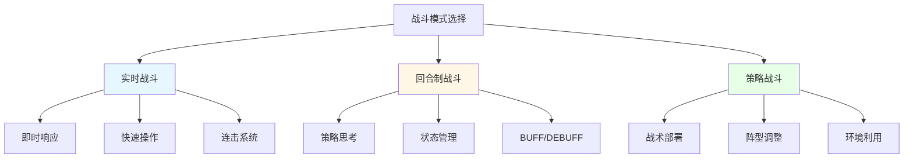
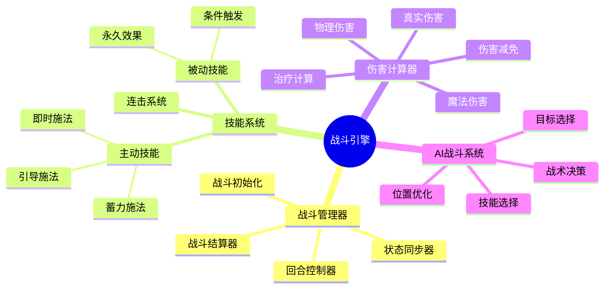
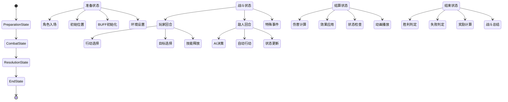
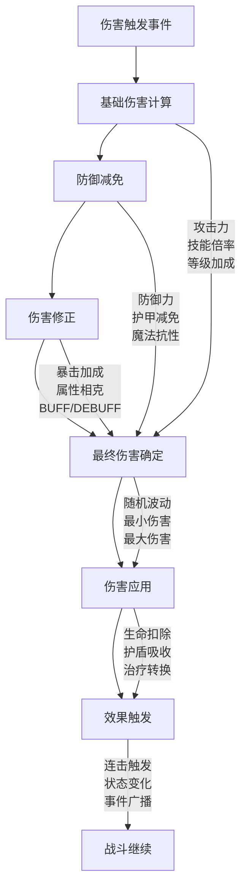
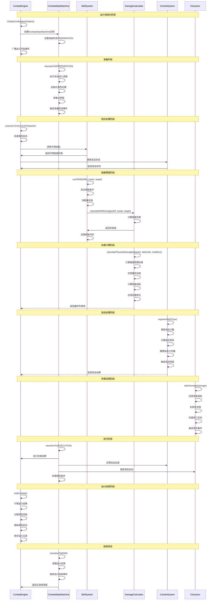

# RPG（角色扮演游戏）架构设计

## 🎯 游戏概述

RPG（Role-Playing Game）是一种让玩家扮演虚拟角色的游戏类型，玩家通过控制角色在游戏世界中冒险、成长、完成任务。核心玩法围绕角色培养、故事叙述、战斗系统和世界探索展开。

## 🏗️ 核心架构模块

### 0. 核心战斗模块 (Combat System)

#### 战斗模式架构图



#### 战斗系统核心组件



#### 战斗状态机架构图



#### 伤害计算流程图



#### 战斗平衡性参数
```typescript
interface CombatBalanceConfig {
  // 伤害计算参数
  baseDamageMultiplier: number;     // 基础伤害倍率 (1.0)
  criticalHitMultiplier: number;    // 暴击伤害倍率 (1.5-2.0)
  armorPenetration: number;         // 护甲穿透系数 (0-1)
  magicResistance: number;          // 魔法抗性系数 (0-1)

  // 战斗节奏参数
  turnTimeLimit: number;           // 回合时间限制 (秒)
  actionPointsPerTurn: number;     // 每回合行动点数
  globalCooldown: number;          // 全局冷却时间

  // 连击系统参数
  comboWindowTime: number;         // 连击窗口时间 (秒)
  maxComboMultiplier: number;      // 最大连击倍率 (3.0)
  comboResetPenalty: number;       // 连击重置惩罚

  // AI难度参数
  aiReactionTime: number;          // AI反应时间 (秒)
  aiSkillSelectionBias: number;    // AI技能选择倾向
  aiAggressiveness: number;        // AI攻击性 (0-1)
}
```

#### RPG战斗系统类图

```mermaid
classDiagram
    class CombatEngine {
        -CombatMode combatMode
        -List<Character> participants
        -Queue<Character> turnOrder
        -CombatState combatState
        +initiateCombat(participants): CombatSession
        +processTurn(currentChar): TurnResult
        +executeAction(action): ActionResult
        +endCombat(): CombatResult
    }

    class CombatStateMachine {
        -CombatState currentState
        -List<CombatState> stateHistory
        -Map<StateTransition> stateTransitions
        +transitionTo(newState: CombatState)
        +canTransitionTo(state: CombatState): boolean
        +onStateEnter(state: CombatState)
        +onStateExit(state: CombatState)
    }

    class SkillSystem {
        -Map<string, ActiveSkill> activeSkills
        -Map<string, PassiveSkill> passiveSkills
        -Map<string, number> skillCooldowns
        +castSkill(skillId, caster, target): SkillResult
        +updateCooldowns(deltaTime: number)
        +getAvailableSkills(character): List<Skill>
        +calculateSkillDamage(skill, caster, target): number
    }

    class DamageCalculator {
        -number physicalMultiplier
        -number magicalMultiplier
        -number trueDamageMultiplier
        -number healingMultiplier
        +calculatePhysicalDamage(attacker, defender, modifiers): number
        +calculateMagicalDamage(attacker, defender, modifiers): number
        +calculateHealing(caster, target, amount): number
        +applyDamageReduction(damage, defender): number
    }

    class ComboSystem {
        -number currentCombo
        -number comboMultiplier
        -number comboTimer
        -number maxComboMultiplier
        +registerHit(hitType: HitType): ComboResult
        +calculateComboBonus(): number
        +resetCombo(): void
        +getComboLevel(): ComboLevel
    }

    class Character {
        -string id
        -string name
        -number level
        -number health
        -number maxHealth
        -number mana
        -number maxMana
        -CharacterAttributes attributes
        +takeDamage(damage: number): number
        +heal(amount: number): number
        +consumeMana(amount: number): boolean
        +isAlive(): boolean
        +getAttackPower(): number
        +getDefensePower(): number
    }

    class PlayerCharacter {
        <<玩家控制>>
        <<装备系统>>
        <<技能学习>>
    }

    class EnemyCharacter {
        <<AI控制>>
        <<固定属性>>
        <<固定技能>>
    }

    class Skill {
        -string id
        -string name
        -string description
        -number manaCost
        -number cooldown
        -SkillType skillType
        +canCast(caster: Character): boolean
        +execute(caster, target): SkillResult
        +getCooldown(): number
        +resetCooldown(): void
    }

    class ActiveSkill {
        <<需要目标>>
        <<手动释放>>
        <<有冷却>>
    }

    class PassiveSkill {
        <<自动触发>>
        <<持续效果>>
        <<无冷却>>
    }

    CombatEngine --> CombatStateMachine : 组合
    CombatEngine --> SkillSystem : 组合
    CombatEngine --> DamageCalculator : 组合
    CombatEngine --> ComboSystem : 组合
    Character <|-- PlayerCharacter : 继承
    Character <|-- EnemyCharacter : 继承
    Skill <|-- ActiveSkill : 继承
    Skill <|-- PassiveSkill : 继承
```



#### RPG战斗系统时序图



### 1. 角色系统 (Character System)

#### 角色属性设计
```typescript
interface CharacterAttributes {
  // 基础属性
  strength: number;      // 力量 - 影响物理伤害和负重
  dexterity: number;     // 敏捷 - 影响命中率和闪避
  constitution: number;  // 体质 - 影响生命值和抗性
  intelligence: number;  // 智力 - 影响魔法伤害和技能
  wisdom: number;        // 感知 - 影响魔法抗性和感知范围
  charisma: number;      // 魅力 - 影响对话选项和交易价格

  // 衍生属性
  maxHealth: number;     // 最大生命值
  maxMana: number;       // 最大魔法值
  attackPower: number;   // 攻击力
  defense: number;       // 防御力
  magicPower: number;    // 魔法攻击力
  magicDefense: number;  // 魔法防御力
}
```

#### 职业系统
- **战士**：高血高防，擅长近战
- **法师**：高魔低血，擅长远程魔法
- **游侠**：平衡发展，擅长远程物理
- **牧师**：治疗辅助，擅长恢复魔法
- **盗贼**：高敏捷，擅长潜行和陷阱
- **术士**：黑暗魔法，擅长诅咒和召唤

#### 天赋树系统
```typescript
interface TalentNode {
  id: string;
  name: string;
  description: string;
  maxLevel: number;
  currentLevel: number;
  prerequisites: string[];     // 前置天赋要求
  effects: TalentEffect[];     // 天赋效果
  position: { x: number; y: number }; // 在天赋树中的位置
}
```

### 2. 装备系统 (Equipment System)

#### 装备类型
- **武器**：剑、斧、弓、法杖、匕首
- **防具**：头盔、胸甲、护手、护腿、鞋子
- **饰品**：戒指、项链、护符、手镯

#### 装备属性
```typescript
interface EquipmentStats {
  // 基础属性加成
  strengthBonus: number;
  dexterityBonus: number;
  constitutionBonus: number;
  intelligenceBonus: number;
  wisdomBonus: number;
  charismaBonus: number;

  // 战斗属性加成
  attackBonus: number;
  defenseBonus: number;
  magicAttackBonus: number;
  magicDefenseBonus: number;

  // 特殊效果
  specialEffects: SpecialEffect[];
}

interface SpecialEffect {
  type: 'damage' | 'healing' | 'resistance' | 'proc';
  value: number;
  chance: number;        // 触发概率 (0-1)
  condition: string;     // 触发条件
}
```

#### 装备强化系统
- **升级材料**：矿石、魔晶、稀有金属
- **强化概率**：成功率随等级降低
- **失败惩罚**：装备损坏或属性下降
- **保护机制**：使用保护符降低失败风险

### 3. 技能系统 (Skill System)

#### 主动技能
```typescript
interface ActiveSkill {
  id: string;
  name: string;
  description: string;
  manaCost: number;
  cooldown: number;       // 冷却时间（秒）
  castTime: number;       // 施法时间
  range: number;          // 技能范围
  targetType: 'single' | 'area' | 'self' | 'allies';
  effects: SkillEffect[];
}

interface SkillEffect {
  type: 'damage' | 'heal' | 'buff' | 'debuff' | 'summon';
  value: number;
  duration: number;       // 效果持续时间
  tickInterval: number;   // 效果间隔时间
}
```

#### 被动技能
- **持续效果**：永久提升角色属性
- **触发效果**：满足条件时自动触发
- **技能树**：通过升级解锁新技能

#### 连击系统
```typescript
interface ComboSystem {
  currentCombo: string[];    // 当前连击序列
  maxComboLength: number;    // 最大连击长度
  comboMultiplier: number;   // 连击伤害倍率
  resetTimer: number;        // 连击重置时间
}
```

### 4. 任务系统 (Quest System)

#### 任务类型
- **主线任务**：推动游戏剧情发展
- **支线任务**：丰富游戏世界背景
- **日常任务**：提供重复性奖励
- **隐藏任务**：奖励稀有物品

#### 任务结构
```typescript
interface Quest {
  id: string;
  title: string;
  description: string;
  type: 'main' | 'side' | 'daily' | 'hidden';
  level: number;
  prerequisites: QuestPrerequisite[];

  objectives: QuestObjective[];
  rewards: QuestReward[];

  status: 'available' | 'active' | 'completed' | 'failed';
}

interface QuestObjective {
  id: string;
  type: 'kill' | 'collect' | 'explore' | 'talk' | 'deliver';
  target: string;
  currentProgress: number;
  requiredProgress: number;
  description: string;
}
```

#### 任务生成算法
- **程序化生成**：随机生成任务内容
- **难度平衡**：根据玩家等级调整任务难度
- **奖励计算**：基于任务难度和玩家表现

### 5. 战斗系统 (Combat System)

#### 回合制战斗
```typescript
interface TurnBasedCombat {
  currentTurn: number;
  turnOrder: Character[];     // 行动顺序
  actionPoints: Map<string, number>; // 行动点数
  battleState: 'preparing' | 'active' | 'finished';

  calculateTurnOrder(): Character[]; // 速度决定行动顺序
  processAction(action: CombatAction): CombatResult;
}
```

#### 实时战斗
- **动作条系统**：时间轴决定行动时机
- **连击判定**：精确的输入时机判定
- **技能预测**：预判对方技能释放

#### AI系统
```typescript
interface CombatAI {
  personality: 'aggressive' | 'defensive' | 'balanced';
  threatTable: Map<string, number>; // 威胁值表
  skillPriority: Skill[];           // 技能优先级

  evaluateThreat(character: Character): number;
  selectOptimalSkill(): Skill;
  chooseTarget(): Character;
}
```

### 6. 世界系统 (World System)

#### 地图设计
- **开放世界**：自由探索的游戏世界
- **区域划分**：森林、沙漠、城市、山脉等
- **动态天气**：影响探索和战斗
- **昼夜循环**：改变NPC行为和怪物出现

#### NPC系统
```typescript
interface NPC {
  id: string;
  name: string;
  type: 'merchant' | 'quest_giver' | 'guard' | 'citizen';
  personality: Personality;
  schedule: ScheduleEntry[]; // 日常作息
  relationships: Map<string, number>; // 与其他NPC的关系
  dialogueTree: DialogueNode;
}

interface DialogueNode {
  text: string;
  responses: DialogueResponse[];
  conditions: DialogueCondition[]; // 显示条件
}

interface DialogueResponse {
  text: string;
  nextNode: DialogueNode;
  effects: DialogueEffect[]; // 对话效果
}
```

#### 经济系统
- **商店系统**：买卖装备和物品
- **拍卖行**：玩家间交易平台
- **价格波动**：供需关系影响价格
- **货币系统**：多种货币和汇率

## 🔧 核心算法实现

### 角色成长算法 (Character Progression)

#### 经验值计算
```typescript
function calculateExperienceGain(
  enemyLevel: number,
  playerLevel: number,
  damageDealt: number,
  totalDamage: number
): number {
  const levelDifference = enemyLevel - playerLevel;
  const damageRatio = damageDealt / totalDamage;

  // 基础经验值
  let baseExp = enemyLevel * 10;

  // 等级差距修正
  const levelModifier = Math.max(0.1, 1 + levelDifference * 0.1);

  // 伤害贡献修正
  const damageModifier = 0.5 + damageRatio * 0.5;

  return Math.floor(baseExp * levelModifier * damageModifier);
}
```

#### 属性成长曲线
```typescript
function calculateAttributeGrowth(
  baseValue: number,
  level: number,
  growthRate: number
): number {
  // 指数衰减成长
  return Math.floor(baseValue * (1 + growthRate * Math.log(level + 1)));
}
```

### 装备平衡算法 (Equipment Balance)

#### 属性权重计算
```typescript
function calculateEquipmentScore(equipment: Equipment): number {
  const weights = {
    attackBonus: 2.0,
    defenseBonus: 1.5,
    magicAttackBonus: 2.0,
    magicDefenseBonus: 1.5,
    strengthBonus: 1.2,
    dexterityBonus: 1.2,
    constitutionBonus: 1.0,
    intelligenceBonus: 1.2,
    wisdomBonus: 1.0,
    charismaBonus: 0.8
  };

  let score = 0;
  for (const [stat, weight] of Object.entries(weights)) {
    score += (equipment[stat] || 0) * weight;
  }

  // 特殊效果加成
  for (const effect of equipment.specialEffects) {
    score += effect.value * effect.chance * 10;
  }

  return Math.floor(score);
}
```

### 任务推荐算法 (Quest Recommendation)

#### 相似度计算
```typescript
function calculateQuestSimilarity(quest1: Quest, quest2: Quest): number {
  let similarity = 0;

  // 类型相似度
  if (quest1.type === quest2.type) similarity += 0.3;

  // 等级相似度
  const levelDiff = Math.abs(quest1.level - quest2.level);
  similarity += Math.max(0, 0.3 * (1 - levelDiff / 10));

  // 奖励相似度
  const rewardSimilarity = calculateRewardSimilarity(quest1.rewards, quest2.rewards);
  similarity += rewardSimilarity * 0.4;

  return similarity;
}
```

## 📊 游戏流程设计

### 角色创建流程
1. **选择种族**：人类、精灵、矮人、兽人等
2. **选择职业**：战士、法师等职业
3. **分配属性点**：自定义初始属性
4. **选择背景故事**：影响游戏剧情发展

### 成长循环
1. **接受任务**：从任务板或NPC处获取任务
2. **探索世界**：前往任务地点，收集信息
3. **战斗磨砺**：与怪物战斗获得经验
4. **装备升级**：使用战利品提升装备
5. **技能学习**：升级技能树解锁新能力
6. **重复循环**：进入下一轮成长

### 剧情推进
1. **主线任务**：推动故事发展
2. **分支选择**：影响剧情走向
3. **角色互动**：与其他角色建立关系
4. **世界事件**：影响游戏世界的重大事件

## 🎮 玩家体验设计

### 沉浸式体验
- **丰富的叙事**：引人入胜的故事背景
- **角色代入感**：个性化的角色定制
- **自由度选择**：多种玩法路线
- **情感连接**：与NPC的深层关系

### 难度平衡
- **渐进式挑战**：难度随等级提升
- **多周目模式**：解锁新内容和难度
- **自定义难度**：调整战斗和经济难度
- **辅助系统**：新手保护和提示系统

## 🔄 系统优化策略

### 性能优化
- **对象池**：复用频繁创建的战斗特效
- **LOD系统**：远处NPC简化渲染
- **异步加载**：地图分块加载
- **缓存机制**：缓存对话和任务数据

### 内存管理
- **资源压缩**：纹理和音频压缩
- **动态卸载**：不常用的资源卸载
- **垃圾回收**：定期清理无用对象
- **内存池**：预分配常用对象

## 📈 扩展性设计

### Mod支持
- **脚本引擎**：Lua/Python支持自定义内容
- **资源编辑器**：可视化编辑器创建新内容
- **API接口**：丰富的Mod制作接口

### 多人游戏扩展
- **合作模式**：多人组队冒险
- **竞技场系统**：玩家间PVP战斗
- **公会系统**：团队协作玩法

## 🎯 核心成功要素

1. **角色成长**：令人上瘾的成长曲线
2. **故事叙述**：引人入胜的剧情设计
3. **世界探索**：丰富的游戏世界
4. **战斗乐趣**：流畅的战斗手感
5. **重玩价值**：多样化的玩法选择

---

*RPG游戏的核心魅力在于扮演角色的自由度和成长的满足感，通过精心设计的系统架构，可以创造出深度沉浸式的游戏体验。*
