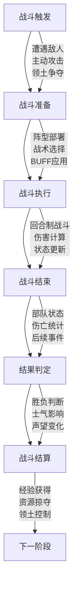
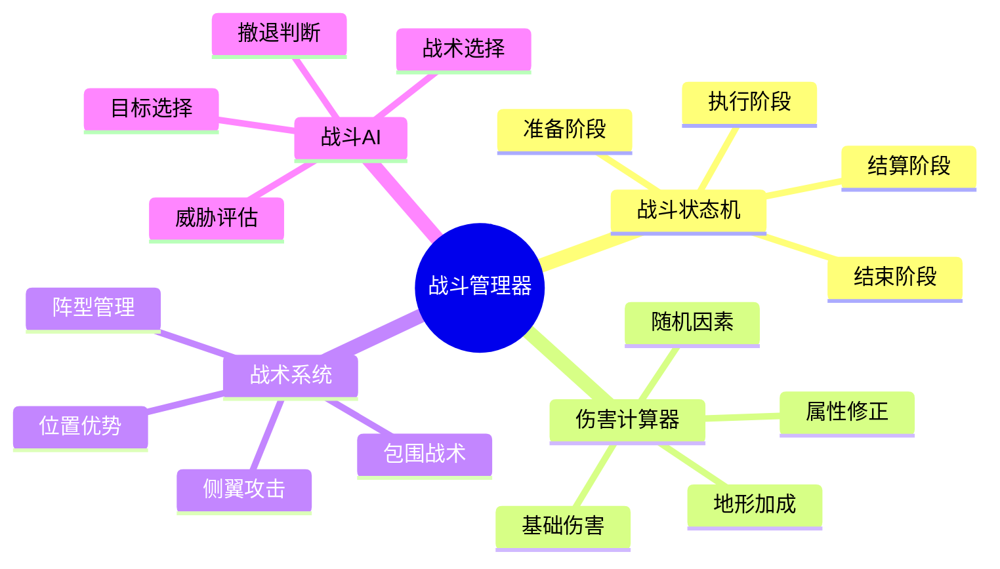
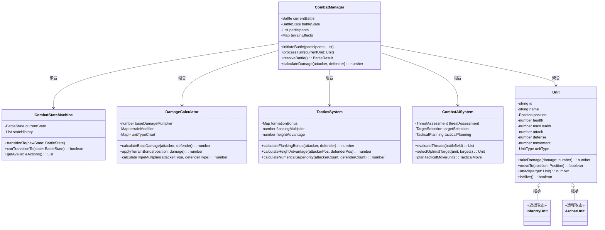
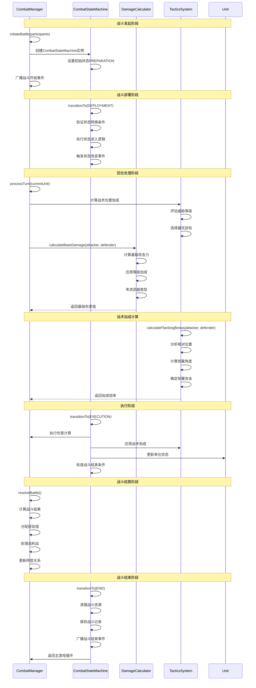

# SLG（策略大型游戏）架构设计

## 🎯 游戏概述

SLG（Strategy Large Game）是一种策略类游戏，玩家需要管理资源、指挥军队、制定战略决策来达成游戏目标。核心玩法围绕资源管理、军事扩张、外交关系和技术发展展开。

## 🏗️ 核心架构模块

### 0. 核心战斗模块 (Combat System)

#### 战斗流程架构图



#### 战斗系统核心组件



#### 战斗伤害计算公式
```
最终伤害 = 基础伤害 × 属性倍率 × 地形修正 × 战术加成 × 随机因子

基础伤害 = 攻击力 × (1 + 等级加成) × 武器倍率
属性倍率 = 1 + (属性相克系数 - 1) × 相克强度
地形修正 = 1 + 地形加成系数 × 地形适应度
战术加成 = 1 + 战术效果 × 战术熟练度
随机因子 = 0.9 + (随机值 × 0.2)  // 90%-110%随机波动
```

#### 战斗平衡性参数
```typescript
interface CombatBalance {
  // 伤害计算参数
  baseDamageMultiplier: number;    // 基础伤害倍率
  levelScalingFactor: number;      // 等级缩放因子
  terrainInfluence: number;        // 地形影响度
  moraleImpact: number;           // 士气影响度

  // 战术参数
  flankingBonus: number;          // 侧翼攻击加成
  heightAdvantage: number;        // 高度优势加成
  numericalSuperiority: number;   // 数量优势加成

  // 随机性参数
  damageVariance: number;         // 伤害波动范围
  criticalHitChance: number;      // 暴击概率
  criticalMultiplier: number;     // 暴击倍率
}
```

#### 核心战斗模块类图



#### SLG战斗系统时序图



### 1. 地图系统 (Map System)

#### 地形管理
- **地形类型**：平原、森林、山地、水域、沙漠、道路
- **移动成本计算**：不同单位在不同地形上的移动消耗
- **视野系统**：单位视野范围和探索机制

#### 建筑系统
- **建筑类型**：房屋、农场、矿场、兵营、塔楼、城墙、城堡
- **建造条件**：资源需求、建造时间、技术依赖
- **升级机制**：等级提升、功能扩展

### 2. 单位系统 (Unit System)

#### 单位类型
- **步兵**：基础地面单位，平衡攻防
- **弓箭手**：远程攻击，适合防卫
- **骑兵**：高速移动，擅长冲锋
- **攻城器械**：破坏建筑，高攻低防
- **法师**：魔法攻击，特殊效果
- **工人**：资源采集，建筑建造

#### 单位属性
- **生命值**：生存能力
- **攻击力**：战斗伤害
- **防御力**：伤害减免
- **移动力**：行动范围
- **视野**：侦察范围

### 3. AI系统 (AI System)

#### 有限状态机 (FSM)
```typescript
enum AIState {
  IDLE = 'idle',           // 待机
  MOVING = 'moving',       // 移动中
  ATTACKING = 'attacking', // 攻击中
  DEFENDING = 'defending', // 防御中
  RETREATING = 'retreating' // 撤退中
}
```

#### 行为树 (Behavior Tree)
- **组合节点**：序列节点、选择节点、装饰器节点
- **执行节点**：动作节点、条件节点
- **决策流程**：评估威胁 → 选择目标 → 执行行动

#### 路径寻找算法
- **A*算法**：启发式搜索，最优路径
- **移动成本**：考虑地形、单位类型、天气因素

### 4. 战斗系统 (Combat System)

#### 伤害计算公式
```
基础伤害 = 攻击力 × (1 + 等级加成)
防御减免 = 防御力 × (1 + 等级加成)
最终伤害 = 基础伤害 - 防御减免
```

#### 战斗机制
- **类型相克**：步兵克骑兵，骑兵克弓箭手，弓箭手克步兵
- **地形加成**：高地防御加成，森林隐蔽加成
- **特殊效果**：暴击、侧翼攻击、士气影响

#### 战斗结果预测
- **胜率计算**：基于双方实力对比
- **伤亡预估**：预测战斗损失
- **战略评估**：考虑战术位置和后勤补给

### 5. 资源管理系统 (Resource Management)

#### 资源类型
- **基础资源**：食物、金钱、木材、石材、铁矿
- **特殊资源**：魔法水晶、稀有金属、古代文物

#### 生产系统
- **采集效率**：工人数量、技术等级影响
- **生产链**：原料→半成品→成品
- **存储上限**：仓库容量和扩建机制

#### 分配优化
- **线性规划**：资源分配最优化
- **优先级排序**：按重要性分配资源
- **动态调整**：根据局势变化调整分配

### 6. 经济系统 (Economic System)

#### 市场机制
- **供需平衡**：价格随供需关系波动
- **贸易路线**：城市间资源交换
- **关税政策**：贸易税收和保护措施

#### 发展策略
- **投资回报率**：计算建筑和技术的ROI
- **长期规划**：平衡短期收益和长期发展
- **风险评估**：考虑投资失败的可能性

### 7. 外交系统 (Diplomacy System)

#### 关系管理
- **友好度**：-100到+100的关系值
- **外交行动**：结盟、宣战、贸易协定
- **声望系统**：影响其他势力的态度

#### 联盟机制
- **共同防御**：盟友间的军事互助
- **资源共享**：联盟内的贸易优惠
- **技术交流**：共享科技研究成果

## 🔧 核心算法实现

### 路径寻找算法 (Pathfinding)

#### A*算法流程
1. **初始化**：创建开放列表和关闭列表
2. **循环搜索**：
   - 选择F值最小的节点
   - 检查是否到达目标
   - 生成邻居节点并计算代价
3. **路径重建**：从目标回溯到起点

#### 复杂度分析
- **时间复杂度**：O(b^d)，b为分支因子，d为深度
- **空间复杂度**：O(b^d)
- **优化策略**：使用堆优化、预计算启发式值

### 资源优化算法 (Resource Optimization)

#### 背包问题求解
```typescript
// 动态规划解背包问题
function knapsack(items: Item[], capacity: number): Selection[] {
  const dp = new Array(capacity + 1).fill(0);
  const selected = new Array(capacity + 1).fill([]);

  for (const item of items) {
    for (let w = capacity; w >= item.weight; w--) {
      if (dp[w - item.weight] + item.value > dp[w]) {
        dp[w] = dp[w - item.weight] + item.value;
        selected[w] = [...selected[w - item.weight], item];
      }
    }
  }

  return selected[capacity];
}
```

#### 线性规划分配
- **目标函数**：最大化资源利用效率
- **约束条件**：资源总量限制、技术依赖
- **求解方法**：单纯形法或内点法

### 战斗预测算法 (Combat Prediction)

#### 蒙特卡罗模拟
```typescript
function predictBattleOutcome(attacker: Army, defender: Army, simulations: number): Result {
  let attackerWins = 0;
  let defenderWins = 0;

  for (let i = 0; i < simulations; i++) {
    const result = simulateBattle(attacker, defender);
    if (result.winner === 'attacker') attackerWins++;
    else defenderWins++;
  }

  return {
    attackerWinRate: attackerWins / simulations,
    defenderWinRate: defenderWins / simulations,
    averageCasualties: calculateAverageCasualties()
  };
}
```

## 📊 游戏流程设计

### 回合制流程
1. **资源生产阶段**：计算各建筑产量
2. **单位行动阶段**：玩家指挥单位行动
3. **战斗结算阶段**：处理所有战斗结果
4. **事件触发阶段**：随机事件和外交事件
5. **状态更新阶段**：更新科技、人口、经济

### 实时策略流程
1. **持续资源生产**：实时计算资源增长
2. **并发单位行动**：多个单位同时执行任务
3. **动态战斗系统**：实时战斗和战术调整
4. **即时外交互动**：与其他玩家实时协商

## 🎮 玩家体验设计

### 难度平衡
- **新手教程**：渐进式引导系统
- **动态难度**：根据玩家表现调整AI强度
- **多周目挑战**：解锁新的游戏模式

### 沉浸式体验
- **故事背景**：丰富的历史背景和剧情
- **视觉反馈**：直观的UI和动画效果
- **成就系统**：多样的成就和奖励机制

## 🔄 系统优化策略

### 性能优化
- **空间分区**：将地图分为网格区域
- **对象池**：复用频繁创建的对象
- **增量更新**：只更新变化的部分

### 内存管理
- **数据压缩**：使用位运算优化存储
- **缓存机制**：缓存计算结果避免重复计算
- **垃圾回收**：及时清理不再使用的对象

### 网络同步（多人游戏）
- **状态同步**：定期同步游戏状态
- **预测补偿**：客户端预测和服务器修正
- **延迟隐藏**：通过动画和缓动隐藏网络延迟

## 📈 扩展性设计

### Mod支持
- **脚本接口**：Lua/Python脚本支持
- **资源包系统**：自定义资源和单位
- **地图编辑器**：玩家创建自定义地图

### DLC和更新
- **新内容集成**：无缝集成新单位和建筑
- **平衡性调整**：数据驱动的平衡机制
- **社区反馈**：持续的内容更新和优化

## 🎯 核心成功要素

1. **平衡性**：各单位、建筑、策略的平衡设计
2. **深度**：丰富的策略选择和决策空间
3. **流畅性**：优秀的用户界面和操作体验
4. **重玩性**：多样化的胜利路线和玩法模式
5. **扩展性**：强大的Mod支持和更新潜力

---

*SLG游戏的核心魅力在于策略的深度和决策的自由度，通过精心的系统设计，可以创造出引人入胜的策略体验。*
