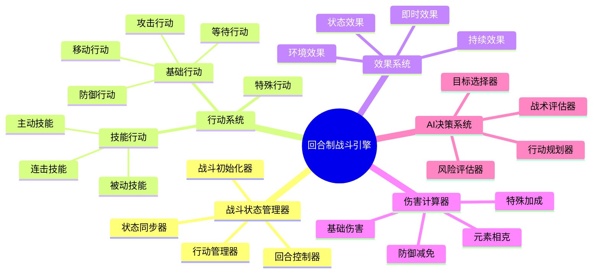
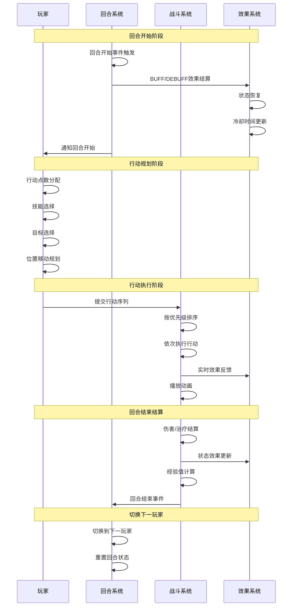
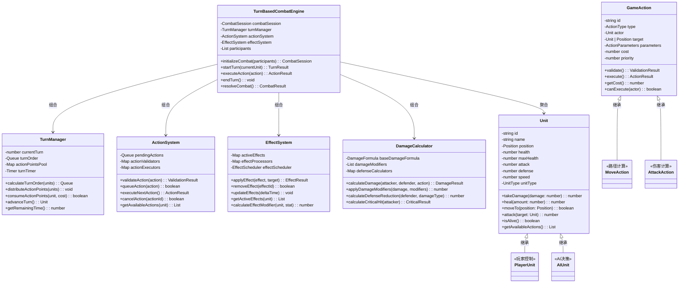
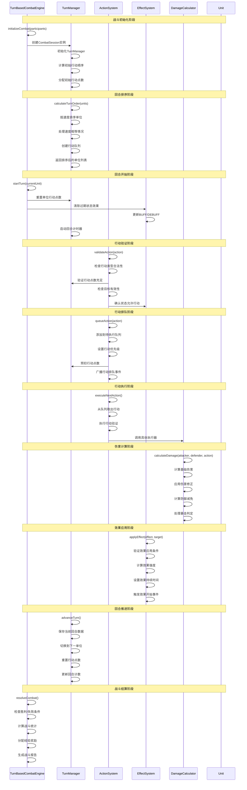

# 回合制游戏架构设计

## 🎯 游戏概述

回合制游戏（Turn-Based Game）是一种玩家和AI交替行动的游戏类型，每个参与者轮流进行有限的行动。核心玩法围绕策略思考、资源管理、战术决策展开。代表作品包括《文明》、《火焰纹章》、《最终幻想》等。

## 🏗️ 核心架构模块

### 0. 核心战斗模块 (Combat System)

#### 回合制战斗流程架构图
```
┌─────────────────────────────────────────────────────────────┐
│                   回合制战斗系统架构                          │
├─────────────────────────────────────────────────────────────┤
│                                                             │
│  ┌─────────────┐    ┌─────────────┐    ┌─────────────┐     │
│  │  战斗准备    │ -> │  回合循环    │ -> │  战斗结算    │     │
│  │             │    │             │    │             │     │
│  │ • 初始化    │    │ • 行动队列   │    │ • 结果计算   │     │
│  │ • 位置设置  │    │ • 状态更新   │    │ • 奖励分配   │     │
│  │ • 状态重置  │    │ • 事件处理   │    │ • 经验获得   │     │
│  └─────────────┘    └─────────────┘    └─────────────┘     │
│                                                             │
└─────────────────────────────────────────────────────────────┘
         ▲                        ▲                        │
         │                        │                        │
         └────────────────────────┼────────────────────────┘
                                  ▼
                    ┌─────────────────────┐
                    │     胜利/失败判定     │
                    │                     │
                    │ • 条件检查          │
                    │ • 统计计算          │
                    │ • 后续处理          │
                    └─────────────────────┘
```

#### 战斗系统核心组件



#### 战斗状态机架构图

```mermaid
stateDiagram-v2
    [*] --> InitializationState
    InitializationState --> PlanningState
    PlanningState --> ExecutionState
    ExecutionState --> ResolutionState
    ResolutionState --> EndState
    EndState --> [*]

    state "初始化状态" as InitializationState {
        [*] --> BattlefieldSetup
        BattlefieldSetup --> UnitDeployment
        UnitDeployment --> StatusInitialization
        StatusInitialization --> UIPreparation
        UIPreparation --> [*]

        BattlefieldSetup : 战场设置
        UnitDeployment : 单位部署
        StatusInitialization : 状态初始化
        UIPreparation : UI准备
    }

    state "规划状态" as PlanningState {
        [*] --> ActionSelection
        ActionSelection --> TargetSelection
        TargetSelection --> PositionPlanning
        PositionPlanning --> StrategyEvaluation
        StrategyEvaluation --> [*]

        ActionSelection : 行动选择
        TargetSelection : 目标选择
        PositionPlanning : 位置规划
        StrategyEvaluation : 策略评估
    }

    state "执行状态" as ExecutionState {
        [*] --> ActionExecution
        ActionExecution --> EffectApplication
        EffectApplication --> AnimationPlayback
        AnimationPlayback --> StateUpdate
        StateUpdate --> [*]

        ActionExecution : 行动执行
        EffectApplication : 效果应用
        AnimationPlayback : 动画播放
        StateUpdate : 状态更新
    }

    state "结算状态" as ResolutionState {
        [*] --> DamageCalculation
        DamageCalculation --> ExperienceDistribution
        ExperienceDistribution --> ItemDrops
        ItemDrops --> AchievementCheck
        AchievementCheck --> [*]

        DamageCalculation : 伤害计算
        ExperienceDistribution : 经验分配
        ItemDrops : 物品掉落
        AchievementCheck : 成就检查
    }

    state "结束状态" as EndState {
        [*] --> VictoryConditionCheck
        VictoryConditionCheck --> DefeatConditionCheck
        DefeatConditionCheck --> StatisticsGeneration
        StatisticsGeneration --> ResourceCleanup
        ResourceCleanup --> [*]

        VictoryConditionCheck : 胜利条件检查
        DefeatConditionCheck : 失败条件检查
        StatisticsGeneration : 统计生成
        ResourceCleanup : 清理资源
    }
```



#### 回合流程时序图



#### 战斗平衡性参数
```typescript
interface TurnBasedCombatConfig {
  // 回合时间参数
  turnTimeLimit: number;           // 回合时间限制 (秒)
  planningTimeLimit: number;       // 规划阶段时间限制 (秒)
  executionTimeLimit: number;      // 执行阶段时间限制 (秒)

  // 行动点数参数
  baseActionPoints: number;        // 基础行动点数
  actionPointRecovery: number;     // 每回合恢复点数
  maxActionPoints: number;         // 最大行动点数

  // 伤害计算参数
  damageMultiplier: number;        // 伤害倍率
  defenseMultiplier: number;       // 防御倍率
  criticalHitChance: number;       // 暴击概率
  criticalHitMultiplier: number;   // 暴击倍率

  // 状态效果参数
  maxStatusEffects: number;        // 最大状态效果数量
  statusEffectDuration: number;    // 状态效果持续时间
  statusStackLimit: number;        // 状态叠加限制

  // AI参数
  aiThinkingTime: number;          // AI思考时间 (秒)
  aiDifficultyMultiplier: number;  // AI难度倍率
  aiAggressiveness: number;        // AI攻击性 (0-1)
}
```

#### 回合制战斗系统类图



#### 回合制战斗系统时序图



### 1. 回合管理器 (Turn Manager)

#### 回合流程控制
```typescript
interface TurnManager {
  currentTurn: number;           // 当前回合数
  currentPlayer: Player;         // 当前行动玩家
  turnOrder: Player[];           // 行动顺序
  turnPhase: TurnPhase;          // 回合阶段
  actionPoints: Map<string, number>; // 行动点数
}

enum TurnPhase {
  START = 'start',        // 回合开始
  PLANNING = 'planning',  // 规划阶段
  EXECUTION = 'execution', // 执行阶段
  END = 'end'            // 回合结束
}
```

#### 行动点数系统
```typescript
interface ActionPointSystem {
  maxPoints: number;           // 最大行动点数
  currentPoints: number;       // 当前剩余点数
  pointRegeneration: number;   // 每回合恢复点数
  actionCosts: Map<string, number>; // 行动消耗表

  consumePoints(action: string): boolean;
  regeneratePoints(): void;
  hasEnoughPoints(action: string): boolean;
}
```

#### 时间管理
- **回合时限**：每个回合的时间限制
- **行动时限**：每个行动的时间限制
- **暂停机制**：允许玩家暂停思考

### 2. 行动系统 (Action System)

#### 基础行动类型
```typescript
enum ActionType {
  MOVE = 'move',           // 移动
  ATTACK = 'attack',       // 攻击
  DEFEND = 'defend',       // 防御
  SKILL = 'skill',         // 使用技能
  ITEM = 'item',           // 使用物品
  WAIT = 'wait',           // 等待
  END_TURN = 'end_turn'    // 结束回合
}

interface GameAction {
  type: ActionType;
  actor: Unit;
  target?: Unit | Position;
  parameters: ActionParameters;
  cost: number;            // 行动点数消耗
  priority: number;        // 行动优先级
}
```

#### 行动队列
```typescript
interface ActionQueue {
  pendingActions: GameAction[];    // 待执行行动
  executedActions: GameAction[];   // 已执行行动
  maxQueueSize: number;            // 最大队列长度

  addAction(action: GameAction): boolean;
  removeAction(actionId: string): void;
  executeNext(): Promise<GameActionResult>;
  clearQueue(): void;
}
```

#### 行动验证
- **可行性检查**：检查行动是否可以执行
- **资源验证**：检查行动点数和资源是否充足
- **状态验证**：检查单位状态是否允许行动

### 3. 单位系统 (Unit System)

#### 单位属性
```typescript
interface Unit {
  id: string;
  name: string;
  type: UnitType;
  position: Position;

  // 基础属性
  health: number;
  maxHealth: number;
  mana: number;
  maxMana: number;

  // 战斗属性
  attack: number;
  defense: number;
  speed: number;          // 影响行动顺序

  // 状态效果
  statusEffects: StatusEffect[];
  buffs: Buff[];
  debuffs: Debuff[];

  // 行动能力
  availableActions: ActionType[];
  movementRange: number;
}
```

#### 状态效果系统
```typescript
interface StatusEffect {
  id: string;
  name: string;
  type: 'buff' | 'debuff' | 'neutral';
  duration: number;       // 持续回合数
  effects: Effect[];      // 具体效果
  stackable: boolean;     // 是否可叠加
  maxStacks: number;      // 最大叠加层数
}

interface Effect {
  type: 'modify_stat' | 'prevent_action' | 'damage_over_time';
  targetStat: string;     // 影响的属性
  value: number;          // 效果数值
  operation: 'add' | 'multiply' | 'set'; // 操作类型
}
```

### 4. 战场系统 (Battlefield System)

#### 网格系统
```typescript
interface GridSystem {
  width: number;
  height: number;
  cells: GridCell[][];

  getCell(x: number, y: number): GridCell;
  isValidPosition(position: Position): boolean;
  getNeighbors(position: Position): Position[];
  getDistance(pos1: Position, pos2: Position): number;
}

interface GridCell {
  position: Position;
  terrain: TerrainType;
  occupant: Unit | null;
  effects: CellEffect[];     // 格子效果（如火焰、毒气）
  movementCost: number;      // 移动消耗
}
```

#### 地形系统
```typescript
enum TerrainType {
  PLAIN = 'plain',        // 平原
  FOREST = 'forest',      // 森林
  MOUNTAIN = 'mountain',  // 山地
  WATER = 'water',        // 水域
  ROAD = 'road',          // 道路
  WALL = 'wall'          // 墙壁
}

interface TerrainModifier {
  terrain: TerrainType;
  movementCost: number;     // 移动消耗倍率
  defenseBonus: number;     // 防御加成
  attackBonus: number;      // 攻击加成
  visibility: number;       // 视野影响
}
```

#### 范围计算
- **移动范围**：基于移动力计算可到达区域
- **攻击范围**：基于武器类型计算攻击区域
- **技能范围**：基于技能类型计算影响区域
- **视野范围**：计算单位可见区域

### 5. AI系统 (AI System)

#### 决策树
```typescript
interface DecisionTree {
  root: DecisionNode;

  evaluate(gameState: GameState): GameAction;
  traverse(node: DecisionNode, context: AIContext): DecisionNode;
}

interface DecisionNode {
  condition: (context: AIContext) => boolean;
  action?: GameAction;
  children: DecisionNode[];
  priority: number;
}
```

#### 策略评估
```typescript
interface StrategyEvaluator {
  evaluatePosition(unit: Unit, position: Position): number;
  evaluateAction(action: GameAction): number;
  evaluateThreat(unit: Unit): number;
  predictOutcome(action: GameAction): PredictionResult;
}

interface PredictionResult {
  successProbability: number;
  expectedDamage: number;
  expectedPosition: Position;
  riskLevel: 'low' | 'medium' | 'high';
}
```

#### 难度调整
- **AI强度**：从简单到困难的不同AI等级
- **预测深度**：AI考虑的回合数量
- **随机性**：AI决策的随机因素

### 6. 技能系统 (Skill System)

#### 主动技能
```typescript
interface ActiveSkill {
  id: string;
  name: string;
  description: string;
  manaCost: number;
  cooldown: number;       // 冷却回合数
  range: number;          // 技能范围
  area: AreaShape;        // 影响区域形状
  effects: SkillEffect[];
  animation: string;      // 技能动画
}

enum AreaShape {
  SINGLE = 'single',      // 单体
  LINE = 'line',          // 直线
  CIRCLE = 'circle',      // 圆形
  CONE = 'cone',          // 扇形
  CROSS = 'cross'         // 十字
}
```

#### 被动技能
- **持续效果**：回合开始时自动触发
- **条件触发**：满足特定条件时激活
- **装备技能**：通过装备获得的能力

### 7. 物品系统 (Item System)

#### 物品类型
```typescript
enum ItemType {
  CONSUMABLE = 'consumable',    // 消耗品
  EQUIPMENT = 'equipment',      // 装备
  KEY_ITEM = 'key_item',        // 关键物品
  MATERIAL = 'material'         // 材料
}

interface Item {
  id: string;
  name: string;
  type: ItemType;
  description: string;
  effects: ItemEffect[];
  usableInBattle: boolean;
  usableOutBattle: boolean;
  maxQuantity: number;
}
```

#### 物品效果
```typescript
interface ItemEffect {
  type: 'heal' | 'damage' | 'buff' | 'debuff' | 'teleport';
  target: 'self' | 'ally' | 'enemy' | 'area';
  value: number;
  duration: number;       // 效果持续时间
  chance: number;         // 触发概率
}
```

## 🔧 核心算法实现

### 回合顺序算法 (Turn Order Algorithm)

#### 速度排序
```typescript
function calculateTurnOrder(units: Unit[]): Unit[] {
  // 按速度降序排序，速度相同时随机决定
  return units.sort((a, b) => {
    if (a.speed !== b.speed) {
      return b.speed - a.speed;
    }
    // 速度相同时，加入随机因素避免死锁
    return Math.random() - 0.5;
  });
}
```

#### 行动点数分配
```typescript
function distributeActionPoints(units: Unit[], totalPoints: number): Map<string, number> {
  const points = new Map<string, number>();
  const totalSpeed = units.reduce((sum, unit) => sum + unit.speed, 0);

  for (const unit of units) {
    const unitPoints = Math.floor((unit.speed / totalSpeed) * totalPoints);
    points.set(unit.id, Math.max(1, unitPoints)); // 至少1点
  }

  return points;
}
```

### 路径寻找算法 (Pathfinding Algorithm)

#### A*寻路
```typescript
function findPath(
  grid: GridSystem,
  start: Position,
  goal: Position,
  unit: Unit
): Position[] {
  const openSet = new PriorityQueue<Position>();
  const cameFrom = new Map<string, Position>();
  const gScore = new Map<string, number>();
  const fScore = new Map<string, number>();

  const startKey = `${start.x},${start.y}`;
  const goalKey = `${goal.x},${goal.y}`;

  openSet.enqueue(start, 0);
  gScore.set(startKey, 0);
  fScore.set(startKey, heuristic(start, goal));

  while (!openSet.isEmpty()) {
    const current = openSet.dequeue();

    if (current.x === goal.x && current.y === goal.y) {
      return reconstructPath(cameFrom, current);
    }

    const neighbors = grid.getNeighbors(current);
    for (const neighbor of neighbors) {
      const neighborKey = `${neighbor.x},${neighbor.y}`;
      const movementCost = grid.getCell(neighbor.x, neighbor.y).movementCost;
      const tentativeGScore = gScore.get(current.x + ',' + current.y) + movementCost;

      if (!gScore.has(neighborKey) || tentativeGScore < gScore.get(neighborKey)) {
        cameFrom.set(neighborKey, current);
        gScore.set(neighborKey, tentativeGScore);
        fScore.set(neighborKey, tentativeGScore + heuristic(neighbor, goal));

        if (!openSet.contains(neighbor)) {
          openSet.enqueue(neighbor, fScore.get(neighborKey));
        }
      }
    }
  }

  return []; // 没有找到路径
}
```

### 伤害计算算法 (Damage Calculation)

#### 基础伤害公式
```typescript
function calculateDamage(
  attacker: Unit,
  defender: Unit,
  attackType: AttackType,
  modifiers: DamageModifier[] = []
): DamageResult {
  let baseDamage = attacker.attack;

  // 攻击类型修正
  switch (attackType) {
    case AttackType.PHYSICAL:
      baseDamage *= (1 + attacker.level * 0.1);
      break;
    case AttackType.MAGICAL:
      baseDamage = attacker.magicAttack;
      baseDamage *= (1 + attacker.intelligence * 0.05);
      break;
  }

  // 防御减免
  const defenseReduction = defender.defense * (1 + defender.level * 0.05);
  let finalDamage = Math.max(0, baseDamage - defenseReduction);

  // 应用伤害修正
  for (const modifier of modifiers) {
    switch (modifier.type) {
      case 'multiplier':
        finalDamage *= modifier.value;
        break;
      case 'addition':
        finalDamage += modifier.value;
        break;
      case 'percentage':
        finalDamage *= (1 + modifier.value);
        break;
    }
  }

  // 暴击判定
  const isCritical = Math.random() < attacker.criticalChance;
  if (isCritical) {
    finalDamage *= attacker.criticalMultiplier;
  }

  return {
    damage: Math.floor(finalDamage),
    isCritical,
    attacker: attacker.id,
    defender: defender.id
  };
}
```

### AI决策算法 (AI Decision Algorithm)

#### 效用函数
```typescript
function evaluateActionUtility(action: GameAction, context: AIContext): number {
  let utility = 0;

  // 威胁评估
  if (action.type === ActionType.ATTACK) {
    const threatReduction = calculateThreatReduction(action, context);
    utility += threatReduction * 10;
  }

  // 位置优势
  if (action.type === ActionType.MOVE) {
    const positionalAdvantage = evaluatePositionAdvantage(action.target as Position, context);
    utility += positionalAdvantage * 5;
  }

  // 生存考虑
  const survivalBonus = calculateSurvivalBonus(action, context);
  utility += survivalBonus * 15;

  // 随机性避免AI过于完美
  utility += (Math.random() - 0.5) * 2;

  return utility;
}
```

## 📊 游戏流程设计

### 标准回合流程
1. **回合开始**：重置行动点数，应用持续效果
2. **行动规划**：玩家选择行动并加入队列
3. **行动执行**：按优先级执行队列中的行动
4. **效果结算**：处理伤害、治疗、状态变化
5. **回合结束**：检查胜利条件，进入下一回合

### 战斗流程
1. **战斗初始化**：设置战场，确定行动顺序
2. **回合循环**：
   - 玩家回合：选择行动，执行行动
   - AI回合：AI评估，执行最优行动
   - 效果处理：结算所有行动结果
3. **战斗结束**：判断胜负，分配奖励

### 策略思考时间
- **无时间限制**：深度策略思考
- **回合时限**：增加紧迫感
- **行动时限**：快速决策训练

## 🎮 玩家体验设计

### 策略深度
- **复杂战术**：多单位协同作战
- **资源管理**：行动点数和技能冷却
- **风险评估**：预测行动后果
- **连锁反应**：行动间的相互影响

### 视觉反馈
- **行动预览**：显示行动范围和效果
- **伤害数字**：直观的伤害显示
- **状态指示**：清晰的状态效果显示
- **动画表现**：流畅的战斗动画

### 难度曲线
- **渐进式挑战**：难度随进度增加
- **教学关卡**：学习系统和机制
- **难度选项**：从休闲到 hardcore
- **动态调整**：根据玩家表现调整

## 🔄 系统优化策略

### 性能优化
- **对象池**：复用战斗单位和特效
- **空间分区**：网格系统优化碰撞检测
- **异步计算**：AI决策异步处理
- **缓存机制**：缓存路径和范围计算

### 网络同步（多人游戏）
- **确定性回放**：确保所有客户端同步
- **延迟补偿**：预测和回滚机制
- **状态同步**：定期同步游戏状态
- **输入缓冲**：处理网络延迟

## 📈 扩展性设计

### 模组支持
- **自定义单位**：创建新的单位类型
- **地图编辑器**：设计自定义战场
- **规则修改器**：调整游戏规则
- **AI脚本**：自定义AI行为

### 多人扩展
- **本地多人**：分屏或轮流操作
- **在线多人**：实时网络对战
- **观战模式**：观看其他玩家游戏
- **锦标赛系统**：竞技比赛功能

## 🎯 核心成功要素

1. **策略深度**：丰富的战术选择和决策空间
2. **平衡性**：各单位和技能的合理平衡
3. **流畅性**：直观的操作和清晰的反馈
4. **重玩性**：多样化的战术组合
5. **教学性**：良好的上手曲线和教学设计

---

*回合制游戏的核心魅力在于策略思考的乐趣，通过精心设计的回合机制和丰富的战术选择，可以创造出耐玩性极强的策略体验。*
