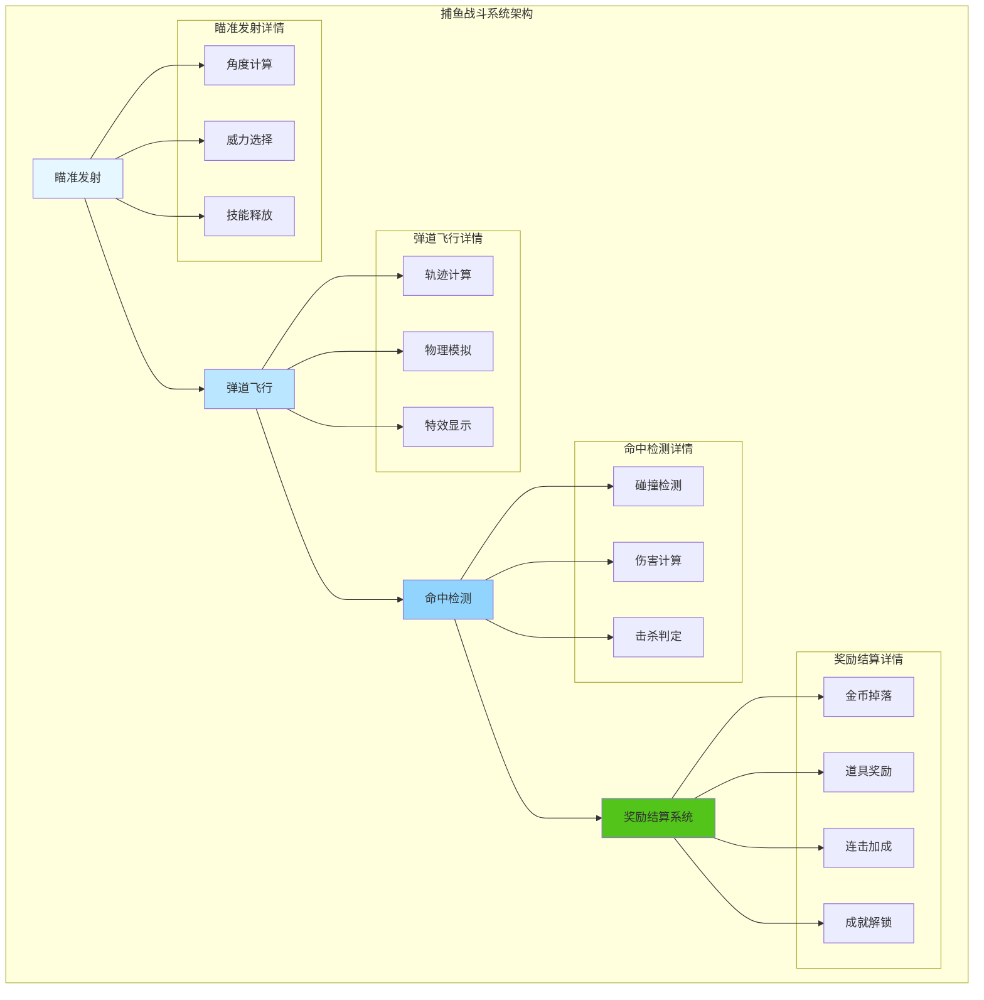
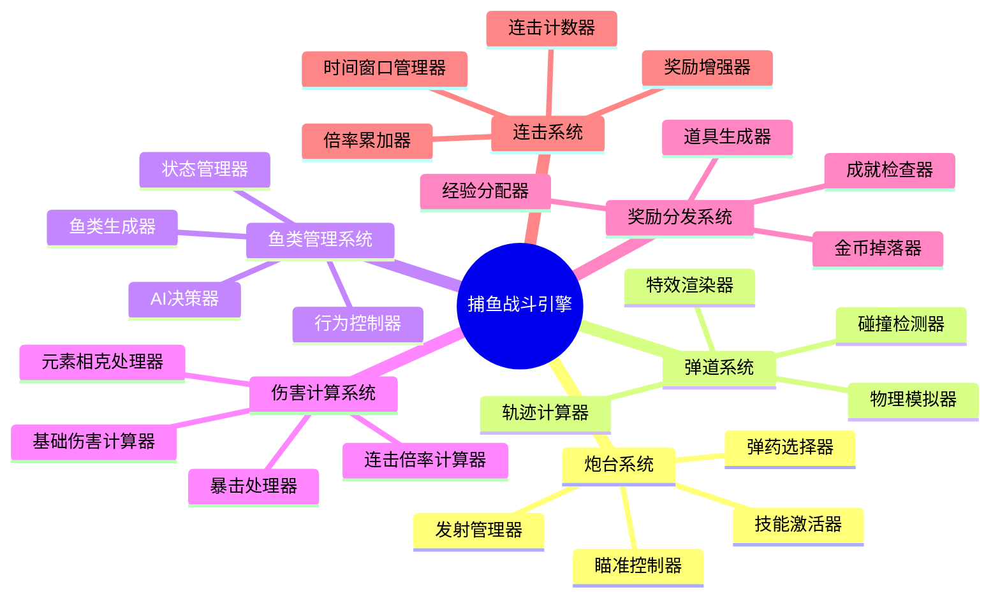
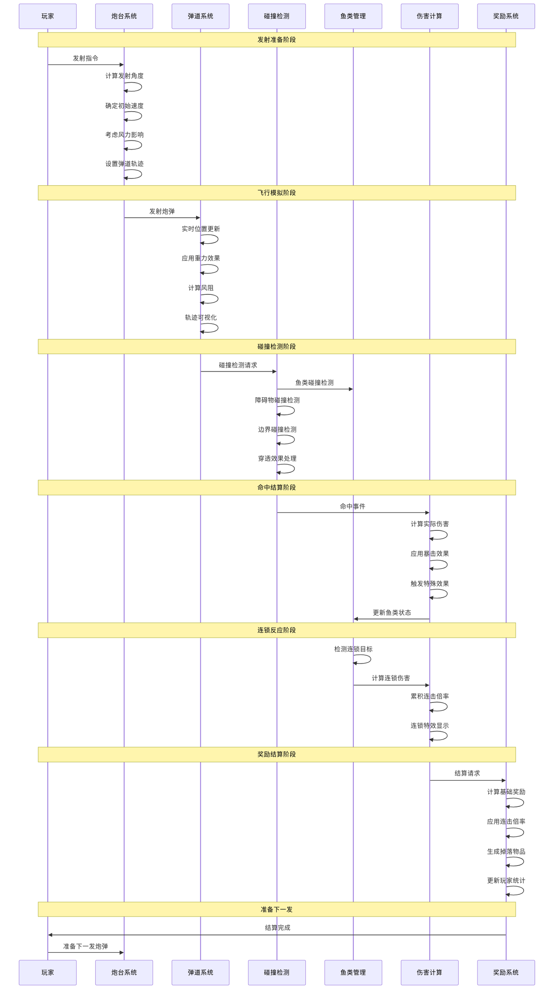
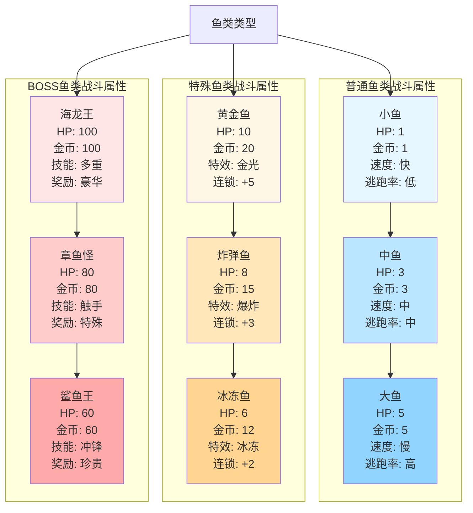
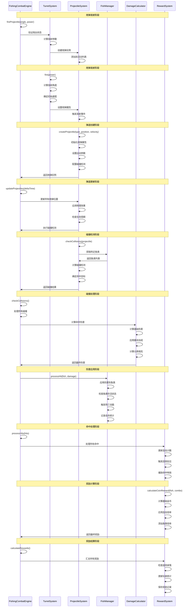

# 捕鱼类游戏架构设计

## 🎯 游戏概述

捕鱼类游戏是一种休闲益智游戏，玩家通过发射炮弹击中游动的鱼类获得分数和奖励。代表作品包括《捕鱼达人》、《海王》等。核心玩法围绕瞄准射击、鱼类行为、概率奖励和道具系统展开。

## 🏗️ 核心架构模块

### 0. 核心战斗模块 (Combat System)

#### 捕鱼战斗模式架构图



#### 捕鱼战斗系统核心组件



#### 捕鱼战斗状态机架构图

```mermaid
stateDiagram-v2
    [*] --> Preparation

    state "准备状态" as Preparation {
        [*] --> SceneLoading
        SceneLoading --> TurretInit
        TurretInit --> FishSpawn
        FishSpawn --> UIReady
        UIReady --> [*]

        SceneLoading : 场景加载
        TurretInit : 炮台初始化
        FishSpawn : 鱼类生成
        UIReady : UI准备
    }

    Preparation --> Aiming

    state "瞄准状态" as Aiming {
        [*] --> AngleCalc
        AngleCalc --> TrajectoryPrev
        TrajectoryPrev --> PowerSelect
        PowerSelect --> SkillSelect
        SkillSelect --> [*]

        AngleCalc : 角度计算
        TrajectoryPrev : 轨迹预览
        PowerSelect : 威力选择
        SkillSelect : 技能选择
    }

    Aiming --> Firing

    state "发射状态" as Firing {
        [*] --> TrajectoryCalc
        TrajectoryCalc --> PhysicsSim
        PhysicsSim --> AnimationPlay
        AnimationPlay --> SoundTrig
        SoundTrig --> [*]

        TrajectoryCalc : 弹道计算
        PhysicsSim : 物理模拟
        AnimationPlay : 动画播放
        SoundTrig : 音效触发
    }

    Firing --> Flight

    state "飞行状态" as Flight {
        [*] --> RealTimeUpdate
        RealTimeUpdate --> CollisionDetect
        CollisionDetect --> EffectRender
        EffectRender --> StateSync
        StateSync --> [*]

        RealTimeUpdate : 实时轨迹更新
        CollisionDetect : 碰撞检测
        EffectRender : 特效渲染
        StateSync : 状态同步
    }

    Flight --> Hit : 命中
    Flight --> Flight : 未命中

    state "命中状态" as Hit {
        [*] --> DamageCalc
        DamageCalc --> FishUpdate
        FishUpdate --> KillJudge
        KillJudge --> ChainTrigger
        ChainTrigger --> RewardCalc
        RewardCalc --> [*]

        DamageCalc : 伤害计算
        FishUpdate : 鱼类状态更新
        KillJudge : 击杀判定
        ChainTrigger : 连锁反应触发
        RewardCalc : 奖励计算
    }

    Hit --> Chain : 触发连锁
    Hit --> Resolution : 无连锁

    state "连锁状态" as Chain {
        [*] --> ChainDetect
        ChainDetect --> MultiHitCalc
        MultiHitCalc --> ComboAccum
        ComboAccum --> RewardMulti
        RewardMulti --> EffectChain
        EffectChain --> [*]

        ChainDetect : 连锁鱼类检测
        MultiHitCalc : 多重命中计算
        ComboAccum : 连击倍率累积
        RewardMulti : 奖励倍增
        EffectChain : 特效连锁
    }

    Chain --> Resolution

    state "结算状态" as Resolution {
        [*] --> FinalReward
        FinalReward --> CoinAnim
        CoinAnim --> ItemDistribute
        ItemDistribute --> StatUpdate
        StatUpdate --> Achievement
        Achievement --> [*]

        FinalReward : 最终奖励计算
        CoinAnim : 金币掉落动画
        ItemDistribute : 道具奖励分发
        StatUpdate : 统计数据更新
        Achievement : 成就检查
    }

    Resolution --> End

    state "结束状态" as End {
        [*] --> SceneClean
        SceneClean --> DataPersist
        DataPersist --> NextWavePrep
        NextWavePrep --> PlayerUpdate
        PlayerUpdate --> [*]

        SceneClean : 场景清理
        DataPersist : 数据持久化
        NextWavePrep : 下一波准备
        PlayerUpdate : 玩家状态更新
    }

    End --> [*]

    note right of Flight : 可能没有命中
    note right of Hit : 可能触发连锁
    note right of Chain : 可能有多重连锁
```



#### 炮弹轨迹战斗流程图



#### 鱼类战斗属性矩阵图



#### 战斗平衡性参数
```typescript
interface FishingCombatConfig {
  // 炮弹参数
  baseDamage: number;               // 基础伤害
  criticalHitChance: number;        // 暴击概率
  criticalMultiplier: number;       // 暴击倍率
  projectileSpeed: number;          // 炮弹速度
  projectileGravity: number;        // 重力影响

  // 鱼类参数
  baseFishHP: number;               // 基础鱼类血量
  hpScalingFactor: number;          // 血量缩放因子
  coinRewardMultiplier: number;     // 金币奖励倍率
  escapeSpeedMultiplier: number;    // 逃跑速度倍率

  // 连击系统参数
  comboTimeWindow: number;          // 连击时间窗口 (秒)
  maxComboMultiplier: number;       // 最大连击倍率
  comboDecayRate: number;           // 连击衰减率

  // 特殊效果参数
  freezeDuration: number;           // 冰冻持续时间
  fireDamageOverTime: number;       // 火焰持续伤害
  lightningChainRange: number;      // 雷电连锁范围
  pierceCount: number;              // 穿透数量

  // AI参数
  fishEscapeThreshold: number;      // 鱼类逃跑阈值
  threatDetectionRange: number;     // 威胁检测范围
  behaviorUpdateFrequency: number;  // 行为更新频率
}
```

#### 捕鱼战斗系统类图

```mermaid
classDiagram
    class FishingCombatEngine {
        -Turret turret
        -ProjectileManager projectileManager
        -FishManager fishManager
        -DamageCalculator damageCalculator
        -RewardSystem rewardSystem
        +initializeScene(sceneData): SceneSession
        +fireProjectile(angle, power): Projectile
        +updateProjectiles(deltaTime): void
        +checkCollisions(): CollisionResult
        +processHits(hits): HitResult
        +calculateRewards(): RewardResult
    }

    class TurretSystem {
        -Vector2D position
        -number angle
        -number power
        -ProjectileType projectileType
        -number upgradeLevel
        +aimAt(target: Vector2D): number
        +fire(power: number): Projectile
        +upgrade(): boolean
        +switchProjectile(type: ProjectileType): boolean
        +getTrajectoryPreview(): Trajectory
    }

    class ProjectileSystem {
        -List<Projectile> activeProjectiles
        -TrajectoryCalculator trajectoryCalculator
        -PhysicsSimulator physicsSimulator
        -CollisionDetector collisionDetector
        +createProjectile(type, position, velocity): Projectile
        +updateProjectiles(deltaTime): void
        +calculateTrajectory(projectile): Trajectory
        +checkCollisions(projectile): CollisionResult
        +destroyProjectile(projectile): void
    }

    class FishManager {
        -List<Fish> activeFish
        -FishSpawner fishSpawner
        -FishAIController aiController
        -FishBehaviorSystem behaviorSystem
        +spawnFish(type, position): Fish
        +updateFish(deltaTime): void
        +processHit(fish, damage): HitResult
        +removeFish(fish): void
        +getNearbyFish(position, radius): List<Fish>
        +triggerFishBehavior(fish, event): void
    }

    class DamageCalculator {
        -DamageFormula baseDamageFormula
        -List<DamageModifier> damageModifiers
        -CriticalCalculator criticalCalculator
        -ElementalCalculator elementalCalculator
        +calculateDamage(attacker, defender, projectile): DamageResult
        +applyDamageModifiers(damage, modifiers): number
        +calculateCriticalHit(projectile): CriticalResult
        +calculateElementalBonus(projectile, fish): ElementalBonus
    }

    class RewardSystem {
        -CoinCalculator coinCalculator
        -ItemDropper itemDropper
        -ComboTracker comboTracker
        -AchievementChecker achievementChecker
        +calculateCoinReward(fish, combo): number
        +dropItems(fish, luck): List<Item>
        +updateCombo(hit): ComboResult
        +checkAchievements(hit): List<Achievement>
        +distributeRewards(rewards): void
    }

    class Fish {
        -string id
        -FishType type
        -Vector2D position
        -Vector2D velocity
        -number health
        -number maxHealth
        -number speed
        -number value
        -FishBehavior behavior
        +update(deltaTime): void
        +takeDamage(damage: number): number
        +moveTo(target: Vector2D): void
        +changeBehavior(newBehavior: FishBehavior): void
        +isAlive(): boolean
        +getHitbox(): Rectangle
    }

    class NormalFish {
        <<标准移动>>
        <<基础奖励>>
        <<普通行为>>
    }

    class SpecialFish {
        <<特殊移动>>
        <<增强奖励>>
        <<特殊行为>>
    }

    class Projectile {
        -string id
        -ProjectileType type
        -Vector2D position
        -Vector2D velocity
        -number damage
        -number lifetime
        -List<ProjectileEffect> effects
        +update(deltaTime): void
        +checkCollision(target): boolean
        +applyEffect(target): EffectResult
        +destroy(): void
        +getTrajectory(): Trajectory
    }

    class NormalProjectile {
        <<标准轨迹>>
        <<基础伤害>>
        <<普通效果>>
    }

    class SpecialProjectile {
        <<特殊轨迹>>
        <<增强伤害>>
        <<特殊效果>>
    }

    FishingCombatEngine --> TurretSystem : 组合
    FishingCombatEngine --> ProjectileSystem : 组合
    FishingCombatEngine --> FishManager : 组合
    FishingCombatEngine --> DamageCalculator : 组合
    FishingCombatEngine --> RewardSystem : 组合
    Fish <|-- NormalFish : 继承
    Fish <|-- SpecialFish : 继承
    Projectile <|-- NormalProjectile : 继承
    Projectile <|-- SpecialProjectile : 继承
```



#### 捕鱼战斗系统时序图



### 1. 物理引擎系统 (Physics Engine System)

#### 向量数学基础
```typescript
class Vector2D {
  constructor(public x: number = 0, public y: number = 0) {}

  // 向量加法
  add(other: Vector2D): Vector2D {
    return new Vector2D(this.x + other.x, this.y + other.y);
  }

  // 向量减法
  subtract(other: Vector2D): Vector2D {
    return new Vector2D(this.x - other.x, this.y - other.y);
  }

  // 向量乘法（标量）
  multiply(scalar: number): Vector2D {
    return new Vector2D(this.x * scalar, this.y * scalar);
  }

  // 向量长度
  magnitude(): number {
    return Math.sqrt(this.x * this.x + this.y * this.y);
  }

  // 向量标准化
  normalize(): Vector2D {
    const mag = this.magnitude();
    if (mag === 0) return new Vector2D(0, 0);
    return new Vector2D(this.x / mag, this.y / mag);
  }

  // 向量点积
  dot(other: Vector2D): number {
    return this.x * other.x + this.y * other.y;
  }

  // 计算两点间距离
  static distance(a: Vector2D, b: Vector2D): number {
    return a.subtract(b).magnitude();
  }

  // 计算方向向量
  static direction(from: Vector2D, to: Vector2D): Vector2D {
    return to.subtract(from).normalize();
  }
}
```

#### 碰撞检测系统
```typescript
enum CollisionShape {
  CIRCLE = 'circle',
  RECTANGLE = 'rectangle',
  POLYGON = 'polygon'
}

interface CollisionBody {
  id: string;
  position: Vector2D;
  shape: CollisionShape;
  radius?: number;        // 圆形半径
  width?: number;         // 矩形宽度
  height?: number;        // 矩形高度
  vertices?: Vector2D[];  // 多边形顶点
}

class CollisionDetector {
  // 圆形碰撞检测
  static circleCollision(
    pos1: Vector2D,
    radius1: number,
    pos2: Vector2D,
    radius2: number
  ): boolean {
    const distance = Vector2D.distance(pos1, pos2);
    return distance <= (radius1 + radius2);
  }

  // 矩形碰撞检测
  static rectangleCollision(
    pos1: Vector2D,
    width1: number,
    height1: number,
    pos2: Vector2D,
    width2: number,
    height2: number
  ): boolean {
    return (
      pos1.x < pos2.x + width2 &&
      pos1.x + width1 > pos2.x &&
      pos1.y < pos2.y + height2 &&
      pos1.y + height1 > pos2.y
    );
  }

  // 点到线段距离
  static pointToLineDistance(
    point: Vector2D,
    lineStart: Vector2D,
    lineEnd: Vector2D
  ): number {
    const A = point.x - lineStart.x;
    const B = point.y - lineStart.y;
    const C = lineEnd.x - lineStart.x;
    const D = lineEnd.y - lineStart.y;

    const dot = A * C + B * D;
    const lenSq = C * C + D * D;

    if (lenSq === 0) {
      return Vector2D.distance(point, lineStart);
    }

    const param = dot / lenSq;

    let xx: number, yy: number;

    if (param < 0) {
      xx = lineStart.x;
      yy = lineStart.y;
    } else if (param > 1) {
      xx = lineEnd.x;
      yy = lineEnd.y;
    } else {
      xx = lineStart.x + param * C;
      yy = lineStart.y + param * D;
    }

    return Vector2D.distance(point, new Vector2D(xx, yy));
  }

  // 通用碰撞检测
  static checkCollision(body1: CollisionBody, body2: CollisionBody): boolean {
    if (body1.shape === CollisionShape.CIRCLE && body2.shape === CollisionShape.CIRCLE) {
      return this.circleCollision(
        body1.position, body1.radius!,
        body2.position, body2.radius!
      );
    }

    if (body1.shape === CollisionShape.RECTANGLE && body2.shape === CollisionShape.RECTANGLE) {
      return this.rectangleCollision(
        body1.position, body1.width!, body1.height!,
        body2.position, body2.width!, body2.height!
      );
    }

    // 其他形状的碰撞检测可以扩展
    return false;
  }
}
```

### 2. 弹道轨迹系统 (Projectile System)

#### 弹道计算
```typescript
interface Projectile {
  id: string;
  position: Vector2D;
  velocity: Vector2D;
  acceleration: Vector2D;
  damage: number;
  type: ProjectileType;
  lifetime: number;
  maxLifetime: number;
}

enum ProjectileType {
  NORMAL = 'normal',      // 普通炮弹
  FREEZE = 'freeze',      // 冰冻炮弹
  FIRE = 'fire',          // 火焰炮弹
  LIGHTNING = 'lightning', // 雷电炮弹
  PIERCE = 'pierce'       // 穿透炮弹
}

class TrajectoryCalculator {
  // 计算抛物线轨迹
  static calculateParabolicPoint(
    startPos: Vector2D,
    velocity: Vector2D,
    gravity: number,
    time: number
  ): Vector2D {
    const x = startPos.x + velocity.x * time;
    const y = startPos.y + velocity.y * time - 0.5 * gravity * time * time;
    return new Vector2D(x, y);
  }

  // 计算直线轨迹
  static calculateLinearPoint(
    startPos: Vector2D,
    direction: Vector2D,
    speed: number,
    time: number
  ): Vector2D {
    const distance = speed * time;
    const displacement = direction.multiply(distance);
    return startPos.add(displacement);
  }

  // 计算贝塞尔曲线轨迹
  static calculateBezierPoint(
    t: number,
    p0: Vector2D,
    p1: Vector2D,
    p2: Vector2D
  ): Vector2D {
    const u = 1 - t;
    const tt = t * t;
    const uu = u * u;

    const x = uu * p0.x + 2 * u * t * p1.x + tt * p2.x;
    const y = uu * p0.y + 2 * u * t * p1.y + tt * p2.y;

    return new Vector2D(x, y);
  }

  // 计算追踪型轨迹（鱼雷）
  static calculateHomingTrajectory(
    currentPos: Vector2D,
    targetPos: Vector2D,
    currentVelocity: Vector2D,
    maxTurnRate: number,
    speed: number,
    deltaTime: number
  ): Vector2D {
    const desiredDirection = Vector2D.direction(currentPos, targetPos);
    const currentDirection = currentVelocity.normalize();

    // 计算转向角度
    const cross = currentDirection.x * desiredDirection.y - currentDirection.y * desiredDirection.x;
    const dot = currentDirection.dot(desiredDirection);

    let turnAngle = Math.acos(Math.max(-1, Math.min(1, dot)));
    if (cross < 0) turnAngle = -turnAngle;

    // 限制转向速度
    turnAngle = Math.max(-maxTurnRate * deltaTime, Math.min(maxTurnRate * deltaTime, turnAngle));

    // 计算新方向
    const cos = Math.cos(turnAngle);
    const sin = Math.sin(turnAngle);

    const newDirectionX = currentDirection.x * cos - currentDirection.y * sin;
    const newDirectionY = currentDirection.x * sin + currentDirection.y * cos;

    const newDirection = new Vector2D(newDirectionX, newDirectionY).normalize();

    return newDirection.multiply(speed);
  }
}
```

#### 炮台系统
```typescript
interface Turret {
  id: string;
  position: Vector2D;
  angle: number;          // 炮台角度
  power: number;          // 炮弹威力
  fireRate: number;       // 发射频率
  projectileType: ProjectileType;
  upgradeLevel: number;
}

class TurretSystem {
  // 计算发射角度
  static calculateFireAngle(turretPos: Vector2D, targetPos: Vector2D): number {
    const direction = Vector2D.direction(turretPos, targetPos);
    return Math.atan2(direction.y, direction.x);
  }

  // 计算发射参数
  static calculateFireParameters(
    turret: Turret,
    targetPos: Vector2D,
    windForce: Vector2D = new Vector2D(0, 0)
  ): FireParameters {
    const distance = Vector2D.distance(turret.position, targetPos);
    const angle = this.calculateFireAngle(turret.position, targetPos);

    // 考虑风力影响
    const adjustedAngle = angle + Math.atan2(windForce.y, windForce.x) * 0.1;

    // 计算初速度
    const gravity = 9.8;
    const initialSpeed = Math.sqrt((distance * gravity) / Math.sin(2 * adjustedAngle));

    return {
      angle: adjustedAngle,
      initialSpeed,
      timeToTarget: this.calculateTimeToTarget(distance, initialSpeed, angle, gravity)
    };
  }
}
```

### 3. 鱼类AI系统 (Fish AI System)

#### 鱼类行为模式
```typescript
enum MovementPattern {
  LINEAR = 'linear',           // 直线移动
  CIRCULAR = 'circular',       // 圆形移动
  SINUSOIDAL = 'sinusoidal',   // 正弦波移动
  RANDOM = 'random',          // 随机移动
  SCHOOLING = 'schooling'     // 鱼群行为
}

interface Fish {
  id: string;
  position: Vector2D;
  velocity: Vector2D;
  type: FishType;
  health: number;
  maxHealth: number;
  movementPattern: MovementPattern;
  speed: number;
  turnRate: number;
  fearRadius: number;          // 恐惧半径
  escapeSpeed: number;         // 逃跑速度
  value: number;               // 价值分数
  rarity: FishRarity;          // 稀有度
}

enum FishRarity {
  COMMON = 'common',     // 普通
  RARE = 'rare',         // 稀有
  EPIC = 'epic',         // 史诗
  LEGENDARY = 'legendary' // 传说
}
```

#### 鱼类AI算法
```typescript
class FishAI {
  // 计算直线移动
  static calculateLinearPath(
    currentPos: Vector2D,
    targetPos: Vector2D,
    speed: number,
    deltaTime: number
  ): Vector2D {
    const direction = Vector2D.direction(currentPos, targetPos);
    return direction.multiply(speed * deltaTime);
  }

  // 计算圆形移动
  static calculateCircularPath(
    center: Vector2D,
    currentPos: Vector2D,
    radius: number,
    angularSpeed: number,
    time: number
  ): Vector2D {
    const angle = angularSpeed * time;
    const x = center.x + radius * Math.cos(angle);
    const y = center.y + radius * Math.sin(angle);
    return new Vector2D(x, y);
  }

  // 计算正弦波移动
  static calculateSinusoidalPath(
    startPos: Vector2D,
    direction: Vector2D,
    amplitude: number,
    frequency: number,
    speed: number,
    time: number
  ): Vector2D {
    const forwardDistance = speed * time;
    const perpendicular = new Vector2D(-direction.y, direction.x);
    const waveOffset = amplitude * Math.sin(frequency * time);

    const forward = direction.multiply(forwardDistance);
    const wave = perpendicular.multiply(waveOffset);

    return startPos.add(forward).add(wave);
  }

  // 计算随机游走
  static calculateRandomWalk(
    currentPos: Vector2D,
    currentDirection: Vector2D,
    speed: number,
    turnRate: number,
    deltaTime: number
  ): { position: Vector2D; direction: Vector2D } {
    // 随机转向
    const randomTurn = (Math.random() - 0.5) * turnRate * deltaTime;

    const cos = Math.cos(randomTurn);
    const sin = Math.sin(randomTurn);

    const newDirectionX = currentDirection.x * cos - currentDirection.y * sin;
    const newDirectionY = currentDirection.x * sin + currentDirection.y * cos;

    const newDirection = new Vector2D(newDirectionX, newDirectionY).normalize();
    const displacement = newDirection.multiply(speed * deltaTime);
    const newPosition = currentPos.add(displacement);

    return { position: newPosition, direction: newDirection };
  }

  // 计算鱼群行为
  static calculateSchoolingBehavior(
    fishPos: Vector2D,
    neighbors: Vector2D[],
    separationDistance: number,
    alignmentDistance: number,
    cohesionDistance: number,
    weights: { separation: number; alignment: number; cohesion: number }
  ): Vector2D {
    let separationForce = new Vector2D(0, 0);
    let alignmentForce = new Vector2D(0, 0);
    let cohesionForce = new Vector2D(0, 0);

    let separationCount = 0;
    let alignmentCount = 0;
    let cohesionCount = 0;

    for (const neighbor of neighbors) {
      const distance = Vector2D.distance(fishPos, neighbor);

      // 分离行为：避免太近的邻居
      if (distance < separationDistance && distance > 0) {
        const force = Vector2D.direction(neighbor, fishPos).multiply(1 / distance);
        separationForce = separationForce.add(force);
        separationCount++;
      }

      // 对齐行为：与邻居保持相同方向
      if (distance < alignmentDistance) {
        // 这里简化处理，实际需要邻居的速度向量
        alignmentForce = alignmentForce.add(neighbor.subtract(fishPos).normalize());
        alignmentCount++;
      }

      // 内聚行为：向邻居中心移动
      if (distance < cohesionDistance) {
        cohesionForce = cohesionForce.add(neighbor);
        cohesionCount++;
      }
    }

    // 平均化力
    if (separationCount > 0) separationForce = separationForce.multiply(1 / separationCount);
    if (alignmentCount > 0) alignmentForce = alignmentForce.multiply(1 / alignmentCount);
    if (cohesionCount > 0) {
      cohesionForce = cohesionForce.multiply(1 / cohesionCount);
      cohesionForce = Vector2D.direction(fishPos, cohesionForce);
    }

    // 组合所有力
    const totalForce = separationForce.multiply(weights.separation)
      .add(alignmentForce.multiply(weights.alignment))
      .add(cohesionForce.multiply(weights.cohesion));

    return totalForce.normalize();
  }
}
```

#### 恐惧和逃跑系统
```typescript
class FearSystem {
  // 计算恐惧响应
  static calculateFearResponse(
    fish: Fish,
    threats: Vector2D[],
    deltaTime: number
  ): Vector2D {
    if (threats.length === 0) return new Vector2D(0, 0);

    let fearForce = new Vector2D(0, 0);

    for (const threat of threats) {
      const distance = Vector2D.distance(fish.position, threat);

      if (distance < fish.fearRadius) {
        // 计算逃跑方向（远离威胁）
        const escapeDirection = Vector2D.direction(threat, fish.position);

        // 恐惧强度随距离衰减
        const fearIntensity = 1 - (distance / fish.fearRadius);
        const fearVector = escapeDirection.multiply(fearIntensity * fish.escapeSpeed);

        fearForce = fearForce.add(fearVector);
      }
    }

    return fearForce;
  }

  // 判断是否进入恐慌状态
  static isInPanic(fish: Fish, threats: Vector2D[]): boolean {
    const threatCount = threats.filter(threat =>
      Vector2D.distance(fish.position, threat) < fish.fearRadius * 0.5
    ).length;

    return threatCount >= 2; // 多个威胁时进入恐慌
  }
}
```

### 4. 概率奖励系统 (Reward System)

#### 掉落概率计算
```typescript
interface DropTable {
  item: string;
  probability: number;
  quantity: { min: number; max: number };
  conditions?: DropCondition[];
}

interface DropCondition {
  type: 'fish_type' | 'rarity' | 'combo' | 'luck';
  value: any;
}

class DropRateCalculator {
  // 计算暴击概率
  static calculateCriticalHit(
    baseRate: number,
    luckModifier: number = 1.0,
    streakBonus: number = 0
  ): boolean {
    const effectiveRate = Math.min(1.0, baseRate * luckModifier * (1 + streakBonus));
    return Math.random() < effectiveRate;
  }

  // 计算多重掉落
  static calculateMultipleDrops(
    dropTable: DropTable[],
    rolls: number = 1
  ): DropResult[] {
    const results: DropResult[] = [];

    for (let i = 0; i < rolls; i++) {
      const roll = Math.random();
      let cumulative = 0;

      for (const drop of dropTable) {
        cumulative += drop.probability;

        // 检查掉落条件
        if (roll <= cumulative && this.checkDropConditions(drop.conditions)) {
          const quantity = this.rollQuantity(drop.quantity);
          const existingItem = results.find(r => r.item === drop.item);

          if (existingItem) {
            existingItem.quantity += quantity;
          } else {
            results.push({ item: drop.item, quantity });
          }
          break;
        }
      }
    }

    return results;
  }

  // 计算连击奖励
  static calculateComboBonus(
    currentCombo: number,
    baseMultiplier: number = 1.0,
    growthRate: number = 0.1
  ): number {
    if (currentCombo <= 1) return baseMultiplier;
    return baseMultiplier * Math.pow(1 + growthRate, currentCombo);
  }

  // 计算稀有度概率
  static calculateRarityProbability(
    baseRates: Record<FishRarity, number>,
    playerLevel: number,
    luckStat: number
  ): Record<FishRarity, number> {
    const luckModifier = 1 + (luckStat / 100);
    const levelModifier = 1 + (playerLevel / 100);

    const adjustedRates: Record<FishRarity, number> = {} as any;

    for (const rarity of Object.keys(baseRates) as FishRarity[]) {
      let rate = baseRates[rarity] * luckModifier * levelModifier;

      // 确保概率总和不超过1
      if (rarity === FishRarity.COMMON) {
        rate = Math.max(0.1, baseRates[rarity] - (luckModifier * levelModifier - 1) * 0.1);
      } else {
        rate = Math.min(0.5, rate); // 限制稀有物品概率上限
      }

      adjustedRates[rarity] = rate;
    }

    return adjustedRates;
  }

  // 检查掉落条件
  private static checkDropConditions(conditions?: DropCondition[]): boolean {
    if (!conditions) return true;

    return conditions.every(condition => {
      switch (condition.type) {
        case 'luck':
          return Math.random() < condition.value;
        case 'combo':
          return GameState.currentCombo >= condition.value;
        default:
          return true;
      }
    });
  }

  // 随机数量
  private static rollQuantity(quantity: { min: number; max: number }): number {
    return Math.floor(Math.random() * (quantity.max - quantity.min + 1)) + quantity.min;
  }
}
```

#### 分数计算系统
```typescript
class ScoreCalculator {
  // 计算基础分数
  static calculateBaseScore(
    fishValue: number,
    bulletPower: number,
    distance: number,
    isCritical: boolean = false,
    comboMultiplier: number = 1.0
  ): number {
    let score = fishValue * bulletPower;

    // 距离惩罚（越远分数越低）
    const distancePenalty = Math.max(0.1, 1 - (distance / 1000));

    // 暴击加成
    if (isCritical) {
      score *= 2;
    }

    // 连击加成
    score *= comboMultiplier;

    return Math.floor(score * distancePenalty);
  }

  // 计算连击分数
  static calculateComboScore(baseScore: number, comboCount: number): number {
    const comboMultiplier = DropRateCalculator.calculateComboBonus(comboCount);
    return Math.floor(baseScore * comboMultiplier);
  }

  // 计算多重击杀奖励
  static calculateMultiKillBonus(hitCount: number): number {
    if (hitCount <= 1) return 0;
    return hitCount * hitCount * 10; // 二次方奖励
  }
}
```

### 5. 道具和技能系统 (Item & Skill System)

#### 炮弹类型
```typescript
interface BulletType {
  id: string;
  name: string;
  damage: number;
  speed: number;
  effect: BulletEffect;
  cost: number;        // 消耗金币
  cooldown: number;    // 冷却时间
}

enum BulletEffect {
  NORMAL = 'normal',       // 普通
  FREEZE = 'freeze',       // 冰冻（减速）
  FIRE = 'fire',           // 火焰（持续伤害）
  LIGHTNING = 'lightning', // 雷电（链式伤害）
  PIERCE = 'pierce',       // 穿透
  EXPLODE = 'explode'      // 爆炸
}
```

#### 技能系统
```typescript
interface Skill {
  id: string;
  name: string;
  type: SkillType;
  level: number;
  maxLevel: number;
  effect: SkillEffect;
  cooldown: number;
  duration: number;
  cost: number;
}

enum SkillType {
  PASSIVE = 'passive',     // 被动技能
  ACTIVE = 'active',       // 主动技能
  AUTO = 'auto'           // 自动触发
}

class SkillSystem {
  // 激活技能
  static async activateSkill(skill: Skill, target?: Vector2D): Promise<SkillResult> {
    // 检查冷却和资源
    if (!this.canActivateSkill(skill)) {
      return { success: false, reason: 'cooldown_or_cost' };
    }

    // 消耗资源
    this.consumeSkillCost(skill);

    // 应用技能效果
    const effectResult = await this.applySkillEffect(skill, target);

    // 设置冷却
    this.startCooldown(skill);

    return {
      success: true,
      effect: effectResult,
      cooldown: skill.cooldown
    };
  }

  // 应用技能效果
  private static async applySkillEffect(skill: Skill, target?: Vector2D): Promise<EffectResult> {
    switch (skill.effect.type) {
      case 'damage_boost':
        return this.applyDamageBoost(skill.effect.value, skill.duration);
      case 'freeze_all':
        return this.applyFreezeAll(skill.effect.radius, skill.duration);
      case 'summon_bomb':
        return this.summonBomb(target!, skill.effect.damage);
      default:
        return { type: 'none' };
    }
  }
}
```

### 6. 关卡和场景系统 (Level System)

#### 场景配置
```typescript
interface Scene {
  id: string;
  name: string;
  background: string;        // 背景图片
  music: string;            // 背景音乐
  fishTypes: FishType[];    // 出现的鱼类
  difficulty: number;       // 难度系数
  timeLimit?: number;       // 时间限制
  targetScore?: number;     // 目标分数
}

interface Wave {
  id: string;
  sceneId: string;
  fishSpawns: FishSpawn[];  // 鱼类生成配置
  duration: number;         // 波次持续时间
  bossFish?: FishType;      // BOSS鱼类
}

interface FishSpawn {
  fishType: FishType;
  count: number;
  spawnRate: number;        // 生成频率
  spawnArea: Rectangle;     // 生成区域
  movementPattern: MovementPattern;
}
```

#### 难度平衡
```typescript
class DifficultyBalancer {
  // 根据玩家等级调整难度
  static adjustDifficultyForPlayer(
    baseScene: Scene,
    playerLevel: number,
    playerScore: number
  ): Scene {
    const adjustedScene = { ...baseScene };

    // 调整鱼类数量
    adjustedScene.fishTypes = adjustedScene.fishTypes.map(fishType => ({
      ...fishType,
      count: Math.floor(fishType.count * (1 + playerLevel * 0.1))
    }));

    // 调整生成频率
    adjustedScene.spawnRate *= (1 + playerLevel * 0.05);

    // 增加稀有鱼类概率
    if (playerScore > 10000) {
      adjustedScene.rareFishProbability = Math.min(0.3, 0.1 + playerLevel * 0.01);
    }

    return adjustedScene;
  }

  // 动态难度调整
  static adjustDynamicDifficulty(
    currentDifficulty: number,
    playerPerformance: number,
    targetPerformance: number
  ): number {
    const performanceRatio = playerPerformance / targetPerformance;
    const adjustment = (performanceRatio - 1) * 0.1; // 10%的调整幅度

    return Math.max(0.5, Math.min(2.0, currentDifficulty + adjustment));
  }
}
```

## 🔧 核心算法实现

### 碰撞检测优化算法 (Collision Detection Optimization)

#### 空间分区
```typescript
class SpatialPartition {
  private gridSize: number;
  private grid: Map<string, CollisionBody[]>;

  constructor(worldWidth: number, worldHeight: number, gridSize: number) {
    this.gridSize = gridSize;
    this.grid = new Map();

    // 初始化网格
    const cols = Math.ceil(worldWidth / gridSize);
    const rows = Math.ceil(worldHeight / gridSize);

    for (let row = 0; row < rows; row++) {
      for (let col = 0; col < cols; col++) {
        const key = `${row}-${col}`;
        this.grid.set(key, []);
      }
    }
  }

  // 添加物体到网格
  addBody(body: CollisionBody): void {
    const cells = this.getOccupiedCells(body);

    for (const cell of cells) {
      const bodies = this.grid.get(cell) || [];
      bodies.push(body);
      this.grid.set(cell, bodies);
    }
  }

  // 获取可能碰撞的物体
  getNearbyBodies(body: CollisionBody): CollisionBody[] {
    const cells = this.getOccupiedCells(body);
    const nearbyBodies = new Set<CollisionBody>();

    for (const cell of cells) {
      const bodies = this.grid.get(cell) || [];
      bodies.forEach(b => nearbyBodies.add(b));
    }

    return Array.from(nearbyBodies).filter(b => b.id !== body.id);
  }

  // 获取物体占用的网格单元
  private getOccupiedCells(body: CollisionBody): string[] {
    const cells: string[] = [];
    const bounds = this.getBodyBounds(body);

    const startRow = Math.floor(bounds.top / this.gridSize);
    const endRow = Math.floor(bounds.bottom / this.gridSize);
    const startCol = Math.floor(bounds.left / this.gridSize);
    const endCol = Math.floor(bounds.right / this.gridSize);

    for (let row = startRow; row <= endRow; row++) {
      for (let col = startCol; col <= endCol; col++) {
        cells.push(`${row}-${col}`);
      }
    }

    return cells;
  }
}
```

### 鱼类生成算法 (Fish Spawning Algorithm)

#### 程序化生成
```typescript
class FishSpawner {
  // 生成鱼群
  static spawnFishSchool(
    scene: Scene,
    spawnConfig: FishSpawn,
    currentTime: number
  ): Fish[] {
    const fish: Fish[] = [];
    const spawnCount = this.calculateSpawnCount(spawnConfig, currentTime);

    for (let i = 0; i < spawnCount; i++) {
      const position = this.generateSpawnPosition(spawnConfig.spawnArea);
      const fish = this.createFish(spawnConfig.fishType, position);
      fish.movementPattern = spawnConfig.movementPattern;
      fish.aiContext = this.initializeAIContext(fish, spawnConfig);

      fish.push(fish);
    }

    return fish;
  }

  // 计算生成数量
  private static calculateSpawnCount(config: FishSpawn, currentTime: number): number {
    // 基于时间和生成率的泊松分布
    const expectedCount = config.spawnRate * config.duration;
    const variance = Math.sqrt(expectedCount);

    return Math.max(1, Math.floor(
      expectedCount + (Math.random() - 0.5) * variance * 2
    ));
  }

  // 生成生成位置
  private static generateSpawnPosition(area: Rectangle): Vector2D {
    const x = area.x + Math.random() * area.width;
    const y = area.y + Math.random() * area.height;
    return new Vector2D(x, y);
  }

  // 初始化AI上下文
  private static initializeAIContext(fish: Fish, config: FishSpawn): AIContext {
    return {
      waypoints: this.generateWaypoints(config.movementPattern, fish.position),
      behaviorWeights: this.getBehaviorWeights(config.fishType),
      threatRadius: fish.fearRadius,
      socialDistance: this.getSocialDistance(config.fishType)
    };
  }
}
```

### 奖励优化算法 (Reward Optimization Algorithm)

#### 动态奖励调整
```typescript
class RewardOptimizer {
  // 优化奖励分布
  static optimizeRewardDistribution(
    playerHistory: GameHistory[],
    currentDifficulty: number
  ): RewardAdjustment {
    const averageScore = this.calculateAverageScore(playerHistory);
    const scoreVariance = this.calculateScoreVariance(playerHistory);
    const playerSkill = this.assessPlayerSkill(playerHistory);

    // 根据玩家表现调整奖励
    let scoreMultiplier = 1.0;
    let dropRateBonus = 0.0;

    if (playerSkill === 'beginner') {
      scoreMultiplier = 1.2;  // 新手奖励加成
      dropRateBonus = 0.1;    // 掉落率加成
    } else if (playerSkill === 'expert') {
      scoreMultiplier = 0.9;  // 专家难度惩罚
      dropRateBonus = -0.05;  // 掉落率减少
    }

    // 平衡分数波动
    if (scoreVariance > 1000) {
      scoreMultiplier *= 0.95; // 高波动时降低奖励
    }

    return {
      scoreMultiplier,
      dropRateBonus,
      specialEventChance: this.calculateSpecialEventChance(playerHistory)
    };
  }

  // 评估玩家技能水平
  private static assessPlayerSkill(history: GameHistory[]): PlayerSkill {
    const recentScores = history.slice(-10).map(h => h.score);
    const averageScore = recentScores.reduce((a, b) => a + b, 0) / recentScores.length;

    if (averageScore < 5000) return 'beginner';
    if (averageScore < 15000) return 'intermediate';
    if (averageScore < 30000) return 'advanced';
    return 'expert';
  }

  // 计算特殊事件概率
  private static calculateSpecialEventChance(history: GameHistory[]): number {
    const luckyStreak = this.findLuckyStreak(history);
    const baseChance = 0.05; // 5%基础概率

    // 幸运连击加成
    const streakBonus = Math.min(0.15, luckyStreak * 0.01);

    return Math.min(0.25, baseChance + streakBonus);
  }
}
```

## 📊 游戏流程设计

### 核心游戏循环
1. **场景初始化**：加载背景、音乐、鱼类配置
2. **波次开始**：生成鱼群，设置目标
3. **玩家操作**：瞄准、发射炮弹
4. **物理模拟**：更新弹道、鱼类移动、碰撞检测
5. **伤害结算**：计算命中、伤害、奖励
6. **状态更新**：更新分数、金币、连击
7. **波次检查**：判断是否完成当前波次
8. **游戏结束**：结算奖励，进入下一场景

### 经济系统
```typescript
interface EconomySystem {
  playerGold: number;
  upgradeCosts: Map<string, number>;
  itemPrices: Map<string, number>;

  // 购买升级
  purchaseUpgrade(upgradeId: string): boolean;
  // 出售物品
  sellItem(itemId: string, quantity: number): number;
  // 计算折扣
  calculateDiscount(itemId: string, playerLevel: number): number;
}
```

## 🎮 玩家体验设计

### 瞄准系统
- **自动瞄准**：智能预测鱼类轨迹
- **手动瞄准**：精确控制发射角度
- **辅助线**：显示弹道轨迹预览
- **锁定机制**：自动跟踪目标

### 视觉反馈
- **命中特效**：金币飞出、鱼类爆炸
- **连击显示**：连击数字和倍率提示
- **进度条**：波次进度和时间显示
- **奖励预览**：显示潜在奖励

### 音效设计
- **发射音效**：不同炮弹的独特音效
- **命中音效**：根据奖励大小变化
- **背景音乐**：根据场景和紧张度变化
- **连击音效**：激励性的连击提示音

## 🔄 系统优化策略

### 性能优化
- **对象池**：复用炮弹、鱼类、特效对象
- **LOD系统**：远处鱼类简化渲染
- **批量渲染**：批量处理相同类型的对象
- **异步加载**：预加载下一场景资源

### 网络同步（多人游戏）
- **状态同步**：定期同步游戏状态
- **预测补偿**：客户端预测，服务器修正
- **延迟隐藏**：通过特效隐藏网络延迟
- **公平性保证**：防止作弊的验证机制

## 📈 扩展性设计

### 自定义模式
- **场景编辑器**：玩家创建自定义场景
- **鱼类定制**：自定义鱼类行为和外观
- **挑战模式**：特殊规则的挑战关卡
- **锦标赛系统**：多人竞技比赛

### 社交功能
- **排行榜**：全球和好友排行
- **成就系统**：各种游戏成就
- **每日挑战**：日常任务和奖励
- **公会系统**：团队合作玩法

## 🎯 核心成功要素

1. **流畅性**：丝滑的瞄准和发射体验
2. **策略性**：合理的瞄准时机和炮弹选择
3. **重玩性**：多样化的场景和挑战
4. **视觉体验**：绚丽的特效和动画
5. **经济平衡**：合理的金币获取和消费

---

*捕鱼类游戏的核心魅力在于简单操作下的策略深度，通过精心的物理模拟和概率系统，可以创造出令人沉迷的射击体验。*
