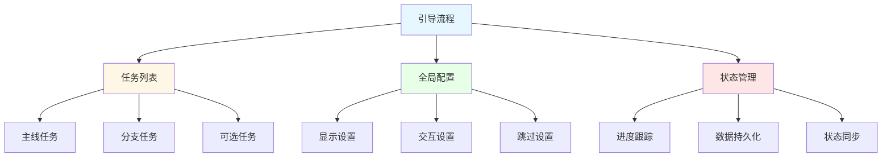
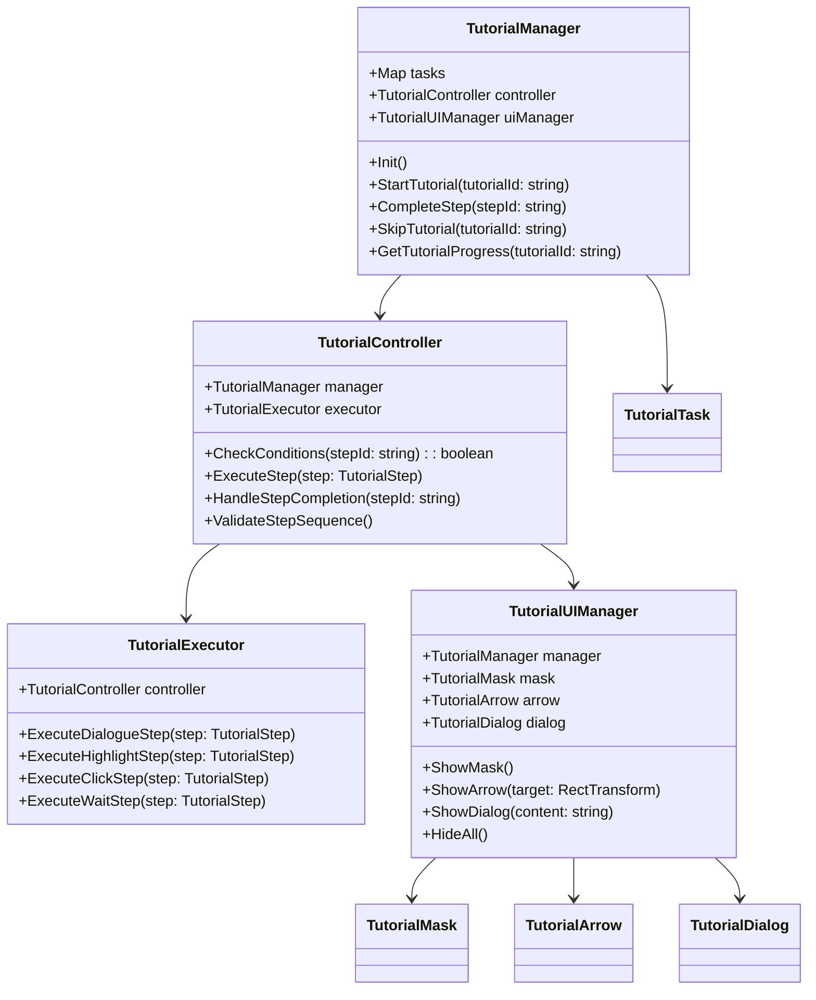
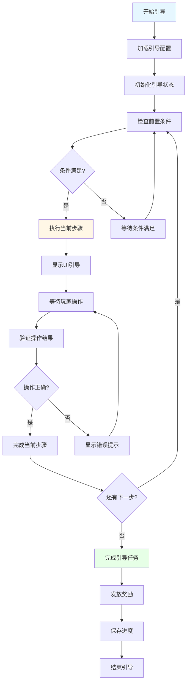

# 新手引导系统设计

## 🎯 系统概述

新手引导系统（Tutorial System）是现代游戏中不可或缺的教学机制，用于帮助新玩家快速掌握游戏的基本操作、理解核心玩法、熟悉游戏界面。通过精心设计的引导流程，可以有效降低玩家流失率，提升游戏体验和用户留存。

## 🏗️ 核心架构模块

### 数据结构设计

#### 引导步骤数据结构

```typescript
interface TutorialStep {
  // 步骤唯一标识
  id: string;
  // 步骤名称
  name: string;
  // 步骤类型
  type: TutorialStepType;
  // 步骤优先级
  priority: number;
  // 前置步骤ID列表
  prerequisites: string[];
  // 步骤条件
  conditions: TutorialCondition[];
  // 步骤动作
  actions: TutorialAction[];
  // 步骤持续时间（秒）
  duration?: number;
  // 是否可跳过
  skippable: boolean;
  // 步骤状态
  status: TutorialStepStatus;
  // 完成时间戳
  completedTime?: number;
}

enum TutorialStepType {
  DIALOGUE = 'dialogue',         // 对话引导
  HIGHLIGHT = 'highlight',       // 高亮引导
  CLICK = 'click',               // 点击引导
  DRAG = 'drag',                 // 拖拽引导
  GESTURE = 'gesture',           // 手势引导
  WAIT = 'wait',                 // 等待引导
  CUSTOM = 'custom'              // 自定义引导
}

enum TutorialStepStatus {
  LOCKED = 'locked',             // 未解锁
  AVAILABLE = 'available',       // 可进行
  IN_PROGRESS = 'in_progress',   // 进行中
  COMPLETED = 'completed',       // 已完成
  SKIPPED = 'skipped'            // 已跳过
}
```

#### 引导任务数据结构

```typescript
interface TutorialTask {
  // 任务唯一标识
  id: string;
  // 任务名称
  name: string;
  // 任务描述
  description: string;
  // 任务类型
  type: TutorialTaskType;
  // 所属引导流程
  tutorialId: string;
  // 任务步骤列表
  steps: string[];
  // 任务奖励
  rewards: TutorialReward[];
  // 任务状态
  status: TutorialTaskStatus;
  // 进度信息
  progress: TutorialProgress;
  // 创建时间
  createdTime: number;
  // 完成时间
  completedTime?: number;
}

enum TutorialTaskType {
  MAIN = 'main',                 // 主线引导
  BRANCH = 'branch',             // 分支引导
  OPTIONAL = 'optional',         // 可选引导
  REPLAY = 'replay'              // 重玩引导
}

interface TutorialProgress {
  currentStep: number;
  totalSteps: number;
  completedSteps: number[];
  startTime: number;
  estimatedTime: number;         // 预估完成时间（秒）
}
```

#### 引导流程数据结构



### 代码架构设计

#### 核心组件架构



#### 引导执行流程



### UI实现思路

#### 引导遮罩系统

```typescript
class TutorialMask {
  private maskImage: Image;
  private highlightArea: RectTransform;
  private maskMaterial: Material;

  // 创建高亮遮罩
  public CreateHighlightMask(targetRect: Rect): void {
    // 创建遮罩材质
    this.maskMaterial = this.CreateMaskMaterial();

    // 设置遮罩大小和位置
    this.SetMaskRect(targetRect);

    // 创建高亮区域
    this.CreateHighlightArea(targetRect);
  }

  // 创建遮罩材质
  private CreateMaskMaterial(): Material {
    const material = new Material(Shader.Find("Custom/TutorialMask"));
    material.SetColor("_MaskColor", new Color(0, 0, 0, 0.7f));
    material.SetColor("_HighlightColor", new Color(1, 1, 1, 0.3f));
    return material;
  }

  // 设置遮罩矩形
  private SetMaskRect(rect: Rect): void {
    this.maskImage.rectTransform.sizeDelta = new Vector2(
      Screen.width,
      Screen.height
    );
    this.maskImage.rectTransform.anchoredPosition = Vector2.zero;
  }

  // 创建高亮区域
  private CreateHighlightArea(rect: Rect): void {
    this.highlightArea = new GameObject("HighlightArea").AddComponent<RectTransform>();
    this.highlightArea.SetParent(this.maskImage.transform);
    this.highlightArea.sizeDelta = new Vector2(rect.width, rect.height);
    this.highlightArea.anchoredPosition = new Vector2(rect.x, rect.y);
  }
}
```

#### 引导箭头系统

```typescript
class TutorialArrow {
  private arrowObject: GameObject;
  private arrowImage: Image;
  private animationController: Animator;

  // 显示引导箭头
  public Show(targetPosition: Vector3, direction: ArrowDirection): void {
    if (!this.arrowObject) {
      this.CreateArrowObject();
    }

    // 设置箭头位置
    this.SetArrowPosition(targetPosition);

    // 设置箭头方向
    this.SetArrowDirection(direction);

    // 播放动画
    this.PlayArrowAnimation();

    this.arrowObject.SetActive(true);
  }

  // 隐藏引导箭头
  public Hide(): void {
    if (this.arrowObject) {
      this.StopAnimation();
      this.arrowObject.SetActive(false);
    }
  }

  // 创建箭头对象
  private CreateArrowObject(): void {
    this.arrowObject = new GameObject("TutorialArrow");
    this.arrowImage = this.arrowObject.AddComponent<Image>();
    this.animationController = this.arrowObject.AddComponent<Animator>();

    // 设置箭头样式
    this.arrowImage.sprite = Resources.Load<Sprite>("UI/Tutorial/Arrow");
    this.arrowImage.SetNativeSize();

    // 设置动画控制器
    const controller = Resources.Load<RuntimeAnimatorController>("Animations/TutorialArrow");
    this.animationController.runtimeAnimatorController = controller;
  }

  // 设置箭头位置
  private SetArrowPosition(position: Vector3): void {
    const screenPoint = Camera.main.WorldToScreenPoint(position);
    const canvasRect = this.GetCanvasRect();

    // 转换为Canvas坐标
    const canvasPos = new Vector2(
      screenPoint.x - canvasRect.width / 2,
      screenPoint.y - canvasRect.height / 2
    );

    this.arrowObject.transform.localPosition = canvasPos;
  }

  // 设置箭头方向
  private SetArrowDirection(direction: ArrowDirection): void {
    const rotation = this.GetDirectionRotation(direction);
    this.arrowObject.transform.rotation = Quaternion.Euler(0, 0, rotation);
  }

  // 获取方向对应的旋转角度
  private GetDirectionRotation(direction: ArrowDirection): number {
    switch (direction) {
      case ArrowDirection.UP: return 0;
      case ArrowDirection.DOWN: return 180;
      case ArrowDirection.LEFT: return 90;
      case ArrowDirection.RIGHT: return -90;
      default: return 0;
    }
  }
}

enum ArrowDirection {
  UP = 'up',
  DOWN = 'down',
  LEFT = 'left',
  RIGHT = 'right'
}
```

#### 引导对话框系统

```typescript
class TutorialDialog {
  private dialogPanel: GameObject;
  private contentText: Text;
  private speakerNameText: Text;
  private speakerImage: Image;
  private continueButton: Button;
  private typingEffect: TypingEffect;

  // 显示对话
  public async ShowDialog(dialogue: TutorialDialogue): Promise<void> {
    this.SetupDialog(dialogue);
    await this.PlayTypingEffect(dialogue.content);
    this.ShowContinueButton();
  }

  // 设置对话内容
  private SetupDialog(dialogue: TutorialDialogue): void {
    if (!this.dialogPanel) {
      this.CreateDialogPanel();
    }

    // 设置说话人信息
    this.speakerNameText.text = dialogue.speakerName;
    if (dialogue.speakerImage) {
      this.speakerImage.sprite = dialogue.speakerImage;
      this.speakerImage.gameObject.SetActive(true);
    } else {
      this.speakerImage.gameObject.SetActive(false);
    }

    // 设置对话位置
    this.SetDialogPosition(dialogue.position);

    this.dialogPanel.SetActive(true);
  }

  // 播放打字效果
  private async PlayTypingEffect(content: string): Promise<void> {
    this.contentText.text = "";
    this.typingEffect = new TypingEffect(this.contentText, content);
    await this.typingEffect.Play();
  }

  // 显示继续按钮
  private ShowContinueButton(): void {
    this.continueButton.gameObject.SetActive(true);
    this.continueButton.onClick.RemoveAllListeners();
    this.continueButton.onClick.AddListener(() => {
      this.OnContinueClicked();
    });
  }

  // 创建对话框面板
  private CreateDialogPanel(): void {
    this.dialogPanel = Instantiate(Resources.Load<GameObject>("UI/Tutorial/DialogPanel"));

    // 获取组件引用
    this.contentText = this.dialogPanel.transform.Find("Content").GetComponent<Text>();
    this.speakerNameText = this.dialogPanel.transform.Find("SpeakerName").GetComponent<Text>();
    this.speakerImage = this.dialogPanel.transform.Find("SpeakerImage").GetComponent<Image>();
    this.continueButton = this.dialogPanel.transform.Find("ContinueButton").GetComponent<Button>();

    // 设置样式
    this.SetupDialogStyle();
  }

  // 设置对话框样式
  private SetupDialogStyle(): void {
    // 设置背景
    const background = this.dialogPanel.GetComponent<Image>();
    background.sprite = Resources.Load<Sprite>("UI/Tutorial/DialogBackground");

    // 设置文字样式
    this.contentText.font = Resources.Load<Font>("Fonts/TutorialFont");
    this.contentText.fontSize = 24;
    this.contentText.color = Color.white;

    // 设置按钮样式
    const buttonImage = this.continueButton.GetComponent<Image>();
    buttonImage.sprite = Resources.Load<Sprite>("UI/Tutorial/ContinueButton");
  }
}

interface TutorialDialogue {
  speakerName: string;
  speakerImage?: Sprite;
  content: string;
  position: DialoguePosition;
  audioClip?: AudioClip;
}

enum DialoguePosition {
  BOTTOM_LEFT = 'bottom_left',
  BOTTOM_RIGHT = 'bottom_right',
  TOP_LEFT = 'top_left',
  TOP_RIGHT = 'top_right',
  CENTER = 'center'
}
```

## 🔧 核心功能实现

### 1. 引导管理器

```typescript
class TutorialManager {
  private tasks: Map<string, TutorialTask> = new Map();
  private currentTask: TutorialTask | null = null;
  private controller: TutorialController;
  private uiManager: TutorialUIManager;
  private persistenceManager: TutorialPersistenceManager;

  // 初始化
  public Init(): void {
    this.controller = new TutorialController(this);
    this.uiManager = new TutorialUIManager(this);
    this.persistenceManager = new TutorialPersistenceManager();

    // 加载引导配置
    this.LoadTutorialConfigs();

    // 恢复引导进度
    this.RestoreTutorialProgress();
  }

  // 开始引导任务
  public StartTutorial(tutorialId: string): void {
    const task = this.tasks.get(tutorialId);
    if (!task || task.status !== TutorialTaskStatus.AVAILABLE) {
      return;
    }

    this.currentTask = task;
    task.status = TutorialTaskStatus.IN_PROGRESS;
    task.progress.startTime = Date.now();

    // 开始执行第一个步骤
    this.controller.StartTask(task);

    // 通知UI更新
    this.uiManager.OnTutorialStarted(task);
  }

  // 完成步骤
  public CompleteStep(stepId: string): void {
    if (!this.currentTask) return;

    const stepIndex = this.currentTask.steps.indexOf(stepId);
    if (stepIndex === -1) return;

    // 标记步骤完成
    this.currentTask.progress.completedSteps.push(stepId);
    this.currentTask.progress.currentStep = stepIndex + 1;

    // 检查任务是否完成
    if (this.IsTaskCompleted(this.currentTask)) {
      this.CompleteTutorial(this.currentTask);
    } else {
      // 执行下一步
      this.controller.ExecuteNextStep(this.currentTask);
    }

    // 保存进度
    this.persistenceManager.SaveProgress(this.currentTask);
  }

  // 跳过引导
  public SkipTutorial(tutorialId: string): void {
    const task = this.tasks.get(tutorialId);
    if (!task) return;

    task.status = TutorialTaskStatus.SKIPPED;

    // 隐藏所有UI
    this.uiManager.HideAll();

    // 发放跳过奖励（如果有）
    this.GrantSkipRewards(task);

    // 保存状态
    this.persistenceManager.SaveTutorialState(task);
  }

  // 检查任务是否完成
  private IsTaskCompleted(task: TutorialTask): boolean {
    return task.progress.completedSteps.length === task.steps.length;
  }

  // 完成引导任务
  private CompleteTutorial(task: TutorialTask): void {
    task.status = TutorialTaskStatus.COMPLETED;
    task.completedTime = Date.now();

    // 发放奖励
    this.GrantRewards(task);

    // 解锁后续任务
    this.UnlockNextTasks(task);

    // 通知UI
    this.uiManager.OnTutorialCompleted(task);

    // 统计分析
    this.AnalyticsTrackCompletion(task);

    this.currentTask = null;
  }
}
```

### 2. 引导控制器

```typescript
class TutorialController {
  private manager: TutorialManager;
  private executor: TutorialExecutor;
  private currentStep: TutorialStep | null = null;

  // 开始任务
  public StartTask(task: TutorialTask): void {
    if (task.steps.length === 0) return;

    const firstStepId = task.steps[0];
    this.ExecuteStep(firstStepId);
  }

  // 执行步骤
  public ExecuteStep(stepId: string): void {
    const step = this.GetStepById(stepId);
    if (!step) return;

    // 检查前置条件
    if (!this.CheckPrerequisites(step)) {
      return;
    }

    this.currentStep = step;
    step.status = TutorialStepStatus.IN_PROGRESS;

    // 执行步骤
    this.executor.ExecuteStep(step);
  }

  // 执行下一步
  public ExecuteNextStep(task: TutorialTask): void {
    const currentIndex = task.steps.indexOf(this.currentStep!.id);
    if (currentIndex === -1 || currentIndex >= task.steps.length - 1) {
      return;
    }

    const nextStepId = task.steps[currentIndex + 1];
    this.ExecuteStep(nextStepId);
  }

  // 完成步骤
  public CompleteCurrentStep(): void {
    if (!this.currentStep) return;

    this.currentStep.status = TutorialStepStatus.COMPLETED;
    this.currentStep.completedTime = Date.now();

    // 通知管理器
    this.manager.CompleteStep(this.currentStep.id);

    this.currentStep = null;
  }

  // 检查前置条件
  private CheckPrerequisites(step: TutorialStep): boolean {
    for (const prereqId of step.prerequisites) {
      const prereqStep = this.GetStepById(prereqId);
      if (!prereqStep || prereqStep.status !== TutorialStepStatus.COMPLETED) {
        return false;
      }
    }
    return true;
  }

  // 获取步骤
  private GetStepById(stepId: string): TutorialStep | null {
    // 从配置中获取步骤
    return TutorialConfigManager.Instance.GetStep(stepId);
  }
}
```

### 3. 引导执行器

```typescript
class TutorialExecutor {
  private controller: TutorialController;
  private uiManager: TutorialUIManager;

  // 执行步骤
  public ExecuteStep(step: TutorialStep): void {
    switch (step.type) {
      case TutorialStepType.DIALOGUE:
        this.ExecuteDialogueStep(step);
        break;
      case TutorialStepType.HIGHLIGHT:
        this.ExecuteHighlightStep(step);
        break;
      case TutorialStepType.CLICK:
        this.ExecuteClickStep(step);
        break;
      case TutorialStepType.WAIT:
        this.ExecuteWaitStep(step);
        break;
      default:
        this.ExecuteCustomStep(step);
        break;
    }
  }

  // 执行对话步骤
  private async ExecuteDialogueStep(step: TutorialStep): Promise<void> {
    const dialogue = step.actions[0] as TutorialDialogue;

    // 显示对话框
    await this.uiManager.ShowDialog(dialogue);

    // 等待玩家点击继续
    await this.WaitForContinue();

    // 完成步骤
    this.controller.CompleteCurrentStep();
  }

  // 执行高亮步骤
  private ExecuteHighlightStep(step: TutorialStep): void {
    const highlightAction = step.actions[0] as TutorialHighlightAction;

    // 获取目标对象
    const targetObject = this.FindTargetObject(highlightAction.targetPath);

    // 显示高亮遮罩
    this.uiManager.ShowHighlight(targetObject);

    // 设置点击监听
    this.SetupTargetClickListener(targetObject, step);
  }

  // 执行点击步骤
  private ExecuteClickStep(step: TutorialStep): void {
    const clickAction = step.actions[0] as TutorialClickAction;

    // 获取目标对象
    const targetObject = this.FindTargetObject(clickAction.targetPath);

    // 显示点击引导
    this.uiManager.ShowClickGuide(targetObject);

    // 监听点击事件
    const clickHandler = () => {
      this.OnTargetClicked(step);
    };

    // 添加事件监听
    this.AddClickListener(targetObject, clickHandler);
  }

  // 执行等待步骤
  private async ExecuteWaitStep(step: TutorialStep): Promise<void> {
    const waitAction = step.actions[0] as TutorialWaitAction;

    // 显示等待提示
    this.uiManager.ShowWaitIndicator(waitAction.message);

    // 等待指定时间或条件
    if (waitAction.duration) {
      await this.WaitForDuration(waitAction.duration);
    } else if (waitAction.condition) {
      await this.WaitForCondition(waitAction.condition);
    }

    // 完成步骤
    this.controller.CompleteCurrentStep();
  }

  // 查找目标对象
  private FindTargetObject(path: string): GameObject {
    // 支持多种寻址方式
    if (path.startsWith("/")) {
      // 绝对路径
      return GameObject.Find(path);
    } else if (path.startsWith("@")) {
      // 组件查找
      return this.FindByComponent(path.substring(1));
    } else {
      // 相对路径
      return GameObject.Find(path);
    }
  }

  // 目标点击处理
  private OnTargetClicked(step: TutorialStep): void {
    // 验证点击是否正确
    if (this.ValidateClick(step)) {
      this.controller.CompleteCurrentStep();
    } else {
      // 显示错误提示
      this.uiManager.ShowErrorMessage("请点击正确的位置");
    }
  }

  // 验证点击
  private ValidateClick(step: TutorialStep): boolean {
    // 根据步骤配置验证点击
    const clickAction = step.actions[0] as TutorialClickAction;
    return clickAction.validation?.() ?? true;
  }
}
```

## 🎨 UI组件设计

### 引导遮罩组件

```typescript
class TutorialMaskComponent extends MonoBehaviour {
  [SerializeField] private Image maskImage;
  [SerializeField] private RectTransform highlightArea;
  [SerializeField] private float fadeDuration = 0.3f;

  private Material maskMaterial;
  private Coroutine fadeCoroutine;

  void Awake() {
    this.InitializeMask();
  }

  // 初始化遮罩
  private void InitializeMask() {
    this.maskMaterial = new Material(Shader.Find("UI/TutorialMask"));
    this.maskImage.material = this.maskMaterial;

    // 设置默认参数
    this.maskMaterial.SetColor("_MaskColor", new Color(0, 0, 0, 0.8f));
    this.maskMaterial.SetFloat("_HighlightStrength", 0.3f);
  }

  // 显示高亮区域
  public void ShowHighlight(Rect targetRect, bool animate = true) {
    this.gameObject.SetActive(true);

    if (animate) {
      this.AnimateToRect(targetRect);
    } else {
      this.SetHighlightRect(targetRect);
    }
  }

  // 隐藏遮罩
  public void Hide(bool animate = true) {
    if (animate) {
      this.StartFadeOut();
    } else {
      this.gameObject.SetActive(false);
    }
  }

  // 设置高亮矩形
  private void SetHighlightRect(Rect rect) {
    this.highlightArea.sizeDelta = new Vector2(rect.width, rect.height);
    this.highlightArea.anchoredPosition = new Vector2(rect.x, rect.y);
  }

  // 动画过渡到目标矩形
  private void AnimateToRect(Rect targetRect) {
    if (this.fadeCoroutine != null) {
      this.StopCoroutine(this.fadeCoroutine);
    }

    this.fadeCoroutine = this.StartCoroutine(this.AnimateHighlight(targetRect));
  }

  private IEnumerator AnimateHighlight(Rect targetRect) {
    const startSize = this.highlightArea.sizeDelta;
    const startPos = this.highlightArea.anchoredPosition;
    const targetSize = new Vector2(targetRect.width, targetRect.height);
    const targetPos = new Vector2(targetRect.x, targetRect.y);

    float elapsed = 0f;

    while (elapsed < this.fadeDuration) {
      elapsed += Time.deltaTime;
      const t = elapsed / this.fadeDuration;

      this.highlightArea.sizeDelta = Vector2.Lerp(startSize, targetSize, t);
      this.highlightArea.anchoredPosition = Vector2.Lerp(startPos, targetPos, t);

      yield return null;
    }

    this.SetHighlightRect(targetRect);
  }

  // 开始淡出
  private void StartFadeOut() {
    if (this.fadeCoroutine != null) {
      this.StopCoroutine(this.fadeCoroutine);
    }

    this.fadeCoroutine = this.StartCoroutine(this.FadeOut());
  }

  private IEnumerator FadeOut() {
    const startAlpha = this.maskImage.color.a;
    float elapsed = 0f;

    while (elapsed < this.fadeDuration) {
      elapsed += Time.deltaTime;
      const t = elapsed / this.fadeDuration;
      const alpha = Mathf.Lerp(startAlpha, 0f, t);

      const color = this.maskImage.color;
      color.a = alpha;
      this.maskImage.color = color;

      yield return null;
    }

    this.gameObject.SetActive(false);
  }
}
```

### 引导箭头组件

```typescript
class TutorialArrowComponent extends MonoBehaviour {
  [SerializeField] private Image arrowImage;
  [SerializeField] private Animator animator;
  [SerializeField] private float bobAmount = 10f;
  [SerializeField] private float bobSpeed = 2f;

  private Vector3 originalPosition;
  private Coroutine bobCoroutine;

  void Awake() {
    this.originalPosition = this.transform.localPosition;
  }

  // 显示箭头
  public void Show(Vector3 worldPosition, ArrowDirection direction) {
    // 转换世界坐标到屏幕坐标
    const screenPoint = Camera.main.WorldToScreenPoint(worldPosition);
    const canvasPos = this.ConvertToCanvasPosition(screenPoint);

    this.transform.localPosition = canvasPos;
    this.SetDirection(direction);

    // 开始上下浮动动画
    this.StartBobAnimation();

    this.gameObject.SetActive(true);
  }

  // 隐藏箭头
  public void Hide() {
    if (this.bobCoroutine != null) {
      this.StopCoroutine(this.bobCoroutine);
    }

    this.gameObject.SetActive(false);
    this.transform.localPosition = this.originalPosition;
  }

  // 设置方向
  private void SetDirection(ArrowDirection direction) {
    float rotation = 0f;

    switch (direction) {
      case ArrowDirection.UP:
        rotation = 0f;
        break;
      case ArrowDirection.DOWN:
        rotation = 180f;
        break;
      case ArrowDirection.LEFT:
        rotation = 90f;
        break;
      case ArrowDirection.RIGHT:
        rotation = -90f;
        break;
    }

    this.transform.rotation = Quaternion.Euler(0f, 0f, rotation);
  }

  // 转换到Canvas坐标
  private Vector2 ConvertToCanvasPosition(Vector3 screenPoint) {
    const canvas = this.GetComponentInParent<Canvas>();
    const canvasRect = canvas.GetComponent<RectTransform>();

    const canvasSize = canvasRect.sizeDelta;
    return new Vector2(
      screenPoint.x - canvasSize.x / 2,
      screenPoint.y - canvasSize.y / 2
    );
  }

  // 开始上下浮动动画
  private void StartBobAnimation() {
    if (this.bobCoroutine != null) {
      this.StopCoroutine(this.bobCoroutine);
    }

    this.bobCoroutine = this.StartCoroutine(this.BobAnimation());
  }

  private IEnumerator BobAnimation() {
    while (true) {
      const bobOffset = Mathf.Sin(Time.time * this.bobSpeed) * this.bobAmount;
      this.transform.localPosition = this.originalPosition + new Vector3(0f, bobOffset, 0f);

      yield return null;
    }
  }
}
```

## 🚀 高级功能

### 1. 引导条件系统

```typescript
interface TutorialCondition {
  type: ConditionType;
  key: string;
  operator: ConditionOperator;
  value: any;
  description: string;
}

enum ConditionType {
  GAME_STATE = 'game_state',     // 游戏状态
  PLAYER_LEVEL = 'player_level', // 玩家等级
  ITEM_COUNT = 'item_count',     // 物品数量
  QUEST_STATUS = 'quest_status', // 任务状态
  UI_VISIBLE = 'ui_visible',     // UI可见性
  CUSTOM = 'custom'              // 自定义条件
}

class TutorialConditionEvaluator {
  // 评估条件
  public EvaluateCondition(condition: TutorialCondition): boolean {
    switch (condition.type) {
      case ConditionType.GAME_STATE:
        return this.EvaluateGameState(condition);
      case ConditionType.PLAYER_LEVEL:
        return this.EvaluatePlayerLevel(condition);
      case ConditionType.ITEM_COUNT:
        return this.EvaluateItemCount(condition);
      case ConditionType.QUEST_STATUS:
        return this.EvaluateQuestStatus(condition);
      case ConditionType.UI_VISIBLE:
        return this.EvaluateUIVisible(condition);
      case ConditionType.CUSTOM:
        return this.EvaluateCustom(condition);
      default:
        return false;
    }
  }

  private EvaluateGameState(condition: TutorialCondition): boolean {
    const currentState = GameStateManager.Instance.GetCurrentState();
    return this.CompareValues(currentState, condition.operator, condition.value);
  }

  private EvaluatePlayerLevel(condition: TutorialCondition): boolean {
    const playerLevel = PlayerManager.Instance.GetLevel();
    return this.CompareValues(playerLevel, condition.operator, condition.value);
  }

  private EvaluateItemCount(condition: TutorialCondition): boolean {
    const itemCount = InventoryManager.Instance.GetItemCount(condition.key);
    return this.CompareValues(itemCount, condition.operator, condition.value);
  }

  private CompareValues(left: any, operator: ConditionOperator, right: any): boolean {
    switch (operator) {
      case ConditionOperator.EQUAL:
        return left === right;
      case ConditionOperator.NOT_EQUAL:
        return left !== right;
      case ConditionOperator.GREATER:
        return left > right;
      case ConditionOperator.GREATER_EQUAL:
        return left >= right;
      case ConditionOperator.LESS:
        return left < right;
      case ConditionOperator.LESS_EQUAL:
        return left <= right;
      default:
        return false;
    }
  }
}
```

### 2. 引导数据持久化

```typescript
class TutorialPersistenceManager {
  private readonly SAVE_KEY = "tutorial_progress";
  private saveData: TutorialSaveData;

  // 保存引导进度
  public SaveProgress(task: TutorialTask): void {
    this.loadSaveData();

    const taskProgress: TaskProgress = {
      taskId: task.id,
      status: task.status,
      currentStep: task.progress.currentStep,
      completedSteps: task.progress.completedSteps,
      startTime: task.progress.startTime,
      completedTime: task.completedTime
    };

    this.saveData.taskProgress[task.id] = taskProgress;
    this.saveData.lastSaveTime = Date.now();

    this.SaveToStorage();
  }

  // 加载引导进度
  public LoadProgress(): Map<string, TaskProgress> {
    this.loadSaveData();
    return new Map(Object.entries(this.saveData.taskProgress));
  }

  // 保存教程状态
  public SaveTutorialState(task: TutorialTask): void {
    this.loadSaveData();

    const taskState: TaskState = {
      taskId: task.id,
      status: task.status,
      completedTime: task.completedTime
    };

    this.saveData.taskStates[task.id] = taskState;
    this.SaveToStorage();
  }

  // 加载教程状态
  public LoadTutorialStates(): Map<string, TaskState> {
    this.loadSaveData();
    return new Map(Object.entries(this.saveData.taskStates));
  }

  // 加载保存数据
  private loadSaveData(): void {
    if (this.saveData) return;

    const saveString = PlayerPrefs.GetString(this.SAVE_KEY, "");
    if (string.IsNullOrEmpty(saveString)) {
      this.saveData = this.CreateDefaultSaveData();
    } else {
      try {
        this.saveData = JsonUtility.FromJson<TutorialSaveData>(saveString);

        // 版本兼容性检查
        if (this.saveData.version !== "1.0") {
          this.MigrateSaveData();
        }
      } catch (Exception e) {
        Debug.LogError($"Failed to load tutorial save data: {e.Message}");
        this.saveData = this.CreateDefaultSaveData();
      }
    }
  }

  // 保存到存储
  private void SaveToStorage(): void {
    const saveString = JsonUtility.ToJson(this.saveData);
    PlayerPrefs.SetString(this.SAVE_KEY, saveString);
    PlayerPrefs.Save();
  }

  // 创建默认保存数据
  private TutorialSaveData CreateDefaultSaveData(): TutorialSaveData {
    return {
      version: "1.0",
      taskProgress: {},
      taskStates: {},
      lastSaveTime: Date.now()
    };
  }

  // 数据迁移
  private void MigrateSaveData(): void {
    // 处理版本升级时的兼容性
    if (this.saveData.version === "0.9") {
      // 从0.9版本迁移到1.0的逻辑
      // ...
    }
  }
}

interface TutorialSaveData {
  version: string;
  taskProgress: { [key: string]: TaskProgress };
  taskStates: { [key: string]: TaskState };
  lastSaveTime: number;
}

interface TaskProgress {
  taskId: string;
  status: TutorialTaskStatus;
  currentStep: number;
  completedSteps: string[];
  startTime: number;
  completedTime?: number;
}

interface TaskState {
  taskId: string;
  status: TutorialTaskStatus;
  completedTime?: number;
}
```

### 3. 引导统计分析

```typescript
class TutorialAnalytics {
  // 跟踪引导开始
  public TrackTutorialStart(tutorialId: string, taskId: string): void {
    AnalyticsManager.TrackEvent("tutorial_start", {
      tutorial_id: tutorialId,
      task_id: taskId,
      timestamp: Date.now(),
      player_level: PlayerManager.Instance.GetLevel(),
      session_count: SessionManager.Instance.GetSessionCount()
    });
  }

  // 跟踪步骤完成
  public TrackStepComplete(stepId: string, tutorialId: string, duration: number): void {
    AnalyticsManager.TrackEvent("tutorial_step_complete", {
      step_id: stepId,
      tutorial_id: tutorialId,
      duration: duration,
      timestamp: Date.now()
    });
  }

  // 跟踪引导完成
  public TrackTutorialComplete(tutorialId: string, taskId: string, totalDuration: number): void {
    AnalyticsManager.TrackEvent("tutorial_complete", {
      tutorial_id: tutorialId,
      task_id: taskId,
      total_duration: totalDuration,
      completion_rate: this.CalculateCompletionRate(taskId),
      timestamp: Date.now()
    });
  }

  // 跟踪引导跳过
  public TrackTutorialSkip(tutorialId: string, taskId: string, skipStep: number): void {
    AnalyticsManager.TrackEvent("tutorial_skip", {
      tutorial_id: tutorialId,
      task_id: taskId,
      skip_step: skipStep,
      timestamp: Date.now()
    });
  }

  // 跟踪引导失败
  public TrackTutorialFail(tutorialId: string, taskId: string, failReason: string): void {
    AnalyticsManager.TrackEvent("tutorial_fail", {
      tutorial_id: tutorialId,
      task_id: taskId,
      fail_reason: failReason,
      timestamp: Date.now()
    });
  }

  // 计算完成率
  private float CalculateCompletionRate(taskId: string): float {
    const task = TutorialManager.Instance.GetTask(taskId);
    if (!task) return 0f;

    return (float)task.progress.completedSteps.Count / task.steps.Count;
  }

  // 生成引导报告
  public TutorialReport GenerateReport(tutorialId: string): TutorialReport {
    const task = TutorialManager.Instance.GetTask(tutorialId);
    if (!task) return null;

    return {
      tutorialId: tutorialId,
      taskId: task.id,
      status: task.status,
      completionRate: this.CalculateCompletionRate(tutorialId),
      totalDuration: task.completedTime - task.progress.startTime,
      averageStepDuration: this.CalculateAverageStepDuration(task),
      skipCount: task.status === TutorialTaskStatus.SKIPPED ? 1 : 0,
      retryCount: 0 // 可以从历史记录中获取
    };
  }

  // 计算平均步骤时长
  private float CalculateAverageStepDuration(task: TutorialTask): float {
    if (task.progress.completedSteps.Count === 0) return 0f;

    // 这里需要更复杂的逻辑来计算每个步骤的时长
    // 简化为总时长除以步骤数
    const totalDuration = task.completedTime - task.progress.startTime;
    return totalDuration / task.steps.Count;
  }
}

interface TutorialReport {
  tutorialId: string;
  taskId: string;
  status: TutorialTaskStatus;
  completionRate: number;
  totalDuration: number;
  averageStepDuration: number;
  skipCount: number;
  retryCount: number;
}
```

## 🎯 最佳实践

### 1. 设计原则
- **渐进式引导**：从简单到复杂，循序渐进
- **及时反馈**：操作后立即给予反馈
- **容错性强**：允许玩家犯错并引导纠正
- **个性化**：根据玩家行为调整引导内容
- **非侵入性**：不影响正常游戏体验

### 2. 引导类型选择
- **强制引导**：核心玩法必须掌握的内容
- **可选引导**：锦上添花的进阶内容
- **情境引导**：特定情况下触发的引导
- **成就引导**：通过成就系统引导探索

### 3. UI设计要点
- **视觉层次清晰**：引导元素要突出但不喧宾夺主
- **动画流畅自然**：过渡动画要平滑舒适
- **响应式设计**：适应不同屏幕尺寸和分辨率
- **无障碍设计**：考虑色盲、视力障碍等特殊需求

### 4. 数据驱动设计
- **配置化管理**：引导内容通过配置管理
- **A/B测试支持**：支持不同版本的引导对比
- **动态调整**：根据玩家反馈调整引导策略
- **版本兼容**：处理游戏版本更新时的兼容性

---

*本文档提供了完整的新手引导系统设计方案，包含数据结构、代码架构、UI实现思路以及高级功能。在实际项目中可根据具体需求进行调整和优化。*
