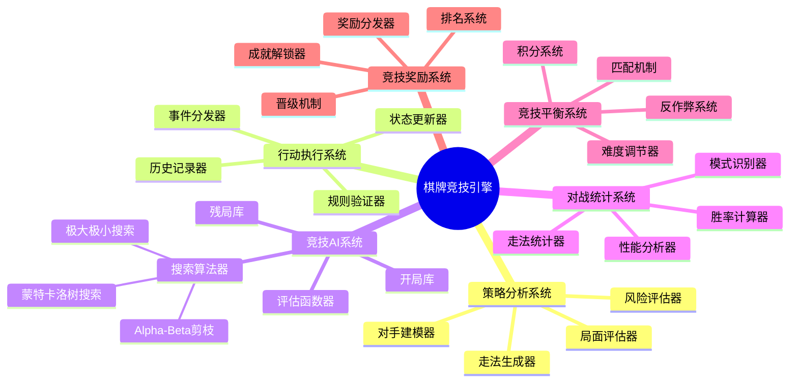
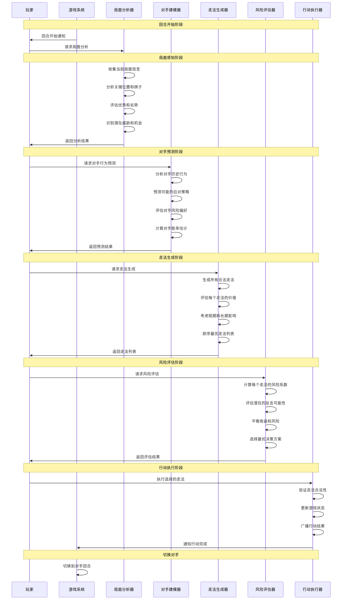
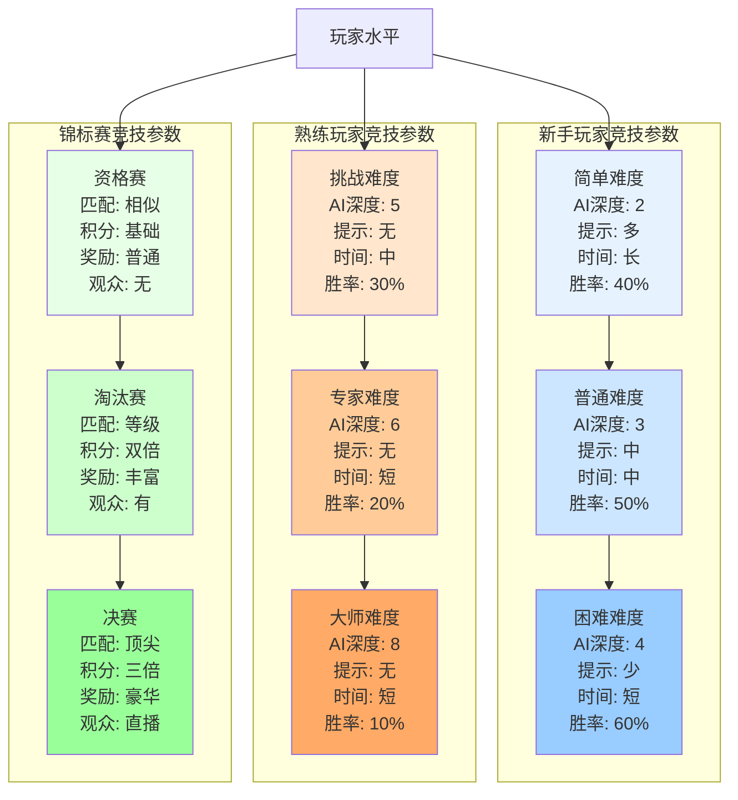
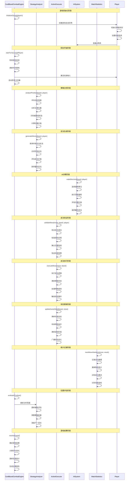

# 棋牌类游戏架构设计

## 🎯 游戏概述

棋牌类游戏是一类基于规则的策略游戏，包括纸牌游戏（扑克、桥牌、斗地主）和棋盘游戏（象棋、围棋、五子棋、国际象棋）。核心玩法围绕规则理解、策略思考、概率计算展开。代表作品包括《Texas Hold'em》、《麻将》、《象棋》等。

## 🏗️ 核心架构模块

### 0. 核心战斗模块 (Combat System)

#### 棋牌竞技模式架构图
```
┌─────────────────────────────────────────────────────────────┐
│                   棋牌竞技系统架构                            │
├─────────────────────────────────────────────────────────────┤
│                                                             │
│  ┌─────────────┐    ┌─────────────┐    ┌─────────────┐     │
│  │  策略思考    │ -> │  行动执行    │ -> │  结果评估    │     │
│  │             │    │             │    │             │     │
│  │ • 局面分析   │    │ • 走法选择   │    │ • 胜率计算   │     │
│  │ • 对手预测   │    │ • 规则验证   │    │ • 局势判断   │     │
│  │ • 风险评估   │    │ • 状态更新   │    │ • 策略调整   │     │
│  └─────────────┘    └─────────────┘    └─────────────┘     │
│                                                             │
└─────────────────────────────────────────────────────────────┘
         ▲                        ▲                        │
         │                        │                        │
         └────────────────────────┼────────────────────────┘
                                  ▼
                    ┌─────────────────────┐
                    │     竞技结算系统      │
                    │                     │
                    │ • 胜负判定          │
                    │ • 积分计算          │
                    │ • 排名更新          │
                    │ • 成就解锁          │
                    └─────────────────────┘
```

#### 棋牌竞技系统核心组件



#### 竞技状态机架构图

```mermaid
stateDiagram-v2
    [*] --> InitializationState
    InitializationState --> ThinkingState
    ThinkingState --> ActionState
    ActionState --> EvaluationState
    EvaluationState --> ThinkingState
    EvaluationState --> EndState
    ThinkingState --> PauseState
    PauseState --> ThinkingState
    ActionState --> InterruptState
    InterruptState --> [*]

    note right of ThinkingState : 玩家思考过程
    note right of ActionState : 执行选定的走法
    note right of EvaluationState : 评估行动结果
    note right of PauseState : 处理暂停和超时

    state "初始化状态" as I
    state "游戏规则加载" as GRL
    state "玩家匹配" as PM
    state "初始局面设置" as IPS
    state "计时器启动" as TS

    I --> GRL
    I --> PM
    I --> IPS
    I --> TS

    state "思考状态" as T
    state "局面分析" as PA
    state "走法枚举" as ME
    state "对手行为预测" as OBP
    state "风险收益评估" as RRA
    state "最优走法选择" as OMS

    T --> PA
    T --> ME
    T --> OBP
    T --> RRA
    T --> OMS

    state "行动状态" as A
    state "走法验证" as MV
    state "规则合规检查" as RCC
    state "行动执行" as AE
    state "状态更新" as SU
    state "历史记录" as HR

    A --> MV
    A --> RCC
    A --> AE
    A --> SU
    A --> HR

    state "评估状态" as E
    state "局面重新评估" as PRE
    state "胜率重新计算" as WRR
    state "策略有效性验证" as SEV
    state "学习数据收集" as LDC
    state "模式识别更新" as PRU

    E --> PRE
    E --> WRR
    E --> SEV
    E --> LDC
    E --> PRU

    state "暂停状态" as P
    state "思考时间管理" as TTM
    state "超时处理" as TOH
    state "暂停请求处理" as PRH
    state "恢复机制" as RM

    P --> TTM
    P --> TOH
    P --> PRH
    P --> RM

    state "结束状态" as ES
    state "胜负判定" as WLD
    state "最终局面分析" as FPA
    state "统计数据生成" as SG
    state "经验值分配" as ED
    state "下一局准备" as NGP

    ES --> WLD
    ES --> FPA
    ES --> SG
    ES --> ED
    ES --> NGP

    state "中断状态" as IS
    state "异常情况处理" as EH
    state "连接断开处理" as DH
    state "数据恢复机制" as DRM
    state "公平性保障" as FG

    IS --> EH
    IS --> DH
    IS --> DRM
    IS --> FG
```



#### 决策流程时序图



#### 竞技平衡性参数矩阵图



#### 战斗平衡性参数
```typescript
interface CardBoardCombatConfig {
  // AI算法参数
  aiSearchDepth: number;            // AI搜索深度
  aiThinkingTime: number;           // AI思考时间 (秒)
  aiEvaluationWeight: number;       // AI评估权重
  aiRandomnessFactor: number;       // AI随机性因子

  // 竞技平衡参数
  playerRatingAdjustment: number;   // 玩家评分调整
  matchMakingRange: number;         // 匹配范围
  winRateTarget: number;           // 目标胜率
  difficultyScalingFactor: number;  // 难度缩放因子

  // 时间控制参数
  baseTurnTime: number;            // 基础回合时间
  timeBonusPerMove: number;        // 每步时间奖励
  timePenaltyPerTimeout: number;   // 超时惩罚
  maximumGameTime: number;         // 最大游戏时间

  // 奖励系统参数
  baseExperienceReward: number;    // 基础经验奖励
  ratingChangeMultiplier: number;  // 评分变化倍率
  achievementUnlockThreshold: number; // 成就解锁阈值
  tournamentBonusMultiplier: number;  // 锦标赛奖励倍率

  // 反作弊参数
  moveValidationStrictness: number; // 走法验证严格程度
  timingAnomalyThreshold: number;   // 时间异常阈值
  patternDetectionSensitivity: number; // 模式检测灵敏度
}
```

#### 棋牌竞技系统类图

```mermaid
classDiagram
    class CardBoardCombatEngine {
        -GameSession gameSession
        -StrategyAnalyzer strategyAnalyzer
        -ActionExecutor actionExecutor
        -AISystem aiSystem
        -MatchStatistics matchStatistics
        +initializeGame(players): GameSession
        +startTurn(currentPlayer): TurnResult
        +executeMove(move): MoveResult
        +evaluatePosition(): PositionEvaluation
        +resolveGame(): GameResult
    }

    class StrategyAnalyzer {
        -PositionEvaluator positionEvaluator
        -MoveGenerator moveGenerator
        -OpponentModeler opponentModeler
        -RiskAssessor riskAssessor
        +analyzePosition(board, player): PositionAnalysis
        +generateMoves(board, player): List<Move>
        +predictOpponentMove(board, opponent): Move
        +assessRisk(move, board): RiskAssessment
        +recommendBestMove(board, player): Move
    }

    class ActionExecutor {
        -RuleValidator ruleValidator
        -StateUpdater stateUpdater
        -HistoryRecorder historyRecorder
        -EventDispatcher eventDispatcher
        +validateMove(move, board, player): ValidationResult
        +executeMove(move, board): ExecutionResult
        +updateGameState(board, move): StateUpdate
        +recordHistory(move, board): HistoryEntry
        +dispatchEvents(events): void
    }

    class AISystem {
        -SearchAlgorithm searchAlgorithm
        -EvaluationFunction evaluationFunction
        -OpeningBook openingBook
        -EndgameDatabase endgameDatabase
        +makeDecision(board, player): Move
        +searchBestMove(board, depth): SearchResult
        +evaluatePosition(board, player): number
        +getOpeningMove(board): Move
        +getEndgameMove(board): Move
    }

    class MatchStatistics {
        -WinRateCalculator winRateCalculator
        -MoveStatistics moveStatistics
        -PatternRecognizer patternRecognizer
        -PerformanceAnalyzer performanceAnalyzer
        +calculateWinRate(player, opponent): number
        +trackMoveStatistics(move, result): void
        +recognizePatterns(board): List<Pattern>
        +analyzePerformance(player): PerformanceReport
        +generateStatisticsReport(): StatisticsReport
    }

    class Player {
        -string id
        -string name
        -number rating
        -number gamesPlayed
        -number gamesWon
        -number winRate
        -PlayStyle preferredStyle
        +makeMove(board): Move
        +evaluatePosition(board): number
        +updateRating(result, opponentRating): number
        +getPlayerStatistics(): PlayerStats
        +isHuman(): boolean
    }

    class HumanPlayer {
        <<用户输入>>
        <<手动操作>>
        <<UI交互>>
    }

    class AIPlayer {
        <<算法决策>>
        <<自动计算>>
        <<策略分析>>
    }

    CardBoardCombatEngine --> StrategyAnalyzer : 组合
    CardBoardCombatEngine --> ActionExecutor : 组合
    CardBoardCombatEngine --> AISystem : 组合
    CardBoardCombatEngine --> MatchStatistics : 组合
    Player <|-- HumanPlayer : 继承
    Player <|-- AIPlayer : 继承

    class Board {
        -number width
        -number height
        -Cell[][] cells
        -Player currentPlayer
        -GameState gameState
        -List<Move> moveHistory
        +makeMove(move): MoveResult
        +isValidMove(move): boolean
        +getPossibleMoves(): List<Move>
        +evaluatePosition(): number
        +checkWinCondition(): WinResult
        +getBoardState(): BoardState
    }

    class ChessBoard {
        <<8x8网格>>
        <<多种棋子>>
        <<西方规则>>
    }

    class XiangqiBoard {
        <<9x10网格>>
        <<中式棋子>>
        <<中国规则>>
    }

    class Move {
        -Player player
        -Position fromPosition
        -Position toPosition
        -Piece piece
        -Piece capturedPiece
        -MoveType moveType
        +execute(board): MoveResult
        +undo(board): void
        +isValid(board): boolean
        +getNotation(): string
        +getValue(): number
    }

    Board <|-- ChessBoard : 继承
    Board <|-- XiangqiBoard : 继承

    class StandardMove {
        <<普通移动>>
        <<标准吃子>>
        <<基本规则>>
    }

    class SpecialMove {
        <<特殊规则>>
        <<王车易位>>
        <<兵升变>>
    }

    Move <|-- StandardMove : 继承
    Move <|-- SpecialMove : 继承
```



#### 棋牌竞技系统时序图



### 1. 游戏规则引擎 (Game Rule Engine)

#### 规则配置系统
```typescript
interface GameRule {
  id: string;
  name: string;
  type: GameType;
  playerCount: { min: number; max: number };
  deckConfig: DeckConfig;
  scoringRules: ScoringRule[];
  winConditions: WinCondition[];
  specialRules: SpecialRule[];
}

enum GameType {
  CARD_GAME = 'card_game',      // 纸牌游戏
  BOARD_GAME = 'board_game',    // 棋盘游戏
  TILE_GAME = 'tile_game',      // 麻将等牌类游戏
  DOMINO_GAME = 'domino_game'   // 多米诺骨牌
}

interface DeckConfig {
  cardCount: number;
  cardTypes: CardType[];
  shuffleMethod: ShuffleMethod;
  dealMethod: DealMethod;
}

interface ScoringRule {
  condition: string;        // 得分条件
  points: number;          // 分数值
  multiplier?: number;     // 倍率
  isBonus?: boolean;       // 是否为奖励分
}
```

#### 规则执行引擎
```typescript
class RuleEngine {
  private rules: GameRule;
  private gameState: GameState;

  constructor(rules: GameRule) {
    this.rules = rules;
    this.gameState = new GameState();
  }

  // 验证行动是否合法
  validateAction(action: GameAction, player: Player): ValidationResult {
    // 检查行动类型
    if (!this.isValidActionType(action.type)) {
      return { valid: false, reason: 'invalid_action_type' };
    }

    // 检查玩家状态
    if (!this.canPlayerAct(player)) {
      return { valid: false, reason: 'player_cannot_act' };
    }

    // 检查游戏状态
    if (!this.isValidGameState(action)) {
      return { valid: false, reason: 'invalid_game_state' };
    }

    // 检查具体规则
    return this.validateSpecificRules(action, player);
  }

  // 执行行动
  async executeAction(action: GameAction): Promise<ActionResult> {
    // 预执行检查
    const validation = this.validateAction(action, action.player);
    if (!validation.valid) {
      return { success: false, error: validation.reason };
    }

    // 执行行动
    const result = await this.performAction(action);

    // 更新游戏状态
    this.updateGameState(result);

    // 检查获胜条件
    const winner = this.checkWinConditions();
    if (winner) {
      return { success: true, winner, finalResult: result };
    }

    return { success: true, result };
  }

  // 检查获胜条件
  private checkWinConditions(): Player | null {
    for (const condition of this.rules.winConditions) {
      const winner = this.evaluateWinCondition(condition);
      if (winner) return winner;
    }
    return null;
  }
}
```

### 2. 卡牌/棋子系统 (Card/Piece System)

#### 卡牌数据结构
```typescript
interface Card {
  id: string;
  suit: CardSuit;          // 花色
  rank: CardRank;          // 点数
  value: number;           // 数值
  name: string;            // 名称
  effects?: CardEffect[];  // 特殊效果
  isWild?: boolean;        // 是否为万能牌
}

enum CardSuit {
  HEARTS = 'hearts',       // 红桃
  DIAMONDS = 'diamonds',   // 方块
  CLUBS = 'clubs',         // 梅花
  SPADES = 'spades',       // 黑桃
  JOKER = 'joker'          // 大小王
}

enum CardRank {
  ACE = 'A',
  TWO = '2',
  THREE = '3',
  FOUR = '4',
  FIVE = '5',
  SIX = '6',
  SEVEN = '7',
  EIGHT = '8',
  NINE = '9',
  TEN = '10',
  JACK = 'J',
  QUEEN = 'Q',
  KING = 'K'
}

interface CardEffect {
  type: EffectType;
  value: number;
  condition?: string;
  duration?: number;
}
```

#### 棋子系统（适用于棋盘游戏）
```typescript
interface ChessPiece {
  id: string;
  type: PieceType;
  color: PieceColor;
  position: Position;
  movePattern: MovePattern[];
  value: number;           // 棋子价值
  abilities: PieceAbility[];
}

enum PieceType {
  KING = 'king',
  QUEEN = 'queen',
  ROOK = 'rook',
  BISHOP = 'bishop',
  KNIGHT = 'knight',
  PAWN = 'pawn'
}

interface MovePattern {
  type: 'straight' | 'diagonal' | 'L_shape' | 'custom';
  range: number;           // 移动范围
  canJump?: boolean;       // 是否可以跳跃
  conditions?: MoveCondition[];
}
```

### 3. 玩家系统 (Player System)

#### 玩家状态管理
```typescript
interface Player {
  id: string;
  name: string;
  avatar?: string;
  level: number;
  experience: number;

  // 游戏相关状态
  hand: Card[];           // 手牌
  position: Position;     // 在棋盘上的位置
  score: number;          // 当前分数
  chips: number;          // 筹码（扑克等）
  status: PlayerStatus;   // 玩家状态

  // 统计信息
  gamesPlayed: number;
  gamesWon: number;
  winRate: number;
  bestScore: number;
}

enum PlayerStatus {
  WAITING = 'waiting',    // 等待中
  THINKING = 'thinking',  // 思考中
  ACTING = 'acting',      // 行动中
  FOLDED = 'folded',      // 已弃牌
  ELIMINATED = 'eliminated' // 已淘汰
}
```

#### 玩家行动系统
```typescript
interface PlayerAction {
  id: string;
  playerId: string;
  type: ActionType;
  timestamp: number;
  data: ActionData;
}

enum ActionType {
  PLAY_CARD = 'play_card',     // 出牌
  DRAW_CARD = 'draw_card',     // 抽牌
  MOVE_PIECE = 'move_piece',   // 移动棋子
  PASS = 'pass',              // 过牌
  FOLD = 'fold',              // 弃牌
  BET = 'bet',                // 下注
  CALL = 'call',              // 跟注
  RAISE = 'raise',            // 加注
  CHECK = 'check'             // 让牌
}

interface ActionData {
  cardId?: string;
  position?: Position;
  amount?: number;
  targetPlayerId?: string;
}
```

### 4. AI系统 (AI System)

#### 决策算法框架
```typescript
abstract class GameAI {
  protected difficulty: AIDifficulty;
  protected personality: AIPersonality;

  constructor(difficulty: AIDifficulty, personality: AIPersonality) {
    this.difficulty = difficulty;
    this.personality = personality;
  }

  // 决策入口
  abstract makeDecision(gameState: GameState, player: Player): Promise<PlayerAction>;

  // 评估行动价值
  protected abstract evaluateAction(action: PlayerAction, gameState: GameState): number;

  // 预测对手行动
  protected abstract predictOpponentAction(gameState: GameState, opponent: Player): PlayerAction[];
}

enum AIDifficulty {
  EASY = 'easy',          // 简单
  MEDIUM = 'medium',      // 中等
  HARD = 'hard',          // 困难
  EXPERT = 'expert'       // 专家
}

interface AIPersonality {
  aggressiveness: number;  // 攻击性 (0-1)
  riskTolerance: number;   // 风险承受度 (0-1)
  bluffFrequency: number;  // 诈唬频率 (0-1)
  patience: number;        // 耐心度 (0-1)
}
```

#### 扑克AI实现
```typescript
class PokerAI extends GameAI {
  async makeDecision(gameState: PokerGameState, player: Player): Promise<PlayerAction> {
    // 评估手牌强度
    const handStrength = this.evaluateHandStrength(player.hand, gameState.communityCards);

    // 考虑位置因素
    const positionFactor = this.evaluatePosition(player.position, gameState.playerCount);

    // 计算行动价值
    const actions = this.generatePossibleActions(gameState, player);
    const bestAction = this.selectBestAction(actions, handStrength, positionFactor, gameState);

    // 应用AI个性
    return this.applyPersonality(bestAction, this.personality);
  }

  // 评估手牌强度
  private evaluateHandStrength(hand: Card[], communityCards: Card[]): number {
    const allCards = [...hand, ...communityCards];
    const pokerHand = this.identifyPokerHand(allCards);

    return this.getHandValue(pokerHand);
  }

  // 识别牌型
  private identifyPokerHand(cards: Card[]): PokerHand {
    // 排序卡牌
    const sortedCards = this.sortCardsByRank(cards);

    // 检查各种牌型
    if (this.isRoyalFlush(sortedCards)) return PokerHand.ROYAL_FLUSH;
    if (this.isStraightFlush(sortedCards)) return PokerHand.STRAIGHT_FLUSH;
    if (this.isFourOfAKind(sortedCards)) return PokerHand.FOUR_OF_A_KIND;
    if (this.isFullHouse(sortedCards)) return PokerHand.FULL_HOUSE;
    if (this.isFlush(sortedCards)) return PokerHand.FLUSH;
    if (this.isStraight(sortedCards)) return PokerHand.STRAIGHT;
    if (this.isThreeOfAKind(sortedCards)) return PokerHand.THREE_OF_A_KIND;
    if (this.isTwoPair(sortedCards)) return PokerHand.TWO_PAIR;
    if (this.isOnePair(sortedCards)) return PokerHand.ONE_PAIR;

    return PokerHand.HIGH_CARD;
  }
}
```

#### 棋类AI实现
```typescript
class ChessAI extends GameAI {
  async makeDecision(gameState: ChessGameState, player: Player): Promise<PlayerAction> {
    const maxDepth = this.getSearchDepth(this.difficulty);

    // 使用Minimax算法搜索最佳移动
    const bestMove = this.minimax(
      gameState,
      maxDepth,
      true, // maximizing player
      -Infinity,
      Infinity
    );

    return bestMove.action;
  }

  // Minimax算法实现
  private minimax(
    state: ChessGameState,
    depth: number,
    isMaximizing: boolean,
    alpha: number,
    beta: number
  ): { score: number; action: PlayerAction } {
    // 终止条件
    if (depth === 0 || this.isGameOver(state)) {
      return {
        score: this.evaluateBoard(state, isMaximizing),
        action: null
      };
    }

    const possibleMoves = this.generateMoves(state, isMaximizing);

    if (isMaximizing) {
      let maxEval = -Infinity;
      let bestAction: PlayerAction = null;

      for (const move of possibleMoves) {
        const newState = this.makeMove(state, move);
        const evaluation = this.minimax(newState, depth - 1, false, alpha, beta);

        if (evaluation.score > maxEval) {
          maxEval = evaluation.score;
          bestAction = move;
        }

        alpha = Math.max(alpha, evaluation.score);
        if (beta <= alpha) break; // Alpha-beta剪枝
      }

      return { score: maxEval, action: bestAction };
    } else {
      let minEval = Infinity;
      let bestAction: PlayerAction = null;

      for (const move of possibleMoves) {
        const newState = this.makeMove(state, move);
        const evaluation = this.minimax(newState, depth - 1, true, alpha, beta);

        if (evaluation.score < minEval) {
          minEval = evaluation.score;
          bestAction = move;
        }

        beta = Math.min(beta, evaluation.score);
        if (beta <= alpha) break; // Alpha-beta剪枝
      }

      return { score: minEval, action: bestAction };
    }
  }

  // 评估棋盘局面
  private evaluateBoard(state: ChessGameState, isMaximizing: boolean): number {
    let score = 0;

    // 棋子价值评估
    for (const piece of state.pieces) {
      const value = this.getPieceValue(piece.type);
      score += piece.color === state.currentPlayer ? value : -value;
    }

    // 位置评估
    score += this.evaluatePosition(state);

    // 机动性评估
    score += this.evaluateMobility(state);

    return isMaximizing ? score : -score;
  }
}
```

### 5. 概率计算系统 (Probability System)

#### 牌局概率计算
```typescript
class ProbabilityCalculator {
  // 计算获胜概率
  static calculateWinProbability(
    playerHand: Card[],
    communityCards: Card[],
    opponentCount: number,
    remainingDeck: Card[]
  ): number {
    const simulations = 10000;
    let wins = 0;

    for (let i = 0; i < simulations; i++) {
      const simulationResult = this.simulateGame(
        playerHand,
        communityCards,
        opponentCount,
        remainingDeck
      );

      if (simulationResult.playerWins) {
        wins++;
      }
    }

    return wins / simulations;
  }

  // 模拟单局游戏
  private static simulateGame(
    playerHand: Card[],
    communityCards: Card[],
    opponentCount: number,
    remainingDeck: Card[]
  ): SimulationResult {
    // 洗牌
    const deck = this.shuffle([...remainingDeck]);

    // 发剩余的公共牌
    const remainingCommunityCards = deck.splice(0, 5 - communityCards.length);

    // 给对手发牌
    const opponentHands: Card[][] = [];
    for (let i = 0; i < opponentCount; i++) {
      opponentHands.push([deck.splice(0, 2)[0], deck.splice(0, 2)[1]]);
    }

    // 评估所有手牌
    const playerStrength = this.evaluateHandStrength([...playerHand, ...communityCards, ...remainingCommunityCards]);
    let playerWins = true;

    for (const opponentHand of opponentHands) {
      const opponentStrength = this.evaluateHandStrength([...opponentHand, ...communityCards, ...remainingCommunityCards]);
      if (opponentStrength >= playerStrength) {
        playerWins = false;
        break;
      }
    }

    return { playerWins };
  }

  // 计算弃牌概率
  static calculateFoldProbability(
    handStrength: number,
    potOdds: number,
    opponentBehavior: OpponentBehavior,
    position: Position
  ): number {
    // 基于手牌强度、底池赔率、对手行为和位置计算弃牌概率
    let foldProbability = 0.5; // 基础50%弃牌率

    // 手牌强度影响
    if (handStrength > 0.8) {
      foldProbability -= 0.3; // 强牌减少弃牌率
    } else if (handStrength < 0.3) {
      foldProbability += 0.2; // 弱牌增加弃牌率
    }

    // 底池赔率影响
    if (potOdds > 0.5) {
      foldProbability -= 0.1; // 好的底池赔率减少弃牌率
    }

    // 对手行为影响
    if (opponentBehavior.aggressiveness > 0.7) {
      foldProbability += 0.1; // 激进对手增加弃牌率
    }

    // 位置影响
    if (position === 'button') {
      foldProbability -= 0.05; // 庄家位置减少弃牌率
    }

    return Math.max(0, Math.min(1, foldProbability));
  }
}
```

### 6. 计分和排名系统 (Scoring & Ranking System)

#### 计分规则
```typescript
interface ScoringSystem {
  baseScoring: Map<string, number>;     // 基础得分
  multipliers: Map<string, number>;     // 倍率
  bonuses: Map<string, number>;         // 奖励分
  penalties: Map<string, number>;       // 惩罚分
}

class ScoreCalculator {
  // 计算游戏得分
  static calculateGameScore(
    gameResult: GameResult,
    player: Player,
    scoringRules: ScoringRule[]
  ): number {
    let totalScore = 0;

    for (const rule of scoringRules) {
      if (this.evaluateScoringCondition(rule.condition, gameResult, player)) {
        let score = rule.points;

        // 应用倍率
        if (rule.multiplier) {
          score *= rule.multiplier;
        }

        // 应用奖励/惩罚
        if (rule.isBonus) {
          score = Math.max(0, score); // 确保奖励为正
        }

        totalScore += score;
      }
    }

    // 应用玩家等级修正
    totalScore *= this.getLevelMultiplier(player.level);

    return Math.floor(totalScore);
  }

  // 计算ELO评分变化
  static calculateEloChange(
    playerRating: number,
    opponentRating: number,
    gameResult: GameResult,
    kFactor: number = 32
  ): number {
    const expectedScore = 1 / (1 + Math.pow(10, (opponentRating - playerRating) / 400));
    const actualScore = gameResult.isWin ? 1 : gameResult.isDraw ? 0.5 : 0;

    return Math.round(kFactor * (actualScore - expectedScore));
  }

  // 计算排名分数
  static calculateRankingScore(
    playerStats: PlayerStats,
    gameType: GameType
  ): number {
    const baseScore = playerStats.winRate * 1000;
    const experienceBonus = Math.log(playerStats.gamesPlayed + 1) * 100;
    const consistencyBonus = this.calculateConsistencyBonus(playerStats);

    return Math.floor(baseScore + experienceBonus + consistencyBonus);
  }

  // 计算一致性奖励
  private static calculateConsistencyBonus(stats: PlayerStats): number {
    // 基于胜率波动计算一致性
    const recentGames = stats.recentResults.slice(-20);
    if (recentGames.length < 10) return 0;

    const winRate = recentGames.filter(r => r).length / recentGames.length;
    const variance = this.calculateVariance(recentGames.map(r => r ? 1 : 0));

    // 低波动 = 高一致性 = 高奖励
    return Math.max(0, (1 - variance) * 200);
  }
}
```

## 🔧 核心算法实现

### 洗牌算法 (Shuffle Algorithm)

#### Fisher-Yates洗牌
```typescript
class DeckShuffler {
  // Fisher-Yates洗牌算法
  static shuffle<T>(deck: T[]): T[] {
    const shuffled = [...deck];

    for (let i = shuffled.length - 1; i > 0; i--) {
      const j = Math.floor(Math.random() * (i + 1));
      [shuffled[i], shuffled[j]] = [shuffled[j], shuffled[i]];
    }

    return shuffled;
  }

  // 多重洗牌（增加随机性）
  static multiShuffle<T>(deck: T[], shuffleCount: number = 3): T[] {
    let shuffled = [...deck];

    for (let i = 0; i < shuffleCount; i++) {
      shuffled = this.shuffle(shuffled);
    }

    return shuffled;
  }

  // 切割洗牌（模拟真实洗牌）
  static cutShuffle<T>(deck: T[]): T[] {
    const cutPoint = Math.floor(Math.random() * (deck.length - 20)) + 10;
    return [...deck.slice(cutPoint), ...deck.slice(0, cutPoint)];
  }

  // 验证洗牌均匀性
  static validateShuffle<T>(originalDeck: T[], shuffledDeck: T[]): boolean {
    if (originalDeck.length !== shuffledDeck.length) return false;

    // 检查是否所有元素都存在
    const originalSet = new Set(originalDeck);
    const shuffledSet = new Set(shuffledDeck);

    if (originalSet.size !== shuffledSet.size) return false;

    for (const item of originalSet) {
      if (!shuffledSet.has(item)) return false;
    }

    return true;
  }
}
```

### 发牌算法 (Deal Algorithm)

#### 标准发牌
```typescript
class CardDealer {
  // 标准发牌算法
  static dealCards(
    deck: Card[],
    players: Player[],
    cardsPerPlayer: number,
    communityCards?: number
  ): DealResult {
    const shuffledDeck = DeckShuffler.shuffle(deck);
    let cardIndex = 0;

    // 发手牌
    const playerHands: Map<string, Card[]> = new Map();

    for (const player of players) {
      const hand: Card[] = [];
      for (let i = 0; i < cardsPerPlayer; i++) {
        hand.push(shuffledDeck[cardIndex++]);
      }
      playerHands.set(player.id, hand);
    }

    // 发公共牌（如适用）
    let communityCardsResult: Card[] = [];
    if (communityCards) {
      communityCardsResult = shuffledDeck.slice(cardIndex, cardIndex + communityCards);
      cardIndex += communityCards;
    }

    // 剩余牌库
    const remainingDeck = shuffledDeck.slice(cardIndex);

    return {
      playerHands,
      communityCards: communityCardsResult,
      remainingDeck,
      burnCards: [] // 烧牌（某些游戏需要）
    };
  }

  // 德州扑克发牌
  static dealTexasHoldem(deck: Card[], players: Player[]): TexasHoldemDeal {
    const deal = this.dealCards(deck, players, 2, 5);

    return {
      playerHands: deal.playerHands,
      flop: deal.communityCards.slice(0, 3),    // 翻牌
      turn: deal.communityCards[3],             // 转牌
      river: deal.communityCards[4],            // 河牌
      remainingDeck: deal.remainingDeck
    };
  }

  // 麻将发牌
  static dealMahjong(tiles: MahjongTile[], players: Player[]): MahjongDeal {
    const shuffledTiles = DeckShuffler.shuffle(tiles);
    const playerHands: Map<string, MahjongTile[]> = new Map();

    // 每人13张牌
    let tileIndex = 0;
    for (const player of players) {
      const hand = shuffledTiles.slice(tileIndex, tileIndex + 13);
      playerHands.set(player.id, hand);
      tileIndex += 13;
    }

    return {
      playerHands,
      remainingTiles: shuffledTiles.slice(tileIndex),
      deadTiles: [] // 死牌
    };
  }
}
```

### 牌型识别算法 (Hand Evaluation Algorithm)

#### 扑克牌型识别
```typescript
class PokerHandEvaluator {
  // 评估牌型
  static evaluateHand(cards: Card[]): PokerHandResult {
    const sortedCards = this.sortCardsByRank(cards);
    const suits = this.groupBySuit(cards);
    const ranks = this.groupByRank(cards);

    // 检查皇家同花顺
    if (this.isRoyalFlush(sortedCards, suits)) {
      return { hand: PokerHand.ROYAL_FLUSH, value: 10, cards: this.getRoyalFlushCards(sortedCards) };
    }

    // 检查同花顺
    if (this.isStraightFlush(sortedCards, suits)) {
      return { hand: PokerHand.STRAIGHT_FLUSH, value: 9, cards: this.getStraightFlushCards(sortedCards) };
    }

    // 检查四条
    if (this.isFourOfAKind(ranks)) {
      return { hand: PokerHand.FOUR_OF_A_KIND, value: 8, cards: this.getFourOfAKindCards(ranks) };
    }

    // 检查满堂红
    if (this.isFullHouse(ranks)) {
      return { hand: PokerHand.FULL_HOUSE, value: 7, cards: this.getFullHouseCards(ranks) };
    }

    // 检查同花
    if (this.isFlush(suits)) {
      return { hand: PokerHand.FLUSH, value: 6, cards: this.getFlushCards(suits) };
    }

    // 检查顺子
    if (this.isStraight(sortedCards)) {
      return { hand: PokerHand.STRAIGHT, value: 5, cards: this.getStraightCards(sortedCards) };
    }

    // 检查三条
    if (this.isThreeOfAKind(ranks)) {
      return { hand: PokerHand.THREE_OF_A_KIND, value: 4, cards: this.getThreeOfAKindCards(ranks) };
    }

    // 检查两对
    if (this.isTwoPair(ranks)) {
      return { hand: PokerHand.TWO_PAIR, value: 3, cards: this.getTwoPairCards(ranks) };
    }

    // 检查一对
    if (this.isOnePair(ranks)) {
      return { hand: PokerHand.ONE_PAIR, value: 2, cards: this.getOnePairCards(ranks) };
    }

    // 高牌
    return { hand: PokerHand.HIGH_CARD, value: 1, cards: this.getHighCardCards(sortedCards) };
  }

  // 检查皇家同花顺
  private static isRoyalFlush(sortedCards: Card[], suits: Map<CardSuit, Card[]>): boolean {
    if (suits.size !== 1) return false; // 必须同花

    const suitCards = Array.from(suits.values())[0];
    const royalRanks = ['10', 'J', 'Q', 'K', 'A'];

    return royalRanks.every(rank =>
      suitCards.some(card => card.rank === rank)
    );
  }

  // 检查同花顺
  private static isStraightFlush(sortedCards: Card[], suits: Map<CardSuit, Card[]>): boolean {
    return suits.size === 1 && this.isStraight(sortedCards);
  }

  // 检查顺子
  private static isStraight(sortedCards: Card[]): boolean {
    if (sortedCards.length < 5) return false;

    for (let i = 0; i <= sortedCards.length - 5; i++) {
      const hand = sortedCards.slice(i, i + 5);
      if (this.isConsecutive(hand)) {
        return true;
      }
    }

    return false;
  }

  // 检查是否连续
  private static isConsecutive(cards: Card[]): boolean {
    for (let i = 1; i < cards.length; i++) {
      const currentValue = this.getRankValue(cards[i].rank);
      const previousValue = this.getRankValue(cards[i - 1].rank);

      if (currentValue !== previousValue + 1) {
        return false;
      }
    }
    return true;
  }

  // 获取牌面值
  private static getRankValue(rank: CardRank): number {
    const values: Record<CardRank, number> = {
      '2': 2, '3': 3, '4': 4, '5': 5, '6': 6, '7': 7, '8': 8, '9': 9, '10': 10,
      'J': 11, 'Q': 12, 'K': 13, 'A': 14
    };
    return values[rank] || 0;
  }
}
```

## 📊 游戏流程设计

### 回合制游戏流程
1. **游戏初始化**：创建游戏房间，等待玩家加入
2. **发牌阶段**：洗牌，发给玩家手牌
3. **行动阶段**：玩家轮流进行行动
4. **结算阶段**：计算行动结果，更新游戏状态
5. **检查结束**：判断是否满足结束条件
6. **分数结算**：计算最终得分，更新排名

### 实时游戏流程
1. **房间匹配**：根据等级和偏好匹配玩家
2. **游戏准备**：加载游戏资源，同步游戏规则
3. **实时交互**：玩家实时行动，系统即时响应
4. **状态同步**：保持所有玩家游戏状态一致
5. **异常处理**：处理网络延迟、掉线等情况
6. **结果结算**：计算最终结果，奖励发放

### 锦标赛系统
```typescript
interface Tournament {
  id: string;
  name: string;
  type: TournamentType;
  entryFee: number;
  prizePool: number;
  maxPlayers: number;
  currentPlayers: number;
  status: TournamentStatus;
  bracket: TournamentBracket;
}

enum TournamentType {
  SINGLE_ELIMINATION = 'single_elimination',  // 单淘汰赛
  DOUBLE_ELIMINATION = 'double_elimination', // 双淘汰赛
  ROUND_ROBIN = 'round_robin',              // 循环赛
  SWISS_SYSTEM = 'swiss_system'              // 瑞士制
}

class TournamentManager {
  // 生成比赛对阵
  static generateBracket(players: Player[], tournamentType: TournamentType): TournamentBracket {
    switch (tournamentType) {
      case TournamentType.SINGLE_ELIMINATION:
        return this.generateSingleEliminationBracket(players);
      case TournamentType.DOUBLE_ELIMINATION:
        return this.generateDoubleEliminationBracket(players);
      case TournamentType.ROUND_ROBIN:
        return this.generateRoundRobinBracket(players);
      case TournamentType.SWISS_SYSTEM:
        return this.generateSwissBracket(players);
      default:
        throw new Error('Unsupported tournament type');
    }
  }

  // 更新锦标赛进度
  static updateTournamentProgress(tournament: Tournament, gameResult: GameResult): Tournament {
    const updatedTournament = { ...tournament };

    // 更新玩家状态
    this.updatePlayerStatus(updatedTournament, gameResult);

    // 检查是否完成
    if (this.isTournamentComplete(updatedTournament)) {
      updatedTournament.status = TournamentStatus.COMPLETED;
      this.distributePrizes(updatedTournament);
    }

    return updatedTournament;
  }
}
```

## 🎮 玩家体验设计

### 界面设计
- **清晰的牌面显示**：大尺寸、易读的卡牌
- **直观的行动提示**：高亮可行动区域
- **实时反馈**：行动结果即时显示
- **历史记录**：可查看游戏历史

### 音效和动画
- **卡牌音效**：出牌、抽牌的音效
- **胜利音效**：不同的胜利庆祝音效
- **背景音乐**：根据游戏阶段变化
- **动画效果**：流畅的卡牌移动动画

### 社交功能
- **好友系统**：添加好友，一起游戏
- **聊天系统**：游戏内文字和语音聊天
- **观战功能**：观看其他玩家游戏
- **成就系统**：游戏成就和徽章

## 🔄 系统优化策略

### 性能优化
- **对象池**：复用卡牌和游戏对象
- **状态压缩**：优化游戏状态存储
- **异步计算**：AI决策异步处理
- **缓存机制**：缓存常用计算结果

### 网络同步
- **状态同步**：定期同步完整游戏状态
- **增量更新**：只同步状态变化
- **预测执行**：客户端预测，服务器验证
- **重连机制**：断线重连和状态恢复

## 📈 扩展性设计

### 自定义游戏
- **规则编辑器**：创建自定义游戏规则
- **牌组定制**：设计自定义卡牌和棋子
- **地图编辑器**：创建自定义棋盘布局
- **AI定制**：调整AI行为和难度

### 数据分析
- **玩家行为分析**：分析玩家游戏模式
- **平衡性调整**：基于数据调整游戏平衡
- **个性化推荐**：推荐适合的游戏类型
- **反作弊系统**：检测和防止作弊行为

## 🎯 核心成功要素

1. **公平性**：公正的洗牌和发牌算法
2. **策略性**：丰富的战术选择和决策空间
3. **社交性**：多人互动和竞技体验
4. **流畅性**：优秀的用户界面和操作体验
5. **扩展性**：强大的自定义和Mod支持

---

*棋牌类游戏的核心魅力在于规则的精妙和策略的深度，通过精心设计的算法和平衡机制，可以创造出历久弥新的经典游戏体验。*
