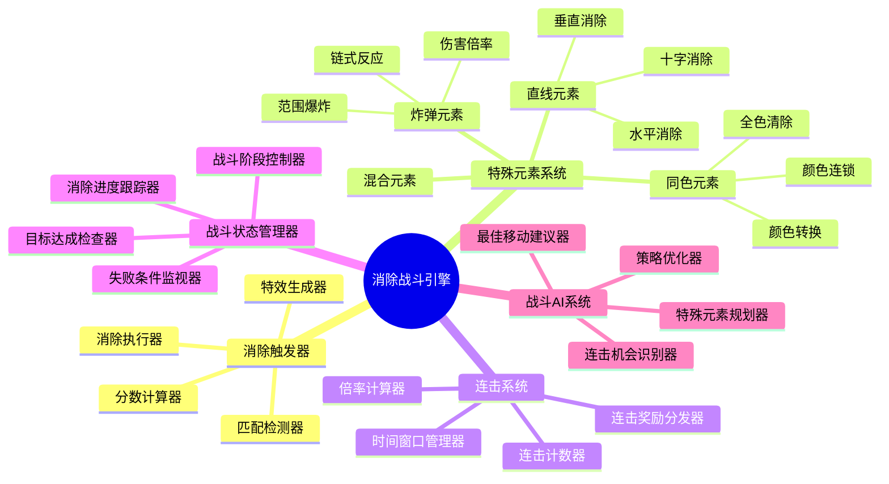
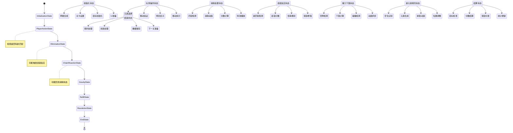
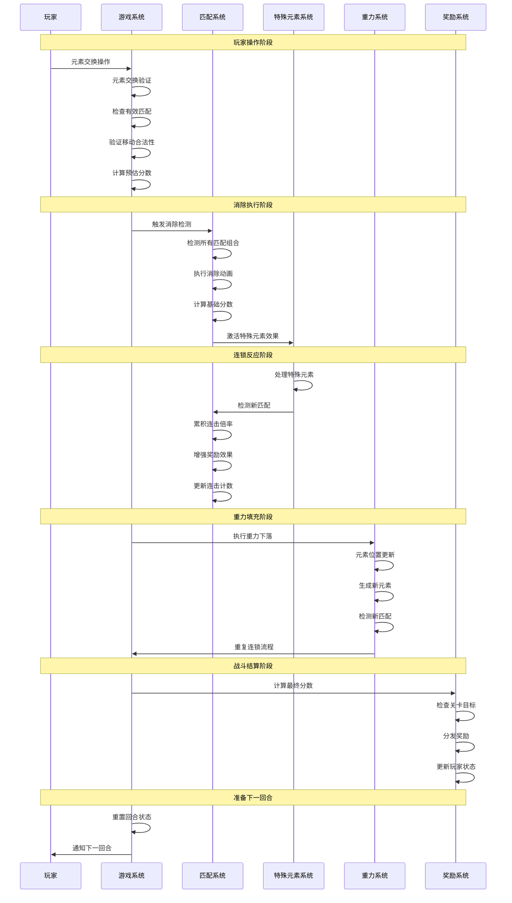
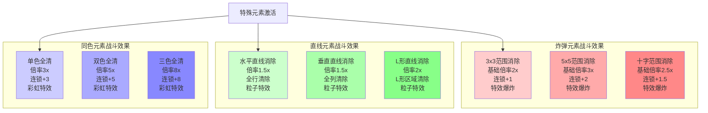
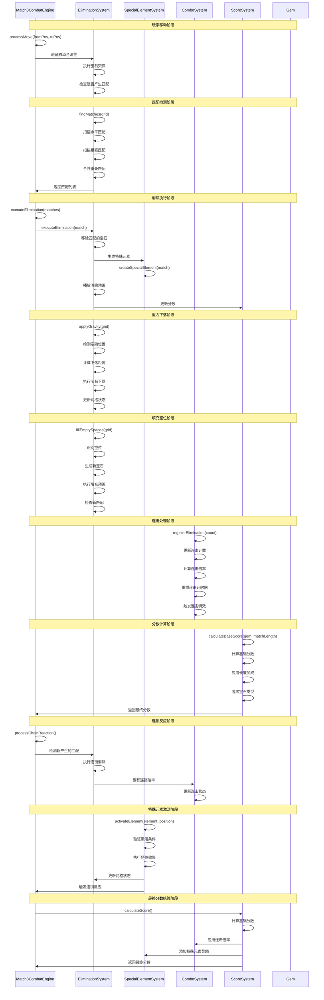

# 消除类游戏架构设计

## 🎯 游戏概述

消除类游戏（Match-3 Game）是一种通过交换相邻元素形成三连消除的益智游戏。代表作品包括《Candy Crush》、《宝石迷阵》等。核心玩法围绕匹配消除、连锁反应、特殊元素组合展开。

## 🏗️ 核心架构模块

### 0. 核心战斗模块 (Combat System)

#### 消除战斗模式架构图
```
┌─────────────────────────────────────────────────────────────┐
│                   消除类战斗系统架构                          │
├─────────────────────────────────────────────────────────────┤
│                                                             │
│  ┌─────────────┐    ┌─────────────┐    ┌─────────────┐     │
│  │  消除触发    │ -> │  效果激活    │ -> │  连锁反应    │     │
│  │             │    │             │    │             │     │
│  │ • 匹配检测   │    │ • 特殊元素   │    │ • 连锁消除   │     │
│  │ • 基础消除   │    │ • 技能释放   │    │ • 倍率累积   │     │
│  │ • 分数计算   │    │ • BUFF应用   │    │ • 奖励增强   │     │
│  └─────────────┘    └─────────────┘    └─────────────┘     │
│                                                             │
└─────────────────────────────────────────────────────────────┘
         ▲                        ▲                        │
         │                        │                        │
         └────────────────────────┼────────────────────────┘
                                  ▼
                    ┌─────────────────────┐
                    │     战斗结算系统      │
                    │                     │
                    │ • 最终分数计算      │
                    │ • 连击奖励          │
                    │ • 成就解锁          │
                    │ • 等级提升          │
                    └─────────────────────┘
```

#### 消除战斗系统核心组件



#### 消除战斗状态机架构图



#### 消除战斗流程时序图



#### 特殊元素战斗效果图



#### 战斗平衡性参数
```typescript
interface Match3CombatConfig {
  // 基础分数参数
  baseScorePerGem: number;         // 每个宝石基础分数
  matchLengthMultiplier: number;   // 匹配长度倍率
  specialGemMultiplier: number;    // 特殊宝石倍率

  // 连击系统参数
  comboTimeWindow: number;         // 连击时间窗口 (秒)
  maxComboMultiplier: number;      // 最大连击倍率
  comboDecayRate: number;          // 连击衰减率

  // 连锁反应参数
  chainReactionMultiplier: number; // 连锁反应倍率
  maxChainLength: number;          // 最大连锁长度
  chainBonusThreshold: number;     // 连锁奖励阈值

  // 特殊元素参数
  bombExplosionRadius: number;     // 炸弹爆炸半径
  lineClearWidth: number;          // 直线清除宽度
  colorClearMultiplier: number;    // 同色清除倍率

  // AI参数
  aiMoveDelay: number;             // AI移动延迟
  aiDifficultyLevel: number;       // AI难度等级
  aiHintAccuracy: number;          // AI提示准确度
}
```

#### 消除类战斗系统类图

```mermaid
classDiagram
    class Match3CombatEngine {
        -GameGrid gameGrid
        -EliminationSystem eliminationSystem
        -SpecialElementSystem specialElementSystem
        -ComboSystem comboSystem
        -ScoreSystem scoreSystem
        +initializeGame(levelData): GameSession
        +processMove(fromPos, toPos): MoveResult
        +executeElimination(matches): EliminationResult
        +processChainReaction(): ChainResult
        +calculateScore(): number
    }

    class EliminationSystem {
        -MatchDetector matchDetector
        -GravitySystem gravitySystem
        -FillSystem fillSystem
        -Queue<Elimination> eliminationQueue
        +findMatches(grid): List<Match>
        +executeElimination(match): EliminationResult
        +applyGravity(grid): GravityResult
        +fillEmptySpaces(grid): FillResult
        +processCascade(): CascadeResult
    }

    class SpecialElementSystem {
        -Map<string, BombElement> bombElements
        -Map<string, LineElement> lineElements
        -Map<string, ColorElement> colorElements
        -Map<ElementType, Processor> effectProcessors
        +createSpecialElement(match): SpecialElement
        +activateElement(element, position): EffectResult
        +processBombEffect(position, radius): BombResult
        +processLineEffect(position, direction): LineResult
        +processColorEffect(color): ColorResult
    }

    class ComboSystem {
        -number currentCombo
        -number comboMultiplier
        -Timer comboTimer
        -number maxComboMultiplier
        +registerElimination(count): ComboResult
        +calculateComboBonus(): number
        +resetCombo(): void
        +isComboActive(): boolean
        +getComboLevel(): ComboLevel
    }

    class ScoreSystem {
        -Map<GemType, number> baseScores
        -Map<BonusType, number> multipliers
        -List<ScoreEntry> scoreHistory
        +calculateBaseScore(gem, matchLength): number
        +applyMultiplier(score, multiplier): number
        +calculateTotalScore(): number
        +getScoreBreakdown(): ScoreBreakdown
        +updateHighScore(score): boolean
    }

    class Gem {
        -string id
        -GemType type
        -Position position
        -number baseScore
        -boolean isSpecial
        -List<GemEffect> effects
        +getScore(): number
        +canMatchWith(other: Gem): boolean
        +activateEffect(): EffectResult
        +destroy(): void
        +clone(): Gem
    }

    class NormalGem {
        <<基础匹配>>
        <<标准分数>>
        <<普通消除>>
    }

    class SpecialGem {
        <<特殊效果>>
        <<增强分数>>
        <<连锁反应>>
    }

    class Match {
        -string id
        -List<Position> positions
        -GemType gemType
        -number length
        -MatchDirection direction
        +getScore(): number
        +getSpecialElement(): SpecialElement | null
        +canCreateCombo(): boolean
        +execute(): EliminationResult
    }

    class HorizontalMatch {
        <<行消除>>
        <<水平特效>>
        <<左到右>>
    }

    class VerticalMatch {
        <<列消除>>
        <<垂直特效>>
        <<上到下>>
    }

    Match3CombatEngine --> EliminationSystem : 组合
    Match3CombatEngine --> SpecialElementSystem : 组合
    Match3CombatEngine --> ComboSystem : 组合
    Match3CombatEngine --> ScoreSystem : 组合
    Gem <|-- NormalGem : 继承
    Gem <|-- SpecialGem : 继承
    Match <|-- HorizontalMatch : 继承
    Match <|-- VerticalMatch : 继承
```



#### 消除类战斗系统时序图



### 1. 游戏网格系统 (Grid System)

#### 网格数据结构
```typescript
interface GameGrid {
  rows: number;           // 行数
  cols: number;           // 列数
  cells: GridCell[][];    // 网格数据
}

interface GridCell {
  gem: Gem | null;        // 宝石对象
  position: Position;     // 位置坐标
  isEmpty: boolean;       // 是否为空
  isLocked: boolean;      // 是否锁定（不可移动）
}

interface Position {
  row: number;
  col: number;
}
```

#### 宝石类型系统
```typescript
enum GemType {
  RED = 'red',           // 红色
  BLUE = 'blue',         // 蓝色
  GREEN = 'green',       // 绿色
  YELLOW = 'yellow',     // 黄色
  PURPLE = 'purple',     // 紫色
  ORANGE = 'orange',     // 橙色

  // 特殊宝石
  SPECIAL_BOMB = 'bomb',       // 炸弹（爆炸消除）
  SPECIAL_LINE_H = 'line_h',   // 水平直线消除
  SPECIAL_LINE_V = 'line_v',   // 垂直直线消除
  SPECIAL_COLOR = 'color',     // 同色消除

  // 特殊状态
  BLOCKER = 'blocker',         // 障碍物
  EMPTY = 'empty'             // 空位置
}
```

#### 网格操作
- **初始化网格**：随机生成或加载预设布局
- **交换元素**：相邻元素的位置交换
- **移除元素**：消除匹配的元素
- **填充空隙**：重力下落和新元素生成

### 2. 匹配检测系统 (Match Detection System)

#### 基础匹配算法
```typescript
interface MatchResult {
  positions: Position[];      // 匹配位置集合
  type: GemType;             // 匹配的宝石类型
  length: number;            // 匹配长度
  direction: 'horizontal' | 'vertical'; // 匹配方向
}

class MatchDetector {
  // 检测水平匹配
  static findHorizontalMatches(grid: GameGrid): MatchResult[] {
    const matches: MatchResult[] = [];

    for (let row = 0; row < grid.rows; row++) {
      let currentType = GemType.EMPTY;
      let count = 0;
      let startCol = 0;

      for (let col = 0; col <= grid.cols; col++) {
        const cell = col < grid.cols ? grid.cells[row][col] : null;
        const gemType = cell?.gem?.type || GemType.EMPTY;

        if (gemType === currentType && gemType !== GemType.EMPTY) {
          count++;
        } else {
          if (count >= 3 && currentType !== GemType.EMPTY) {
            matches.push({
              positions: this.getMatchPositions(row, startCol, count, 'horizontal'),
              type: currentType,
              length: count,
              direction: 'horizontal'
            });
          }
          currentType = gemType;
          count = 1;
          startCol = col;
        }
      }
    }

    return matches;
  }

  // 检测垂直匹配
  static findVerticalMatches(grid: GameGrid): MatchResult[] {
    // 类似水平匹配的实现
    return [];
  }

  // 获取匹配位置
  private static getMatchPositions(
    row: number,
    startCol: number,
    length: number,
    direction: 'horizontal' | 'vertical'
  ): Position[] {
    const positions: Position[] = [];

    for (let i = 0; i < length; i++) {
      positions.push({
        row: direction === 'horizontal' ? row : row + i,
        col: direction === 'horizontal' ? startCol + i : startCol
      });
    }

    return positions;
  }
}
```

#### 特殊匹配检测
- **L形匹配**：两个方向同时匹配
- **T形匹配**：三个方向的交叉匹配
- **特殊元素生成**：根据匹配类型生成对应的特殊元素

### 3. 消除系统 (Elimination System)

#### 消除执行
```typescript
class EliminationEngine {
  // 执行消除
  static async eliminateMatches(
    grid: GameGrid,
    matches: MatchResult[]
  ): Promise<EliminationResult> {
    const eliminatedGems: EliminatedGem[] = [];
    const specialEffects: SpecialEffect[] = [];

    for (const match of matches) {
      // 处理普通消除
      for (const position of match.positions) {
        const cell = grid.cells[position.row][position.col];
        if (cell.gem) {
          eliminatedGems.push({
            position,
            gem: cell.gem,
            score: this.calculateGemScore(cell.gem, match.length)
          });
          cell.gem = null;
          cell.isEmpty = true;
        }
      }

      // 生成特殊元素
      const specialGem = this.generateSpecialGem(match);
      if (specialGem) {
        specialEffects.push({
          type: 'create_special',
          position: this.findSpecialGemPosition(match),
          gemType: specialGem
        });
      }
    }

    return { eliminatedGems, specialEffects };
  }

  // 计算宝石分数
  private static calculateGemScore(gem: Gem, matchLength: number): number {
    const baseScore = gem.baseScore || 10;
    const lengthBonus = (matchLength - 3) * 5; // 超过3个的额外分数
    return baseScore + lengthBonus;
  }

  // 生成特殊元素
  private static generateSpecialGem(match: MatchResult): GemType | null {
    if (match.length >= 5) return GemType.SPECIAL_COLOR;
    if (match.length === 4) {
      return match.direction === 'horizontal'
        ? GemType.SPECIAL_LINE_H
        : GemType.SPECIAL_LINE_V;
    }
    if (match.length === 3) {
      // 检查是否为L形或T形匹配
      return this.checkSpecialShape(match) ? GemType.SPECIAL_BOMB : null;
    }
    return null;
  }
}
```

#### 消除动画
- **消失动画**：宝石消失的特效
- **粒子效果**：消除时的粒子喷发
- **音效配合**：消除音效和背景音乐

### 4. 重力与填充系统 (Gravity & Fill System)

#### 重力下落
```typescript
class GravitySystem {
  // 应用重力
  static applyGravity(grid: GameGrid): MoveAnimation[] {
    const animations: MoveAnimation[] = [];

    for (let col = 0; col < grid.cols; col++) {
      let emptyRow = grid.rows - 1;

      // 从底部向上检查
      for (let row = grid.rows - 1; row >= 0; row--) {
        const cell = grid.cells[row][col];

        if (cell.isEmpty) {
          // 找到上面的非空元素
          let sourceRow = row - 1;
          while (sourceRow >= 0 && grid.cells[sourceRow][col].isEmpty) {
            sourceRow--;
          }

          if (sourceRow >= 0) {
            const sourceCell = grid.cells[sourceRow][col];

            // 创建移动动画
            animations.push({
              fromPosition: { row: sourceRow, col },
              toPosition: { row, col },
              gem: sourceCell.gem!,
              duration: this.calculateFallDuration(sourceRow, row)
            });

            // 执行移动
            grid.cells[row][col].gem = sourceCell.gem;
            grid.cells[row][col].isEmpty = false;
            grid.cells[sourceRow][col].gem = null;
            grid.cells[sourceRow][col].isEmpty = true;
          }
        }
      }
    }

    return animations;
  }

  // 计算下落时间
  private static calculateFallDuration(fromRow: number, toRow: number): number {
    const distance = fromRow - toRow;
    return Math.sqrt(distance) * 0.1; // 距离越远，下落时间越长
  }
}
```

#### 新元素生成
```typescript
class FillSystem {
  // 生成新元素
  static generateNewGems(grid: GameGrid, count: number): SpawnAnimation[] {
    const animations: SpawnAnimation[] = [];
    const gemTypes = this.getAvailableGemTypes();
    let generated = 0;

    // 优先填充底部空位
    for (let col = 0; col < grid.cols && generated < count; col++) {
      for (let row = grid.rows - 1; row >= 0 && generated < count; row--) {
        const cell = grid.cells[row][col];

        if (cell.isEmpty) {
          const gemType = this.selectGemType(gemTypes);
          const newGem = this.createGem(gemType);

          cell.gem = newGem;
          cell.isEmpty = false;

          animations.push({
            position: { row, col },
            gem: newGem,
            spawnType: 'fall_in', // 从上方落下
            delay: generated * 0.05 // 交错生成
          });

          generated++;
        }
      }
    }

    return animations;
  }

  // 选择宝石类型（避免立即匹配）
  private static selectGemType(availableTypes: GemType[]): GemType {
    let selectedType: GemType;
    let attempts = 0;
    const maxAttempts = 10;

    do {
      selectedType = availableTypes[Math.floor(Math.random() * availableTypes.length)];
      attempts++;
    } while (this.wouldCreateMatch(selectedType) && attempts < maxAttempts);

    return selectedType;
  }
}
```

### 5. 特殊元素系统 (Special Elements System)

#### 特殊元素类型
```typescript
interface SpecialElement {
  type: GemType;
  effects: SpecialEffect[];
  priority: number;        // 激活优先级
}

class SpecialElementSystem {
  // 处理特殊元素激活
  static async activateSpecialElement(
    grid: GameGrid,
    position: Position,
    triggerType: 'match' | 'tap' | 'chain'
  ): Promise<SpecialEffectResult> {
    const cell = grid.cells[position.row][position.col];
    if (!cell.gem) return { effects: [] };

    const specialElement = this.getSpecialElement(cell.gem.type);
    if (!specialElement) return { effects: [] };

    const effects = await this.executeSpecialEffects(grid, specialElement, position);
    return { effects, score: this.calculateSpecialScore(specialElement) };
  }

  // 执行特殊效果
  private static async executeSpecialEffects(
    grid: GameGrid,
    element: SpecialElement,
    center: Position
  ): Promise<SpecialEffect[]> {
    const effects: SpecialEffect[] = [];

    for (const effect of element.effects) {
      switch (effect.type) {
        case 'explode':
          effects.push(...await this.createExplosion(grid, center, effect.radius));
          break;
        case 'line_clear':
          effects.push(...this.createLineClear(grid, center, effect.direction));
          break;
        case 'color_clear':
          effects.push(...this.createColorClear(grid, center, effect.targetColor));
          break;
      }
    }

    return effects;
  }
}
```

#### 特殊元素组合
- **炸弹+炸弹**：大范围爆炸
- **直线+直线**：十字消除
- **炸弹+直线**：T形爆炸
- **同色+普通**：增强同色消除

### 6. 连击系统 (Combo System)

#### 连击检测
```typescript
interface ComboSystem {
  currentCombo: number;         // 当前连击数
  maxCombo: number;            // 最大连击数
  comboMultiplier: number;     // 连击倍率
  comboTimer: number;          // 连击计时器
  comboWindow: number;         // 连击时间窗口
}

class ComboManager {
  // 处理连击
  static processCombo(eliminationCount: number, timeSinceLastElimination: number): ComboResult {
    let comboCount = 1;
    let multiplier = 1;

    if (timeSinceLastElimination < this.comboWindow) {
      comboCount = Math.min(this.maxCombo, this.currentCombo + 1);
      multiplier = this.calculateMultiplier(comboCount);
    } else {
      comboCount = 1;
      multiplier = 1;
    }

    return {
      comboCount,
      multiplier,
      bonusScore: eliminationCount * multiplier * 10,
      isNewRecord: comboCount > this.maxCombo
    };
  }

  // 计算连击倍率
  private static calculateMultiplier(comboCount: number): number {
    if (comboCount <= 1) return 1;
    return 1 + (comboCount - 1) * 0.25; // 每连击1次增加25%
  }
}
```

#### 连锁反应
- **自动连锁**：消除后立即检测新匹配
- **连锁计数**：统计连锁反应次数
- **连锁奖励**：根据连锁次数给予额外分数

### 7. AI提示系统 (Hint System)

#### 移动建议
```typescript
interface HintSystem {
  availableMoves: PossibleMove[];
  bestMove: PossibleMove | null;
  hintLevel: 'basic' | 'advanced' | 'expert';
}

interface PossibleMove {
  fromPosition: Position;
  toPosition: Position;
  score: number;           // 移动评分
  matchCount: number;      // 消除数量
  specialGems: number;     // 生成特殊元素数
  comboPotential: number;  // 连击潜力
}

class HintEngine {
  // 寻找可能的移动
  static findPossibleMoves(grid: GameGrid): PossibleMove[] {
    const moves: PossibleMove[] = [];

    for (let row = 0; row < grid.rows; row++) {
      for (let col = 0; col < grid.cols; col++) {
        // 检查与右侧交换
        if (col < grid.cols - 1) {
          const move = this.evaluateMove(grid, {row, col}, {row, col: col + 1});
          if (move) moves.push(move);
        }

        // 检查与下方交换
        if (row < grid.rows - 1) {
          const move = this.evaluateMove(grid, {row, col}, {row: row + 1, col});
          if (move) moves.push(move);
        }
      }
    }

    return moves.sort((a, b) => b.score - a.score);
  }

  // 评估移动价值
  private static evaluateMove(
    grid: GameGrid,
    from: Position,
    to: Position
  ): PossibleMove | null {
    // 创建临时网格副本
    const tempGrid = this.cloneGrid(grid);

    // 执行交换
    this.swapCells(tempGrid, from, to);

    // 检测匹配
    const matches = MatchDetector.findAllMatches(tempGrid);
    if (matches.length === 0) return null;

    // 计算分数
    const score = this.calculateMoveScore(matches);

    return {
      fromPosition: from,
      toPosition: to,
      score,
      matchCount: matches.length,
      specialGems: this.countSpecialGems(matches),
      comboPotential: this.evaluateComboPotential(tempGrid, matches)
    };
  }
}
```

## 🔧 核心算法实现

### 匹配检测算法 (Match Detection Algorithm)

#### 高效匹配扫描
```typescript
function findAllMatches(grid: GameGrid): MatchResult[] {
  const matches: MatchResult[] = [];
  const visited = new Set<string>();

  // 水平扫描
  for (let row = 0; row < grid.rows; row++) {
    for (let col = 0; col < grid.cols - 2; col++) {
      const match = findHorizontalMatch(grid, row, col);
      if (match && !isVisited(match, visited)) {
        matches.push(match);
        markVisited(match, visited);
      }
    }
  }

  // 垂直扫描
  for (let col = 0; col < grid.cols; col++) {
    for (let row = 0; row < grid.rows - 2; row++) {
      const match = findVerticalMatch(grid, row, col);
      if (match && !isVisited(match, visited)) {
        matches.push(match);
        markVisited(match, visited);
      }
    }
  }

  return matches;
}

function findHorizontalMatch(grid: GameGrid, startRow: number, startCol: number): MatchResult | null {
  const gemType = grid.cells[startRow][startCol].gem?.type;
  if (!gemType || gemType === GemType.EMPTY) return null;

  let length = 1;
  const positions: Position[] = [{ row: startRow, col: startCol }];

  // 向右扩展
  for (let col = startCol + 1; col < grid.cols; col++) {
    const cell = grid.cells[startRow][col];
    if (cell.gem?.type === gemType) {
      length++;
      positions.push({ row: startRow, col });
    } else {
      break;
    }
  }

  return length >= 3 ? {
    positions,
    type: gemType,
    length,
    direction: 'horizontal'
  } : null;
}
```

### 消除优化算法 (Elimination Optimization Algorithm)

#### 消除序列优化
```typescript
function optimizeEliminationSequence(matches: MatchResult[]): MatchResult[] {
  // 按优先级排序：特殊元素优先，长匹配优先
  return matches.sort((a, b) => {
    // 特殊元素优先级
    const aSpecial = isSpecialGem(a.type);
    const bSpecial = isSpecialGem(b.type);

    if (aSpecial !== bSpecial) {
      return aSpecial ? -1 : 1;
    }

    // 长度优先
    if (a.length !== b.length) {
      return b.length - a.length;
    }

    // 位置优先（左上优先）
    const aPos = a.positions[0];
    const bPos = b.positions[0];

    if (aPos.row !== bPos.row) {
      return aPos.row - bPos.row;
    }

    return aPos.col - bPos.col;
  });
}
```

## 📊 游戏流程设计

### 核心游戏循环
1. **初始化网格**：随机生成或加载关卡
2. **玩家操作**：选择要交换的元素
3. **验证移动**：检查是否产生有效匹配
4. **执行消除**：移除匹配元素，计算分数
5. **重力下落**：元素下落填充空隙
6. **生成新元素**：补充顶部新元素
7. **连锁检测**：检查是否产生新的匹配
8. **状态检查**：判断游戏是否结束

### 关卡目标系统
```typescript
interface LevelObjective {
  type: 'score' | 'time' | 'moves' | 'collect';
  target: number;
  current: number;
  description: string;
}

class ObjectiveManager {
  // 检查目标完成
  static checkObjectives(objectives: LevelObjective[]): ObjectiveResult {
    const completed: LevelObjective[] = [];
    const failed: LevelObjective[] = [];
    let allCompleted = true;

    for (const objective of objectives) {
      const isCompleted = this.evaluateObjective(objective);

      if (isCompleted) {
        completed.push(objective);
      } else if (this.isObjectiveFailed(objective)) {
        failed.push(objective);
        allCompleted = false;
      } else {
        allCompleted = false;
      }
    }

    return { completed, failed, allCompleted };
  }

  private static evaluateObjective(objective: LevelObjective): boolean {
    switch (objective.type) {
      case 'score':
        return objective.current >= objective.target;
      case 'time':
        return objective.current <= objective.target; // 时间目标是上限
      case 'moves':
        return objective.current <= objective.target; // 步数目标是上限
      case 'collect':
        return objective.current >= objective.target;
      default:
        return false;
    }
  }
}
```

### 难度平衡系统
- **网格大小**：更大网格增加复杂度
- **时间限制**：限时关卡增加压力
- **步数限制**：限制移动次数
- **特殊元素**：增加障碍物和限制元素

## 🎮 玩家体验设计

### 视觉反馈系统
- **消除特效**：宝石消失时的动画效果
- **连击显示**：连击数字和倍率显示
- **分数反馈**：实时分数更新和奖励提示
- **进度条**：关卡目标完成进度

### 音效设计
- **消除音效**：不同长度的匹配有不同音效
- **特殊音效**：特殊元素激活的独特音效
- **背景音乐**：根据游戏状态变化的音乐
- **连击音效**：连击时的激励音效

### 操作体验
- **拖拽交换**：直观的拖拽操作
- **自动匹配**：智能的移动建议
- **撤销功能**：允许悔棋
- **暂停功能**：游戏暂停和设置

## 🔄 系统优化策略

### 性能优化
- **对象池**：复用宝石和特效对象
- **批量处理**：批量更新网格状态
- **异步加载**：预加载下一关的资源
- **内存管理**：及时清理不需要的对象

### 渲染优化
- **精灵表**：使用纹理合集减少draw call
- **LOD系统**：远处元素简化渲染
- **粒子池**：复用粒子效果
- **动画缓存**：缓存重复的动画序列

## 📈 扩展性设计

### 关卡编辑器
- **可视化编辑**：拖拽式关卡设计
- **预设模板**：常用关卡布局模板
- **难度调整**：动态调整关卡参数
- **测试模式**：实时测试关卡可玩性

### 自定义元素
- **新宝石类型**：添加新的宝石种类
- **特殊效果**：自定义特殊元素效果
- **障碍物系统**：添加各种障碍物类型
- **Buff系统**：临时状态效果

## 🎯 核心成功要素

1. **流畅性**：丝滑的消除体验和动画效果
2. **策略性**：合理的匹配规则和连击系统
3. **重玩性**：多样化的关卡和挑战目标
4. **视觉体验**：精美的美术风格和特效
5. **难度曲线**：合理的难度递进和教学设计

---

*消除类游戏的核心魅力在于简单规则下产生的复杂策略，通过精心的视觉设计和流畅的操作体验，可以创造出令人上瘾的消除乐趣。*
