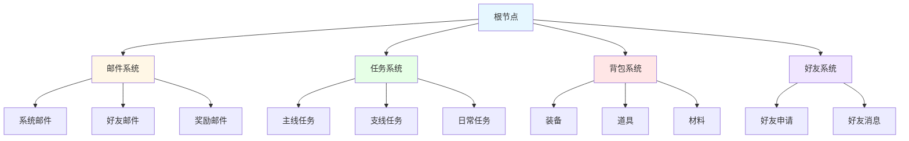
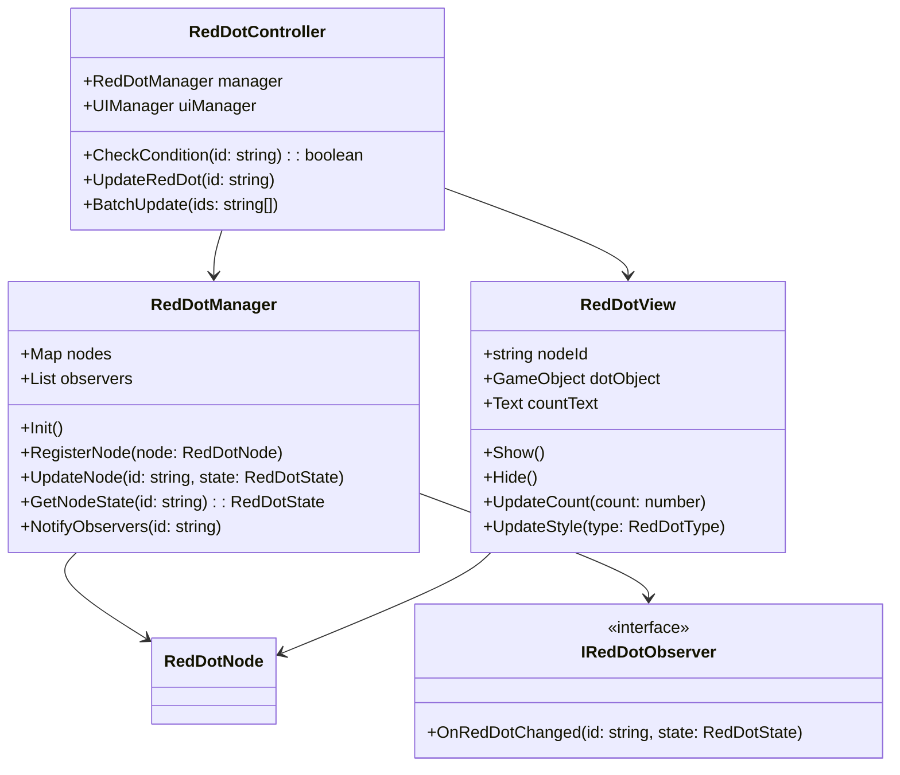
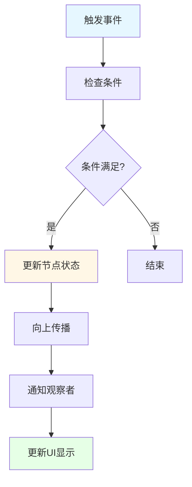
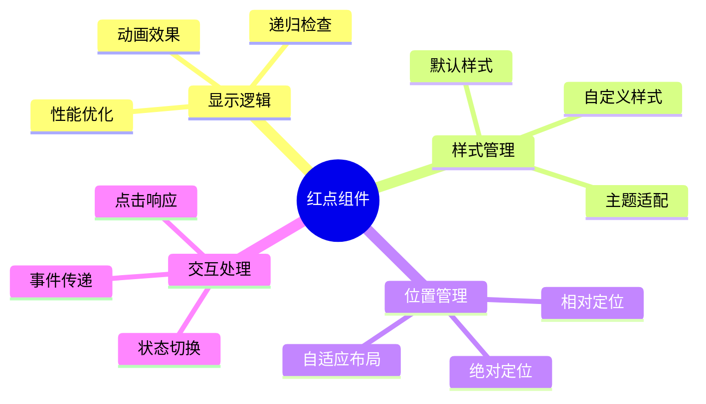

# 红点系统设计

## 🎯 系统概述

红点系统（Red Dot System）是现代游戏中不可或缺的UI提示机制，用于提醒玩家有新的内容、任务更新、奖励可领取等重要信息。通过视觉化的红点提示，可以有效引导玩家注意力，提升游戏体验和用户粘性。

## 🏗️ 核心架构模块

### 数据结构设计

#### 红点节点数据结构

```typescript
interface RedDotNode {
  // 节点唯一标识
  id: string;
  // 父节点ID
  parentId?: string;
  // 子节点列表
  children: string[];
  // 红点状态
  isVisible: boolean;
  // 红点数量（用于显示具体数值，如"99+"）
  count: number;
  // 红点类型
  type: RedDotType;
  // 自定义数据
  data?: any;
  // 更新时间戳
  lastUpdateTime: number;
}

enum RedDotType {
  NONE = 0,           // 无红点
  DOT = 1,            // 纯红点
  NUMBER = 2,         // 数字红点
  CUSTOM = 3          // 自定义样式
}
```

#### 红点树形结构



### 代码架构设计

#### 核心组件架构



#### 状态更新流程



### UI实现思路

#### 红点组件设计



#### UI层级结构

```
Canvas
├── MainUI
│   ├── TopBar
│   │   ├── MailButton
│   │   │   └── RedDot (邮件)
│   │   ├── TaskButton
│   │   │   └── RedDot (任务)
│   │   └── BagButton
│   │       └── RedDot (背包)
│   ├── SideBar
│   │   ├── FriendButton
│   │   │   └── RedDot (好友)
│   │   └── ShopButton
│   │       └── RedDot (商店)
│   └── ContentArea
│       ├── MailPanel
│       │   ├── SystemMailTab
│       │   │   └── RedDot (系统邮件)
│       │   ├── FriendMailTab
│       │   │   └── RedDot (好友邮件)
│       │   └── RewardMailTab
│       │       └── RedDot (奖励邮件)
```

## 🔧 核心功能实现

### 1. 红点注册与管理

```typescript
class RedDotManager {
  private nodes: Map<string, RedDotNode> = new Map();
  private observers: IRedDotObserver[] = [];

  // 注册红点节点
  public RegisterNode(node: RedDotNode): void {
    this.nodes.set(node.id, node);

    // 建立父子关系
    if (node.parentId) {
      const parent = this.nodes.get(node.parentId);
      if (parent && !parent.children.includes(node.id)) {
        parent.children.push(node.id);
      }
    }
  }

  // 更新红点状态
  public UpdateNode(id: string, isVisible: boolean, count: number = 0): void {
    const node = this.nodes.get(id);
    if (!node) return;

    node.isVisible = isVisible;
    node.count = count;
    node.lastUpdateTime = Date.now();

    // 向上传播状态变化
    this.PropagateUp(id);

    // 通知观察者
    this.NotifyObservers(id);
  }

  // 向上传播状态变化
  private PropagateUp(id: string): void {
    const node = this.nodes.get(id);
    if (!node || !node.parentId) return;

    const parent = this.nodes.get(node.parentId);
    if (!parent) return;

    // 更新父节点状态
    const hasVisibleChild = parent.children.some(childId => {
      const child = this.nodes.get(childId);
      return child?.isVisible;
    });

    parent.isVisible = hasVisibleChild;
    parent.lastUpdateTime = Date.now();

    // 递归向上传播
    this.PropagateUp(node.parentId);
  }
}
```

### 2. 条件检查系统

```typescript
class RedDotController {
  private manager: RedDotManager;
  private conditions: Map<string, () => boolean> = new Map();

  // 注册条件检查函数
  public RegisterCondition(id: string, condition: () => boolean): void {
    this.conditions.set(id, condition);
  }

  // 检查并更新红点
  public CheckAndUpdate(id: string): void {
    const condition = this.conditions.get(id);
    if (!condition) return;

    const isVisible = condition();
    let count = 0;

    // 获取数量（如果需要）
    if (isVisible) {
      count = this.GetCount(id);
    }

    this.manager.UpdateNode(id, isVisible, count);
  }

  // 获取红点数量
  private GetCount(id: string): number {
    // 根据不同类型的红点计算数量
    switch (id) {
      case 'mail':
        return this.GetUnreadMailCount();
      case 'task':
        return this.GetUnfinishedTaskCount();
      case 'bag':
        return this.GetNewItemCount();
      default:
        return 0;
    }
  }
}
```

### 3. UI显示组件

```typescript
class RedDotView extends MonoBehaviour {
  public nodeId: string;
  public dotSprite: Sprite;
  public countText: Text;
  public customStyle: RedDotStyle;

  private isVisible: boolean = false;

  void Start() {
    // 注册到观察者
    RedDotManager.Instance.AddObserver(this);
  }

  void OnDestroy() {
    // 取消注册
    RedDotManager.Instance.RemoveObserver(this);
  }

  public void OnRedDotChanged(id: string, state: RedDotState) {
    if (id !== this.nodeId) return;

    this.UpdateDisplay(state);
  }

  private void UpdateDisplay(RedDotState state) {
    if (state.isVisible && !this.isVisible) {
      this.Show();
    } else if (!state.isVisible && this.isVisible) {
      this.Hide();
    }

    if (state.isVisible) {
      this.UpdateCount(state.count);
      this.UpdateStyle(state.type);
    }
  }

  private void Show() {
    this.isVisible = true;
    this.gameObject.SetActive(true);

    // 播放显示动画
    this.PlayShowAnimation();
  }

  private void Hide() {
    this.isVisible = false;
    this.gameObject.SetActive(false);
  }

  private void UpdateCount(count: number) {
    if (count <= 0) {
      this.countText.gameObject.SetActive(false);
      return;
    }

    this.countText.gameObject.SetActive(true);
    this.countText.text = count > 99 ? "99+" : count.ToString();
  }
}
```

## 🚀 性能优化策略

### 1. 批量更新机制

```typescript
class RedDotBatchUpdater {
  private pendingUpdates: Set<string> = new Set();
  private updateTimer: number = 0;
  private readonly BATCH_INTERVAL = 0.1f; // 100ms

  public AddToBatch(id: string): void {
    this.pendingUpdates.add(id);
  }

  void Update() {
    this.updateTimer += Time.deltaTime;
    if (this.updateTimer >= BATCH_INTERVAL) {
      this.ProcessBatch();
      this.updateTimer = 0;
    }
  }

  private void ProcessBatch(): void {
    if (this.pendingUpdates.size === 0) return;

    // 批量处理更新
    foreach (string id in this.pendingUpdates) {
      RedDotManager.Instance.CheckAndUpdate(id);
    }

    this.pendingUpdates.Clear();
  }
}
```

### 2. 条件缓存机制

```typescript
class RedDotConditionCache {
  private cache: Map<string, { result: boolean, timestamp: number }> = new Map();
  private readonly CACHE_DURATION = 1.0f; // 1秒缓存

  public GetCachedResult(id: string): boolean | null {
    const cached = this.cache.get(id);
    if (!cached) return null;

    if (Time.time - cached.timestamp > CACHE_DURATION) {
      this.cache.delete(id);
      return null;
    }

    return cached.result;
  }

  public SetCacheResult(id: string, result: boolean): void {
    this.cache.set(id, {
      result: result,
      timestamp: Time.time
    });
  }
}
```

## 📊 扩展功能

### 1. 红点优先级系统

```typescript
enum RedDotPriority {
  LOW = 1,
  NORMAL = 2,
  HIGH = 3,
  URGENT = 4
}

interface PriorityRedDotNode extends RedDotNode {
  priority: RedDotPriority;
  expireTime?: number; // 过期时间
  autoHide: boolean;   // 自动隐藏
}
```

### 2. 红点动画系统

```typescript
class RedDotAnimation {
  public static Bounce(node: RedDotView): void {
    // 弹跳动画
    DOTween.Sequence()
      .Append(node.transform.DOScale(1.2f, 0.1f))
      .Append(node.transform.DOScale(1.0f, 0.1f))
      .Play();
  }

  public static Pulse(node: RedDotView): void {
    // 脉冲动画
    node.transform.DOScale(1.1f, 0.5f)
      .SetLoops(-1, LoopType.Yoyo)
      .Play();
  }
}
```

### 3. 红点统计系统

```typescript
class RedDotAnalytics {
  public static TrackRedDotShow(id: string): void {
    // 统计红点显示次数
    AnalyticsManager.TrackEvent("red_dot_show", {
      red_dot_id: id,
      timestamp: Date.now()
    });
  }

  public static TrackRedDotClick(id: string): void {
    // 统计红点点击次数
    AnalyticsManager.TrackEvent("red_dot_click", {
      red_dot_id: id,
      timestamp: Date.now()
    });
  }
}
```

## 🎯 最佳实践

### 1. 设计原则
- **单一职责**：每个红点节点只负责一个明确的功能
- **层次清晰**：采用树形结构组织红点层级关系
- **性能优先**：减少不必要的UI更新和条件检查
- **扩展性强**：支持动态添加新的红点类型和样式

### 2. 常见使用场景
- **邮件系统**：新邮件提醒
- **任务系统**：任务完成、新任务提醒
- **背包系统**：新物品获得
- **好友系统**：好友申请、消息提醒
- **商店系统**：限时优惠、折扣提醒
- **活动系统**：活动开启、奖励可领取

### 3. 注意事项
- 避免红点泛滥，导致玩家视觉疲劳
- 红点状态要与实际数据保持同步
- 考虑不同设备性能，优化更新频率
- 支持红点开关设置，满足玩家个性化需求

## 💾 数据持久化机制

### 持久化策略

```typescript
interface RedDotPersistence {
  // 需要持久化的红点ID列表
  persistentIds: string[];
  // 持久化间隔（秒）
  saveInterval: number;
  // 最后保存时间
  lastSaveTime: number;
}

class RedDotPersistenceManager {
  private readonly STORAGE_KEY = "red_dot_states";
  private saveTimer: number = 0;

  // 保存红点状态
  public SaveStates(): void {
    const persistentStates: Map<string, RedDotState> = new Map();

    // 只保存需要持久化的红点状态
    for (const id of this.persistentIds) {
      const state = RedDotManager.Instance.GetNodeState(id);
      if (state && state.isVisible) {
        persistentStates.set(id, {
          isVisible: state.isVisible,
          count: state.count,
          lastUpdateTime: state.lastUpdateTime
        });
      }
    }

    const saveData = {
      version: "1.0",
      timestamp: Date.now(),
      states: Object.fromEntries(persistentStates)
    };

    // 保存到本地存储
    LocalStorage.SetItem(this.STORAGE_KEY, JSON.stringify(saveData));
  }

  // 加载红点状态
  public LoadStates(): void {
    try {
      const saveDataStr = LocalStorage.GetItem(this.STORAGE_KEY);
      if (!saveDataStr) return;

      const saveData = JSON.parse(saveDataStr);

      // 版本兼容性检查
      if (saveData.version !== "1.0") {
        this.MigrateData(saveData);
      }

      // 恢复状态
      for (const [id, state] of Object.entries(saveData.states)) {
        RedDotManager.Instance.UpdateNode(id, state.isVisible, state.count);
      }
    } catch (error) {
      console.error("Failed to load red dot states:", error);
      // 加载失败时清理损坏的数据
      LocalStorage.RemoveItem(this.STORAGE_KEY);
    }
  }

  // 数据迁移
  private MigrateData(oldData: any): void {
    // 处理版本升级时的兼容性
    if (oldData.version === "0.9") {
      // 从0.9版本迁移到1.0的逻辑
      for (const [id, state] of Object.entries(oldData.states)) {
        // 迁移逻辑...
      }
    }
  }
}
```

## 🌍 多语言本地化支持

### 本地化红点文本

```typescript
interface LocalizedRedDot {
  id: string;
  textKey: string;        // 本地化键值
  params?: any[];         // 参数化文本参数
}

class RedDotLocalizationManager {
  private localizedTexts: Map<string, LocalizedRedDot> = new Map();

  // 注册本地化红点
  public RegisterLocalizedRedDot(config: LocalizedRedDot): void {
    this.localizedTexts.set(config.id, config);
  }

  // 获取本地化文本
  public GetLocalizedText(id: string): string {
    const config = this.localizedTexts.get(id);
    if (!config) return "";

    const baseText = LocalizationManager.GetText(config.textKey);
    if (!config.params) return baseText;

    // 参数替换
    return this.FormatText(baseText, config.params);
  }

  private FormatText(template: string, params: any[]): string {
    return template.replace(/\{(\d+)\}/g, (match, index) => {
      return params[parseInt(index)]?.toString() || match;
    });
  }
}
```

## ⚙️ 配置系统

### 红点配置管理

```typescript
interface RedDotConfig {
  id: string;
  type: RedDotType;
  priority: RedDotPriority;
  style: RedDotStyle;
  conditions: RedDotCondition[];
  autoRefresh: boolean;
  refreshInterval?: number;
  expireTime?: number;
  dependencies?: string[];  // 依赖的其他红点
}

interface RedDotCondition {
  type: 'data' | 'event' | 'time' | 'custom';
  key: string;
  operator: '>' | '<' | '=' | '!=' | 'contains' | 'not_contains';
  value: any;
  logic?: 'AND' | 'OR';
}

class RedDotConfigManager {
  private configs: Map<string, RedDotConfig> = new Map();

  // 加载配置文件
  public LoadConfigs(configData: any): void {
    for (const [id, config] of Object.entries(configData)) {
      this.configs.set(id, config as RedDotConfig);
    }
  }

  // 获取配置
  public GetConfig(id: string): RedDotConfig | undefined {
    return this.configs.get(id);
  }

  // 检查条件
  public CheckConditions(id: string): boolean {
    const config = this.configs.get(id);
    if (!config) return false;

    return config.conditions.every(condition => {
      return this.EvaluateCondition(condition);
    });
  }

  private EvaluateCondition(condition: RedDotCondition): boolean {
    const actualValue = this.GetActualValue(condition);

    switch (condition.operator) {
      case '>': return actualValue > condition.value;
      case '<': return actualValue < condition.value;
      case '=': return actualValue === condition.value;
      case '!=': return actualValue !== condition.value;
      case 'contains': return Array.isArray(actualValue) ?
        actualValue.includes(condition.value) : false;
      case 'not_contains': return Array.isArray(actualValue) ?
        !actualValue.includes(condition.value) : true;
      default: return false;
    }
  }

  private GetActualValue(condition: RedDotCondition): any {
    switch (condition.type) {
      case 'data':
        return DataManager.Get(condition.key);
      case 'event':
        return EventManager.HasPendingEvent(condition.key);
      case 'time':
        return Date.now();
      case 'custom':
        return this.GetCustomValue(condition.key);
      default:
        return null;
    }
  }
}
```

## 🛡️ 错误处理和异常情况

### 异常处理机制

```typescript
class RedDotErrorHandler {
  private errorCounts: Map<string, number> = new Map();
  private readonly MAX_ERROR_COUNT = 5;

  // 处理红点更新错误
  public HandleUpdateError(id: string, error: Error): void {
    console.error(`Red dot update failed for ${id}:`, error);

    const count = (this.errorCounts.get(id) || 0) + 1;
    this.errorCounts.set(id, count);

    if (count >= this.MAX_ERROR_COUNT) {
      // 达到最大错误次数，禁用此红点
      this.DisableRedDot(id);
      this.ReportError(id, error);
    }
  }

  // 处理UI显示错误
  public HandleDisplayError(id: string, error: Error): void {
    console.error(`Red dot display failed for ${id}:`, error);

    // 降级处理：隐藏红点
    RedDotViewManager.Instance.HideRedDot(id);
  }

  // 禁用异常红点
  private DisableRedDot(id: string): void {
    RedDotManager.Instance.DisableNode(id);
    NotificationManager.ShowSystemMessage(
      `红点系统异常，已暂时禁用 ${id} 的红点提示`
    );
  }

  // 上报错误
  private ReportError(id: string, error: Error): void {
    AnalyticsManager.TrackError({
      category: 'red_dot_system',
      action: 'update_failed',
      label: id,
      value: this.errorCounts.get(id),
      error_message: error.message
    });
  }
}

class RedDotRecoveryManager {
  // 系统恢复
  public RecoverSystem(): void {
    // 重置所有红点状态
    RedDotManager.Instance.ResetAll();

    // 重新加载配置
    RedDotConfigManager.Instance.ReloadConfigs();

    // 重新注册所有红点
    this.ReregisterAllRedDots();

    // 重新检查所有条件
    RedDotController.Instance.CheckAllConditions();
  }

  // 单个红点恢复
  public RecoverRedDot(id: string): void {
    try {
      // 重置状态
      RedDotManager.Instance.ResetNode(id);

      // 重新注册
      this.ReregisterRedDot(id);

      // 重新检查条件
      RedDotController.Instance.CheckCondition(id);

    } catch (error) {
      RedDotErrorHandler.Instance.HandleRecoveryError(id, error);
    }
  }
}
```

## 🧠 内存管理机制

### 内存优化策略

```typescript
class RedDotMemoryManager {
  private nodePool: RedDotNode[] = [];
  private viewPool: RedDotView[] = [];
  private readonly POOL_SIZE = 50;

  // 对象池管理
  public GetNodeFromPool(): RedDotNode {
    if (this.nodePool.length > 0) {
      return this.nodePool.pop()!;
    }
    return new RedDotNode();
  }

  public ReturnNodeToPool(node: RedDotNode): void {
    if (this.nodePool.length < this.POOL_SIZE) {
      // 重置节点状态
      node.Reset();
      this.nodePool.push(node);
    }
  }

  // 定期清理
  public Cleanup(): void {
    // 清理过期红点
    this.CleanupExpiredRedDots();

    // 清理未使用的观察者
    this.CleanupUnusedObservers();

    // 清理缓存
    this.CleanupCache();

    // 强制垃圾回收（如果支持）
    if (window.gc) {
      window.gc();
    }
  }

  // 内存监控
  public GetMemoryUsage(): MemoryStats {
    return {
      nodeCount: RedDotManager.Instance.GetNodeCount(),
      observerCount: RedDotManager.Instance.GetObserverCount(),
      poolSize: this.nodePool.length,
      cacheSize: this.GetCacheSize()
    };
  }
}

interface MemoryStats {
  nodeCount: number;
  observerCount: number;
  poolSize: number;
  cacheSize: number;
}
```

## 🧪 测试覆盖方案

### 单元测试

```typescript
class RedDotSystemTests {
  // 测试红点状态更新
  @Test
  public TestRedDotStateUpdate(): void {
    const manager = new RedDotManager();

    // 创建测试节点
    const node: RedDotNode = {
      id: "test_node",
      isVisible: false,
      count: 0,
      type: RedDotType.DOT
    };

    manager.RegisterNode(node);
    manager.UpdateNode("test_node", true, 5);

    const state = manager.GetNodeState("test_node");
    Assert.IsTrue(state.isVisible);
    Assert.AreEqual(5, state.count);
  }

  // 测试树形结构传播
  @Test
  public TestTreePropagation(): void {
    const manager = new RedDotManager();

    // 创建父子节点
    manager.RegisterNode({ id: "parent", children: ["child1", "child2"] });
    manager.RegisterNode({ id: "child1", parentId: "parent" });
    manager.RegisterNode({ id: "child2", parentId: "parent" });

    // 更新子节点
    manager.UpdateNode("child1", true);

    // 检查父节点状态
    const parentState = manager.GetNodeState("parent");
    Assert.IsTrue(parentState.isVisible);
  }

  // 测试性能
  @Test
  public TestPerformance(): void {
    const manager = new RedDotManager();

    // 创建大量节点
    for (let i = 0; i < 1000; i++) {
      manager.RegisterNode({
        id: `node_${i}`,
        isVisible: false,
        count: 0,
        type: RedDotType.DOT
      });
    }

    const startTime = Date.now();

    // 批量更新
    for (let i = 0; i < 1000; i++) {
      manager.UpdateNode(`node_${i}`, true);
    }

    const endTime = Date.now();
    const duration = endTime - startTime;

    // 性能断言（批量更新应在合理时间内完成）
    Assert.IsTrue(duration < 100, `Batch update took ${duration}ms`);
  }
}
```

## 🔧 调试工具

### 开发调试面板

```typescript
class RedDotDebugPanel {
  private panel: GameObject;
  private isVisible: boolean = false;

  // 显示调试面板
  public Show(): void {
    if (!this.panel) {
      this.CreateDebugPanel();
    }
    this.panel.SetActive(true);
    this.isVisible = true;
    this.UpdateDebugInfo();
  }

  // 隐藏调试面板
  public Hide(): void {
    if (this.panel) {
      this.panel.SetActive(false);
    }
    this.isVisible = false;
  }

  // 更新调试信息
  private UpdateDebugInfo(): void {
    const stats = this.GetSystemStats();
    const treeInfo = this.GetTreeStructure();

    // 更新UI显示
    this.UpdateStatsDisplay(stats);
    this.UpdateTreeDisplay(treeInfo);
  }

  // 获取系统统计信息
  private GetSystemStats(): DebugStats {
    return {
      totalNodes: RedDotManager.Instance.GetNodeCount(),
      visibleNodes: RedDotManager.Instance.GetVisibleNodeCount(),
      observerCount: RedDotManager.Instance.GetObserverCount(),
      memoryUsage: RedDotMemoryManager.Instance.GetMemoryUsage(),
      updateCount: RedDotManager.Instance.GetUpdateCount(),
      lastUpdateTime: RedDotManager.Instance.GetLastUpdateTime()
    };
  }

  // 获取树形结构信息
  private GetTreeStructure(): TreeNode[] {
    return RedDotManager.Instance.GetTreeStructure();
  }

  // 创建调试面板UI
  private CreateDebugPanel(): void {
    this.panel = new GameObject("RedDotDebugPanel");

    // 创建背景
    const background = this.CreateBackground();

    // 创建统计信息区域
    const statsPanel = this.CreateStatsPanel();

    // 创建树形结构显示区域
    const treePanel = this.CreateTreePanel();

    // 创建控制按钮
    const controlPanel = this.CreateControlPanel();
  }
}

interface DebugStats {
  totalNodes: number;
  visibleNodes: number;
  observerCount: number;
  memoryUsage: MemoryStats;
  updateCount: number;
  lastUpdateTime: number;
}
```

---

*本文档提供了完整的红点系统设计方案，包含数据结构、代码架构、UI实现思路以及补充的持久化、多语言、配置、错误处理、内存管理、测试和调试功能。在实际项目中可根据具体需求进行调整和优化。*
